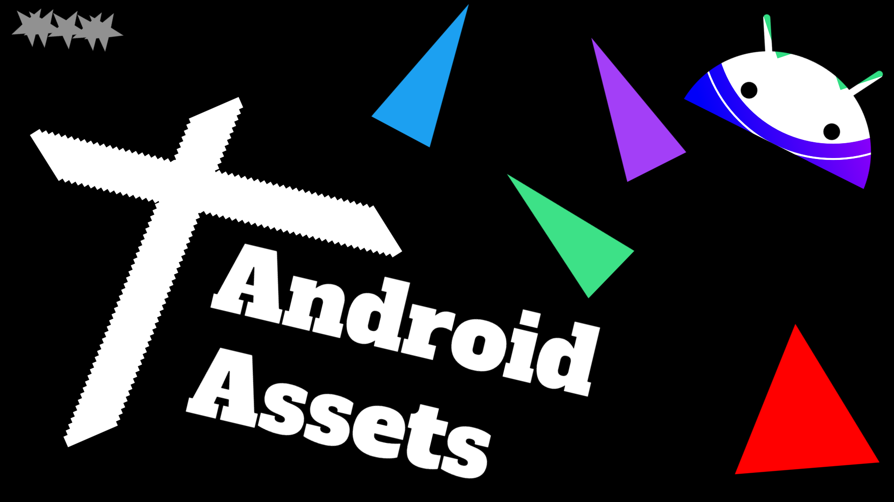

<h1 align="center">Android Assets</h1> 

:eyeglasses: An extensive collection of Android Assets for Android Studio, AOSP and Android Developer documentation.

 

  
  
  

 

</img>

 

**Android Assets** aims to be your starting point to find all the official assets from Android Developer sites: [Android Studio](https://developer.android.com/studio), [Android Open Source Project](https://source.android.com/), and [Android Developers](https://developer.android.com/)

Assets include PNG, JPG, SVG, GIF, WEBP files for now.

The repository was created to see the entire catalog of Android Assets used in the official documentation. There are some few many hidden gems.

Tools that helped in the process: [Wget](https://www.gnu.org/software/wget/), [regex](https://en.wikipedia.org/wiki/Regular_expression), [git](https://git-scm.com/), [Visual Studio Code](https://code.visualstudio.com/), [paste](https://www.gnu.org/software/coreutils/manual/html_node/paste-invocation.html#:~:text=paste%20writes%20to%20standard%20output,no%20input%20files%20are%20given.&text=The%20program%20accepts%20the%20following,Also%20see%20Common%20options.)

[**Download Assets**](https://drive.google.com/drive/folders/1X6AAoaiI9jqDXz7E3UDr_cHB76XzIivE?usp=sharing) 

## Contents

- [AOSP](#aosp)
- [Android Developers](#android-developers)
- [Android Studio](#android-studio)
- [All](#all)

:memo: [**Contributing**](#memo-contributing)

:seedling: [**Contributors**](#seedling-contributors)

## [AOSP](aosp/README.md)

- Title: Android Open Source Project

- Website: https://source.android.com

- Source code: https://android.googlesource.com

- Asset Count: 1190

- [**See all AOSP assets**](aosp/README.md)

## [Android Developers](android-developer\README.md)

- Title: Android Developers

- Website: https://developer.android.com

- Asset Count: 2416

- [**See all Android Developers assets**](android-developer\README.md)

## [Android Studio](android-studio-ux-assets\README.md)

- Title: Android Studio

- Website: https://developer.android.com/studio

- Source code: https://android.googlesource.com/platform/tools/base/+/studio-master-dev/source.md

- Assets: https://android.googlesource.com/assets/android-studio-ux-assets

- Asset Count: 1519

- [**See all Android Studio assets**](android-studio-ux-assets\README.md)

# All

## AOSP

### PNG file

#### VIM3_V12_Perspective

Source: https://source.android.com/setup/images/VIM3_V12_Perspective.png

 

#### neonkey-sensorhub

Source: https://source.android.com/setup/images/neonkey-sensorhub.png

 

#### mobile-view

Source: https://source.android.com/setup/images/mobile-view.png

 

#### JB-TM-example

Source: https://source.android.com/setup/images/JB-TM-example.png

 

#### jack_predex

Source: https://source.android.com/setup/images/jack_predex.png

 

#### jack_overview

Source: https://source.android.com/setup/images/jack_overview.png

 

#### jack_library

Source: https://source.android.com/setup/images/jack_library.png

 

#### jack_jill

Source: https://source.android.com/setup/images/jack_jill.png

 

#### hikey960

Source: https://source.android.com/setup/images/hikey960.png

 

#### hikey620

Source: https://source.android.com/setup/images/hikey620.png

 

#### select-git-branch

Source: https://source.android.com/setup/images/git-source-editor/select-git-branch.png

 

#### revert-all-files-btn

Source: https://source.android.com/setup/images/git-source-editor/revert-all-files-btn.png

 

#### revert-all-confirm-db

Source: https://source.android.com/setup/images/git-source-editor/revert-all-confirm-db.png

 

#### pending-changes

Source: https://source.android.com/setup/images/git-source-editor/pending-changes.png

 

#### login

Source: https://source.android.com/setup/images/git-source-editor/login.png

 

#### load-file-change

Source: https://source.android.com/setup/images/git-source-editor/load-file-change.png

 

#### gerrit-cl

Source: https://source.android.com/setup/images/git-source-editor/gerrit-cl.png

 

#### file-tabs

Source: https://source.android.com/setup/images/git-source-editor/file-tabs.png

 

#### file-diffs

Source: https://source.android.com/setup/images/git-source-editor/file-diffs.png

 

#### editor-pane

Source: https://source.android.com/setup/images/git-source-editor/editor-pane.png

 

#### create-change-db

Source: https://source.android.com/setup/images/git-source-editor/create-change-db.png

 

#### codesearch-edit-btn

Source: https://source.android.com/setup/images/git-source-editor/codesearch-edit-btn.png

 

#### change-notification

Source: https://source.android.com/setup/images/git-source-editor/change-notification.png

 

#### bug-button

Source: https://source.android.com/setup/images/git-source-editor/bug-button.png

 

#### emulator-run-ui

Source: https://source.android.com/setup/images/emulator-run-ui.png

 

#### emulator-design

Source: https://source.android.com/setup/images/emulator-design.png

 

#### db845c-front-sd

Source: https://source.android.com/setup/images/db845c-front-sd.png

 

#### dashboard

Source: https://source.android.com/setup/images/dashboard.png

 

#### Android_wordmark_black_crossed_out

Source: https://source.android.com/setup/images/Android_wordmark_black_crossed_out.png

 

#### Android_symbol_green_RGB

Source: https://source.android.com/setup/images/Android_symbol_green_RGB.png

 

#### Android_Robot_100

Source: https://source.android.com/setup/images/Android_Robot_100.png

 

#### android_logo_old_crossed_out

Source: https://source.android.com/setup/images/android_logo_old_crossed_out.png

 

#### android_logo_new_crossed_out

Source: https://source.android.com/setup/images/android_logo_new_crossed_out.png

 

#### Android_greenrobot

Source: https://source.android.com/setup/images/Android_greenrobot.png

 

#### 8100-TM-example

Source: https://source.android.com/setup/images/8100-TM-example.png

 

#### sac_logo

Source: https://source.android.com/setup/assets/images/sac_logo.png

 

#### bg_images_sprite

Source: https://source.android.com/setup/assets/bg_images_sprite.png

 

#### selinux_device_policy_reduction

Source: https://source.android.com/security/selinux/images/selinux_device_policy_reduction.png

 

#### n-selinux-policy-file

Source: https://source.android.com/security/selinux/images/n-selinux-policy-file.png

 

#### n-selinux-build-logic

Source: https://source.android.com/security/selinux/images/n-selinux-build-logic.png

 

#### yir-2017

Source: https://source.android.com/security/images/yir-2017.png

 

#### yir-2016

Source: https://source.android.com/security/images/yir-2016.png

 

#### yir-2015

Source: https://source.android.com/security/images/yir-2015.png

 

#### yir-2014

Source: https://source.android.com/security/images/yir-2014.png

 

#### verified-boot-flow

Source: https://source.android.com/security/images/verified-boot-flow.png

 

#### verified_boot

Source: https://source.android.com/security/images/verified_boot.png

 

#### unlock-confirmation

Source: https://source.android.com/security/images/unlock-confirmation.png

 

#### trustyOverview_900w

Source: https://source.android.com/security/images/trustyOverview_900w.png

 

#### trustyApps_900w

Source: https://source.android.com/security/images/trustyApps_900w.png

 

#### tiny-robot

Source: https://source.android.com/security/images/tiny-robot.png

 

#### referencePlanes

Source: https://source.android.com/security/images/referencePlanes.png

 

#### permissions_check

Source: https://source.android.com/security/images/permissions_check.png

 

#### patchreward

Source: https://source.android.com/security/images/patchreward.png

 

#### lock-confirmation

Source: https://source.android.com/security/images/lock-confirmation.png

 

#### image03

Source: https://source.android.com/security/images/image03.png

 

#### image02

Source: https://source.android.com/security/images/image02.png

 

#### image00

Source: https://source.android.com/security/images/image00.png

 

#### image_install

Source: https://source.android.com/security/images/image_install.png

 

#### image_gmail_installed

Source: https://source.android.com/security/images/image_gmail_installed.png

 

#### gatekeeper-flow

Source: https://source.android.com/security/images/gatekeeper-flow.png

 

#### fingerprint-data-flow

Source: https://source.android.com/security/images/fingerprint-data-flow.png

 

#### fingerprint-daemon

Source: https://source.android.com/security/images/fingerprint-daemon.png

 

#### faceAuthStateFlow

Source: https://source.android.com/security/images/faceAuthStateFlow.png

 

#### dm-verity-hash-table

Source: https://source.android.com/security/images/dm-verity-hash-table.png

 

#### boot_yellow2

Source: https://source.android.com/security/images/boot_yellow2.png

 

#### boot_yellow1

Source: https://source.android.com/security/images/boot_yellow1.png

 

#### boot_red2

Source: https://source.android.com/security/images/boot_red2.png

 

#### boot_red1

Source: https://source.android.com/security/images/boot_red1.png

 

#### boot_orange

Source: https://source.android.com/security/images/boot_orange.png

 

#### biometricStack

Source: https://source.android.com/security/images/biometricStack.png

 

#### biometricprompt-architecture

Source: https://source.android.com/security/images/biometricprompt-architecture.png

 

#### authentication-flow

Source: https://source.android.com/security/images/authentication-flow.png

 

#### apk-validation-process

Source: https://source.android.com/security/images/apk-validation-process.png

 

#### apk-validation-process-v4

Source: https://source.android.com/security/images/apk-validation-process-v4.png

 

#### apk-v2-validation

Source: https://source.android.com/security/images/apk-v2-validation.png

 

#### apk-sections

Source: https://source.android.com/security/images/apk-sections.png

 

#### apk-integrity-protection

Source: https://source.android.com/security/images/apk-integrity-protection.png

 

#### apk-before-after-signing

Source: https://source.android.com/security/images/apk-before-after-signing.png

 

#### APC_SwMagnifiedView

Source: https://source.android.com/security/images/APC_SwMagnifiedView.png

 

#### APC_SwInvertedColors

Source: https://source.android.com/security/images/APC_SwInvertedColors.png

 

#### APC_SwButtonLayout

Source: https://source.android.com/security/images/APC_SwButtonLayout.png

 

#### APC_softwareDesignLayout

Source: https://source.android.com/security/images/APC_softwareDesignLayout.png

 

#### APC_shield

Source: https://source.android.com/security/images/APC_shield.png

 

#### APC_magnifiedView

Source: https://source.android.com/security/images/APC_magnifiedView.png

 

#### APC_HwInvertedColors

Source: https://source.android.com/security/images/APC_HwInvertedColors.png

 

#### APC_hardwareDesignLayout

Source: https://source.android.com/security/images/APC_hardwareDesignLayout.png

 

#### androidProtectedConfirmationOverview

Source: https://source.android.com/security/images/androidProtectedConfirmationOverview.png

 

#### android_software_stack

Source: https://source.android.com/security/images/android_software_stack.png

 

#### access-to-keymaster

Source: https://source.android.com/security/images/access-to-keymaster.png

 

#### ftv2vertline

Source: https://source.android.com/reference/hal/ftv2vertline.png

 

#### ftv2node

Source: https://source.android.com/reference/hal/ftv2node.png

 

#### ftv2mnode

Source: https://source.android.com/reference/hal/ftv2mnode.png

 

#### ftv2mlastnode

Source: https://source.android.com/reference/hal/ftv2mlastnode.png

 

#### ftv2lastnode

Source: https://source.android.com/reference/hal/ftv2lastnode.png

 

#### ftv2folderopen

Source: https://source.android.com/reference/hal/ftv2folderopen.png

 

#### ftv2doc

Source: https://source.android.com/reference/hal/ftv2doc.png

 

#### ftv2cl

Source: https://source.android.com/reference/hal/ftv2cl.png

 

#### ftv2blank

Source: https://source.android.com/reference/hal/ftv2blank.png

 

#### closed

Source: https://source.android.com/reference/hal/closed.png

 

#### workflow-0

Source: https://source.android.com/images/workflow-0.png

 

#### submit-patches-0

Source: https://source.android.com/images/submit-patches-0.png

 

#### pre-dex

Source: https://source.android.com/images/pre-dex.png

 

#### open_source

Source: https://source.android.com/images/open_source.png

 

#### lil-wrench

Source: https://source.android.com/images/lil-wrench.png

 

#### landing_icon-security

Source: https://source.android.com/images/landing_icon-security.png

 

#### landing_icon-security_960

Source: https://source.android.com/images/landing_icon-security_960.png

 

#### landing_icon-security_96

Source: https://source.android.com/images/landing_icon-security_96.png

 

#### landing_icon-security_856

Source: https://source.android.com/images/landing_icon-security_856.png

 

#### landing_icon-security_720

Source: https://source.android.com/images/landing_icon-security_720.png

 

#### landing_icon-security_72

Source: https://source.android.com/images/landing_icon-security_72.png

 

#### landing_icon-security_480

Source: https://source.android.com/images/landing_icon-security_480.png

 

#### landing_icon-security_48

Source: https://source.android.com/images/landing_icon-security_48.png

 

#### landing_icon-security_36

Source: https://source.android.com/images/landing_icon-security_36.png

 

#### landing_icon-security_2880

Source: https://source.android.com/images/landing_icon-security_2880.png

 

#### landing_icon-security_1920

Source: https://source.android.com/images/landing_icon-security_1920.png

 

#### landing_icon-security_1440

Source: https://source.android.com/images/landing_icon-security_1440.png

 

#### landing_icon-porting

Source: https://source.android.com/images/landing_icon-porting.png

 

#### landing_icon-porting_960

Source: https://source.android.com/images/landing_icon-porting_960.png

 

#### landing_icon-porting_96

Source: https://source.android.com/images/landing_icon-porting_96.png

 

#### landing_icon-porting_856

Source: https://source.android.com/images/landing_icon-porting_856.png

 

#### landing_icon-porting_720

Source: https://source.android.com/images/landing_icon-porting_720.png

 

#### landing_icon-porting_72

Source: https://source.android.com/images/landing_icon-porting_72.png

 

#### landing_icon-porting_480

Source: https://source.android.com/images/landing_icon-porting_480.png

 

#### landing_icon-porting_48

Source: https://source.android.com/images/landing_icon-porting_48.png

 

#### landing_icon-porting_36

Source: https://source.android.com/images/landing_icon-porting_36.png

 

#### landing_icon-porting_2880

Source: https://source.android.com/images/landing_icon-porting_2880.png

 

#### landing_icon-porting_1920

Source: https://source.android.com/images/landing_icon-porting_1920.png

 

#### landing_icon-porting_1440

Source: https://source.android.com/images/landing_icon-porting_1440.png

 

#### landing_icon-compatibility

Source: https://source.android.com/images/landing_icon-compatibility.png

 

#### landing_icon-compatibility_960

Source: https://source.android.com/images/landing_icon-compatibility_960.png

 

#### landing_icon-compatibility_96

Source: https://source.android.com/images/landing_icon-compatibility_96.png

 

#### landing_icon-compatibility_856

Source: https://source.android.com/images/landing_icon-compatibility_856.png

 

#### landing_icon-compatibility_720

Source: https://source.android.com/images/landing_icon-compatibility_720.png

 

#### landing_icon-compatibility_72

Source: https://source.android.com/images/landing_icon-compatibility_72.png

 

#### landing_icon-compatibility_480

Source: https://source.android.com/images/landing_icon-compatibility_480.png

 

#### landing_icon-compatibility_48

Source: https://source.android.com/images/landing_icon-compatibility_48.png

 

#### landing_icon-compatibility_36

Source: https://source.android.com/images/landing_icon-compatibility_36.png

 

#### landing_icon-compatibility_2880

Source: https://source.android.com/images/landing_icon-compatibility_2880.png

 

#### landing_icon-compatibility_1920

Source: https://source.android.com/images/landing_icon-compatibility_1920.png

 

#### landing_icon-compatibility_1440

Source: https://source.android.com/images/landing_icon-compatibility_1440.png

 

#### jack-library-file

Source: https://source.android.com/images/jack-library-file.png

 

#### home-bugdroid

Source: https://source.android.com/images/home-bugdroid.png

 

#### git-repo-1

Source: https://source.android.com/images/git-repo-1.png

 

#### external-link

Source: https://source.android.com/images/external-link.png

 

#### code-lines

Source: https://source.android.com/images/code-lines.png

 

#### android_stack

Source: https://source.android.com/images/android_stack.png

 

#### android_stack_960

Source: https://source.android.com/images/android_stack_960.png

 

#### android_stack_96

Source: https://source.android.com/images/android_stack_96.png

 

#### android_stack_856

Source: https://source.android.com/images/android_stack_856.png

 

#### android_stack_720

Source: https://source.android.com/images/android_stack_720.png

 

#### android_stack_72

Source: https://source.android.com/images/android_stack_72.png

 

#### android_stack_480

Source: https://source.android.com/images/android_stack_480.png

 

#### android_stack_48

Source: https://source.android.com/images/android_stack_48.png

 

#### android_stack_36

Source: https://source.android.com/images/android_stack_36.png

 

#### android_stack_2880

Source: https://source.android.com/images/android_stack_2880.png

 

#### android_stack_1920

Source: https://source.android.com/images/android_stack_1920.png

 

#### android_stack_1440

Source: https://source.android.com/images/android_stack_1440.png

 

#### android_framework_small

Source: https://source.android.com/images/android_framework_small.png

 

#### android_framework_details

Source: https://source.android.com/images/android_framework_details.png

 

#### tv-options

Source: https://source.android.com/devices/tv/images/tv-options.png

 

#### tv-options-row

Source: https://source.android.com/devices/tv/images/tv-options-row.png

 

#### TV_Input_DVR

Source: https://source.android.com/devices/tv/images/TV_Input_DVR.png

 

#### TV_App_CEC_integration

Source: https://source.android.com/devices/tv/images/TV_App_CEC_integration.png

 

#### tuner-config

Source: https://source.android.com/devices/tv/images/tuner-config.png

 

#### tuner-cas

Source: https://source.android.com/devices/tv/images/tuner-cas.png

 

#### Tuner_SDK_API

Source: https://source.android.com/devices/tv/images/Tuner_SDK_API.png

 

#### Tuner_SDK_API_packages

Source: https://source.android.com/devices/tv/images/Tuner_SDK_API_packages.png

 

#### Tuner_HAL_overall_design

Source: https://source.android.com/devices/tv/images/Tuner_HAL_overall_design.png

 

#### Tuner_HAL_modules

Source: https://source.android.com/devices/tv/images/Tuner_HAL_modules.png

 

#### Tuner_Framework_components

Source: https://source.android.com/devices/tv/images/Tuner_Framework_components.png

 

#### trickplay

Source: https://source.android.com/devices/tv/images/trickplay.png

 

#### TIS_scan_flow

Source: https://source.android.com/devices/tv/images/TIS_scan_flow.png

 

#### TIF_TV_Provider

Source: https://source.android.com/devices/tv/images/TIF_TV_Provider.png

 

#### TIF_timeshift

Source: https://source.android.com/devices/tv/images/TIF_timeshift.png

 

#### TIF_PIP-PAP

Source: https://source.android.com/devices/tv/images/TIF_PIP-PAP.png

 

#### TIF_Overview

Source: https://source.android.com/devices/tv/images/TIF_Overview.png

 

#### TIF_MHEG5_app

Source: https://source.android.com/devices/tv/images/TIF_MHEG5_app.png

 

#### TIF_HDMI_TV_Input

Source: https://source.android.com/devices/tv/images/TIF_HDMI_TV_Input.png

 

#### Third-party_Input_HDMI

Source: https://source.android.com/devices/tv/images/Third-party_Input_HDMI.png

 

#### Start_record_example

Source: https://source.android.com/devices/tv/images/Start_record_example.png

 

#### Setup_sequence_playback

Source: https://source.android.com/devices/tv/images/Setup_sequence_playback.png

 

#### Reclaim_mechanism

Source: https://source.android.com/devices/tv/images/Reclaim_mechanism.png

 

#### Process_AV_data_playback

Source: https://source.android.com/devices/tv/images/Process_AV_data_playback.png

 

#### partner-row

Source: https://source.android.com/devices/tv/images/partner-row.png

 

#### multimedia_tunneling_flo_diag

Source: https://source.android.com/devices/tv/images/multimedia_tunneling_flo_diag.png

 

#### LiveChannels_sources

Source: https://source.android.com/devices/tv/images/LiveChannels_sources.png

 

#### LiveChannels_settings

Source: https://source.android.com/devices/tv/images/LiveChannels_settings.png

 

#### LiveChannels_set_up_sources

Source: https://source.android.com/devices/tv/images/LiveChannels_set_up_sources.png

 

#### LiveChannels_customize_channel-list

Source: https://source.android.com/devices/tv/images/LiveChannels_customize_channel-list.png

 

#### LiveChannels_channel_sources

Source: https://source.android.com/devices/tv/images/LiveChannels_channel_sources.png

 

#### LiveChannels_channel_list

Source: https://source.android.com/devices/tv/images/LiveChannels_channel_list.png

 

#### LiveChannels_Add_channel

Source: https://source.android.com/devices/tv/images/LiveChannels_Add_channel.png

 

#### HDMI_Control_Service

Source: https://source.android.com/devices/tv/images/HDMI_Control_Service.png

 

#### HDMI_Control_Service_Flow

Source: https://source.android.com/devices/tv/images/HDMI_Control_Service_Flow.png

 

#### hardware-tuner-config

Source: https://source.android.com/devices/tv/images/hardware-tuner-config.png

 

#### hardware_composer_and_synchronizer

Source: https://source.android.com/devices/tv/images/hardware_composer_and_synchronizer.png

 

#### Handle_scrambled_content_playback

Source: https://source.android.com/devices/tv/images/Handle_scrambled_content_playback.png

 

#### Handle_AV_playback

Source: https://source.android.com/devices/tv/images/Handle_AV_playback.png

 

#### Filter_MediaEvent_example

Source: https://source.android.com/devices/tv/images/Filter_MediaEvent_example.png

 

#### Filter_linkage

Source: https://source.android.com/devices/tv/images/Filter_linkage.png

 

#### Filter_build_PSI_example

Source: https://source.android.com/devices/tv/images/Filter_build_PSI_example.png

 

#### example-cas

Source: https://source.android.com/devices/tv/images/example-cas.png

 

#### custom-dialog

Source: https://source.android.com/devices/tv/images/custom-dialog.png

 

#### Built-in_Tuner_TV_Input

Source: https://source.android.com/devices/tv/images/Built-in_Tuner_TV_Input.png

 

#### audio_track_created_before_codec_configure

Source: https://source.android.com/devices/tv/images/audio_track_created_before_codec_configure.png

 

#### audio_track_created_after_codec_configure

Source: https://source.android.com/devices/tv/images/audio_track_created_after_codec_configure.png

 

#### ape_fwk_hal_tv

Source: https://source.android.com/devices/tv/images/ape_fwk_hal_tv.png

 

#### settings-guidelines40

Source: https://source.android.com/devices/tech/settings/images/settings-guidelines40.png

 

#### settings-guidelines39

Source: https://source.android.com/devices/tech/settings/images/settings-guidelines39.png

 

#### settings-guidelines38

Source: https://source.android.com/devices/tech/settings/images/settings-guidelines38.png

 

#### settings-guidelines37

Source: https://source.android.com/devices/tech/settings/images/settings-guidelines37.png

 

#### settings-guidelines36

Source: https://source.android.com/devices/tech/settings/images/settings-guidelines36.png

 

#### settings-guidelines35

Source: https://source.android.com/devices/tech/settings/images/settings-guidelines35.png

 

#### settings-guidelines34

Source: https://source.android.com/devices/tech/settings/images/settings-guidelines34.png

 

#### settings-guidelines33

Source: https://source.android.com/devices/tech/settings/images/settings-guidelines33.png

 

#### settings-guidelines32

Source: https://source.android.com/devices/tech/settings/images/settings-guidelines32.png

 

#### settings-guidelines31

Source: https://source.android.com/devices/tech/settings/images/settings-guidelines31.png

 

#### settings-guidelines30

Source: https://source.android.com/devices/tech/settings/images/settings-guidelines30.png

 

#### settings-guidelines29

Source: https://source.android.com/devices/tech/settings/images/settings-guidelines29.png

 

#### settings-guidelines28

Source: https://source.android.com/devices/tech/settings/images/settings-guidelines28.png

 

#### settings-guidelines27

Source: https://source.android.com/devices/tech/settings/images/settings-guidelines27.png

 

#### settings-guidelines26

Source: https://source.android.com/devices/tech/settings/images/settings-guidelines26.png

 

#### settings-guidelines25

Source: https://source.android.com/devices/tech/settings/images/settings-guidelines25.png

 

#### settings-guidelines24

Source: https://source.android.com/devices/tech/settings/images/settings-guidelines24.png

 

#### settings-guidelines23

Source: https://source.android.com/devices/tech/settings/images/settings-guidelines23.png

 

#### settings-guidelines22

Source: https://source.android.com/devices/tech/settings/images/settings-guidelines22.png

 

#### settings-guidelines21

Source: https://source.android.com/devices/tech/settings/images/settings-guidelines21.png

 

#### settings-guidelines20

Source: https://source.android.com/devices/tech/settings/images/settings-guidelines20.png

 

#### settings-guidelines19

Source: https://source.android.com/devices/tech/settings/images/settings-guidelines19.png

 

#### settings-guidelines18

Source: https://source.android.com/devices/tech/settings/images/settings-guidelines18.png

 

#### settings-guidelines17

Source: https://source.android.com/devices/tech/settings/images/settings-guidelines17.png

 

#### settings-guidelines16

Source: https://source.android.com/devices/tech/settings/images/settings-guidelines16.png

 

#### settings-guidelines15

Source: https://source.android.com/devices/tech/settings/images/settings-guidelines15.png

 

#### settings-guidelines14

Source: https://source.android.com/devices/tech/settings/images/settings-guidelines14.png

 

#### settings-guidelines13

Source: https://source.android.com/devices/tech/settings/images/settings-guidelines13.png

 

#### settings-guidelines12

Source: https://source.android.com/devices/tech/settings/images/settings-guidelines12.png

 

#### settings-guidelines11

Source: https://source.android.com/devices/tech/settings/images/settings-guidelines11.png

 

#### settings-guidelines10

Source: https://source.android.com/devices/tech/settings/images/settings-guidelines10.png

 

#### settings-guidelines09

Source: https://source.android.com/devices/tech/settings/images/settings-guidelines09.png

 

#### settings-guidelines08

Source: https://source.android.com/devices/tech/settings/images/settings-guidelines08.png

 

#### settings-guidelines07

Source: https://source.android.com/devices/tech/settings/images/settings-guidelines07.png

 

#### settings-guidelines06

Source: https://source.android.com/devices/tech/settings/images/settings-guidelines06.png

 

#### settings-guidelines05

Source: https://source.android.com/devices/tech/settings/images/settings-guidelines05.png

 

#### settings-guidelines04

Source: https://source.android.com/devices/tech/settings/images/settings-guidelines04.png

 

#### settings-guidelines03

Source: https://source.android.com/devices/tech/settings/images/settings-guidelines03.png

 

#### settings-guidelines02

Source: https://source.android.com/devices/tech/settings/images/settings-guidelines02.png

 

#### settings-guidelines01

Source: https://source.android.com/devices/tech/settings/images/settings-guidelines01.png

 

#### apk_cache_test_results

Source: https://source.android.com/devices/tech/perf/images/apk_cache_test_results.png

 

#### dynamic_partitions_table

Source: https://source.android.com/devices/tech/ota/images/dynamic_partitions_table.png

 

#### apex-format

Source: https://source.android.com/devices/tech/ota/images/apex-format.png

 

#### ab-updates-state-machine

Source: https://source.android.com/devices/tech/ota/images/ab-updates-state-machine.png

 

#### vp9-pq_decoder_pipleline

Source: https://source.android.com/devices/tech/images/vp9-pq_decoder_pipleline.png

 

#### virtual_ab_stacking

Source: https://source.android.com/devices/tech/images/virtual_ab_stacking.png

 

#### progress_fill

Source: https://source.android.com/devices/tech/images/progress_fill.png

 

#### progress_empty

Source: https://source.android.com/devices/tech/images/progress_empty.png

 

#### progress_50

Source: https://source.android.com/devices/tech/images/progress_50.png

 

#### progress_10

Source: https://source.android.com/devices/tech/images/progress_10.png

 

#### progress_1

Source: https://source.android.com/devices/tech/images/progress_1.png

 

#### power_sustained_perf

Source: https://source.android.com/devices/tech/images/power_sustained_perf.png

 

#### ota_size_comparison

Source: https://source.android.com/devices/tech/images/ota_size_comparison.png

 

#### launch-dsu-loader

Source: https://source.android.com/devices/tech/images/launch-dsu-loader.png

 

#### installing_text

Source: https://source.android.com/devices/tech/images/installing_text.png

 

#### install-dsu-image

Source: https://source.android.com/devices/tech/images/install-dsu-image.png

 

#### icon_installing

Source: https://source.android.com/devices/tech/images/icon_installing.png

 

#### icon_installing_overlay07

Source: https://source.android.com/devices/tech/images/icon_installing_overlay07.png

 

#### icon_installing_overlay01

Source: https://source.android.com/devices/tech/images/icon_installing_overlay01.png

 

#### icon_installing_5x

Source: https://source.android.com/devices/tech/images/icon_installing_5x.png

 

#### icon_error

Source: https://source.android.com/devices/tech/images/icon_error.png

 

#### hdr10_decoder_pipeline

Source: https://source.android.com/devices/tech/images/hdr10_decoder_pipeline.png

 

#### dsu-tos

Source: https://source.android.com/devices/tech/images/dsu-tos.png

 

#### dsu-multiple-partitions

Source: https://source.android.com/devices/tech/images/dsu-multiple-partitions.png

 

#### dsu-metadata-chaining

Source: https://source.android.com/devices/tech/images/dsu-metadata-chaining.png

 

#### doze_lightweight

Source: https://source.android.com/devices/tech/images/doze_lightweight.png

 

#### dolby_vision_decoder_pipleline

Source: https://source.android.com/devices/tech/images/dolby_vision_decoder_pipleline.png

 

#### dmsnapshot_device_mapping

Source: https://source.android.com/devices/tech/images/dmsnapshot_device_mapping.png

 

#### composite07

Source: https://source.android.com/devices/tech/images/composite07.png

 

#### composite01

Source: https://source.android.com/devices/tech/images/composite01.png

 

#### aot-settings

Source: https://source.android.com/devices/tech/images/aot-settings.png

 

#### aot-image-access

Source: https://source.android.com/devices/tech/images/aot-image-access.png

 

#### health-component-2

Source: https://source.android.com/devices/tech/health/images/health-component-2.png

 

#### health-component-1

Source: https://source.android.com/devices/tech/health/images/health-component-1.png

 

#### health-2-charging-recovery

Source: https://source.android.com/devices/tech/health/images/health-2-charging-recovery.png

 

#### health-1-charging-recovery

Source: https://source.android.com/devices/tech/health/images/health-1-charging-recovery.png

 

#### top-center-cutout

Source: https://source.android.com/devices/tech/display/images/top-center-cutout.png

 

#### textclassifier

Source: https://source.android.com/devices/tech/display/images/textclassifier.png

 

#### split-screen-example-ux

Source: https://source.android.com/devices/tech/display/images/split-screen-example-ux.png

 

#### retail-demo-wizard

Source: https://source.android.com/devices/tech/display/images/retail-demo-wizard.png

 

#### retail-demo-flow

Source: https://source.android.com/devices/tech/display/images/retail-demo-flow.png

 

#### multi_display_11b

Source: https://source.android.com/devices/tech/display/images/multi_display_11b.png

 

#### multi_display_11a

Source: https://source.android.com/devices/tech/display/images/multi_display_11a.png

 

#### multi_display_10b

Source: https://source.android.com/devices/tech/display/images/multi_display_10b.png

 

#### multi_display_10a

Source: https://source.android.com/devices/tech/display/images/multi_display_10a.png

 

#### multi_display_09

Source: https://source.android.com/devices/tech/display/images/multi_display_09.png

 

#### multi_display_08

Source: https://source.android.com/devices/tech/display/images/multi_display_08.png

 

#### multi_display_07

Source: https://source.android.com/devices/tech/display/images/multi_display_07.png

 

#### multi_display_06b

Source: https://source.android.com/devices/tech/display/images/multi_display_06b.png

 

#### multi_display_06a

Source: https://source.android.com/devices/tech/display/images/multi_display_06a.png

 

#### multi_display_05b

Source: https://source.android.com/devices/tech/display/images/multi_display_05b.png

 

#### multi_display_05a

Source: https://source.android.com/devices/tech/display/images/multi_display_05a.png

 

#### multi_display_04

Source: https://source.android.com/devices/tech/display/images/multi_display_04.png

 

#### multi_display_01b

Source: https://source.android.com/devices/tech/display/images/multi_display_01b.png

 

#### multi_display_01a

Source: https://source.android.com/devices/tech/display/images/multi_display_01a.png

 

#### perf_trace_wake_render_enqueue

Source: https://source.android.com/devices/tech/debug/images/perf_trace_wake_render_enqueue.png

 

#### perf_trace_wake_cpu0

Source: https://source.android.com/devices/tech/debug/images/perf_trace_wake_cpu0.png

 

#### perf_trace_tl

Source: https://source.android.com/devices/tech/debug/images/perf_trace_tl.png

 

#### perf_trace_tl_pxl

Source: https://source.android.com/devices/tech/debug/images/perf_trace_tl_pxl.png

 

#### perf_trace_sf_woken_et

Source: https://source.android.com/devices/tech/debug/images/perf_trace_sf_woken_et.png

 

#### perf_trace_sf_wake_sleep

Source: https://source.android.com/devices/tech/debug/images/perf_trace_sf_wake_sleep.png

 

#### perf_trace_sf_latches_pend

Source: https://source.android.com/devices/tech/debug/images/perf_trace_sf_latches_pend.png

 

#### perf_trace_sf_comp_submit

Source: https://source.android.com/devices/tech/debug/images/perf_trace_sf_comp_submit.png

 

#### perf_trace_previous_frame

Source: https://source.android.com/devices/tech/debug/images/perf_trace_previous_frame.png

 

#### perf_trace_pending_frames

Source: https://source.android.com/devices/tech/debug/images/perf_trace_pending_frames.png

 

#### perf_trace_normal_pipeline

Source: https://source.android.com/devices/tech/debug/images/perf_trace_normal_pipeline.png

 

#### perf_trace_frame_previous

Source: https://source.android.com/devices/tech/debug/images/perf_trace_frame_previous.png

 

#### perf_trace_fm_sf

Source: https://source.android.com/devices/tech/debug/images/perf_trace_fm_sf.png

 

#### perf_trace_fences

Source: https://source.android.com/devices/tech/debug/images/perf_trace_fences.png

 

#### perf_trace_fence_end

Source: https://source.android.com/devices/tech/debug/images/perf_trace_fence_end.png

 

#### perf_trace_binder_trans

Source: https://source.android.com/devices/tech/debug/images/perf_trace_binder_trans.png

 

#### jit-workflow

Source: https://source.android.com/devices/tech/dalvik/images/jit-workflow.png

 

#### jit-profile-comp

Source: https://source.android.com/devices/tech/dalvik/images/jit-profile-comp.png

 

#### jit-daemon

Source: https://source.android.com/devices/tech/dalvik/images/jit-daemon.png

 

#### jit-arch

Source: https://source.android.com/devices/tech/dalvik/images/jit-arch.png

 

#### flow-intercon-app

Source: https://source.android.com/devices/tech/dalvik/images/flow-intercon-app.png

 

#### wifi-network-quality

Source: https://source.android.com/devices/tech/connect/images/wifi-network-quality.png

 

#### wifi-arch

Source: https://source.android.com/devices/tech/connect/images/wifi-arch.png

 

#### wallet-zero-state

Source: https://source.android.com/devices/tech/connect/images/wallet-zero-state.png

 

#### wallet-sequence-diagram

Source: https://source.android.com/devices/tech/connect/images/wallet-sequence-diagram.png

 

#### wallet-non-zero-state

Source: https://source.android.com/devices/tech/connect/images/wallet-non-zero-state.png

 

#### test-app-3p-call

Source: https://source.android.com/devices/tech/connect/images/test-app-3p-call.png

 

#### secure-nfc

Source: https://source.android.com/devices/tech/connect/images/secure-nfc.png

 

#### rtt-standard-call-ui

Source: https://source.android.com/devices/tech/connect/images/rtt-standard-call-ui.png

 

#### rtt-mode-view

Source: https://source.android.com/devices/tech/connect/images/rtt-mode-view.png

 

#### rtt-in-call-ui

Source: https://source.android.com/devices/tech/connect/images/rtt-in-call-ui.png

 

#### rtt-in-call-ui-options

Source: https://source.android.com/devices/tech/connect/images/rtt-in-call-ui-options.png

 

#### rtt-call-details

Source: https://source.android.com/devices/tech/connect/images/rtt-call-details.png

 

#### rtt-banner

Source: https://source.android.com/devices/tech/connect/images/rtt-banner.png

 

#### rtt-accessibility

Source: https://source.android.com/devices/tech/connect/images/rtt-accessibility.png

 

#### rsp-architecture

Source: https://source.android.com/devices/tech/connect/images/rsp-architecture.png

 

#### ril-refactor-scenario-2

Source: https://source.android.com/devices/tech/connect/images/ril-refactor-scenario-2.png

 

#### ril-refactor-scenario-2-solution

Source: https://source.android.com/devices/tech/connect/images/ril-refactor-scenario-2-solution.png

 

#### ril-refactor-scenario-1

Source: https://source.android.com/devices/tech/connect/images/ril-refactor-scenario-1.png

 

#### ril-refactor-scenario-1-solution-2

Source: https://source.android.com/devices/tech/connect/images/ril-refactor-scenario-1-solution-2.png

 

#### ril-refactor-scenario-1-solution-1

Source: https://source.android.com/devices/tech/connect/images/ril-refactor-scenario-1-solution-1.png

 

#### quick-access-wallet

Source: https://source.android.com/devices/tech/connect/images/quick-access-wallet.png

 

#### open-network-notification

Source: https://source.android.com/devices/tech/connect/images/open-network-notification.png

 

#### nfc-offhost-payment-sync

Source: https://source.android.com/devices/tech/connect/images/nfc-offhost-payment-sync.png

 

#### incoming-call-3p-call-app

Source: https://source.android.com/devices/tech/connect/images/incoming-call-3p-call-app.png

 

#### imsservice

Source: https://source.android.com/devices/tech/connect/images/imsservice.png

 

#### imsservice-sequence

Source: https://source.android.com/devices/tech/connect/images/imsservice-sequence.png

 

#### host_card

Source: https://source.android.com/devices/tech/connect/images/host_card.png

 

#### esim-profile-saip23-nobertlv

Source: https://source.android.com/devices/tech/connect/images/esim-profile-saip23-nobertlv.png

 

#### esim-profile-saip23-bertlv

Source: https://source.android.com/devices/tech/connect/images/esim-profile-saip23-bertlv.png

 

#### esim-profile-saip21-nobertlv

Source: https://source.android.com/devices/tech/connect/images/esim-profile-saip21-nobertlv.png

 

#### esim-profile-saip21-bertlv-v2

Source: https://source.android.com/devices/tech/connect/images/esim-profile-saip21-bertlv-v2.png

 

#### emergency-option

Source: https://source.android.com/devices/tech/connect/images/emergency-option.png

 

#### emergency-number-db

Source: https://source.android.com/devices/tech/connect/images/emergency-number-db.png

 

#### emergency-button

Source: https://source.android.com/devices/tech/connect/images/emergency-button.png

 

#### data-saver-use

Source: https://source.android.com/devices/tech/connect/images/data-saver-use.png

 

#### data-saver-quick-settings

Source: https://source.android.com/devices/tech/connect/images/data-saver-quick-settings.png

 

#### data-saver-app

Source: https://source.android.com/devices/tech/connect/images/data-saver-app.png

 

#### data-battery-saver

Source: https://source.android.com/devices/tech/connect/images/data-battery-saver.png

 

#### connect-open-networks

Source: https://source.android.com/devices/tech/connect/images/connect-open-networks.png

 

#### carrier-oem-lpa

Source: https://source.android.com/devices/tech/connect/images/carrier-oem-lpa.png

 

#### carrier-app-euicc-apis

Source: https://source.android.com/devices/tech/connect/images/carrier-app-euicc-apis.png

 

#### cards-passes

Source: https://source.android.com/devices/tech/connect/images/cards-passes.png

 

#### call-log-entry-3p

Source: https://source.android.com/devices/tech/connect/images/call-log-entry-3p.png

 

#### block-numbers-ui

Source: https://source.android.com/devices/tech/connect/images/block-numbers-ui.png

 

#### block-numbers-flow

Source: https://source.android.com/devices/tech/connect/images/block-numbers-flow.png

 

#### auto-wifi

Source: https://source.android.com/devices/tech/connect/images/auto-wifi.png

 

#### 5g-nsa-icons

Source: https://source.android.com/devices/tech/connect/images/5g-nsa-icons.png

 

#### tz_version_check

Source: https://source.android.com/devices/tech/config/images/tz_version_check.png

 

#### tz_trigger_update

Source: https://source.android.com/devices/tech/config/images/tz_trigger_update.png

 

#### tz_get_info_distro

Source: https://source.android.com/devices/tech/config/images/tz_get_info_distro.png

 

#### tz_data_app_updates

Source: https://source.android.com/devices/tech/config/images/tz_data_app_updates.png

 

#### tz_check_complete

Source: https://source.android.com/devices/tech/config/images/tz_check_complete.png

 

#### tz_call_rulesmanagerservice

Source: https://source.android.com/devices/tech/config/images/tz_call_rulesmanagerservice.png

 

#### tristate-image

Source: https://source.android.com/devices/tech/config/images/tristate-image.png

 

#### package-install

Source: https://source.android.com/devices/tech/config/images/package-install.png

 

#### namespace-libraries

Source: https://source.android.com/devices/tech/config/images/namespace-libraries.png

 

#### incremental-permissions-screen

Source: https://source.android.com/devices/tech/config/images/incremental-permissions-screen.png

 

#### immutable-device-ids-protected-in-q

Source: https://source.android.com/devices/tech/config/images/immutable-device-ids-protected-in-q.png

 

#### background-location-access-reminder

Source: https://source.android.com/devices/tech/config/images/background-location-access-reminder.png

 

#### Work-profile7

Source: https://source.android.com/devices/tech/admin/images/Work-profile7.png

 

#### Work-profile6

Source: https://source.android.com/devices/tech/admin/images/Work-profile6.png

 

#### Work-profile5

Source: https://source.android.com/devices/tech/admin/images/Work-profile5.png

 

#### Work-profile4

Source: https://source.android.com/devices/tech/admin/images/Work-profile4.png

 

#### Work-profile3

Source: https://source.android.com/devices/tech/admin/images/Work-profile3.png

 

#### Work-profile2

Source: https://source.android.com/devices/tech/admin/images/Work-profile2.png

 

#### Work-profile1

Source: https://source.android.com/devices/tech/admin/images/Work-profile1.png

 

#### Work-profile0

Source: https://source.android.com/devices/tech/admin/images/Work-profile0.png

 

#### multi-user-perms

Source: https://source.android.com/devices/tech/admin/images/multi-user-perms.png

 

#### ape_fwk_hal_extstor

Source: https://source.android.com/devices/storage/images/ape_fwk_hal_extstor.png

 

#### sensor_layers

Source: https://source.android.com/devices/sensors/images/sensor_layers.png

 

#### battery_icon

Source: https://source.android.com/devices/sensors/images/battery_icon.png

 

#### axis_positive_roll

Source: https://source.android.com/devices/sensors/images/axis_positive_roll.png

 

#### axis_auto

Source: https://source.android.com/devices/sensors/images/axis_auto.png

 

#### ape_fwk_sensors

Source: https://source.android.com/devices/sensors/images/ape_fwk_sensors.png

 

#### ape_fwk_hal_sensors

Source: https://source.android.com/devices/sensors/images/ape_fwk_hal_sensors.png

 

#### neural-networks-interface

Source: https://source.android.com/devices/neural-networks/images/neural-networks-interface.png

 

#### memory-domains

Source: https://source.android.com/devices/neural-networks/images/memory-domains.png

 

#### mainline_media_components

Source: https://source.android.com/devices/media/images/mainline_media_components.png

 

#### ape_media_split

Source: https://source.android.com/devices/media/images/ape_media_split.png

 

#### ape_media_buffer_alloc_pren

Source: https://source.android.com/devices/media/images/ape_media_buffer_alloc_pren.png

 

#### ape_media_buffer_alloc_n

Source: https://source.android.com/devices/media/images/ape_media_buffer_alloc_n.png

 

#### ape_fwk_media

Source: https://source.android.com/devices/media/images/ape_fwk_media.png

 

#### ape_fwk_hal_media

Source: https://source.android.com/devices/media/images/ape_fwk_hal_media.png

 

#### neural_networks_interface

Source: https://source.android.com/devices/interaction/images/neural_networks_interface.png

 

#### ape_fwk_hal_input

Source: https://source.android.com/devices/input/images/ape_fwk_hal_input.png

 

#### vehicle_hvac_set

Source: https://source.android.com/devices/images/vehicle_hvac_set.png

 

#### vehicle_hvac_get

Source: https://source.android.com/devices/images/vehicle_hvac_get.png

 

#### vehicle_hal_arch

Source: https://source.android.com/devices/images/vehicle_hal_arch.png

 

#### system-architecture

Source: https://source.android.com/devices/images/system-architecture.png

 

#### linuxMerge

Source: https://source.android.com/devices/images/linuxMerge.png

 

#### ihv_req

Source: https://source.android.com/devices/images/ihv_req.png

 

#### hapticsSAC9_1_50

Source: https://source.android.com/devices/images/hapticsSAC9_1_50.png

 

#### hapticsSAC6_1

Source: https://source.android.com/devices/images/hapticsSAC6_1.png

 

#### hapticsSAC5_1_25

Source: https://source.android.com/devices/images/hapticsSAC5_1_25.png

 

#### hapticsSAC3_1_65

Source: https://source.android.com/devices/images/hapticsSAC3_1_65.png

 

#### hapticsSAC25_crop

Source: https://source.android.com/devices/images/hapticsSAC25_crop.png

 

#### hapticsSAC24_crop

Source: https://source.android.com/devices/images/hapticsSAC24_crop.png

 

#### hapticsSAC23_crop

Source: https://source.android.com/devices/images/hapticsSAC23_crop.png

 

#### hapticsSAC22_crop

Source: https://source.android.com/devices/images/hapticsSAC22_crop.png

 

#### hapticsSAC21_1

Source: https://source.android.com/devices/images/hapticsSAC21_1.png

 

#### hapticsSAC19_1

Source: https://source.android.com/devices/images/hapticsSAC19_1.png

 

#### hapticsSAC17_1

Source: https://source.android.com/devices/images/hapticsSAC17_1.png

 

#### hapticsSAC16_1

Source: https://source.android.com/devices/images/hapticsSAC16_1.png

 

#### hapticsSAC14_1

Source: https://source.android.com/devices/images/hapticsSAC14_1.png

 

#### hapticsSAC12_1

Source: https://source.android.com/devices/images/hapticsSAC12_1.png

 

#### hapticsSAC11

Source: https://source.android.com/devices/images/hapticsSAC11.png

 

#### hapticsSAC10_1

Source: https://source.android.com/devices/images/hapticsSAC10_1.png

 

#### haptics_sac_8

Source: https://source.android.com/devices/images/haptics_sac_8.png

 

#### haptics_sac_7

Source: https://source.android.com/devices/images/haptics_sac_7.png

 

#### haptics_sac_4

Source: https://source.android.com/devices/images/haptics_sac_4.png

 

#### haptics_sac_26

Source: https://source.android.com/devices/images/haptics_sac_26.png

 

#### haptics_sac_2

Source: https://source.android.com/devices/images/haptics_sac_2.png

 

#### haptics_sac_18

Source: https://source.android.com/devices/images/haptics_sac_18.png

 

#### haptics_sac_13

Source: https://source.android.com/devices/images/haptics_sac_13.png

 

#### haptics_sac_1

Source: https://source.android.com/devices/images/haptics_sac_1.png

 

#### graphics_arch

Source: https://source.android.com/devices/images/graphics_arch.png

 

#### ebpf-net-monitor

Source: https://source.android.com/devices/images/ebpf-net-monitor.png

 

#### drm_plugin

Source: https://source.android.com/devices/images/drm_plugin.png

 

#### drm_plugin_lifecycle

Source: https://source.android.com/devices/images/drm_plugin_lifecycle.png

 

#### drm_license_metadata

Source: https://source.android.com/devices/images/drm_license_metadata.png

 

#### drm_hal

Source: https://source.android.com/devices/images/drm_hal.png

 

#### bt

Source: https://source.android.com/devices/images/bt.png

 

#### ape_fwk

Source: https://source.android.com/devices/images/ape_fwk.png

 

#### ape_fwk_hal

Source: https://source.android.com/devices/images/ape_fwk_hal.png

 

#### ape_fwk_hal_vehicle

Source: https://source.android.com/devices/images/ape_fwk_hal_vehicle.png

 

#### ape_fwk_hal_drm

Source: https://source.android.com/devices/images/ape_fwk_hal_drm.png

 

#### ape_fwk_drm

Source: https://source.android.com/devices/images/ape_fwk_drm.png

 

#### ape_fwk_drm_retrieve_license

Source: https://source.android.com/devices/images/ape_fwk_drm_retrieve_license.png

 

#### ape_fwk_drm_postQ

Source: https://source.android.com/devices/images/ape_fwk_drm_postQ.png

 

#### ape_fwk_drm_plugins

Source: https://source.android.com/devices/images/ape_fwk_drm_plugins.png

 

#### ape_fwk_drm_plugins_life

Source: https://source.android.com/devices/images/ape_fwk_drm_plugins_life.png

 

#### ape_fwk_drm_2

Source: https://source.android.com/devices/images/ape_fwk_drm_2.png

 

#### ape_fwk_drm_2_postO

Source: https://source.android.com/devices/images/ape_fwk_drm_2_postO.png

 

#### ape_fwk_all

Source: https://source.android.com/devices/images/ape_fwk_all.png

 

#### winscope_screenshot

Source: https://source.android.com/devices/graphics/images/winscope_screenshot.png

 

#### surfaceflinger_bufferqueue

Source: https://source.android.com/devices/graphics/images/surfaceflinger_bufferqueue.png

 

#### graphics-pipeline

Source: https://source.android.com/devices/graphics/images/graphics-pipeline.png

 

#### graphics_surface

Source: https://source.android.com/devices/graphics/images/graphics_surface.png

 

#### graphics_secure_texture_playback

Source: https://source.android.com/devices/graphics/images/graphics_secure_texture_playback.png

 

#### graphics_pipeline

Source: https://source.android.com/devices/graphics/images/graphics_pipeline.png

 

#### dispsync

Source: https://source.android.com/devices/graphics/images/dispsync.png

 

#### continuous_capture_activity

Source: https://source.android.com/devices/graphics/images/continuous_capture_activity.png

 

#### bufferqueue

Source: https://source.android.com/devices/graphics/images/bufferqueue.png

 

#### ape-fwk-hal-graphics

Source: https://source.android.com/devices/graphics/images/ape-fwk-hal-graphics.png

 

#### ape-fwk-graphics

Source: https://source.android.com/devices/graphics/images/ape-fwk-graphics.png

 

#### ape_graphics_vulkan

Source: https://source.android.com/devices/graphics/images/ape_graphics_vulkan.png

 

#### ape_fwk_graphics

Source: https://source.android.com/devices/graphics/images/ape_fwk_graphics.png

 

#### chre

Source: https://source.android.com/devices/contexthub/images/chre.png

 

#### zoom-ratio-2-crop-43

Source: https://source.android.com/devices/camera/images/zoom-ratio-2-crop-43.png

 

#### zoom-ratio-2-crop-169

Source: https://source.android.com/devices/camera/images/zoom-ratio-2-crop-169.png

 

#### zoom-ratio-0.5-crop-11

Source: https://source.android.com/devices/camera/images/zoom-ratio-0.5-crop-11.png

 

#### oem-ext-preview-flow

Source: https://source.android.com/devices/camera/images/oem-ext-preview-flow.png

 

#### oem-ext-image-capture-flow

Source: https://source.android.com/devices/camera/images/oem-ext-image-capture-flow.png

 

#### oem-ext-architecture

Source: https://source.android.com/devices/camera/images/oem-ext-architecture.png

 

#### multi-camera

Source: https://source.android.com/devices/camera/images/multi-camera.png

 

#### handling-late-calls

Source: https://source.android.com/devices/camera/images/handling-late-calls.png

 

#### crop-region-43-square-ratio

Source: https://source.android.com/devices/camera/images/crop-region-43-square-ratio.png

 

#### crop-region-43-ratio

Source: https://source.android.com/devices/camera/images/crop-region-43-ratio.png

 

#### crop-region-169-ratio

Source: https://source.android.com/devices/camera/images/crop-region-169-ratio.png

 

#### crop-region-11-ratio

Source: https://source.android.com/devices/camera/images/crop-region-11-ratio.png

 

#### camera2_hal

Source: https://source.android.com/devices/camera/images/camera2_hal.png

 

#### camera2_block

Source: https://source.android.com/devices/camera/images/camera2_block.png

 

#### camera-ops-flow

Source: https://source.android.com/devices/camera/images/camera-ops-flow.png

 

#### camera-hal-overview

Source: https://source.android.com/devices/camera/images/camera-hal-overview.png

 

#### camera_simple_model

Source: https://source.android.com/devices/camera/images/camera_simple_model.png

 

#### camera_model

Source: https://source.android.com/devices/camera/images/camera_model.png

 

#### camera_hal

Source: https://source.android.com/devices/camera/images/camera_hal.png

 

#### camera_block

Source: https://source.android.com/devices/camera/images/camera_block.png

 

#### buffer-sharing

Source: https://source.android.com/devices/camera/images/buffer-sharing.png

 

#### buffer-management-9

Source: https://source.android.com/devices/camera/images/buffer-management-9.png

 

#### buffer-management-10

Source: https://source.android.com/devices/camera/images/buffer-management-10.png

 

#### ape_fwk_hal_camera

Source: https://source.android.com/devices/camera/images/ape_fwk_hal_camera.png

 

#### ape_fwk_camera2

Source: https://source.android.com/devices/camera/images/ape_fwk_camera2.png

 

#### ape_fwk_camera

Source: https://source.android.com/devices/camera/images/ape_fwk_camera.png

 

#### ape_camera_n_api2_hal3

Source: https://source.android.com/devices/camera/images/ape_camera_n_api2_hal3.png

 

#### ape_camera_n_api1_hal3

Source: https://source.android.com/devices/camera/images/ape_camera_n_api1_hal3.png

 

#### ape_camera_n_api1_hal1

Source: https://source.android.com/devices/camera/images/ape_camera_n_api1_hal1.png

 

#### partitions-android-r

Source: https://source.android.com/devices/bootloader/images/partitions-android-r.png

 

#### maintain_abi_partitions

Source: https://source.android.com/devices/bootloader/images/maintain_abi_partitions.png

 

#### build_sys_to_prod_odm_partitions

Source: https://source.android.com/devices/bootloader/images/build_sys_to_prod_odm_partitions.png

 

#### bootloader_slotting

Source: https://source.android.com/devices/bootloader/images/bootloader_slotting.png

 

#### boot-image-profiles

Source: https://source.android.com/devices/bootloader/images/boot-image-profiles.png

 

#### fluoride_architecture

Source: https://source.android.com/devices/bluetooth/images/fluoride_architecture.png

 

#### bt_onfound_onlost

Source: https://source.android.com/devices/bluetooth/images/bt_onfound_onlost.png

 

#### bt_filter_batch_report

Source: https://source.android.com/devices/bluetooth/images/bt_filter_batch_report.png

 

#### bt_asha_topology

Source: https://source.android.com/devices/bluetooth/images/bt_asha_topology.png

 

#### ape_fwk_hal_bluetooth

Source: https://source.android.com/devices/bluetooth/images/ape_fwk_hal_bluetooth.png

 

#### ape_fwk_bluetooth

Source: https://source.android.com/devices/bluetooth/images/ape_fwk_bluetooth.png

 

#### voice_taptoread_01

Source: https://source.android.com/devices/automotive/images/voice_taptoread_01.png

 

#### voice_sequence_03

Source: https://source.android.com/devices/automotive/images/voice_sequence_03.png

 

#### voice_sequence_02

Source: https://source.android.com/devices/automotive/images/voice_sequence_02.png

 

#### voice_sequence_01

Source: https://source.android.com/devices/automotive/images/voice_sequence_01.png

 

#### vi_14

Source: https://source.android.com/devices/automotive/images/vi_14.png

 

#### vi_13

Source: https://source.android.com/devices/automotive/images/vi_13.png

 

#### vi_09

Source: https://source.android.com/devices/automotive/images/vi_09.png

 

#### vi_07

Source: https://source.android.com/devices/automotive/images/vi_07.png

 

#### vi_06

Source: https://source.android.com/devices/automotive/images/vi_06.png

 

#### vi_04

Source: https://source.android.com/devices/automotive/images/vi_04.png

 

#### vi_03

Source: https://source.android.com/devices/automotive/images/vi_03.png

 

#### vi_01

Source: https://source.android.com/devices/automotive/images/vi_01.png

 

#### vhal_evs_receive_frame

Source: https://source.android.com/devices/automotive/images/vhal_evs_receive_frame.png

 

#### vhal_evs_manager

Source: https://source.android.com/devices/automotive/images/vhal_evs_manager.png

 

#### vhal_evs_get_camera

Source: https://source.android.com/devices/automotive/images/vhal_evs_get_camera.png

 

#### vhal_evs_components

Source: https://source.android.com/devices/automotive/images/vhal_evs_components.png

 

#### vehicle_hvac_set

Source: https://source.android.com/devices/automotive/images/vehicle_hvac_set.png

 

#### vehicle_hvac_get

Source: https://source.android.com/devices/automotive/images/vehicle_hvac_get.png

 

#### usb_reset_new

Source: https://source.android.com/devices/automotive/images/usb_reset_new.png

 

#### systemui_ux_03

Source: https://source.android.com/devices/automotive/images/systemui_ux_03.png

 

#### systemui_ux_02

Source: https://source.android.com/devices/automotive/images/systemui_ux_02.png

 

#### status_bar_01

Source: https://source.android.com/devices/automotive/images/status_bar_01.png

 

#### radio_media_03

Source: https://source.android.com/devices/automotive/images/radio_media_03.png

 

#### radio_media_02

Source: https://source.android.com/devices/automotive/images/radio_media_02.png

 

#### radio_media_01

Source: https://source.android.com/devices/automotive/images/radio_media_01.png

 

#### radio_03

Source: https://source.android.com/devices/automotive/images/radio_03.png

 

#### radio_02

Source: https://source.android.com/devices/automotive/images/radio_02.png

 

#### radio_01

Source: https://source.android.com/devices/automotive/images/radio_01.png

 

#### power_overview_01

Source: https://source.android.com/devices/automotive/images/power_overview_01.png

 

#### pixelxl_02

Source: https://source.android.com/devices/automotive/images/pixelxl_02.png

 

#### pixelxl_01

Source: https://source.android.com/devices/automotive/images/pixelxl_01.png

 

#### multi_zone_01

Source: https://source.android.com/devices/automotive/images/multi_zone_01.png

 

#### multi_user_01

Source: https://source.android.com/devices/automotive/images/multi_user_01.png

 

#### mu_disable_package_01

Source: https://source.android.com/devices/automotive/images/mu_disable_package_01.png

 

#### media_screen_02

Source: https://source.android.com/devices/automotive/images/media_screen_02.png

 

#### media_screen_01

Source: https://source.android.com/devices/automotive/images/media_screen_01.png

 

#### media_11_new

Source: https://source.android.com/devices/automotive/images/media_11_new.png

 

#### media_10_new

Source: https://source.android.com/devices/automotive/images/media_10_new.png

 

#### media_09_new

Source: https://source.android.com/devices/automotive/images/media_09_new.png

 

#### media_08_new

Source: https://source.android.com/devices/automotive/images/media_08_new.png

 

#### media_07

Source: https://source.android.com/devices/automotive/images/media_07.png

 

#### media_07_new

Source: https://source.android.com/devices/automotive/images/media_07_new.png

 

#### media_06

Source: https://source.android.com/devices/automotive/images/media_06.png

 

#### media_05

Source: https://source.android.com/devices/automotive/images/media_05.png

 

#### media_04

Source: https://source.android.com/devices/automotive/images/media_04.png

 

#### media_03

Source: https://source.android.com/devices/automotive/images/media_03.png

 

#### long_term_security_01

Source: https://source.android.com/devices/automotive/images/long_term_security_01.png

 

#### key_input_01

Source: https://source.android.com/devices/automotive/images/key_input_01.png

 

#### image-9207512

Source: https://source.android.com/devices/automotive/images/image-9207512.png

 

#### hun_01

Source: https://source.android.com/devices/automotive/images/hun_01.png

 

#### garage_mode

Source: https://source.android.com/devices/automotive/images/garage_mode.png

 

#### display_overview_02

Source: https://source.android.com/devices/automotive/images/display_overview_02.png

 

#### display_overview_01

Source: https://source.android.com/devices/automotive/images/display_overview_01.png

 

#### dialer_7

Source: https://source.android.com/devices/automotive/images/dialer_7.png

 

#### dialer_6

Source: https://source.android.com/devices/automotive/images/dialer_6.png

 

#### dialer_5

Source: https://source.android.com/devices/automotive/images/dialer_5.png

 

#### dialer_4

Source: https://source.android.com/devices/automotive/images/dialer_4.png

 

#### dialer_3

Source: https://source.android.com/devices/automotive/images/dialer_3.png

 

#### dialer_2

Source: https://source.android.com/devices/automotive/images/dialer_2.png

 

#### dialer_1

Source: https://source.android.com/devices/automotive/images/dialer_1.png

 

#### dialer_0

Source: https://source.android.com/devices/automotive/images/dialer_0.png

 

#### data_evs_system_components

Source: https://source.android.com/devices/automotive/images/data_evs_system_components.png

 

#### carui_03

Source: https://source.android.com/devices/automotive/images/carui_03.png

 

#### carui_02

Source: https://source.android.com/devices/automotive/images/carui_02.png

 

#### carui_01

Source: https://source.android.com/devices/automotive/images/carui_01.png

 

#### car_uxr_02

Source: https://source.android.com/devices/automotive/images/car_uxr_02.png

 

#### car_uxr_01

Source: https://source.android.com/devices/automotive/images/car_uxr_01.png

 

#### car_ui_library_01

Source: https://source.android.com/devices/automotive/images/car_ui_library_01.png

 

#### car_settings_do_03

Source: https://source.android.com/devices/automotive/images/car_settings_do_03.png

 

#### car_settings_do_02

Source: https://source.android.com/devices/automotive/images/car_settings_do_02.png

 

#### car_settings_do_01

Source: https://source.android.com/devices/automotive/images/car_settings_do_01.png

 

#### car_settings_01

Source: https://source.android.com/devices/automotive/images/car_settings_01.png

 

#### automotive_power_states

Source: https://source.android.com/devices/automotive/images/automotive_power_states.png

 

#### automotive_power_reference_diagram

Source: https://source.android.com/devices/automotive/images/automotive_power_reference_diagram.png

 

#### automotive_power_object_state

Source: https://source.android.com/devices/automotive/images/automotive_power_object_state.png

 

#### automotive_power_deep_sleep

Source: https://source.android.com/devices/automotive/images/automotive_power_deep_sleep.png

 

#### automotive_power_deep_sleep_exit

Source: https://source.android.com/devices/automotive/images/automotive_power_deep_sleep_exit.png

 

#### automotive_power_class_diagram

Source: https://source.android.com/devices/automotive/images/automotive_power_class_diagram.png

 

#### audio_streams_all

Source: https://source.android.com/devices/automotive/images/audio_streams_all.png

 

#### audio_auto_radio_ducks

Source: https://source.android.com/devices/automotive/images/audio_auto_radio_ducks.png

 

#### audio_auto_focus_radio

Source: https://source.android.com/devices/automotive/images/audio_auto_focus_radio.png

 

#### audio_auto_focus_nav

Source: https://source.android.com/devices/automotive/images/audio_auto_focus_nav.png

 

#### audio_auto_focus_book

Source: https://source.android.com/devices/automotive/images/audio_auto_focus_book.png

 

#### venn

Source: https://source.android.com/devices/audio/images/venn.png

 

#### round-trip-latencies

Source: https://source.android.com/devices/audio/images/round-trip-latencies.png

 

#### round_trip

Source: https://source.android.com/devices/audio/images/round_trip.png

 

#### round_trip_via_headset_connector

Source: https://source.android.com/devices/audio/images/round_trip_via_headset_connector.png

 

#### round_trip_on_device

Source: https://source.android.com/devices/audio/images/round_trip_on_device.png

 

#### round_trip_bar_graph

Source: https://source.android.com/devices/audio/images/round_trip_bar_graph.png

 

#### pcm_data_flow

Source: https://source.android.com/devices/audio/images/pcm_data_flow.png

 

#### medialog_before

Source: https://source.android.com/devices/audio/images/medialog_before.png

 

#### medialog_after

Source: https://source.android.com/devices/audio/images/medialog_after.png

 

#### loopback_circuit

Source: https://source.android.com/devices/audio/images/loopback_circuit.png

 

#### dac

Source: https://source.android.com/devices/audio/images/dac.png

 

#### audio_hal

Source: https://source.android.com/devices/audio/images/audio_hal.png

 

#### ape_fwk_hal_audio

Source: https://source.android.com/devices/audio/images/ape_fwk_hal_audio.png

 

#### ape_fwk_audio

Source: https://source.android.com/devices/audio/images/ape_fwk_audio.png

 

#### ape_audio_tv_tuner

Source: https://source.android.com/devices/audio/images/ape_audio_tv_tuner.png

 

#### ape_audio_tv_tif

Source: https://source.android.com/devices/audio/images/ape_audio_tv_tif.png

 

#### ape_audio_tv_hdmi_tuner

Source: https://source.android.com/devices/audio/images/ape_audio_tv_hdmi_tuner.png

 

#### wifi-customization

Source: https://source.android.com/devices/architecture/images/wifi-customization.png

 

#### wifi-components

Source: https://source.android.com/devices/architecture/images/wifi-components.png

 

#### vndk_snapshot_system_only

Source: https://source.android.com/devices/architecture/images/vndk_snapshot_system_only.png

 

#### vndk_snapshot_prebuilt

Source: https://source.android.com/devices/architecture/images/vndk_snapshot_prebuilt.png

 

#### vndk_snapshot_directory

Source: https://source.android.com/devices/architecture/images/vndk_snapshot_directory.png

 

#### vndk_snapshot_arch

Source: https://source.android.com/devices/architecture/images/vndk_snapshot_arch.png

 

#### vndk_apex

Source: https://source.android.com/devices/architecture/images/vndk_apex.png

 

#### treble_vndk_linker_namespace3

Source: https://source.android.com/devices/architecture/images/treble_vndk_linker_namespace3.png

 

#### treble_vndk_linker_namespace2

Source: https://source.android.com/devices/architecture/images/treble_vndk_linker_namespace2.png

 

#### treble_vndk_linker_namespace1

Source: https://source.android.com/devices/architecture/images/treble_vndk_linker_namespace1.png

 

#### treble_vndk_design

Source: https://source.android.com/devices/architecture/images/treble_vndk_design.png

 

#### treble_vndk_build_system_libraries

Source: https://source.android.com/devices/architecture/images/treble_vndk_build_system_libraries.png

 

#### treble_vndk_androidbp

Source: https://source.android.com/devices/architecture/images/treble_vndk_androidbp.png

 

#### treble_vintf_mm

Source: https://source.android.com/devices/architecture/images/treble_vintf_mm.png

 

#### treble_vintf_avb_p

Source: https://source.android.com/devices/architecture/images/treble_vintf_avb_p.png

 

#### treble_vintf_avb_o_p

Source: https://source.android.com/devices/architecture/images/treble_vintf_avb_o_p.png

 

#### treble_rs_vendor_driver

Source: https://source.android.com/devices/architecture/images/treble_rs_vendor_driver.png

 

#### treble_rs_namespace

Source: https://source.android.com/devices/architecture/images/treble_rs_namespace.png

 

#### treble_rs_linking

Source: https://source.android.com/devices/architecture/images/treble_rs_linking.png

 

#### treble_rs_gpu_fallback

Source: https://source.android.com/devices/architecture/images/treble_rs_gpu_fallback.png

 

#### treble_rs_cpu_fallback

Source: https://source.android.com/devices/architecture/images/treble_rs_cpu_fallback.png

 

#### treble_rs_bcc_plugin_old

Source: https://source.android.com/devices/architecture/images/treble_rs_bcc_plugin_old.png

 

#### treble_rs_bcc_plugin_new

Source: https://source.android.com/devices/architecture/images/treble_rs_bcc_plugin_new.png

 

#### treble_kernel_treble

Source: https://source.android.com/devices/architecture/images/treble_kernel_treble.png

 

#### treble_kernel_current

Source: https://source.android.com/devices/architecture/images/treble_kernel_current.png

 

#### treble_dto_simulate

Source: https://source.android.com/devices/architecture/images/treble_dto_simulate.png

 

#### treble_dto_partition_layout

Source: https://source.android.com/devices/architecture/images/treble_dto_partition_layout.png

 

#### treble_dto_partition_2

Source: https://source.android.com/devices/architecture/images/treble_dto_partition_2.png

 

#### treble_dto_partition_1

Source: https://source.android.com/devices/architecture/images/treble_dto_partition_1.png

 

#### treble_dto_overriding

Source: https://source.android.com/devices/architecture/images/treble_dto_overriding.png

 

#### treble_dto_multiple_dt

Source: https://source.android.com/devices/architecture/images/treble_dto_multiple_dt.png

 

#### treble_dto_multiple_dt_runtime

Source: https://source.android.com/devices/architecture/images/treble_dto_multiple_dt_runtime.png

 

#### treble_dto_dtbo

Source: https://source.android.com/devices/architecture/images/treble_dto_dtbo.png

 

#### treble_dto_dtbo_partition_2

Source: https://source.android.com/devices/architecture/images/treble_dto_dtbo_partition_2.png

 

#### treble_dto_dtbo_partition_1

Source: https://source.android.com/devices/architecture/images/treble_dto_dtbo_partition_1.png

 

#### treble_dto_dtbo_ab

Source: https://source.android.com/devices/architecture/images/treble_dto_dtbo_ab.png

 

#### treble_dto_dtbo_ab_2

Source: https://source.android.com/devices/architecture/images/treble_dto_dtbo_ab_2.png

 

#### treble_dto_dtbo_ab_1

Source: https://source.android.com/devices/architecture/images/treble_dto_dtbo_ab_1.png

 

#### treble_dto_bootloader

Source: https://source.android.com/devices/architecture/images/treble_dto_bootloader.png

 

#### treble_dto_appending

Source: https://source.android.com/devices/architecture/images/treble_dto_appending.png

 

#### treble_cpp_legacy_hal_progression

Source: https://source.android.com/devices/architecture/images/treble_cpp_legacy_hal_progression.png

 

#### treble_cpp_compiler_generated_files

Source: https://source.android.com/devices/architecture/images/treble_cpp_compiler_generated_files.png

 

#### treble_configstore_design

Source: https://source.android.com/devices/architecture/images/treble_configstore_design.png

 

#### treble_blog_before

Source: https://source.android.com/devices/architecture/images/treble_blog_before.png

 

#### treble_blog_after

Source: https://source.android.com/devices/architecture/images/treble_blog_after.png

 

#### thermal_mitigation_warnings

Source: https://source.android.com/devices/architecture/images/thermal_mitigation_warnings.png

 

#### therm_mitigation_flow

Source: https://source.android.com/devices/architecture/images/therm_mitigation_flow.png

 

#### suspendThreadLoop

Source: https://source.android.com/devices/architecture/images/suspendThreadLoop.png

 

#### modular_system_components_arch

Source: https://source.android.com/devices/architecture/images/modular_system_components_arch.png

 

#### mainline-cellbroadcast

Source: https://source.android.com/devices/architecture/images/mainline-cellbroadcast.png

 

#### kmi-branch-lifecycle-5x

Source: https://source.android.com/devices/architecture/images/kmi-branch-lifecycle-5x.png

 

#### kernel_lts_diff

Source: https://source.android.com/devices/architecture/images/kernel_lts_diff.png

 

#### kernel_branch_hierarchy_44

Source: https://source.android.com/devices/architecture/images/kernel_branch_hierarchy_44.png

 

#### ion-gki

Source: https://source.android.com/devices/architecture/images/ion-gki.png

 

#### incfs-incremental-install

Source: https://source.android.com/devices/architecture/images/incfs-incremental-install.png

 

#### hidl_memoryblock_arch

Source: https://source.android.com/devices/architecture/images/hidl_memoryblock_arch.png

 

#### generic-kernel-image-test-partitions

Source: https://source.android.com/devices/architecture/images/generic-kernel-image-test-partitions.png

 

#### generic-kernel-image-overview

Source: https://source.android.com/devices/architecture/images/generic-kernel-image-overview.png

 

#### generic-kernel-image-architecture

Source: https://source.android.com/devices/architecture/images/generic-kernel-image-architecture.png

 

#### common-kernel-branching

Source: https://source.android.com/devices/architecture/images/common-kernel-branching.png

 

#### cellbroadcast-app-settings

Source: https://source.android.com/devices/architecture/images/cellbroadcast-app-settings.png

 

#### cellbroadcast-app-alert-history

Source: https://source.android.com/devices/architecture/images/cellbroadcast-app-alert-history.png

 

#### build-flow-java-lib

Source: https://source.android.com/devices/architecture/images/build-flow-java-lib.png

 

#### android-diffs

Source: https://source.android.com/devices/architecture/images/android-diffs.png

 

#### abi_check_sdump

Source: https://source.android.com/devices/architecture/images/abi_check_sdump.png

 

#### abi_check_lsdump

Source: https://source.android.com/devices/architecture/images/abi_check_lsdump.png

 

#### abi_check_abidiff

Source: https://source.android.com/devices/architecture/images/abi_check_abidiff.png

 

#### telephony_two

Source: https://source.android.com/devices/accessories/headset/images/telephony_two.png

 

#### telephony_three

Source: https://source.android.com/devices/accessories/headset/images/telephony_three.png

 

#### telephony_one

Source: https://source.android.com/devices/accessories/headset/images/telephony_one.png

 

#### telephony_four

Source: https://source.android.com/devices/accessories/headset/images/telephony_four.png

 

#### microphone

Source: https://source.android.com/devices/accessories/headset/images/microphone.png

 

#### media_two

Source: https://source.android.com/devices/accessories/headset/images/media_two.png

 

#### media_three

Source: https://source.android.com/devices/accessories/headset/images/media_three.png

 

#### media_one

Source: https://source.android.com/devices/accessories/headset/images/media_one.png

 

#### media_four

Source: https://source.android.com/devices/accessories/headset/images/media_four.png

 

#### icon_sizing

Source: https://source.android.com/devices/accessories/headset/images/icon_sizing.png

 

#### headset-circuit2

Source: https://source.android.com/devices/accessories/headset/images/headset-circuit2.png

 

#### headset-circuit1

Source: https://source.android.com/devices/accessories/headset/images/headset-circuit1.png

 

#### button_spacing

Source: https://source.android.com/devices/accessories/headset/images/button_spacing.png

 

#### button_icons

Source: https://source.android.com/devices/accessories/headset/images/button_icons.png

 

#### button_configuration

Source: https://source.android.com/devices/accessories/headset/images/button_configuration.png

 

#### VTS-Host0

Source: https://source.android.com/compatibility/vts/images/VTS-Host0.png

 

#### vts-host-controller

Source: https://source.android.com/compatibility/vts/images/vts-host-controller.png

 

#### vts-automated

Source: https://source.android.com/compatibility/vts/images/vts-automated.png

 

#### vts_template_extension

Source: https://source.android.com/compatibility/vts/images/vts_template_extension.png

 

#### vts_template_arch

Source: https://source.android.com/compatibility/vts/images/vts_template_arch.png

 

#### vts_target_hidl

Source: https://source.android.com/compatibility/vts/images/vts_target_hidl.png

 

#### vts_shell_driver

Source: https://source.android.com/compatibility/vts/images/vts_shell_driver.png

 

#### vts_non_batch

Source: https://source.android.com/compatibility/vts/images/vts_non_batch.png

 

#### vts_hostside_hal

Source: https://source.android.com/compatibility/vts/images/vts_hostside_hal.png

 

#### vts_hostside_agent

Source: https://source.android.com/compatibility/vts/images/vts_hostside_agent.png

 

#### vts_device_serials

Source: https://source.android.com/compatibility/vts/images/vts_device_serials.png

 

#### vts_batch_terminal_output

Source: https://source.android.com/compatibility/vts/images/vts_batch_terminal_output.png

 

#### vts_batch_output_xml

Source: https://source.android.com/compatibility/vts/images/vts_batch_output_xml.png

 

#### treble_vts_ui_results

Source: https://source.android.com/compatibility/vts/images/treble_vts_ui_results.png

 

#### treble_vts_ui_performance

Source: https://source.android.com/compatibility/vts/images/treble_vts_ui_performance.png

 

#### treble_vts_ui_main

Source: https://source.android.com/compatibility/vts/images/treble_vts_ui_main.png

 

#### treble_vts_ui_histogram

Source: https://source.android.com/compatibility/vts/images/treble_vts_ui_histogram.png

 

#### treble_vts_ui_favorites

Source: https://source.android.com/compatibility/vts/images/treble_vts_ui_favorites.png

 

#### treble_vts_ui_coverage

Source: https://source.android.com/compatibility/vts/images/treble_vts_ui_coverage.png

 

#### treble_vts_ui_coverage_source

Source: https://source.android.com/compatibility/vts/images/treble_vts_ui_coverage_source.png

 

#### treble_vts_descend

Source: https://source.android.com/compatibility/vts/images/treble_vts_descend.png

 

#### treble_vts_descend_not

Source: https://source.android.com/compatibility/vts/images/treble_vts_descend_not.png

 

#### treble_vts_dash_entity_ancestry

Source: https://source.android.com/compatibility/vts/images/treble_vts_dash_entity_ancestry.png

 

#### treble_vts_dash_arch

Source: https://source.android.com/compatibility/vts/images/treble_vts_dash_arch.png

 

#### treble_systrace_binder_processes

Source: https://source.android.com/compatibility/vts/images/treble_systrace_binder_processes.png

 

#### treble_priority_inv_rta

Source: https://source.android.com/compatibility/vts/images/treble_priority_inv_rta.png

 

#### treble_priority_inv_rta_blocked

Source: https://source.android.com/compatibility/vts/images/treble_priority_inv_rta_blocked.png

 

#### treble_latency_bubble

Source: https://source.android.com/compatibility/vts/images/treble_latency_bubble.png

 

#### testability-check-non-compliance

Source: https://source.android.com/compatibility/vts/images/testability-check-non-compliance.png

 

#### testability-check-compliance

Source: https://source.android.com/compatibility/vts/images/testability-check-compliance.png

 

#### runtime-support-target

Source: https://source.android.com/compatibility/vts/images/runtime-support-target.png

 

#### runtime-support-host

Source: https://source.android.com/compatibility/vts/images/runtime-support-host.png

 

#### webaoa-link

Source: https://source.android.com/compatibility/tests/images/webaoa-link.png

 

#### webaoa-editor

Source: https://source.android.com/compatibility/tests/images/webaoa-editor.png

 

#### virtual-device-test-run-results

Source: https://source.android.com/compatibility/tests/images/virtual-device-test-run-results.png

 

#### virtual-device-test-resources

Source: https://source.android.com/compatibility/tests/images/virtual-device-test-resources.png

 

#### virtual-device-actions

Source: https://source.android.com/compatibility/tests/images/virtual-device-actions.png

 

#### test-run-status

Source: https://source.android.com/compatibility/tests/images/test-run-status.png

 

#### test-run-results

Source: https://source.android.com/compatibility/tests/images/test-run-results.png

 

#### test-run-logs

Source: https://source.android.com/compatibility/tests/images/test-run-logs.png

 

#### test-run-list

Source: https://source.android.com/compatibility/tests/images/test-run-list.png

 

#### test-run-details

Source: https://source.android.com/compatibility/tests/images/test-run-details.png

 

#### test-run-config

Source: https://source.android.com/compatibility/tests/images/test-run-config.png

 

#### test-results-tab

Source: https://source.android.com/compatibility/tests/images/test-results-tab.png

 

#### test-resources

Source: https://source.android.com/compatibility/tests/images/test-resources.png

 

#### test-resources-tab

Source: https://source.android.com/compatibility/tests/images/test-resources-tab.png

 

#### test-resource-selector-wildcard-support

Source: https://source.android.com/compatibility/tests/images/test-resource-selector-wildcard-support.png

 

#### test-resource-selector-web-url

Source: https://source.android.com/compatibility/tests/images/test-resource-selector-web-url.png

 

#### test-resource-selector-local-file-store

Source: https://source.android.com/compatibility/tests/images/test-resource-selector-local-file-store.png

 

#### test-resource-selector-google-drive

Source: https://source.android.com/compatibility/tests/images/test-resource-selector-google-drive.png

 

#### test-config-tab

Source: https://source.android.com/compatibility/tests/images/test-config-tab.png

 

#### target-preparer-list

Source: https://source.android.com/compatibility/tests/images/target-preparer-list.png

 

#### start-test-run

Source: https://source.android.com/compatibility/tests/images/start-test-run.png

 

#### setup-wifi-settings

Source: https://source.android.com/compatibility/tests/images/setup-wifi-settings.png

 

#### setup-service-account

Source: https://source.android.com/compatibility/tests/images/setup-service-account.png

 

#### setup-config-sets

Source: https://source.android.com/compatibility/tests/images/setup-config-sets.png

 

#### setup-config-backup

Source: https://source.android.com/compatibility/tests/images/setup-config-backup.png

 

#### set-test-resources

Source: https://source.android.com/compatibility/tests/images/set-test-resources.png

 

#### select-virtual-devices

Source: https://source.android.com/compatibility/tests/images/select-virtual-devices.png

 

#### select-test

Source: https://source.android.com/compatibility/tests/images/select-test.png

 

#### select-devices

Source: https://source.android.com/compatibility/tests/images/select-devices.png

 

#### remote-prev-test-run

Source: https://source.android.com/compatibility/tests/images/remote-prev-test-run.png

 

#### local-prev-test-run

Source: https://source.android.com/compatibility/tests/images/local-prev-test-run.png

 

#### local-mounted-directory

Source: https://source.android.com/compatibility/tests/images/local-mounted-directory.png

 

#### local-ats-storage-file

Source: https://source.android.com/compatibility/tests/images/local-ats-storage-file.png

 

#### import_backup_config

Source: https://source.android.com/compatibility/tests/images/import_backup_config.png

 

#### export_backup_config

Source: https://source.android.com/compatibility/tests/images/export_backup_config.png

 

#### edit-tests

Source: https://source.android.com/compatibility/tests/images/edit-tests.png

 

#### device-actions

Source: https://source.android.com/compatibility/tests/images/device-actions.png

 

#### device-actions-tab

Source: https://source.android.com/compatibility/tests/images/device-actions-tab.png

 

#### device-action-name

Source: https://source.android.com/compatibility/tests/images/device-action-name.png

 

#### device-action-button

Source: https://source.android.com/compatibility/tests/images/device-action-button.png

 

#### default-service-account

Source: https://source.android.com/compatibility/tests/images/default-service-account.png

 

#### create-tests

Source: https://source.android.com/compatibility/tests/images/create-tests.png

 

#### create-test-plan

Source: https://source.android.com/compatibility/tests/images/create-test-plan.png

 

#### copy-tests

Source: https://source.android.com/compatibility/tests/images/copy-tests.png

 

#### connect-device

Source: https://source.android.com/compatibility/tests/images/connect-device.png

 

#### configure-test-run

Source: https://source.android.com/compatibility/tests/images/configure-test-run.png

 

#### configure-test-plan

Source: https://source.android.com/compatibility/tests/images/configure-test-plan.png

 

#### config-file-mgmt

Source: https://source.android.com/compatibility/tests/images/config-file-mgmt.png

 

#### cancel-test-run

Source: https://source.android.com/compatibility/tests/images/cancel-test-run.png

 

#### api-explorer

Source: https://source.android.com/compatibility/tests/images/api-explorer.png

 

#### api-explorer-link

Source: https://source.android.com/compatibility/tests/images/api-explorer-link.png

 

#### aoa-device-action

Source: https://source.android.com/compatibility/tests/images/aoa-device-action.png

 

#### aoa-device-action-selection

Source: https://source.android.com/compatibility/tests/images/aoa-device-action-selection.png

 

#### add-device-actions

Source: https://source.android.com/compatibility/tests/images/add-device-actions.png

 

#### add-actions

Source: https://source.android.com/compatibility/tests/images/add-actions.png

 

#### action-test-resources

Source: https://source.android.com/compatibility/tests/images/action-test-resources.png

 

#### action-target-preparer

Source: https://source.android.com/compatibility/tests/images/action-target-preparer.png

 

#### action-save-changes

Source: https://source.android.com/compatibility/tests/images/action-save-changes.png

 

#### action-option-example

Source: https://source.android.com/compatibility/tests/images/action-option-example.png

 

#### action-command-example

Source: https://source.android.com/compatibility/tests/images/action-command-example.png

 

#### android-oreo-blue

Source: https://source.android.com/compatibility/source/images/android-oreo-blue.png

 

#### android-nougat-light

Source: https://source.android.com/compatibility/source/images/android-nougat-light.png

 

#### android-nougat-dark

Source: https://source.android.com/compatibility/source/images/android-nougat-dark.png

 

#### android-marshmallow

Source: https://source.android.com/compatibility/source/images/android-marshmallow.png

 

#### android-marshmallow-1

Source: https://source.android.com/compatibility/source/images/android-marshmallow-1.png

 

#### compat-ecosystem

Source: https://source.android.com/compatibility/images/compat-ecosystem.png

 

#### wfov-zip-ties

Source: https://source.android.com/compatibility/cts/images/wfov-zip-ties.png

 

#### wfov-zip-ties-facing-up

Source: https://source.android.com/compatibility/cts/images/wfov-zip-ties-facing-up.png

 

#### wfov-yf1065

Source: https://source.android.com/compatibility/cts/images/wfov-yf1065.png

 

#### wfov-side-panels-baffles

Source: https://source.android.com/compatibility/cts/images/wfov-side-panels-baffles.png

 

#### wfov-power-adapter

Source: https://source.android.com/compatibility/cts/images/wfov-power-adapter.png

 

#### wfov-plunger

Source: https://source.android.com/compatibility/cts/images/wfov-plunger.png

 

#### wfov-parts

Source: https://source.android.com/compatibility/cts/images/wfov-parts.png

 

#### wfov-mounts-with-plungers

Source: https://source.android.com/compatibility/cts/images/wfov-mounts-with-plungers.png

 

#### wfov-mount-parts

Source: https://source.android.com/compatibility/cts/images/wfov-mount-parts.png

 

#### wfov-lux-meter

Source: https://source.android.com/compatibility/cts/images/wfov-lux-meter.png

 

#### wfov-lights-exiting

Source: https://source.android.com/compatibility/cts/images/wfov-lights-exiting.png

 

#### wfov-light-strip

Source: https://source.android.com/compatibility/cts/images/wfov-light-strip.png

 

#### wfov-light-mounts

Source: https://source.android.com/compatibility/cts/images/wfov-light-mounts.png

 

#### wfov-cad-wfov-box

Source: https://source.android.com/compatibility/cts/images/wfov-cad-wfov-box.png

 

#### wfov-cad-mounts

Source: https://source.android.com/compatibility/cts/images/wfov-cad-mounts.png

 

#### wfov-cad-light-frame

Source: https://source.android.com/compatibility/cts/images/wfov-cad-light-frame.png

 

#### wfov-attached-mounts

Source: https://source.android.com/compatibility/cts/images/wfov-attached-mounts.png

 

#### wfov-assembled-side-panels

Source: https://source.android.com/compatibility/cts/images/wfov-assembled-side-panels.png

 

#### wfov-assembled-box

Source: https://source.android.com/compatibility/cts/images/wfov-assembled-box.png

 

#### wfov-aperture-plates

Source: https://source.android.com/compatibility/cts/images/wfov-aperture-plates.png

 

#### wfov-abs-pieces

Source: https://source.android.com/compatibility/cts/images/wfov-abs-pieces.png

 

#### wfov-9

Source: https://source.android.com/compatibility/cts/images/wfov-9.png

 

#### wfov-8

Source: https://source.android.com/compatibility/cts/images/wfov-8.png

 

#### wfov-7

Source: https://source.android.com/compatibility/cts/images/wfov-7.png

 

#### wfov-6

Source: https://source.android.com/compatibility/cts/images/wfov-6.png

 

#### wfov-5

Source: https://source.android.com/compatibility/cts/images/wfov-5.png

 

#### wfov-33

Source: https://source.android.com/compatibility/cts/images/wfov-33.png

 

#### wfov-31

Source: https://source.android.com/compatibility/cts/images/wfov-31.png

 

#### wfov-30

Source: https://source.android.com/compatibility/cts/images/wfov-30.png

 

#### wfov-3

Source: https://source.android.com/compatibility/cts/images/wfov-3.png

 

#### wfov-29

Source: https://source.android.com/compatibility/cts/images/wfov-29.png

 

#### wfov-28

Source: https://source.android.com/compatibility/cts/images/wfov-28.png

 

#### wfov-25

Source: https://source.android.com/compatibility/cts/images/wfov-25.png

 

#### wfov-24

Source: https://source.android.com/compatibility/cts/images/wfov-24.png

 

#### wfov-23

Source: https://source.android.com/compatibility/cts/images/wfov-23.png

 

#### wfov-20

Source: https://source.android.com/compatibility/cts/images/wfov-20.png

 

#### wfov-2

Source: https://source.android.com/compatibility/cts/images/wfov-2.png

 

#### wfov-19

Source: https://source.android.com/compatibility/cts/images/wfov-19.png

 

#### wfov-18

Source: https://source.android.com/compatibility/cts/images/wfov-18.png

 

#### wfov-17

Source: https://source.android.com/compatibility/cts/images/wfov-17.png

 

#### wfov-13

Source: https://source.android.com/compatibility/cts/images/wfov-13.png

 

#### wfov-12

Source: https://source.android.com/compatibility/cts/images/wfov-12.png

 

#### wfov-11

Source: https://source.android.com/compatibility/cts/images/wfov-11.png

 

#### wfov-10

Source: https://source.android.com/compatibility/cts/images/wfov-10.png

 

#### video-verifier

Source: https://source.android.com/compatibility/cts/images/video-verifier.png

 

#### verifier-save-icon

Source: https://source.android.com/compatibility/cts/images/verifier-save-icon.png

 

#### verifier-preview-icon

Source: https://source.android.com/compatibility/cts/images/verifier-preview-icon.png

 

#### USB-accessory-test

Source: https://source.android.com/compatibility/cts/images/USB-accessory-test.png

 

#### USB-accessory-test-8-instructions

Source: https://source.android.com/compatibility/cts/images/USB-accessory-test-8-instructions.png

 

#### usb_headset

Source: https://source.android.com/compatibility/cts/images/usb_headset.png

 

#### usb_audio_interface

Source: https://source.android.com/compatibility/cts/images/usb_audio_interface.png

 

#### timing-diagram-scene-change

Source: https://source.android.com/compatibility/cts/images/timing-diagram-scene-change.png

 

#### test-zoom-scene

Source: https://source.android.com/compatibility/cts/images/test-zoom-scene.png

 

#### sensor_fusion_zip_ties

Source: https://source.android.com/compatibility/cts/images/sensor_fusion_zip_ties.png

 

#### sensor_fusion_test_components

Source: https://source.android.com/compatibility/cts/images/sensor_fusion_test_components.png

 

#### sensor_fusion_servo_control2

Source: https://source.android.com/compatibility/cts/images/sensor_fusion_servo_control2.png

 

#### sensor_fusion_servo_control1

Source: https://source.android.com/compatibility/cts/images/sensor_fusion_servo_control1.png

 

#### sensor_fusion_servo_control

Source: https://source.android.com/compatibility/cts/images/sensor_fusion_servo_control.png

 

#### sensor_fusion_servo_control_box2

Source: https://source.android.com/compatibility/cts/images/sensor_fusion_servo_control_box2.png

 

#### sensor_fusion_servo_control_box1

Source: https://source.android.com/compatibility/cts/images/sensor_fusion_servo_control_box1.png

 

#### sensor_fusion_servo_control_box

Source: https://source.android.com/compatibility/cts/images/sensor_fusion_servo_control_box.png

 

#### sensor_fusion_servo_connector

Source: https://source.android.com/compatibility/cts/images/sensor_fusion_servo_connector.png

 

#### sensor_fusion_phone_mount_servo_arm

Source: https://source.android.com/compatibility/cts/images/sensor_fusion_phone_mount_servo_arm.png

 

#### sensor_fusion_phone_fixture_drawing

Source: https://source.android.com/compatibility/cts/images/sensor_fusion_phone_fixture_drawing.png

 

#### sensor_fusion_fixture2

Source: https://source.android.com/compatibility/cts/images/sensor_fusion_fixture2.png

 

#### sensor_fusion_fixture1

Source: https://source.android.com/compatibility/cts/images/sensor_fusion_fixture1.png

 

#### sensor_fusion_fixture

Source: https://source.android.com/compatibility/cts/images/sensor_fusion_fixture.png

 

#### sensor_fusion_conversion_cable2

Source: https://source.android.com/compatibility/cts/images/sensor_fusion_conversion_cable2.png

 

#### sensor_fusion_conversion_cable1

Source: https://source.android.com/compatibility/cts/images/sensor_fusion_conversion_cable1.png

 

#### sensor_fusion_conversion_cable

Source: https://source.android.com/compatibility/cts/images/sensor_fusion_conversion_cable.png

 

#### sensor_fusion_connect_lights

Source: https://source.android.com/compatibility/cts/images/sensor_fusion_connect_lights.png

 

#### sensor_fusion_clamp_with_screws

Source: https://source.android.com/compatibility/cts/images/sensor_fusion_clamp_with_screws.png

 

#### sensor_fusion_assembly_taped_box

Source: https://source.android.com/compatibility/cts/images/sensor_fusion_assembly_taped_box.png

 

#### sensor_fusion_assembly_strips_taped_back

Source: https://source.android.com/compatibility/cts/images/sensor_fusion_assembly_strips_taped_back.png

 

#### sensor_fusion_assembly_single_servo_controller

Source: https://source.android.com/compatibility/cts/images/sensor_fusion_assembly_single_servo_controller.png

 

#### sensor_fusion_assembly_shaft

Source: https://source.android.com/compatibility/cts/images/sensor_fusion_assembly_shaft.png

 

#### sensor_fusion_assembly_shaft_screws

Source: https://source.android.com/compatibility/cts/images/sensor_fusion_assembly_shaft_screws.png

 

#### sensor_fusion_assembly_servo_shaft

Source: https://source.android.com/compatibility/cts/images/sensor_fusion_assembly_servo_shaft.png

 

#### sensor_fusion_assembly_servo_servo_plate

Source: https://source.android.com/compatibility/cts/images/sensor_fusion_assembly_servo_servo_plate.png

 

#### sensor_fusion_assembly_servo_screw

Source: https://source.android.com/compatibility/cts/images/sensor_fusion_assembly_servo_screw.png

 

#### sensor_fusion_assembly_servo_on_wall

Source: https://source.android.com/compatibility/cts/images/sensor_fusion_assembly_servo_on_wall.png

 

#### sensor_fusion_assembly_servo_gear

Source: https://source.android.com/compatibility/cts/images/sensor_fusion_assembly_servo_gear.png

 

#### sensor_fusion_assembly_servo_arm

Source: https://source.android.com/compatibility/cts/images/sensor_fusion_assembly_servo_arm.png

 

#### sensor_fusion_assembly_screws

Source: https://source.android.com/compatibility/cts/images/sensor_fusion_assembly_screws.png

 

#### sensor_fusion_assembly_screws_nuts

Source: https://source.android.com/compatibility/cts/images/sensor_fusion_assembly_screws_nuts.png

 

#### sensor_fusion_assembly_rack_mount_servo_controller

Source: https://source.android.com/compatibility/cts/images/sensor_fusion_assembly_rack_mount_servo_controller.png

 

#### sensor_fusion_assembly_phone_mount_servo

Source: https://source.android.com/compatibility/cts/images/sensor_fusion_assembly_phone_mount_servo.png

 

#### sensor_fusion_assembly_phone_mount_parts

Source: https://source.android.com/compatibility/cts/images/sensor_fusion_assembly_phone_mount_parts.png

 

#### sensor_fusion_assembly_phone_fixture

Source: https://source.android.com/compatibility/cts/images/sensor_fusion_assembly_phone_fixture.png

 

#### sensor_fusion_assembly_phone_fixture_holes2

Source: https://source.android.com/compatibility/cts/images/sensor_fusion_assembly_phone_fixture_holes2.png

 

#### sensor_fusion_assembly_phone_fixture_holes1

Source: https://source.android.com/compatibility/cts/images/sensor_fusion_assembly_phone_fixture_holes1.png

 

#### sensor_fusion_assembly_phone_fixture_holes

Source: https://source.android.com/compatibility/cts/images/sensor_fusion_assembly_phone_fixture_holes.png

 

#### sensor_fusion_assembly_light_strips_diffusers

Source: https://source.android.com/compatibility/cts/images/sensor_fusion_assembly_light_strips_diffusers.png

 

#### sensor_fusion_assembly_interior_wall_screws

Source: https://source.android.com/compatibility/cts/images/sensor_fusion_assembly_interior_wall_screws.png

 

#### sensor_fusion_assembly_interior_wall_lights

Source: https://source.android.com/compatibility/cts/images/sensor_fusion_assembly_interior_wall_lights.png

 

#### sensor_fusion_assembly_handle_pieces

Source: https://source.android.com/compatibility/cts/images/sensor_fusion_assembly_handle_pieces.png

 

#### sensor_fusion_assembly_fixed_rail

Source: https://source.android.com/compatibility/cts/images/sensor_fusion_assembly_fixed_rail.png

 

#### sensor_fusion_assembly_exterior_bolts

Source: https://source.android.com/compatibility/cts/images/sensor_fusion_assembly_exterior_bolts.png

 

#### sensor_fusion_assembly_complete_box_drawing

Source: https://source.android.com/compatibility/cts/images/sensor_fusion_assembly_complete_box_drawing.png

 

#### sensor_fusion_assembly_clamp

Source: https://source.android.com/compatibility/cts/images/sensor_fusion_assembly_clamp.png

 

#### sensor_fusion_assembly_clamp_attachment_drawing

Source: https://source.android.com/compatibility/cts/images/sensor_fusion_assembly_clamp_attachment_drawing.png

 

#### sensor_fusion_assembly_clamp_attachment_cad_drawing

Source: https://source.android.com/compatibility/cts/images/sensor_fusion_assembly_clamp_attachment_cad_drawing.png

 

#### sensor_fusion_assembly_checkerboard

Source: https://source.android.com/compatibility/cts/images/sensor_fusion_assembly_checkerboard.png

 

#### sensor_fusion_assembly_box_cad_drawing

Source: https://source.android.com/compatibility/cts/images/sensor_fusion_assembly_box_cad_drawing.png

 

#### sensor_fusion_assembly_bottom_panel

Source: https://source.android.com/compatibility/cts/images/sensor_fusion_assembly_bottom_panel.png

 

#### sensor_fusion_assembly_assembled_fixture

Source: https://source.android.com/compatibility/cts/images/sensor_fusion_assembly_assembled_fixture.png

 

#### sensor_fusion_assembly_abs_pieces

Source: https://source.android.com/compatibility/cts/images/sensor_fusion_assembly_abs_pieces.png

 

#### sensor_fusion_assembled_phone_fixture

Source: https://source.android.com/compatibility/cts/images/sensor_fusion_assembled_phone_fixture.png

 

#### sensor_fusion_adjust

Source: https://source.android.com/compatibility/cts/images/sensor_fusion_adjust.png

 

#### sensor_fusion_abs_clamp

Source: https://source.android.com/compatibility/cts/images/sensor_fusion_abs_clamp.png

 

#### secret-decoder-ring

Source: https://source.android.com/compatibility/cts/images/secret-decoder-ring.png

 

#### screen-lock-test

Source: https://source.android.com/compatibility/cts/images/screen-lock-test.png

 

#### scene2e

Source: https://source.android.com/compatibility/cts/images/scene2e.png

 

#### scene2d

Source: https://source.android.com/compatibility/cts/images/scene2d.png

 

#### RVCVXCheck_start

Source: https://source.android.com/compatibility/cts/images/RVCVXCheck_start.png

 

#### RVCVXCheck_pass

Source: https://source.android.com/compatibility/cts/images/RVCVXCheck_pass.png

 

#### RVCVXCheck_next

Source: https://source.android.com/compatibility/cts/images/RVCVXCheck_next.png

 

#### RVCVXCheck_flow

Source: https://source.android.com/compatibility/cts/images/RVCVXCheck_flow.png

 

#### RVCVXCheck_down

Source: https://source.android.com/compatibility/cts/images/RVCVXCheck_down.png

 

#### rfov-9

Source: https://source.android.com/compatibility/cts/images/rfov-9.png

 

#### rfov-8

Source: https://source.android.com/compatibility/cts/images/rfov-8.png

 

#### rfov-7

Source: https://source.android.com/compatibility/cts/images/rfov-7.png

 

#### rfov-6

Source: https://source.android.com/compatibility/cts/images/rfov-6.png

 

#### rfov-5

Source: https://source.android.com/compatibility/cts/images/rfov-5.png

 

#### rfov-4

Source: https://source.android.com/compatibility/cts/images/rfov-4.png

 

#### rfov-37

Source: https://source.android.com/compatibility/cts/images/rfov-37.png

 

#### rfov-36

Source: https://source.android.com/compatibility/cts/images/rfov-36.png

 

#### rfov-35

Source: https://source.android.com/compatibility/cts/images/rfov-35.png

 

#### rfov-34

Source: https://source.android.com/compatibility/cts/images/rfov-34.png

 

#### rfov-33

Source: https://source.android.com/compatibility/cts/images/rfov-33.png

 

#### rfov-32

Source: https://source.android.com/compatibility/cts/images/rfov-32.png

 

#### rfov-31

Source: https://source.android.com/compatibility/cts/images/rfov-31.png

 

#### rfov-30

Source: https://source.android.com/compatibility/cts/images/rfov-30.png

 

#### rfov-3

Source: https://source.android.com/compatibility/cts/images/rfov-3.png

 

#### rfov-29

Source: https://source.android.com/compatibility/cts/images/rfov-29.png

 

#### rfov-28

Source: https://source.android.com/compatibility/cts/images/rfov-28.png

 

#### rfov-27

Source: https://source.android.com/compatibility/cts/images/rfov-27.png

 

#### rfov-26

Source: https://source.android.com/compatibility/cts/images/rfov-26.png

 

#### rfov-25

Source: https://source.android.com/compatibility/cts/images/rfov-25.png

 

#### rfov-24

Source: https://source.android.com/compatibility/cts/images/rfov-24.png

 

#### rfov-23

Source: https://source.android.com/compatibility/cts/images/rfov-23.png

 

#### rfov-22

Source: https://source.android.com/compatibility/cts/images/rfov-22.png

 

#### rfov-21

Source: https://source.android.com/compatibility/cts/images/rfov-21.png

 

#### rfov-20

Source: https://source.android.com/compatibility/cts/images/rfov-20.png

 

#### rfov-2

Source: https://source.android.com/compatibility/cts/images/rfov-2.png

 

#### rfov-19

Source: https://source.android.com/compatibility/cts/images/rfov-19.png

 

#### rfov-18

Source: https://source.android.com/compatibility/cts/images/rfov-18.png

 

#### rfov-17

Source: https://source.android.com/compatibility/cts/images/rfov-17.png

 

#### rfov-16

Source: https://source.android.com/compatibility/cts/images/rfov-16.png

 

#### rfov-15

Source: https://source.android.com/compatibility/cts/images/rfov-15.png

 

#### rfov-14

Source: https://source.android.com/compatibility/cts/images/rfov-14.png

 

#### rfov-13

Source: https://source.android.com/compatibility/cts/images/rfov-13.png

 

#### rfov-12

Source: https://source.android.com/compatibility/cts/images/rfov-12.png

 

#### rfov-11

Source: https://source.android.com/compatibility/cts/images/rfov-11.png

 

#### rfov-10

Source: https://source.android.com/compatibility/cts/images/rfov-10.png

 

#### rfov-1

Source: https://source.android.com/compatibility/cts/images/rfov-1.png

 

#### rev2-shield-top

Source: https://source.android.com/compatibility/cts/images/rev2-shield-top.png

 

#### rev2-shield-bottom

Source: https://source.android.com/compatibility/cts/images/rev2-shield-bottom.png

 

#### rev2-servo-control

Source: https://source.android.com/compatibility/cts/images/rev2-servo-control.png

 

#### rev2-controller-enclosure

Source: https://source.android.com/compatibility/cts/images/rev2-controller-enclosure.png

 

#### rev2-board-stack-end

Source: https://source.android.com/compatibility/cts/images/rev2-board-stack-end.png

 

#### rev2-assembled-top

Source: https://source.android.com/compatibility/cts/images/rev2-assembled-top.png

 

#### rev2-assembled-enclosure

Source: https://source.android.com/compatibility/cts/images/rev2-assembled-enclosure.png

 

#### record_test

Source: https://source.android.com/compatibility/cts/images/record_test.png

 

#### record_summary

Source: https://source.android.com/compatibility/cts/images/record_summary.png

 

#### record_preconnect

Source: https://source.android.com/compatibility/cts/images/record_preconnect.png

 

#### record_postconnect

Source: https://source.android.com/compatibility/cts/images/record_postconnect.png

 

#### record_postconnect_running

Source: https://source.android.com/compatibility/cts/images/record_postconnect_running.png

 

#### record_connected

Source: https://source.android.com/compatibility/cts/images/record_connected.png

 

#### record_connected_front

Source: https://source.android.com/compatibility/cts/images/record_connected_front.png

 

#### record_connected_back

Source: https://source.android.com/compatibility/cts/images/record_connected_back.png

 

#### Q-cts-test-summary

Source: https://source.android.com/compatibility/cts/images/Q-cts-test-summary.png

 

#### Pro-Audio6

Source: https://source.android.com/compatibility/cts/images/Pro-Audio6.png

 

#### Pro-Audio5

Source: https://source.android.com/compatibility/cts/images/Pro-Audio5.png

 

#### Pro-Audio4

Source: https://source.android.com/compatibility/cts/images/Pro-Audio4.png

 

#### Pro-Audio2

Source: https://source.android.com/compatibility/cts/images/Pro-Audio2.png

 

#### Pro-Audio1

Source: https://source.android.com/compatibility/cts/images/Pro-Audio1.png

 

#### Pro-Audio0

Source: https://source.android.com/compatibility/cts/images/Pro-Audio0.png

 

#### play_test

Source: https://source.android.com/compatibility/cts/images/play_test.png

 

#### play_summary

Source: https://source.android.com/compatibility/cts/images/play_summary.png

 

#### play_preconnect

Source: https://source.android.com/compatibility/cts/images/play_preconnect.png

 

#### play_postconnect

Source: https://source.android.com/compatibility/cts/images/play_postconnect.png

 

#### play_connected

Source: https://source.android.com/compatibility/cts/images/play_connected.png

 

#### pixel4-matrix-values

Source: https://source.android.com/compatibility/cts/images/pixel4-matrix-values.png

 

#### peripheral_cable

Source: https://source.android.com/compatibility/cts/images/peripheral_cable.png

 

#### path-saved-report

Source: https://source.android.com/compatibility/cts/images/path-saved-report.png

 

#### patch_cables

Source: https://source.android.com/compatibility/cts/images/patch_cables.png

 

#### otg_adapter

Source: https://source.android.com/compatibility/cts/images/otg_adapter.png

 

#### openvc-play

Source: https://source.android.com/compatibility/cts/images/openvc-play.png

 

#### Near9

Source: https://source.android.com/compatibility/cts/images/Near9.png

 

#### Near8

Source: https://source.android.com/compatibility/cts/images/Near8.png

 

#### Near7

Source: https://source.android.com/compatibility/cts/images/Near7.png

 

#### Near6

Source: https://source.android.com/compatibility/cts/images/Near6.png

 

#### Near5

Source: https://source.android.com/compatibility/cts/images/Near5.png

 

#### Near4

Source: https://source.android.com/compatibility/cts/images/Near4.png

 

#### Near3

Source: https://source.android.com/compatibility/cts/images/Near3.png

 

#### Near24

Source: https://source.android.com/compatibility/cts/images/Near24.png

 

#### Near23

Source: https://source.android.com/compatibility/cts/images/Near23.png

 

#### Near22

Source: https://source.android.com/compatibility/cts/images/Near22.png

 

#### Near21

Source: https://source.android.com/compatibility/cts/images/Near21.png

 

#### Near20

Source: https://source.android.com/compatibility/cts/images/Near20.png

 

#### Near2

Source: https://source.android.com/compatibility/cts/images/Near2.png

 

#### Near19

Source: https://source.android.com/compatibility/cts/images/Near19.png

 

#### Near18

Source: https://source.android.com/compatibility/cts/images/Near18.png

 

#### Near17

Source: https://source.android.com/compatibility/cts/images/Near17.png

 

#### Near16

Source: https://source.android.com/compatibility/cts/images/Near16.png

 

#### Near15

Source: https://source.android.com/compatibility/cts/images/Near15.png

 

#### Near14

Source: https://source.android.com/compatibility/cts/images/Near14.png

 

#### Near13

Source: https://source.android.com/compatibility/cts/images/Near13.png

 

#### Near12

Source: https://source.android.com/compatibility/cts/images/Near12.png

 

#### Near11

Source: https://source.android.com/compatibility/cts/images/Near11.png

 

#### Near10

Source: https://source.android.com/compatibility/cts/images/Near10.png

 

#### Near1

Source: https://source.android.com/compatibility/cts/images/Near1.png

 

#### found-circle

Source: https://source.android.com/compatibility/cts/images/found-circle.png

 

#### failed-test-values

Source: https://source.android.com/compatibility/cts/images/failed-test-values.png

 

#### enclosure-design

Source: https://source.android.com/compatibility/cts/images/enclosure-design.png

 

#### CTS-Verifier9

Source: https://source.android.com/compatibility/cts/images/CTS-Verifier9.png

 

#### CTS-Verifier8

Source: https://source.android.com/compatibility/cts/images/CTS-Verifier8.png

 

#### CTS-Verifier7

Source: https://source.android.com/compatibility/cts/images/CTS-Verifier7.png

 

#### CTS-Verifier6

Source: https://source.android.com/compatibility/cts/images/CTS-Verifier6.png

 

#### CTS-Verifier5

Source: https://source.android.com/compatibility/cts/images/CTS-Verifier5.png

 

#### CTS-Verifier4

Source: https://source.android.com/compatibility/cts/images/CTS-Verifier4.png

 

#### CTS-Verifier3

Source: https://source.android.com/compatibility/cts/images/CTS-Verifier3.png

 

#### CTS-Verifier2

Source: https://source.android.com/compatibility/cts/images/CTS-Verifier2.png

 

#### CTS-Verifier10

Source: https://source.android.com/compatibility/cts/images/CTS-Verifier10.png

 

#### CTS-Verifier1

Source: https://source.android.com/compatibility/cts/images/CTS-Verifier1.png

 

#### CTS-Verifier0

Source: https://source.android.com/compatibility/cts/images/CTS-Verifier0.png

 

#### cts-verifier-menu

Source: https://source.android.com/compatibility/cts/images/cts-verifier-menu.png

 

#### cts-verifier-icon

Source: https://source.android.com/compatibility/cts/images/cts-verifier-icon.png

 

#### cts-v2-test-summary

Source: https://source.android.com/compatibility/cts/images/cts-v2-test-summary.png

 

#### cts-v2-test-report

Source: https://source.android.com/compatibility/cts/images/cts-v2-test-report.png

 

#### cts-test-summary

Source: https://source.android.com/compatibility/cts/images/cts-test-summary.png

 

#### cts-test-report

Source: https://source.android.com/compatibility/cts/images/cts-test-report.png

 

#### cts-0

Source: https://source.android.com/compatibility/cts/images/cts-0.png

 

#### CTS_Verifier_Instant5

Source: https://source.android.com/compatibility/cts/images/CTS_Verifier_Instant5.png

 

#### CTS_Verifier_Instant4

Source: https://source.android.com/compatibility/cts/images/CTS_Verifier_Instant4.png

 

#### CTS_Verifier_Instant3

Source: https://source.android.com/compatibility/cts/images/CTS_Verifier_Instant3.png

 

#### CTS_Verifier_Instant2

Source: https://source.android.com/compatibility/cts/images/CTS_Verifier_Instant2.png

 

#### CTS_Verifier_Instant1

Source: https://source.android.com/compatibility/cts/images/CTS_Verifier_Instant1.png

 

#### cardboard_apertures

Source: https://source.android.com/compatibility/cts/images/cardboard_apertures.png

 

#### camera-printed-target

Source: https://source.android.com/compatibility/cts/images/camera-printed-target.png

 

#### camera_its_scene5

Source: https://source.android.com/compatibility/cts/images/camera_its_scene5.png

 

#### camera_its_results

Source: https://source.android.com/compatibility/cts/images/camera_its_results.png

 

#### camera_its_reports

Source: https://source.android.com/compatibility/cts/images/camera_its_reports.png

 

#### camera_its_cam1

Source: https://source.android.com/compatibility/cts/images/camera_its_cam1.png

 

#### camera_its_cam0

Source: https://source.android.com/compatibility/cts/images/camera_its_cam0.png

 

#### camera_iab_top_bottom_placed

Source: https://source.android.com/compatibility/cts/images/camera_iab_top_bottom_placed.png

 

#### camera_iab_tabholder_assembled

Source: https://source.android.com/compatibility/cts/images/camera_iab_tabholder_assembled.png

 

#### camera_iab_tab_holder_spacer

Source: https://source.android.com/compatibility/cts/images/camera_iab_tab_holder_spacer.png

 

#### camera_iab_tab_holder_parts

Source: https://source.android.com/compatibility/cts/images/camera_iab_tab_holder_parts.png

 

#### camera_iab_plunger_parts

Source: https://source.android.com/compatibility/cts/images/camera_iab_plunger_parts.png

 

#### camera_iab_pin_led_mount_details

Source: https://source.android.com/compatibility/cts/images/camera_iab_pin_led_mount_details.png

 

#### camera_iab_phone_mount_parts

Source: https://source.android.com/compatibility/cts/images/camera_iab_phone_mount_parts.png

 

#### camera_iab_phone_mount_assembled

Source: https://source.android.com/compatibility/cts/images/camera_iab_phone_mount_assembled.png

 

#### camera_iab_light_bar

Source: https://source.android.com/compatibility/cts/images/camera_iab_light_bar.png

 

#### camera_iab_light_baffles

Source: https://source.android.com/compatibility/cts/images/camera_iab_light_baffles.png

 

#### camera_iab_light_assembly_parts

Source: https://source.android.com/compatibility/cts/images/camera_iab_light_assembly_parts.png

 

#### camera_iab_light_assembled

Source: https://source.android.com/compatibility/cts/images/camera_iab_light_assembled.png

 

#### camera_iab_handle_parts

Source: https://source.android.com/compatibility/cts/images/camera_iab_handle_parts.png

 

#### camera_iab_handle_assembled

Source: https://source.android.com/compatibility/cts/images/camera_iab_handle_assembled.png

 

#### camera_iab_front_plate_parts

Source: https://source.android.com/compatibility/cts/images/camera_iab_front_plate_parts.png

 

#### camera_iab_cad

Source: https://source.android.com/compatibility/cts/images/camera_iab_cad.png

 

#### buttons_test

Source: https://source.android.com/compatibility/cts/images/buttons_test.png

 

#### buttons_summary

Source: https://source.android.com/compatibility/cts/images/buttons_summary.png

 

#### buttons_recognized

Source: https://source.android.com/compatibility/cts/images/buttons_recognized.png

 

#### buttons_not_recognized

Source: https://source.android.com/compatibility/cts/images/buttons_not_recognized.png

 

#### buttons_connected

Source: https://source.android.com/compatibility/cts/images/buttons_connected.png

 

#### audio-framework9

Source: https://source.android.com/compatibility/cts/images/audio-framework9.png

 

#### audio-framework8

Source: https://source.android.com/compatibility/cts/images/audio-framework8.png

 

#### audio-framework7

Source: https://source.android.com/compatibility/cts/images/audio-framework7.png

 

#### audio-framework6

Source: https://source.android.com/compatibility/cts/images/audio-framework6.png

 

#### audio-framework54

Source: https://source.android.com/compatibility/cts/images/audio-framework54.png

 

#### audio-framework53

Source: https://source.android.com/compatibility/cts/images/audio-framework53.png

 

#### audio-framework52

Source: https://source.android.com/compatibility/cts/images/audio-framework52.png

 

#### audio-framework51

Source: https://source.android.com/compatibility/cts/images/audio-framework51.png

 

#### audio-framework50

Source: https://source.android.com/compatibility/cts/images/audio-framework50.png

 

#### audio-framework5

Source: https://source.android.com/compatibility/cts/images/audio-framework5.png

 

#### audio-framework48

Source: https://source.android.com/compatibility/cts/images/audio-framework48.png

 

#### audio-framework47

Source: https://source.android.com/compatibility/cts/images/audio-framework47.png

 

#### audio-framework46

Source: https://source.android.com/compatibility/cts/images/audio-framework46.png

 

#### audio-framework42

Source: https://source.android.com/compatibility/cts/images/audio-framework42.png

 

#### audio-framework41

Source: https://source.android.com/compatibility/cts/images/audio-framework41.png

 

#### audio-framework40

Source: https://source.android.com/compatibility/cts/images/audio-framework40.png

 

#### audio-framework4

Source: https://source.android.com/compatibility/cts/images/audio-framework4.png

 

#### audio-framework39

Source: https://source.android.com/compatibility/cts/images/audio-framework39.png

 

#### audio-framework38

Source: https://source.android.com/compatibility/cts/images/audio-framework38.png

 

#### audio-framework37

Source: https://source.android.com/compatibility/cts/images/audio-framework37.png

 

#### audio-framework36

Source: https://source.android.com/compatibility/cts/images/audio-framework36.png

 

#### audio-framework35

Source: https://source.android.com/compatibility/cts/images/audio-framework35.png

 

#### audio-framework33

Source: https://source.android.com/compatibility/cts/images/audio-framework33.png

 

#### audio-framework32

Source: https://source.android.com/compatibility/cts/images/audio-framework32.png

 

#### audio-framework31

Source: https://source.android.com/compatibility/cts/images/audio-framework31.png

 

#### audio-framework30

Source: https://source.android.com/compatibility/cts/images/audio-framework30.png

 

#### audio-framework3

Source: https://source.android.com/compatibility/cts/images/audio-framework3.png

 

#### audio-framework29

Source: https://source.android.com/compatibility/cts/images/audio-framework29.png

 

#### audio-framework28

Source: https://source.android.com/compatibility/cts/images/audio-framework28.png

 

#### audio-framework27

Source: https://source.android.com/compatibility/cts/images/audio-framework27.png

 

#### audio-framework26

Source: https://source.android.com/compatibility/cts/images/audio-framework26.png

 

#### audio-framework25

Source: https://source.android.com/compatibility/cts/images/audio-framework25.png

 

#### audio-framework24

Source: https://source.android.com/compatibility/cts/images/audio-framework24.png

 

#### audio-framework23

Source: https://source.android.com/compatibility/cts/images/audio-framework23.png

 

#### audio-framework22

Source: https://source.android.com/compatibility/cts/images/audio-framework22.png

 

#### audio-framework21

Source: https://source.android.com/compatibility/cts/images/audio-framework21.png

 

#### audio-framework20

Source: https://source.android.com/compatibility/cts/images/audio-framework20.png

 

#### audio-framework2

Source: https://source.android.com/compatibility/cts/images/audio-framework2.png

 

#### audio-framework19

Source: https://source.android.com/compatibility/cts/images/audio-framework19.png

 

#### audio-framework18

Source: https://source.android.com/compatibility/cts/images/audio-framework18.png

 

#### audio-framework17

Source: https://source.android.com/compatibility/cts/images/audio-framework17.png

 

#### audio-framework16

Source: https://source.android.com/compatibility/cts/images/audio-framework16.png

 

#### audio-framework15

Source: https://source.android.com/compatibility/cts/images/audio-framework15.png

 

#### audio-framework14

Source: https://source.android.com/compatibility/cts/images/audio-framework14.png

 

#### audio-framework13

Source: https://source.android.com/compatibility/cts/images/audio-framework13.png

 

#### audio-framework12

Source: https://source.android.com/compatibility/cts/images/audio-framework12.png

 

#### audio-framework11

Source: https://source.android.com/compatibility/cts/images/audio-framework11.png

 

#### audio-framework10

Source: https://source.android.com/compatibility/cts/images/audio-framework10.png

 

#### audio-framework1

Source: https://source.android.com/compatibility/cts/images/audio-framework1.png

 

#### audio-framework0

Source: https://source.android.com/compatibility/cts/images/audio-framework0.png

 

#### audio-framework-port

Source: https://source.android.com/compatibility/cts/images/audio-framework-port.png

 

#### audio-framework-pass

Source: https://source.android.com/compatibility/cts/images/audio-framework-pass.png

 

#### audio-framework-mic-port

Source: https://source.android.com/compatibility/cts/images/audio-framework-mic-port.png

 

#### audio-framework-line-port

Source: https://source.android.com/compatibility/cts/images/audio-framework-line-port.png

 

#### attributes_test

Source: https://source.android.com/compatibility/cts/images/attributes_test.png

 

#### attributes_summary

Source: https://source.android.com/compatibility/cts/images/attributes_summary.png

 

#### attributes_preconnect

Source: https://source.android.com/compatibility/cts/images/attributes_preconnect.png

 

#### attributes_postconnect

Source: https://source.android.com/compatibility/cts/images/attributes_postconnect.png

 

#### attributes_connected

Source: https://source.android.com/compatibility/cts/images/attributes_connected.png

 

#### arduino-top-view

Source: https://source.android.com/compatibility/cts/images/arduino-top-view.png

 

#### analog_headphones

Source: https://source.android.com/compatibility/cts/images/analog_headphones.png

 

#### acircles_pattern_reduced

Source: https://source.android.com/compatibility/cts/images/acircles_pattern_reduced.png

### JPG file

 

#### XBrand-TM-example

Source: https://source.android.com/setup/images/XBrand-TM-example.jpg

 

#### pcb

Source: https://source.android.com/devices/audio/images/pcb.jpg

 

#### otg

Source: https://source.android.com/devices/audio/images/otg.jpg

 

#### loopback_assembled

Source: https://source.android.com/devices/audio/images/loopback_assembled.jpg

 

#### hub

Source: https://source.android.com/devices/audio/images/hub.jpg

 

#### display

Source: https://source.android.com/devices/audio/images/display.jpg

 

#### breadboard

Source: https://source.android.com/devices/audio/images/breadboard.jpg

 

#### android-lollipop-mr1

Source: https://source.android.com/compatibility/source/images/android-lollipop-mr1.jpg

 

#### Pro-Audio3

Source: https://source.android.com/compatibility/cts/images/Pro-Audio3.jpg

 

#### audio-framework49

Source: https://source.android.com/compatibility/cts/images/audio-framework49.jpg

 

#### audio-framework45

Source: https://source.android.com/compatibility/cts/images/audio-framework45.jpg

 

#### audio-framework44

Source: https://source.android.com/compatibility/cts/images/audio-framework44.jpg

 

#### audio-framework43

Source: https://source.android.com/compatibility/cts/images/audio-framework43.jpg

 

#### audio-framework34

Source: https://source.android.com/compatibility/cts/images/audio-framework34.jpg

 

#### No_PeaceBot_200

Source: https://github.com/androiddevnotes/android-assets/blob/main/aosp/setup/images/No_PeaceBot_200.jpg

 

#### bg_fade

Source: https://github.com/androiddevnotes/android-assets/blob/main/aosp/setup/assets/bg_fade.jpg

 

#### cameraTakePicture

Source: https://github.com/androiddevnotes/android-assets/blob/main/aosp/images/cameraTakePicture.jpg

 

#### cameraPreview

Source: https://github.com/androiddevnotes/android-assets/blob/main/aosp/images/cameraPreview.jpg

 

#### androidBluetoothProcessDiagram

Source: https://github.com/androiddevnotes/android-assets/blob/main/aosp/images/androidBluetoothProcessDiagram.jpg

 

#### android-lollipop

Source: https://github.com/androiddevnotes/android-assets/blob/main/aosp/compatibility/source/images/android-lollipop.jpg

 

#### camera_iab_tablet_spacer_detail

Source: https://github.com/androiddevnotes/android-assets/blob/main/aosp/compatibility/cts/images/camera_iab_tablet_spacer_detail.jpg

 

#### camera_iab_tabholder_inserted

Source: https://github.com/androiddevnotes/android-assets/blob/main/aosp/compatibility/cts/images/camera_iab_tabholder_inserted.jpg

 

#### camera_iab_right_side_placed

Source: https://github.com/androiddevnotes/android-assets/blob/main/aosp/compatibility/cts/images/camera_iab_right_side_placed.jpg

 

#### camera_iab_light_installed

Source: https://github.com/androiddevnotes/android-assets/blob/main/aosp/compatibility/cts/images/camera_iab_light_installed.jpg

 

#### camera_iab_light_cord

Source: https://github.com/androiddevnotes/android-assets/blob/main/aosp/compatibility/cts/images/camera_iab_light_cord.jpg

 

#### camera_iab_light_cord_zip

Source: https://github.com/androiddevnotes/android-assets/blob/main/aosp/compatibility/cts/images/camera_iab_light_cord_zip.jpg

 

#### camera_iab_light_cord_secured

Source: https://github.com/androiddevnotes/android-assets/blob/main/aosp/compatibility/cts/images/camera_iab_light_cord_secured.jpg

 

#### camera_iab_left_side_placed

Source: https://github.com/androiddevnotes/android-assets/blob/main/aosp/compatibility/cts/images/camera_iab_left_side_placed.jpg

 

#### camera_iab_gater_no_aperture

Source: https://github.com/androiddevnotes/android-assets/blob/main/aosp/compatibility/cts/images/camera_iab_gater_no_aperture.jpg

 

#### camera_iab_front_plate_assembled

Source: https://github.com/androiddevnotes/android-assets/blob/main/aosp/compatibility/cts/images/camera_iab_front_plate_assembled.jpg

 

#### camera_iab_front_attached

Source: https://github.com/androiddevnotes/android-assets/blob/main/aosp/compatibility/cts/images/camera_iab_front_attached.jpg

 

#### camera_iab_front_apertures

Source: https://github.com/androiddevnotes/android-assets/blob/main/aosp/compatibility/cts/images/camera_iab_front_apertures.jpg

 

#### camera_iab_back_no_sides

Source: https://github.com/androiddevnotes/android-assets/blob/main/aosp/compatibility/cts/images/camera_iab_back_no_sides.jpg

### SVG file

 

#### Android_symbol_green_RGB

Source: https://source.android.com/setup/images/Android_symbol_green_RGB.svg

 

#### gridBG

Source: https://source.android.com/security/images/gridBG.svg

 

#### instrument_cluster_implementation

Source: https://source.android.com/devices/automotive/images/instrument_cluster_implementation.svg

 

#### translated

Source: https://source.android.com/_static/images/translated.svg

 

#### Android_greenrobot

Source: https://github.com/androiddevnotes/android-assets/blob/main/aosp/setup/images/Android_greenrobot.svg

### GIF file

 

#### biometricFaceIrisTesting

Source: https://source.android.com/security/images/biometricFaceIrisTesting.gif

 

#### rotate-btn-quickstep

Source: https://source.android.com/devices/tech/display/images/rotate-btn-quickstep.gif

 

#### hapticsSAC15_1

Source: https://source.android.com/devices/images/hapticsSAC15_1.gif

 

#### multiple-refresh-rate-toggle

Source: https://source.android.com/devices/graphics/images/multiple-refresh-rate-toggle.gif

 

#### multiple-refresh-rate-green

Source: https://source.android.com/devices/graphics/images/multiple-refresh-rate-green.gif

 

#### multiple-refresh-rate-blue

Source: https://source.android.com/devices/graphics/images/multiple-refresh-rate-blue.gif

 

#### vi_12

Source: https://source.android.com/devices/automotive/images/vi_12.gif

 

#### vi_10

Source: https://source.android.com/devices/automotive/images/vi_10.gif

 

#### vi_08

Source: https://source.android.com/devices/automotive/images/vi_08.gif

 

#### vi_05

Source: https://source.android.com/devices/automotive/images/vi_05.gif

 

#### vi_02

Source: https://source.android.com/devices/automotive/images/vi_02.gif

 

#### pixel3_03

Source: https://source.android.com/devices/automotive/images/pixel3_03.gif

 

#### hun_05

Source: https://source.android.com/devices/automotive/images/hun_05.gif

 

#### hun_04

Source: https://source.android.com/devices/automotive/images/hun_04.gif

 

#### hun_03

Source: https://source.android.com/devices/automotive/images/hun_03.gif

 

#### hun_02

Source: https://source.android.com/devices/automotive/images/hun_02.gif

 

#### rack-sensor-fusion-video

Source: https://source.android.com/compatibility/cts/images/rack-sensor-fusion-video.gif

 

#### rebox-gradient

Source: https://source.android.com/setup/assets/rebox-gradient.gif

 

#### telephony

Source: https://source.android.com/images/telephony.gif

 

#### telephony_unsolicted_example

Source: https://source.android.com/images/telephony_unsolicted_example.gif

 

#### telephony_solicted_example

Source: https://source.android.com/images/telephony_solicted_example.gif

 

#### stk

Source: https://source.android.com/images/stk.gif

 

#### stk_send_SMS

Source: https://source.android.com/images/stk_send_SMS.gif

 

#### stk_refresh_update

Source: https://source.android.com/images/stk_refresh_update.gif

 

#### stk_refresh_reset

Source: https://source.android.com/images/stk_refresh_reset.gif

 

#### stk_refresh_init

Source: https://source.android.com/images/stk_refresh_init.gif

 

#### stk_display_text

Source: https://source.android.com/images/stk_display_text.gif

 

#### camera_video2

Source: https://source.android.com/images/camera_video2.gif

 

#### androidPMArchitecture

Source: https://source.android.com/images/androidPMArchitecture.gif

 

#### androidBluetooth

Source: https://source.android.com/images/androidBluetooth.gif

 

#### android_audio_architecture

Source: https://source.android.com/images/android_audio_architecture.gif

 

#### rotate-btn-quickstep

Source: https://source.android.com/devices/tech/display/images/rotate-btn-quickstep.gif

 
 

## Android Developers

### PNG file

#### 01_uilib

Source: https://developer.android.com/wear/images/01_uilib.png

 

#### 02_uilib

Source: https://developer.android.com/wear/images/02_uilib.png

 

#### 03_uilib

Source: https://developer.android.com/wear/images/03_uilib.png

 

#### 06_uilib

Source: https://developer.android.com/wear/images/06_uilib.png

 

#### 08_uilib

Source: https://developer.android.com/wear/images/08_uilib.png

 

#### 09_uilib

Source: https://developer.android.com/wear/images/09_uilib.png

 

#### 1-car-engine-di

Source: https://developer.android.com/images/training/dependency-injection/1-car-engine-di.png

 

#### 1-car-engine-no-di

Source: https://developer.android.com/images/training/dependency-injection/1-car-engine-no-di.png

 

#### 2-application-graph

Source: https://developer.android.com/images/training/dependency-injection/2-application-graph.png

 

#### 3-factory-diagram

Source: https://developer.android.com/images/training/dependency-injection/3-factory-diagram.png

 

#### 4-application-graph

Source: https://developer.android.com/images/training/dependency-injection/4-application-graph.png

 

#### 4-graph-login

Source: https://developer.android.com/images/training/dependency-injection/4-graph-login.png

 

#### 4-graph-subcomponent

Source: https://developer.android.com/images/training/dependency-injection/4-graph-subcomponent.png

 

#### 5-graph-dynamic-modules

Source: https://developer.android.com/images/training/dependency-injection/5-graph-dynamic-modules.png

 

#### 5-graph-modules

Source: https://developer.android.com/images/training/dependency-injection/5-graph-modules.png

 

#### aab_format-2x

Source: https://developer.android.com/images/app-bundle/aab_format-2x.png

 

#### absolute_humidity

Source: https://developer.android.com/images/guide/topics/sensors/absolute_humidity.png

 

#### acceleration

Source: https://developer.android.com/images/guide/topics/sensors/acceleration.png

 

#### acceleration_with_grav

Source: https://developer.android.com/images/guide/topics/sensors/acceleration_with_grav.png

 

#### account-transfer-temporary

Source: https://developer.android.com/guide/topics/data/images/account-transfer-temporary.png

 

#### account-transfer

Source: https://developer.android.com/guide/topics/data/images/account-transfer.png

 

#### action_view

Source: https://developer.android.com/images/training/appbar/action_view.png

 

#### action_view_2x

Source: https://developer.android.com/images/training/appbar/action_view_2x.png

 

#### actionbar-actionview

Source: https://developer.android.com/images/ui/actionbar-actionview.png

 

#### activity-workflows

Source: https://developer.android.com/images/training/cars/activity-workflows.png

 

#### activity_lifecycle

Source: https://developer.android.com/guide/components/images/activity_lifecycle.png

 

#### add-arrows

Source: https://developer.android.com/studio/images/buttons/add-arrows.png

 

#### add-sign-green-icon

Source: https://developer.android.com/studio/images/buttons/add-sign-green-icon.png

 

#### add-string_2x

Source: https://developer.android.com/training/basics/firstapp/images/add-string_2x.png

 

#### add-watchpoint_2-2_2x

Source: https://developer.android.com/studio/images/debug/add-watchpoint_2-2_2x.png

 

#### additional-resources-bg

Source: https://developer.android.com/images/games/additional-resources-bg.png

 

#### adobe-acrobat-reader

Source: https://developer.android.com/images/kotlin/apps/adobe-acrobat-reader.png

 

#### adobe-acrobat-reader_2x

Source: https://developer.android.com/images/kotlin/apps/adobe-acrobat-reader_2x.png

 

#### adwear1

Source: https://developer.android.com/wear/images/adwear1.png

 

#### adwear2

Source: https://developer.android.com/wear/images/adwear2.png

 

#### agde-hero

Source: https://developer.android.com/games/preview/images/agde-hero.png

 

#### agde-hero_1440

Source: https://developer.android.com/games/preview/images/agde-hero_1440.png

 

#### agde-hero_1920

Source: https://developer.android.com/games/preview/images/agde-hero_1920.png

 

#### agde-hero_2880

Source: https://developer.android.com/games/preview/images/agde-hero_2880.png

 

#### agde-hero_36

Source: https://developer.android.com/games/preview/images/agde-hero_36.png

 

#### agde-hero_48

Source: https://developer.android.com/games/preview/images/agde-hero_48.png

 

#### agde-hero_480

Source: https://developer.android.com/games/preview/images/agde-hero_480.png

 

#### agde-hero_72

Source: https://developer.android.com/games/preview/images/agde-hero_72.png

 

#### agde-hero_720

Source: https://developer.android.com/games/preview/images/agde-hero_720.png

 

#### agde-hero_856

Source: https://developer.android.com/games/preview/images/agde-hero_856.png

 

#### agde-hero_96

Source: https://developer.android.com/games/preview/images/agde-hero_96.png

 

#### agde-hero_960

Source: https://developer.android.com/games/preview/images/agde-hero_960.png

 

#### agi-icon

Source: https://developer.android.com/images/games/agi-icon.png

 

#### airbnb

Source: https://developer.android.com/images/kotlin/apps/airbnb.png

 

#### airbnb_2x

Source: https://developer.android.com/images/kotlin/apps/airbnb_2x.png

 

#### alignment-constraint-offset_2x

Source: https://developer.android.com/training/constraint-layout/images/alignment-constraint-offset_2x.png

 

#### alignment-constraint_2x

Source: https://developer.android.com/training/constraint-layout/images/alignment-constraint_2x.png

 

#### all-modules

Source: https://developer.android.com/images/kotlin/all-modules.png

 

#### alternative-distribution

Source: https://developer.android.com/distribute/images/cards/alternative-distribution.png

 

#### alternative-distribution_1440

Source: https://developer.android.com/distribute/images/cards/alternative-distribution_1440.png

 

#### alternative-distribution_1920

Source: https://developer.android.com/distribute/images/cards/alternative-distribution_1920.png

 

#### alternative-distribution_2880

Source: https://developer.android.com/distribute/images/cards/alternative-distribution_2880.png

 

#### alternative-distribution_36

Source: https://developer.android.com/distribute/images/cards/alternative-distribution_36.png

 

#### alternative-distribution_48

Source: https://developer.android.com/distribute/images/cards/alternative-distribution_48.png

 

#### alternative-distribution_480

Source: https://developer.android.com/distribute/images/cards/alternative-distribution_480.png

 

#### alternative-distribution_72

Source: https://developer.android.com/distribute/images/cards/alternative-distribution_72.png

 

#### alternative-distribution_720

Source: https://developer.android.com/distribute/images/cards/alternative-distribution_720.png

 

#### alternative-distribution_856

Source: https://developer.android.com/distribute/images/cards/alternative-distribution_856.png

 

#### alternative-distribution_96

Source: https://developer.android.com/distribute/images/cards/alternative-distribution_96.png

 

#### alternative-distribution_960

Source: https://developer.android.com/distribute/images/cards/alternative-distribution_960.png

 

#### amex

Source: https://developer.android.com/images/kotlin/apps/amex.png

 

#### amex_2x

Source: https://developer.android.com/images/kotlin/apps/amex_2x.png

 

#### analytics

Source: https://developer.android.com/things/images/console/analytics.png

 

#### android-auto-design

Source: https://developer.android.com/design/images/android-auto-design.png

 

#### android-basics

Source: https://developer.android.com/images/kotlin/android-basics.png

 

#### android-gpu-inspector

Source: https://developer.android.com/games/preview/images/android-gpu-inspector.png

 

#### android-gpu-inspector_1440

Source: https://developer.android.com/games/preview/images/android-gpu-inspector_1440.png

 

#### android-gpu-inspector_1920

Source: https://developer.android.com/games/preview/images/android-gpu-inspector_1920.png

 

#### android-gpu-inspector_2880

Source: https://developer.android.com/games/preview/images/android-gpu-inspector_2880.png

 

#### android-gpu-inspector_36

Source: https://developer.android.com/games/preview/images/android-gpu-inspector_36.png

 

#### android-gpu-inspector_48

Source: https://developer.android.com/games/preview/images/android-gpu-inspector_48.png

 

#### android-gpu-inspector_480

Source: https://developer.android.com/games/preview/images/android-gpu-inspector_480.png

 

#### android-gpu-inspector_72

Source: https://developer.android.com/games/preview/images/android-gpu-inspector_72.png

 

#### android-gpu-inspector_720

Source: https://developer.android.com/games/preview/images/android-gpu-inspector_720.png

 

#### android-gpu-inspector_856

Source: https://developer.android.com/games/preview/images/android-gpu-inspector_856.png

 

#### android-gpu-inspector_96

Source: https://developer.android.com/games/preview/images/android-gpu-inspector_96.png

 

#### android-gpu-inspector_960

Source: https://developer.android.com/games/preview/images/android-gpu-inspector_960.png

 

#### android-icon

Source: https://developer.android.com/courses/images/android-icon.png

 

#### android-icon_1440

Source: https://developer.android.com/courses/images/android-icon_1440.png

 

#### android-icon_1920

Source: https://developer.android.com/courses/images/android-icon_1920.png

 

#### android-icon_2880

Source: https://developer.android.com/courses/images/android-icon_2880.png

 

#### android-icon_36

Source: https://developer.android.com/courses/images/android-icon_36.png

 

#### android-icon_48

Source: https://developer.android.com/courses/images/android-icon_48.png

 

#### android-icon_480

Source: https://developer.android.com/courses/images/android-icon_480.png

 

#### android-icon_72

Source: https://developer.android.com/courses/images/android-icon_72.png

 

#### android-icon_720

Source: https://developer.android.com/courses/images/android-icon_720.png

 

#### android-icon_856

Source: https://developer.android.com/courses/images/android-icon_856.png

 

#### android-icon_96

Source: https://developer.android.com/courses/images/android-icon_96.png

 

#### android-icon_960

Source: https://developer.android.com/courses/images/android-icon_960.png

 

#### android-logo

Source: https://developer.android.com/images/android-logo.png

 

#### android-plus-kotlin

Source: https://developer.android.com/images/kotlin/android-plus-kotlin.png

 

#### android-profiler-callouts_2x

Source: https://developer.android.com/studio/images/profile/android-profiler-callouts_2x.png

 

#### android-profiler-overview_2x

Source: https://developer.android.com/studio/images/profile/android-profiler-overview_2x.png

 

#### android-stack_2x

Source: https://developer.android.com/guide/platform/images/android-stack_2x.png

 

#### android-studio

Source: https://developer.android.com/images/kotlin/optimized-for-kotlin/android-studio.png

 

#### android-studio_1440

Source: https://developer.android.com/images/kotlin/optimized-for-kotlin/android-studio_1440.png

 

#### android-studio_1920

Source: https://developer.android.com/images/kotlin/optimized-for-kotlin/android-studio_1920.png

 

#### android-studio_2880

Source: https://developer.android.com/images/kotlin/optimized-for-kotlin/android-studio_2880.png

 

#### android-studio_36

Source: https://developer.android.com/images/kotlin/optimized-for-kotlin/android-studio_36.png

 

#### android-studio_48

Source: https://developer.android.com/images/kotlin/optimized-for-kotlin/android-studio_48.png

 

#### android-studio_480

Source: https://developer.android.com/images/kotlin/optimized-for-kotlin/android-studio_480.png

 

#### android-studio_72

Source: https://developer.android.com/images/kotlin/optimized-for-kotlin/android-studio_72.png

 

#### android-studio_720

Source: https://developer.android.com/images/kotlin/optimized-for-kotlin/android-studio_720.png

 

#### android-studio_856

Source: https://developer.android.com/images/kotlin/optimized-for-kotlin/android-studio_856.png

 

#### android-studio_96

Source: https://developer.android.com/images/kotlin/optimized-for-kotlin/android-studio_96.png

 

#### android-studio_960

Source: https://developer.android.com/images/kotlin/optimized-for-kotlin/android-studio_960.png

 

#### android-vitals-rendering

Source: https://developer.android.com/images/games/performance-tuner/android-vitals-rendering.png

 

#### android-vitals

Source: https://developer.android.com/topic/performance/vitals/images/android-vitals.png

 

#### android10-card

Source: https://developer.android.com/images/about/versions/10/android10-card.png

 

#### android10_black

Source: https://developer.android.com/images/about/versions/10/android10_black.png

 

#### android11_black

Source: https://developer.android.com/images/about/versions/11/android11_black.png

 

#### android_logo_no_2x

Source: https://developer.android.com/images/brand/android_logo_no_2x.png

 

#### Android_Robot

Source: https://developer.android.com/images/brand/Android_Robot.png

 

#### Android_Robot_200

Source: https://developer.android.com/images/brand/Android_Robot_200.png

 

#### Android_Robot_96x96

Source: https://developer.android.com/images/games/products/Android_Robot_96x96.png

 

#### android_test_orchestrator_flow

Source: https://developer.android.com/images/training/testing/android_test_orchestrator_flow.png

 

#### android_test_orchestrator_flow_2x

Source: https://developer.android.com/images/training/testing/android_test_orchestrator_flow_2x.png

 

#### animation-attributes

Source: https://developer.android.com/images/guide/navigation/animation-attributes.png

 

#### animation-linear

Source: https://developer.android.com/images/animation/animation-linear.png

 

#### animation-nonlinear

Source: https://developer.android.com/images/animation/animation-nonlinear.png

 

#### annotation-example-1

Source: https://developer.android.com/guide/topics/resources/images/annotation-example-1.png

 

#### anr-example-framed

Source: https://developer.android.com/topic/performance/images/anr-example-framed.png

 

#### anr

Source: https://developer.android.com/images/anr.png

 

#### api-key

Source: https://developer.android.com/images/games/performance-tuner/api-key.png

 

#### api-restrict-android

Source: https://developer.android.com/images/games/performance-tuner/api-restrict-android.png

 

#### api-restrict-api

Source: https://developer.android.com/images/games/performance-tuner/api-restrict-api.png

 

#### apk-analyzer-package-name

Source: https://developer.android.com/images/app-bundle/apk-analyzer-package-name.png

 

#### apk-analyzer

Source: https://developer.android.com/studio/images/home/apk-analyzer.png

 

#### apk-analyzer_2x

Source: https://developer.android.com/studio/images/home/apk-analyzer_2x.png

 

#### apk-byte-code_2x

Source: https://developer.android.com/studio/images/build/apk-byte-code_2x.png

 

#### apk-compare_2x

Source: https://developer.android.com/studio/images/build/apk-compare_2x.png

 

#### apk-debugging_2x

Source: https://developer.android.com/studio/images/debug/apk-debugging_2x.png

 

#### apk-deobfuscate-names

Source: https://developer.android.com/studio/images/buttons/apk-deobfuscate-names.png

 

#### apk-fields

Source: https://developer.android.com/studio/images/buttons/apk-fields.png

 

#### apk-file-sizes_2x

Source: https://developer.android.com/studio/images/build/apk-file-sizes_2x.png

 

#### apk-filter-tree-view_2x

Source: https://developer.android.com/studio/images/build/apk-filter-tree-view_2x.png

 

#### apk-image-preview_2x

Source: https://developer.android.com/studio/images/build/apk-image-preview_2x.png

 

#### apk-manifest-error_2x

Source: https://developer.android.com/studio/images/build/apk-manifest-error_2x.png

 

#### apk-methods-fields

Source: https://developer.android.com/studio/images/buttons/apk-methods-fields.png

 

#### apk-methods

Source: https://developer.android.com/studio/images/buttons/apk-methods.png

 

#### apk-over-64k-limit_2x

Source: https://developer.android.com/studio/images/build/apk-over-64k-limit_2x.png

 

#### apk-proguard-keep-rule_2x

Source: https://developer.android.com/studio/images/build/apk-proguard-keep-rule_2x.png

 

#### apk-proguard-mappings_2x

Source: https://developer.android.com/studio/images/build/apk-proguard-mappings_2x.png

 

#### apk-references_2x

Source: https://developer.android.com/studio/images/build/apk-references_2x.png

 

#### apk-show-removed-nodes

Source: https://developer.android.com/studio/images/buttons/apk-show-removed-nodes.png

 

#### apk-strings_2x

Source: https://developer.android.com/studio/images/build/apk-strings_2x.png

 

#### apk_splits_tree-2x

Source: https://developer.android.com/images/app-bundle/apk_splits_tree-2x.png

 

#### app-bar-added

Source: https://developer.android.com/images/guide/fragments/app-bar-added.png

 

#### app-bar-variations

Source: https://developer.android.com/images/guide/navigation/app-bar-variations.png

 

#### app-browse

Source: https://developer.android.com/images/tv/app-browse.png

 

#### app-bundle-blog

Source: https://developer.android.com/images/cards/distribute/stories/app-bundle-blog.png

 

#### app-bundle-blog_1440

Source: https://developer.android.com/images/cards/distribute/stories/app-bundle-blog_1440.png

 

#### app-bundle-blog_1920

Source: https://developer.android.com/images/cards/distribute/stories/app-bundle-blog_1920.png

 

#### app-bundle-blog_2880

Source: https://developer.android.com/images/cards/distribute/stories/app-bundle-blog_2880.png

 

#### app-bundle-blog_36

Source: https://developer.android.com/images/cards/distribute/stories/app-bundle-blog_36.png

 

#### app-bundle-blog_48

Source: https://developer.android.com/images/cards/distribute/stories/app-bundle-blog_48.png

 

#### app-bundle-blog_480

Source: https://developer.android.com/images/cards/distribute/stories/app-bundle-blog_480.png

 

#### app-bundle-blog_72

Source: https://developer.android.com/images/cards/distribute/stories/app-bundle-blog_72.png

 

#### app-bundle-blog_720

Source: https://developer.android.com/images/cards/distribute/stories/app-bundle-blog_720.png

 

#### app-bundle-blog_856

Source: https://developer.android.com/images/cards/distribute/stories/app-bundle-blog_856.png

 

#### app-bundle-blog_96

Source: https://developer.android.com/images/cards/distribute/stories/app-bundle-blog_96.png

 

#### app-bundle-blog_960

Source: https://developer.android.com/images/cards/distribute/stories/app-bundle-blog_960.png

 

#### app-details

Source: https://developer.android.com/things/images/console/app-details.png

 

#### app-disambiguation_2x

Source: https://developer.android.com/training/app-links/images/app-disambiguation_2x.png

 

#### app-library

Source: https://developer.android.com/things/images/console/app-library.png

 

#### app-link-2x

Source: https://developer.android.com/images/training/tv/tif/app-link-2x.png

 

#### app-link-diagram

Source: https://developer.android.com/images/training/tv/tif/app-link-diagram.png

 

#### app-link

Source: https://developer.android.com/images/training/tv/tif/app-link.png

 

#### app-navigation-multiple-sizes-multipane-bad

Source: https://developer.android.com/images/training/app-navigation-multiple-sizes-multipane-bad.png

 

#### app-navigation-multiple-sizes-multipane-good

Source: https://developer.android.com/images/training/app-navigation-multiple-sizes-multipane-good.png

 

#### app-rankings

Source: https://developer.android.com/topic/performance/images/app-rankings.png

 

#### appbar_basic

Source: https://developer.android.com/images/training/appbar/appbar_basic.png

 

#### appbar_basic_2x

Source: https://developer.android.com/images/training/appbar/appbar_basic_2x.png

 

#### appbar_sheets

Source: https://developer.android.com/images/training/appbar/appbar_sheets.png

 

#### appbar_sheets_2x

Source: https://developer.android.com/images/training/appbar/appbar_sheets_2x.png

 

#### appbar_with_button

Source: https://developer.android.com/images/training/appbar/appbar_with_button.png

 

#### appbar_with_button_2x

Source: https://developer.android.com/images/training/appbar/appbar_with_button_2x.png

 

#### apple-podcasts

Source: https://developer.android.com/images/podcasts/listen-on/apple-podcasts.png

 

#### applinks-smartlock-callout_2x

Source: https://developer.android.com/studio/images/write/applinks-smartlock-callout_2x.png

 

#### applinks-url-validation-callout_2x

Source: https://developer.android.com/studio/images/write/applinks-url-validation-callout_2x.png

 

#### apply-changes-buttons-3.5

Source: https://developer.android.com/studio/images/releases/apply-changes-buttons-3.5.png

 

#### apps-games-insights-dirk-primbs

Source: https://developer.android.com/images/podcasts/apps-games-insights-dirk-primbs.png

 

#### apps-games-insights-dirk-primbs_1440

Source: https://developer.android.com/images/podcasts/apps-games-insights-dirk-primbs_1440.png

 

#### apps-games-insights-dirk-primbs_1920

Source: https://developer.android.com/images/podcasts/apps-games-insights-dirk-primbs_1920.png

 

#### apps-games-insights-dirk-primbs_2880

Source: https://developer.android.com/images/podcasts/apps-games-insights-dirk-primbs_2880.png

 

#### apps-games-insights-dirk-primbs_36

Source: https://developer.android.com/images/podcasts/apps-games-insights-dirk-primbs_36.png

 

#### apps-games-insights-dirk-primbs_48

Source: https://developer.android.com/images/podcasts/apps-games-insights-dirk-primbs_48.png

 

#### apps-games-insights-dirk-primbs_480

Source: https://developer.android.com/images/podcasts/apps-games-insights-dirk-primbs_480.png

 

#### apps-games-insights-dirk-primbs_72

Source: https://developer.android.com/images/podcasts/apps-games-insights-dirk-primbs_72.png

 

#### apps-games-insights-dirk-primbs_720

Source: https://developer.android.com/images/podcasts/apps-games-insights-dirk-primbs_720.png

 

#### apps-games-insights-dirk-primbs_856

Source: https://developer.android.com/images/podcasts/apps-games-insights-dirk-primbs_856.png

 

#### apps-games-insights-dirk-primbs_96

Source: https://developer.android.com/images/podcasts/apps-games-insights-dirk-primbs_96.png

 

#### apps-games-insights-dirk-primbs_960

Source: https://developer.android.com/images/podcasts/apps-games-insights-dirk-primbs_960.png

 

#### apps-games-insights-promo

Source: https://developer.android.com/images/podcasts/apps-games-insights-promo.png

 

#### apps-games-insights-tamzin-taylor

Source: https://developer.android.com/images/podcasts/apps-games-insights-tamzin-taylor.png

 

#### apps-games-insights-tamzin-taylor_1440

Source: https://developer.android.com/images/podcasts/apps-games-insights-tamzin-taylor_1440.png

 

#### apps-games-insights-tamzin-taylor_1920

Source: https://developer.android.com/images/podcasts/apps-games-insights-tamzin-taylor_1920.png

 

#### apps-games-insights-tamzin-taylor_2880

Source: https://developer.android.com/images/podcasts/apps-games-insights-tamzin-taylor_2880.png

 

#### apps-games-insights-tamzin-taylor_36

Source: https://developer.android.com/images/podcasts/apps-games-insights-tamzin-taylor_36.png

 

#### apps-games-insights-tamzin-taylor_48

Source: https://developer.android.com/images/podcasts/apps-games-insights-tamzin-taylor_48.png

 

#### apps-games-insights-tamzin-taylor_480

Source: https://developer.android.com/images/podcasts/apps-games-insights-tamzin-taylor_480.png

 

#### apps-games-insights-tamzin-taylor_72

Source: https://developer.android.com/images/podcasts/apps-games-insights-tamzin-taylor_72.png

 

#### apps-games-insights-tamzin-taylor_720

Source: https://developer.android.com/images/podcasts/apps-games-insights-tamzin-taylor_720.png

 

#### apps-games-insights-tamzin-taylor_856

Source: https://developer.android.com/images/podcasts/apps-games-insights-tamzin-taylor_856.png

 

#### apps-games-insights-tamzin-taylor_96

Source: https://developer.android.com/images/podcasts/apps-games-insights-tamzin-taylor_96.png

 

#### apps-games-insights-tamzin-taylor_960

Source: https://developer.android.com/images/podcasts/apps-games-insights-tamzin-taylor_960.png

 

#### appwidget

Source: https://developer.android.com/images/appwidgets/appwidget.png

 

#### appwidget_collections

Source: https://developer.android.com/images/appwidgets/appwidget_collections.png

 

#### architecture

Source: https://developer.android.com/guide/topics/ui/images/look-and-feel/emoji-compat/architecture.png

 

#### arm

Source: https://developer.android.com/images/wear/oems/arm.png

 

#### arm_1440

Source: https://developer.android.com/images/wear/oems/arm_1440.png

 

#### arm_1920

Source: https://developer.android.com/images/wear/oems/arm_1920.png

 

#### arm_2880

Source: https://developer.android.com/images/wear/oems/arm_2880.png

 

#### arm_36

Source: https://developer.android.com/images/wear/oems/arm_36.png

 

#### arm_48

Source: https://developer.android.com/images/wear/oems/arm_48.png

 

#### arm_480

Source: https://developer.android.com/images/wear/oems/arm_480.png

 

#### arm_72

Source: https://developer.android.com/images/wear/oems/arm_72.png

 

#### arm_720

Source: https://developer.android.com/images/wear/oems/arm_720.png

 

#### arm_856

Source: https://developer.android.com/images/wear/oems/arm_856.png

 

#### arm_96

Source: https://developer.android.com/images/wear/oems/arm_96.png

 

#### arm_960

Source: https://developer.android.com/images/wear/oems/arm_960.png

 

#### as-breakpointline

Source: https://developer.android.com/images/tools/as-breakpointline.png

 

#### as-gradle

Source: https://developer.android.com/images/tools/as-gradle.png

 

#### as-gradlesync

Source: https://developer.android.com/images/tools/as-gradlesync.png

 

#### as-launchavdm

Source: https://developer.android.com/images/tools/as-launchavdm.png

 

#### as-ok

Source: https://developer.android.com/images/tools/as-ok.png

 

#### as-run

Source: https://developer.android.com/images/tools/as-run.png

 

#### as-varviewbutton

Source: https://developer.android.com/images/tools/as-varviewbutton.png

 

#### as-viewbreakbutton

Source: https://developer.android.com/images/tools/as-viewbreakbutton.png

 

#### as-watchesview

Source: https://developer.android.com/studio/images/debug/as-watchesview.png

 

#### as-wrench

Source: https://developer.android.com/images/tools/as-wrench.png

 

#### as_devices

Source: https://developer.android.com/images/topic/arc/as_devices.png

 

#### asi_warning

Source: https://developer.android.com/images/google/asi_warning.png

 

#### ask_again

Source: https://developer.android.com/images/training/wear/ask_again.png

 

#### ask_in_context

Source: https://developer.android.com/images/training/wear/ask_in_context.png

 

#### ask_up_front

Source: https://developer.android.com/images/training/wear/ask_up_front.png

 

#### asset-pack-flow-java

Source: https://developer.android.com/images/app-bundle/asset-pack-flow-java.png

 

#### asset-pack-flow-native

Source: https://developer.android.com/images/app-bundle/asset-pack-flow-native.png

 

#### asset-pack-flow-unity-plugin

Source: https://developer.android.com/images/app-bundle/asset-pack-flow-unity-plugin.png

 

#### assistant-session-play

Source: https://developer.android.com/guide/topics/media-apps/images/assistant-session-play.png

 

#### asus

Source: https://developer.android.com/images/wear/oems/asus.png

 

#### asus_1440

Source: https://developer.android.com/images/wear/oems/asus_1440.png

 

#### asus_1920

Source: https://developer.android.com/images/wear/oems/asus_1920.png

 

#### asus_2880

Source: https://developer.android.com/images/wear/oems/asus_2880.png

 

#### asus_36

Source: https://developer.android.com/images/wear/oems/asus_36.png

 

#### asus_48

Source: https://developer.android.com/images/wear/oems/asus_48.png

 

#### asus_480

Source: https://developer.android.com/images/wear/oems/asus_480.png

 

#### asus_72

Source: https://developer.android.com/images/wear/oems/asus_72.png

 

#### asus_720

Source: https://developer.android.com/images/wear/oems/asus_720.png

 

#### asus_856

Source: https://developer.android.com/images/wear/oems/asus_856.png

 

#### asus_96

Source: https://developer.android.com/images/wear/oems/asus_96.png

 

#### asus_960

Source: https://developer.android.com/images/wear/oems/asus_960.png

 

#### attestation-protocol

Source: https://developer.android.com/images/training/safetynet/attestation-protocol.png

 

#### attestation-protocol_2x

Source: https://developer.android.com/images/training/safetynet/attestation-protocol_2x.png

 

#### attributes-plus-icon_2x

Source: https://developer.android.com/studio/images/buttons/attributes-plus-icon_2x.png

 

#### atv-keyboard-email

Source: https://developer.android.com/training/tv/images/atv-keyboard-email.png

 

#### atv-keyboard-numeric

Source: https://developer.android.com/training/tv/images/atv-keyboard-numeric.png

 

#### atv-keyboard-password

Source: https://developer.android.com/training/tv/images/atv-keyboard-password.png

 

#### atv-keyboard-placement-example

Source: https://developer.android.com/training/tv/images/atv-keyboard-placement-example.png

 

#### atv-keyboard-placement

Source: https://developer.android.com/training/tv/images/atv-keyboard-placement.png

 

#### atv-keyboard-text

Source: https://developer.android.com/training/tv/images/atv-keyboard-text.png

 

#### audio-activity-and-service

Source: https://developer.android.com/guide/topics/media-apps/images/audio-activity-and-service.png

 

#### audio-focus

Source: https://developer.android.com/guide/topics/media-apps/images/MCT/audio-focus.png

 

#### auth-token

Source: https://developer.android.com/wear/images/auth-token.png

 

#### auto-desktop-head-unit-context-menu-enabled

Source: https://developer.android.com/images/training/cars/auto-desktop-head-unit-context-menu-enabled.png

 

#### auto-desktop-head-unit-server-running

Source: https://developer.android.com/images/training/cars/auto-desktop-head-unit-server-running.png

 

#### auto-desktop-head-unit-update-available

Source: https://developer.android.com/images/training/cars/auto-desktop-head-unit-update-available.png

 

#### auto-desktop-head-unit-wkst-launch

Source: https://developer.android.com/images/training/cars/auto-desktop-head-unit-wkst-launch.png

 

#### auto-select-hardware

Source: https://developer.android.com/studio/images/run/auto-select-hardware.png

 

#### auto-select-project-template

Source: https://developer.android.com/studio/images/run/auto-select-project-template.png

 

#### auto-ui

Source: https://developer.android.com/images/training/cars/auto-ui.png

 

#### autofill_sample_framed

Source: https://developer.android.com/images/guide/topics/text/autofill_sample_framed.png

 

#### autofill_save

Source: https://developer.android.com/images/guide/topics/text/autofill_save.png

 

#### automotive-os-ui

Source: https://developer.android.com/images/training/cars/automotive-os-ui.png

 

#### autoupdate

Source: https://developer.android.com/things/images/console/autoupdate.png

 

#### avd-coldboot-callout_2x

Source: https://developer.android.com/studio/images/run/avd-coldboot-callout_2x.png

 

#### avd-edit

Source: https://developer.android.com/studio/images/buttons/avd-edit.png

 

#### axis_device

Source: https://developer.android.com/images/axis_device.png

 

#### axis_globe

Source: https://developer.android.com/images/axis_globe.png

 

#### background-download-controls

Source: https://developer.android.com/studio/preview/features/images/background-download-controls.png

 

#### backup-framework

Source: https://developer.android.com/guide/topics/data/images/backup-framework.png

 

#### backward-compatible-inputmanager

Source: https://developer.android.com/images/training/backward-compatible-inputmanager.png

 

#### backward-compatible-ui-classes-eclair

Source: https://developer.android.com/images/training/backward-compatible-ui-classes-eclair.png

 

#### backward-compatible-ui-classes-honeycomb

Source: https://developer.android.com/images/training/backward-compatible-ui-classes-honeycomb.png

 

#### backward-compatible-ui-classes

Source: https://developer.android.com/images/training/backward-compatible-ui-classes.png

 

#### backward-compatible-ui-gb

Source: https://developer.android.com/images/training/backward-compatible-ui-gb.png

 

#### backward-compatible-ui-ics

Source: https://developer.android.com/images/training/backward-compatible-ui-ics.png

 

#### badges-open_2x

Source: https://developer.android.com/images/ui/notifications/badges-open_2x.png

 

#### barrier-constraint_2x

Source: https://developer.android.com/training/constraint-layout/images/barrier-constraint_2x.png

 

#### bars

Source: https://developer.android.com/topic/performance/images/bars.png

 

#### basecamp

Source: https://developer.android.com/images/kotlin/apps/basecamp.png

 

#### basecamp_2x

Source: https://developer.android.com/images/kotlin/apps/basecamp_2x.png

 

#### baseline-constraint_2x

Source: https://developer.android.com/training/constraint-layout/images/baseline-constraint_2x.png

 

#### basic-components

Source: https://developer.android.com/guide/topics/ui/images/look-and-feel/emoji-compat/basic-components.png

 

#### batteryhistorian_additionalstats_2x

Source: https://developer.android.com/topic/performance/images/batteryhistorian_additionalstats_2x.png

 

#### batteryhistorian_chart_2x

Source: https://developer.android.com/topic/performance/images/batteryhistorian_chart_2x.png

 

#### batteryhistorian_startpage_2x

Source: https://developer.android.com/topic/performance/images/batteryhistorian_startpage_2x.png

 

#### beforeafterindexed

Source: https://developer.android.com/topic/performance/images/beforeafterindexed.png

 

#### bitmap-upload

Source: https://developer.android.com/topic/performance/vitals/images/bitmap-upload.png

 

#### BitmapFilterDisabled

Source: https://developer.android.com/training/wearables/watch-faces/images/BitmapFilterDisabled.png

 

#### BitmapFilterEnabled

Source: https://developer.android.com/training/wearables/watch-faces/images/BitmapFilterEnabled.png

 

#### blogger

Source: https://developer.android.com/images/blogger.png

 

#### boss

Source: https://developer.android.com/images/wear/oems/boss.png

 

#### boss_1440

Source: https://developer.android.com/images/wear/oems/boss_1440.png

 

#### boss_1920

Source: https://developer.android.com/images/wear/oems/boss_1920.png

 

#### boss_2880

Source: https://developer.android.com/images/wear/oems/boss_2880.png

 

#### boss_36

Source: https://developer.android.com/images/wear/oems/boss_36.png

 

#### boss_48

Source: https://developer.android.com/images/wear/oems/boss_48.png

 

#### boss_480

Source: https://developer.android.com/images/wear/oems/boss_480.png

 

#### boss_72

Source: https://developer.android.com/images/wear/oems/boss_72.png

 

#### boss_720

Source: https://developer.android.com/images/wear/oems/boss_720.png

 

#### boss_856

Source: https://developer.android.com/images/wear/oems/boss_856.png

 

#### boss_96

Source: https://developer.android.com/images/wear/oems/boss_96.png

 

#### boss_960

Source: https://developer.android.com/images/wear/oems/boss_960.png

 

#### bottom-navigation

Source: https://developer.android.com/topic/libraries/architecture/images/bottom-navigation.png

 

#### bottom-or-drawer

Source: https://developer.android.com/images/guide/navigation/bottom-or-drawer.png

 

#### bottom_up_tree-2X

Source: https://developer.android.com/studio/images/profile/bottom_up_tree-2X.png

 

#### brand-guidelines

Source: https://developer.android.com/distribute/images/cards/brand-guidelines.png

 

#### brand-guidelines_1440

Source: https://developer.android.com/distribute/images/cards/brand-guidelines_1440.png

 

#### brand-guidelines_1920

Source: https://developer.android.com/distribute/images/cards/brand-guidelines_1920.png

 

#### brand-guidelines_2880

Source: https://developer.android.com/distribute/images/cards/brand-guidelines_2880.png

 

#### brand-guidelines_36

Source: https://developer.android.com/distribute/images/cards/brand-guidelines_36.png

 

#### brand-guidelines_48

Source: https://developer.android.com/distribute/images/cards/brand-guidelines_48.png

 

#### brand-guidelines_480

Source: https://developer.android.com/distribute/images/cards/brand-guidelines_480.png

 

#### brand-guidelines_72

Source: https://developer.android.com/distribute/images/cards/brand-guidelines_72.png

 

#### brand-guidelines_720

Source: https://developer.android.com/distribute/images/cards/brand-guidelines_720.png

 

#### brand-guidelines_856

Source: https://developer.android.com/distribute/images/cards/brand-guidelines_856.png

 

#### brand-guidelines_96

Source: https://developer.android.com/distribute/images/cards/brand-guidelines_96.png

 

#### brand-guidelines_960

Source: https://developer.android.com/distribute/images/cards/brand-guidelines_960.png

 

#### broadcom

Source: https://developer.android.com/images/wear/oems/broadcom.png

 

#### broadcom_1440

Source: https://developer.android.com/images/wear/oems/broadcom_1440.png

 

#### broadcom_1920

Source: https://developer.android.com/images/wear/oems/broadcom_1920.png

 

#### broadcom_2880

Source: https://developer.android.com/images/wear/oems/broadcom_2880.png

 

#### broadcom_36

Source: https://developer.android.com/images/wear/oems/broadcom_36.png

 

#### broadcom_48

Source: https://developer.android.com/images/wear/oems/broadcom_48.png

 

#### broadcom_480

Source: https://developer.android.com/images/wear/oems/broadcom_480.png

 

#### broadcom_72

Source: https://developer.android.com/images/wear/oems/broadcom_72.png

 

#### broadcom_720

Source: https://developer.android.com/images/wear/oems/broadcom_720.png

 

#### broadcom_856

Source: https://developer.android.com/images/wear/oems/broadcom_856.png

 

#### broadcom_96

Source: https://developer.android.com/images/wear/oems/broadcom_96.png

 

#### broadcom_960

Source: https://developer.android.com/images/wear/oems/broadcom_960.png

 

#### bt_enable_discoverable

Source: https://developer.android.com/images/bt_enable_discoverable.png

 

#### bt_enable_request

Source: https://developer.android.com/images/bt_enable_request.png

 

#### bt_pairing_request

Source: https://developer.android.com/images/bt_pairing_request.png

 

#### bug

Source: https://developer.android.com/topic/libraries/architecture/images/bug.png

 

#### build-attribution-critical-path

Source: https://developer.android.com/studio/images/build/build-attribution-critical-path.png

 

#### build-download

Source: https://developer.android.com/things/images/console/build-download.png

 

#### build-list-empty

Source: https://developer.android.com/things/images/console/build-list-empty.png

 

#### build-list-update

Source: https://developer.android.com/things/images/console/build-list-update.png

 

#### build-list

Source: https://developer.android.com/things/images/console/build-list.png

 

#### build-process_2x

Source: https://developer.android.com/images/tools/studio/build-process_2x.png

 

#### build-resources

Source: https://developer.android.com/things/images/console/build-resources.png

 

#### build-toggle_view-2x

Source: https://developer.android.com/studio/images/buttons/build-toggle_view-2x.png

 

#### building-ui-constrained-baseline-2x

Source: https://developer.android.com/images/training/basics/firstapp/building-ui-constrained-baseline-2x.png

 

#### building-ui-constrained-top-left-2x

Source: https://developer.android.com/images/training/basics/firstapp/building-ui-constrained-top-left-2x.png

 

#### building-ui-constraint-fill-2x

Source: https://developer.android.com/images/training/basics/firstapp/building-ui-constraint-fill-2x.png

 

#### building-ui-horizontal-chain-2x

Source: https://developer.android.com/images/training/basics/firstapp/building-ui-horizontal-chain-2x.png

 

#### building-ui-layout-editor-2x

Source: https://developer.android.com/images/training/basics/firstapp/building-ui-layout-editor-2x.png

 

#### building-ui-match-constraints-2x

Source: https://developer.android.com/images/training/basics/firstapp/building-ui-match-constraints-2x.png

 

#### button-types

Source: https://developer.android.com/images/ui/button-types.png

 

#### calendar

Source: https://developer.android.com/guide/topics/ui/accessibility/calendar.png

 

#### call_chart_1-2X

Source: https://developer.android.com/studio/images/profile/call_chart_1-2X.png

 

#### call_chart_2-2X

Source: https://developer.android.com/studio/images/profile/call_chart_2-2X.png

 

#### calling-app-example

Source: https://developer.android.com/images/guide/topics/connectivity/calling-app-example.png

 

#### camera-area-coordinates

Source: https://developer.android.com/guide/topics/media/images/camera-area-coordinates.png

 

#### camera-enumeration-1

Source: https://developer.android.com/images/training/camera/camera-enumeration-1.png

 

#### camera360

Source: https://developer.android.com/images/kotlin/apps/camera360.png

 

#### camera360_2x

Source: https://developer.android.com/images/kotlin/apps/camera360_2x.png

 

#### camerax-architecture

Source: https://developer.android.com/images/training/camera/camerax-architecture.png

 

#### camerax-mobile

Source: https://developer.android.com/images/about/camerax-mobile.png

 

#### capture-sessions-requests-1

Source: https://developer.android.com/images/training/camera/capture-sessions-requests-1.png

 

#### capture-sessions-requests-2

Source: https://developer.android.com/images/training/camera/capture-sessions-requests-2.png

 

#### carappservice-lifecycle

Source: https://developer.android.com/images/training/cars/carappservice-lifecycle.png

 

#### card-view

Source: https://developer.android.com/images/tv/card-view.png

 

#### card_travel

Source: https://developer.android.com/design/material/images/card_travel.png

 

#### casio

Source: https://developer.android.com/images/wear/oems/casio.png

 

#### casio_1440

Source: https://developer.android.com/images/wear/oems/casio_1440.png

 

#### casio_1920

Source: https://developer.android.com/images/wear/oems/casio_1920.png

 

#### casio_2880

Source: https://developer.android.com/images/wear/oems/casio_2880.png

 

#### casio_36

Source: https://developer.android.com/images/wear/oems/casio_36.png

 

#### casio_48

Source: https://developer.android.com/images/wear/oems/casio_48.png

 

#### casio_480

Source: https://developer.android.com/images/wear/oems/casio_480.png

 

#### casio_72

Source: https://developer.android.com/images/wear/oems/casio_72.png

 

#### casio_720

Source: https://developer.android.com/images/wear/oems/casio_720.png

 

#### casio_856

Source: https://developer.android.com/images/wear/oems/casio_856.png

 

#### casio_96

Source: https://developer.android.com/images/wear/oems/casio_96.png

 

#### casio_960

Source: https://developer.android.com/images/wear/oems/casio_960.png

 

#### cast-shadows_2x

Source: https://developer.android.com/images/ui/material-design/cast-shadows_2x.png

 

#### ccw-square

Source: https://developer.android.com/images/opengl/ccw-square.png

 

#### ccw-winding

Source: https://developer.android.com/images/opengl/ccw-winding.png

 

#### cdpr-thumbnail

Source: https://developer.android.com/images/cards/distribute/stories/cdpr-thumbnail.png

 

#### cdpr-thumbnail_1440

Source: https://developer.android.com/images/cards/distribute/stories/cdpr-thumbnail_1440.png

 

#### cdpr-thumbnail_1920

Source: https://developer.android.com/images/cards/distribute/stories/cdpr-thumbnail_1920.png

 

#### cdpr-thumbnail_2880

Source: https://developer.android.com/images/cards/distribute/stories/cdpr-thumbnail_2880.png

 

#### cdpr-thumbnail_36

Source: https://developer.android.com/images/cards/distribute/stories/cdpr-thumbnail_36.png

 

#### cdpr-thumbnail_48

Source: https://developer.android.com/images/cards/distribute/stories/cdpr-thumbnail_48.png

 

#### cdpr-thumbnail_480

Source: https://developer.android.com/images/cards/distribute/stories/cdpr-thumbnail_480.png

 

#### cdpr-thumbnail_72

Source: https://developer.android.com/images/cards/distribute/stories/cdpr-thumbnail_72.png

 

#### cdpr-thumbnail_720

Source: https://developer.android.com/images/cards/distribute/stories/cdpr-thumbnail_720.png

 

#### cdpr-thumbnail_856

Source: https://developer.android.com/images/cards/distribute/stories/cdpr-thumbnail_856.png

 

#### cdpr-thumbnail_96

Source: https://developer.android.com/images/cards/distribute/stories/cdpr-thumbnail_96.png

 

#### cdpr-thumbnail_960

Source: https://developer.android.com/images/cards/distribute/stories/cdpr-thumbnail_960.png

 

#### chaining-array-merger-conflict

Source: https://developer.android.com/images/topic/libraries/architecture/workmanager/how-to/chaining-array-merger-conflict.png

 

#### chaining-array-merger-example

Source: https://developer.android.com/images/topic/libraries/architecture/workmanager/how-to/chaining-array-merger-example.png

 

#### chaining-enqueued-all-blocked

Source: https://developer.android.com/images/topic/libraries/architecture/workmanager/how-to/chaining-enqueued-all-blocked.png

 

#### chaining-enqueued-cancelled

Source: https://developer.android.com/images/topic/libraries/architecture/workmanager/how-to/chaining-enqueued-cancelled.png

 

#### chaining-enqueued-failed

Source: https://developer.android.com/images/topic/libraries/architecture/workmanager/how-to/chaining-enqueued-failed.png

 

#### chaining-enqueued-in-progress

Source: https://developer.android.com/images/topic/libraries/architecture/workmanager/how-to/chaining-enqueued-in-progress.png

 

#### chaining-enqueued-retry

Source: https://developer.android.com/images/topic/libraries/architecture/workmanager/how-to/chaining-enqueued-retry.png

 

#### chaining-overwriting-merger-conflict

Source: https://developer.android.com/images/topic/libraries/architecture/workmanager/how-to/chaining-overwriting-merger-conflict.png

 

#### chaining-overwriting-merger-example

Source: https://developer.android.com/images/topic/libraries/architecture/workmanager/how-to/chaining-overwriting-merger-example.png

 

#### channel-alert-levels_2x

Source: https://developer.android.com/images/ui/notifications/channel-alert-levels_2x.png

 

#### channel-groups_2x

Source: https://developer.android.com/images/ui/notifications/channel-groups_2x.png

 

#### channel-info

Source: https://developer.android.com/images/tv/channel-info.png

 

#### channel-settings_2x

Source: https://developer.android.com/images/ui/notifications/channel-settings_2x.png

 

#### checkboxes

Source: https://developer.android.com/images/ui/checkboxes.png

 

#### chin-fixsystemwindows

Source: https://developer.android.com/wear/images/chin-fixsystemwindows.png

 

#### chin-insetdrawable

Source: https://developer.android.com/wear/images/chin-insetdrawable.png

 

#### chin-nochin

Source: https://developer.android.com/wear/images/chin-nochin.png

 

#### chin-nofix

Source: https://developer.android.com/wear/images/chin-nofix.png

 

#### choose-source-language

Source: https://developer.android.com/images/kotlin/choose-source-language.png

 

#### choose-template

Source: https://developer.android.com/images/kotlin/choose-template.png

 

#### clip

Source: https://developer.android.com/images/resources/clip.png

 

#### ClockHandCropped

Source: https://developer.android.com/training/wearables/watch-faces/images/ClockHandCropped.png

 

#### ClockHandFull

Source: https://developer.android.com/training/wearables/watch-faces/images/ClockHandFull.png

 

#### cloud-iot-core

Source: https://developer.android.com/things/images/cloud-iot-core.png

 

#### code-after-formatting_2-1_2x

Source: https://developer.android.com/studio/images/intro/code-after-formatting_2-1_2x.png

 

#### code-before-formatting_2-1_2x

Source: https://developer.android.com/studio/images/intro/code-before-formatting_2-1_2x.png

 

#### code-mode-icon-2x

Source: https://developer.android.com/images/studio/write/code-mode-icon-2x.png

 

#### code-screen

Source: https://developer.android.com/wear/images/code-screen.png

 

#### cold-launch

Source: https://developer.android.com/topic/performance/images/cold-launch.png

 

#### color-picker-resource-tab

Source: https://developer.android.com/studio/images/releases/color-picker-resource-tab.png

 

#### colorspace_display_p3

Source: https://developer.android.com/images/colorspace_display_p3.png

 

#### combinedtemplates-1

Source: https://developer.android.com/guide/slices/images/combinedtemplates-1.png

 

#### combinedtemplates-2

Source: https://developer.android.com/guide/slices/images/combinedtemplates-2.png

 

#### companion-device-pairing

Source: https://developer.android.com/images/guide/topics/connectivity/companion-device-pairing.png

 

#### companion

Source: https://developer.android.com/wear/images/companion.png

 

#### comparison

Source: https://developer.android.com/topic/performance/images/comparison.png

 

#### comparison_diagram

Source: https://developer.android.com/wear/images/comparison_diagram.png

 

#### compatibility

Source: https://developer.android.com/training/camerax/images/compatibility.png

 

#### compile_with_d8_proguard

Source: https://developer.android.com/studio/images/build/r8/compile_with_d8_proguard.png

 

#### compile_with_r8

Source: https://developer.android.com/studio/images/build/r8/compile_with_r8.png

 

#### complication-type-exs

Source: https://developer.android.com/wear/images/complication-type-exs.png

 

#### complications-data-flow

Source: https://developer.android.com/wear/images/complications-data-flow.png

 

#### complications-main-image

Source: https://developer.android.com/wear/images/complications-main-image.png

 

#### configure-kotlin

Source: https://developer.android.com/images/kotlin/configure-kotlin.png

 

#### configure

Source: https://developer.android.com/things/images/console/configure.png

 

#### configure_2x

Source: https://developer.android.com/things/images/console/configure_2x.png

 

#### confluence-cloud

Source: https://developer.android.com/images/kotlin/apps/confluence-cloud.png

 

#### confluence-cloud_2x

Source: https://developer.android.com/images/kotlin/apps/confluence-cloud_2x.png

 

#### console-home

Source: https://developer.android.com/things/images/console/console-home.png

 

#### console_release_status

Source: https://developer.android.com/distribute/best-practices/images/develop/64bit/console_release_status.png

 

#### console_warning

Source: https://developer.android.com/distribute/best-practices/images/develop/64bit/console_warning.png

 

#### constraint-chain-styles_2x

Source: https://developer.android.com/training/constraint-layout/images/constraint-chain-styles_2x.png

 

#### constraint-chain_2x

Source: https://developer.android.com/training/constraint-layout/images/constraint-chain_2x.png

 

#### constraint-example_2x

Source: https://developer.android.com/training/basics/firstapp/images/constraint-example_2x.png

 

#### constraint-fail-fixed_2x

Source: https://developer.android.com/training/constraint-layout/images/constraint-fail-fixed_2x.png

 

#### constraint-fail_2x

Source: https://developer.android.com/training/constraint-layout/images/constraint-fail_2x.png

 

#### constraint-layout-create-constraint-2x

Source: https://developer.android.com/images/training/constraint-layout/constraint-layout-create-constraint-2x.png

 

#### constraint-layout-delete-1-2x

Source: https://developer.android.com/images/training/constraint-layout/constraint-layout-delete-1-2x.png

 

#### constraint-layout-delete-2-2x

Source: https://developer.android.com/images/training/constraint-layout/constraint-layout-delete-2-2x.png

 

#### constraint-layout-editor-attributes-2x

Source: https://developer.android.com/images/training/constraint-layout/constraint-layout-editor-attributes-2x.png

 

#### constraint-layout-margin-2x

Source: https://developer.android.com/images/training/constraint-layout/constraint-layout-margin-2x.png

 

#### constraint-layout-margin-icon-2x

Source: https://developer.android.com/images/training/constraint-layout/constraint-layout-margin-icon-2x.png

 

#### constraint-layout-ratio-2x

Source: https://developer.android.com/images/training/constraint-layout/constraint-layout-ratio-2x.png

 

#### constraint-relationships-3.5

Source: https://developer.android.com/studio/images/releases/constraint-relationships-3.5.png

 

#### constraint-textview_2x

Source: https://developer.android.com/training/basics/firstapp/images/constraint-textview_2x.png

 

#### contacts_structure

Source: https://developer.android.com/images/providers/contacts_structure.png

 

#### contacts_tables

Source: https://developer.android.com/images/providers/contacts_tables.png

 

#### ContactsAnim_poster

Source: https://developer.android.com/design/material/videos/ContactsAnim_poster.png

 

#### ContactsDataFlow

Source: https://developer.android.com/images/providers/ContactsDataFlow.png

 

#### content-provider-interaction

Source: https://developer.android.com/guide/topics/providers/images/content-provider-interaction.png

 

#### content-provider-migration

Source: https://developer.android.com/guide/topics/providers/images/content-provider-migration.png

 

#### content-provider-overview

Source: https://developer.android.com/guide/topics/providers/images/content-provider-overview.png

 

#### content-provider-tech-stack

Source: https://developer.android.com/guide/topics/providers/images/content-provider-tech-stack.png

 

#### contextual-menu-selected

Source: https://developer.android.com/images/training/testing/contextual-menu-selected.png

 

#### contextual_menu

Source: https://developer.android.com/images/topic/arc/contextual_menu.png

 

#### controller-and-session

Source: https://developer.android.com/guide/topics/media-apps/images/controller-and-session.png

 

#### conversations-conv-space

Source: https://developer.android.com/images/guide/topics/ui/conversations-conv-space.png

 

#### conversations-testing

Source: https://developer.android.com/images/guide/topics/ui/conversations-testing.png

 

#### convert-code

Source: https://developer.android.com/images/kotlin/convert-code.png

 

#### coordinates

Source: https://developer.android.com/images/opengl/coordinates.png

 

#### copy_paste_framework

Source: https://developer.android.com/images/ui/clipboard/copy_paste_framework.png

 

#### cpu-profiler-method-filter_1x

Source: https://developer.android.com/studio/images/releases/cpu-profiler-method-filter_1x.png

 

#### cpu-profiler

Source: https://developer.android.com/studio/images/profile/cpu-profiler.png

 

#### cpu-profiler_2x

Source: https://developer.android.com/studio/images/releases/cpu-profiler_2x.png

 

#### cpu_profiler_L2-2X

Source: https://developer.android.com/studio/images/profile/cpu_profiler_L2-2X.png

 

#### crash-emulator-memory

Source: https://developer.android.com/topic/performance/images/crash-emulator-memory.png

 

#### crash-example-framed

Source: https://developer.android.com/topic/performance/images/crash-example-framed.png

 

#### create-new-product

Source: https://developer.android.com/things/images/console/create-new-product.png

 

#### ctl-config

Source: https://developer.android.com/images/training/ctl-config.png

 

#### ctl-test-results

Source: https://developer.android.com/images/training/ctl-test-results.png

 

#### curved_path_animation

Source: https://developer.android.com/training/animation/videos/curved_path_animation.png

 

#### custom-auth

Source: https://developer.android.com/wear/images/custom-auth.png

 

#### custom-head

Source: https://developer.android.com/images/tv/custom-head.png

 

#### custom-view-preview

Source: https://developer.android.com/studio/images/design/custom-view-preview.png

 

#### CustomNotificationCount

Source: https://developer.android.com/training/wearables/watch-faces/images/CustomNotificationCount.png

 

#### customshare

Source: https://developer.android.com/images/training/sharing/customshare.png

 

#### cutout-coordinates

Source: https://developer.android.com/guide/topics/display-cutout/images/cutout-coordinates.png

 

#### cutout-corner

Source: https://developer.android.com/guide/topics/display-cutout/images/cutout-corner.png

 

#### cutout-example-1

Source: https://developer.android.com/guide/topics/display-cutout/images/cutout-example-1.png

 

#### cutout-fullscreen

Source: https://developer.android.com/guide/topics/display-cutout/images/cutout-fullscreen.png

 

#### cutout-intro

Source: https://developer.android.com/guide/topics/display-cutout/images/cutout-intro.png

 

#### cutout-never-landscape

Source: https://developer.android.com/guide/topics/display-cutout/images/cutout-never-landscape.png

 

#### cutout-never

Source: https://developer.android.com/guide/topics/display-cutout/images/cutout-never.png

 

#### cutout-short-edges-1

Source: https://developer.android.com/guide/topics/display-cutout/images/cutout-short-edges-1.png

 

#### cutout-short-edges-2

Source: https://developer.android.com/guide/topics/display-cutout/images/cutout-short-edges-2.png

 

#### cutout-special-mode

Source: https://developer.android.com/guide/topics/display-cutout/images/cutout-special-mode.png

 

#### cutout-status-bar-1

Source: https://developer.android.com/guide/topics/display-cutout/images/cutout-status-bar-1.png

 

#### darktheme

Source: https://developer.android.com/images/guide/topics/ui/look-and-feel/darktheme.png

 

#### dashboards

Source: https://developer.android.com/distribute/images/cards/dashboards.png

 

#### dashboards_1440

Source: https://developer.android.com/distribute/images/cards/dashboards_1440.png

 

#### dashboards_1920

Source: https://developer.android.com/distribute/images/cards/dashboards_1920.png

 

#### dashboards_2880

Source: https://developer.android.com/distribute/images/cards/dashboards_2880.png

 

#### dashboards_36

Source: https://developer.android.com/distribute/images/cards/dashboards_36.png

 

#### dashboards_48

Source: https://developer.android.com/distribute/images/cards/dashboards_48.png

 

#### dashboards_480

Source: https://developer.android.com/distribute/images/cards/dashboards_480.png

 

#### dashboards_72

Source: https://developer.android.com/distribute/images/cards/dashboards_72.png

 

#### dashboards_720

Source: https://developer.android.com/distribute/images/cards/dashboards_720.png

 

#### dashboards_856

Source: https://developer.android.com/distribute/images/cards/dashboards_856.png

 

#### dashboards_96

Source: https://developer.android.com/distribute/images/cards/dashboards_96.png

 

#### dashboards_960

Source: https://developer.android.com/distribute/images/cards/dashboards_960.png

 

#### data_columns

Source: https://developer.android.com/images/providers/data_columns.png

 

#### datamodel

Source: https://developer.android.com/images/providers/datamodel.png

 

#### db-attachprocess_2x

Source: https://developer.android.com/studio/images/debug/db-attachprocess_2x.png

 

#### debug-directories_2-1_2x

Source: https://developer.android.com/images/tools/debug-directories_2-1_2x.png

 

#### debugger-view-breakpoints_2x

Source: https://developer.android.com/studio/images/debug/debugger-view-breakpoints_2x.png

 

#### debugger_2x

Source: https://developer.android.com/studio/images/debug/debugger_2x.png

 

#### debugger_button_evaluate_2-0

Source: https://developer.android.com/studio/images/debug/debugger_button_evaluate_2-0.png

 

#### debugger_button_resume_2-0

Source: https://developer.android.com/studio/images/debug/debugger_button_resume_2-0.png

 

#### debugger_button_stepinto_2-0

Source: https://developer.android.com/studio/images/debug/debugger_button_stepinto_2-0.png

 

#### debugger_button_stepout_2-0

Source: https://developer.android.com/studio/images/debug/debugger_button_stepout_2-0.png

 

#### debugger_button_stepover_2-0

Source: https://developer.android.com/studio/images/debug/debugger_button_stepover_2-0.png

 

#### decisions

Source: https://developer.android.com/topic/performance/images/decisions.png

 

#### deep-link

Source: https://developer.android.com/images/tv/deep-link.png

 

#### deezer

Source: https://developer.android.com/images/podcasts/listen-on/deezer.png

 

#### definework-flex-period

Source: https://developer.android.com/images/topic/libraries/architecture/workmanager/how-to/definework-flex-period.png

 

#### delayedcontent-1

Source: https://developer.android.com/guide/slices/images/delayedcontent-1.png

 

#### delete-snapshot-button

Source: https://developer.android.com/studio/images/buttons/delete-snapshot-button.png

 

#### delete-unused-directories-dialog-2x

Source: https://developer.android.com/studio/images/releases/delete-unused-directories-dialog-2x.png

 

#### deliveroo

Source: https://developer.android.com/images/kotlin/apps/deliveroo.png

 

#### deliveroo_2x

Source: https://developer.android.com/images/kotlin/apps/deliveroo_2x.png

 

#### densities-phone_2x

Source: https://developer.android.com/images/screens_support/densities-phone_2x.png

 

#### deny

Source: https://developer.android.com/images/training/wear/deny.png

 

#### deploy-run-app

Source: https://developer.android.com/studio/images/run/deploy-run-app.png

 

#### deprecated

Source: https://developer.android.com/reference/android/arch/watermark/deprecated.png

 

#### design-mode-icon-2x

Source: https://developer.android.com/images/studio/write/design-mode-icon-2x.png

 

#### design-view-icon

Source: https://developer.android.com/studio/images/buttons/design-view-icon.png

 

#### device-admin-activate-prompt

Source: https://developer.android.com/images/admin/device-admin-activate-prompt.png

 

#### device-admin-app

Source: https://developer.android.com/images/admin/device-admin-app.png

 

#### device-art-generator

Source: https://developer.android.com/distribute/images/cards/device-art-generator.png

 

#### device-art-generator_1440

Source: https://developer.android.com/distribute/images/cards/device-art-generator_1440.png

 

#### device-art-generator_1920

Source: https://developer.android.com/distribute/images/cards/device-art-generator_1920.png

 

#### device-art-generator_2880

Source: https://developer.android.com/distribute/images/cards/device-art-generator_2880.png

 

#### device-art-generator_36

Source: https://developer.android.com/distribute/images/cards/device-art-generator_36.png

 

#### device-art-generator_48

Source: https://developer.android.com/distribute/images/cards/device-art-generator_48.png

 

#### device-art-generator_480

Source: https://developer.android.com/distribute/images/cards/device-art-generator_480.png

 

#### device-art-generator_72

Source: https://developer.android.com/distribute/images/cards/device-art-generator_72.png

 

#### device-art-generator_720

Source: https://developer.android.com/distribute/images/cards/device-art-generator_720.png

 

#### device-art-generator_856

Source: https://developer.android.com/distribute/images/cards/device-art-generator_856.png

 

#### device-art-generator_96

Source: https://developer.android.com/distribute/images/cards/device-art-generator_96.png

 

#### device-art-generator_960

Source: https://developer.android.com/distribute/images/cards/device-art-generator_960.png

 

#### device-control-panel1

Source: https://developer.android.com/images/device-control/device-control-panel1.png

 

#### device-control-panel2

Source: https://developer.android.com/images/device-control/device-control-panel2.png

 

#### device-control-range

Source: https://developer.android.com/images/device-control/device-control-range.png

 

#### device-control-toggle-slider

Source: https://developer.android.com/images/device-control/device-control-toggle-slider.png

 

#### device-control-toggle-stateless

Source: https://developer.android.com/images/device-control/device-control-toggle-stateless.png

 

#### device-control-toggle

Source: https://developer.android.com/images/device-control/device-control-toggle.png

 

#### device-file-explorer_2x

Source: https://developer.android.com/studio/images/debug/device-file-explorer_2x.png

 

#### device-mgmt-activate-device-admin

Source: https://developer.android.com/images/training/device-mgmt-activate-device-admin.png

 

#### devices-density_2x

Source: https://developer.android.com/images/screens_support/devices-density_2x.png

 

#### devices_2x

Source: https://developer.android.com/images/screens_support/devices_2x.png

 

#### devices_displays_density@2x

Source: https://developer.android.com/design/media/devices_displays_density@2x.png

 

#### dew_point

Source: https://developer.android.com/images/guide/topics/sensors/dew_point.png

 

#### dfm-nav-loading

Source: https://developer.android.com/images/guide/navigation/dfm-nav-loading.png

 

#### diagram_backstack

Source: https://developer.android.com/images/fundamentals/diagram_backstack.png

 

#### diagram_backstack_singletask_multiactivity

Source: https://developer.android.com/images/fundamentals/diagram_backstack_singletask_multiactivity.png

 

#### diagram_multiple_instances

Source: https://developer.android.com/images/fundamentals/diagram_multiple_instances.png

 

#### diagram_multitasking

Source: https://developer.android.com/images/fundamentals/diagram_multitasking.png

 

#### dialog_buttons

Source: https://developer.android.com/images/ui/dialog_buttons.png

 

#### dialog_checkboxes

Source: https://developer.android.com/images/ui/dialog_checkboxes.png

 

#### dialog_custom

Source: https://developer.android.com/images/ui/dialog_custom.png

 

#### dialog_list

Source: https://developer.android.com/images/ui/dialog_list.png

 

#### dialogs

Source: https://developer.android.com/images/ui/dialogs.png

 

#### dialogs_regions

Source: https://developer.android.com/images/ui/dialogs_regions.png

 

#### diesel

Source: https://developer.android.com/images/wear/oems/diesel.png

 

#### diesel_1440

Source: https://developer.android.com/images/wear/oems/diesel_1440.png

 

#### diesel_1920

Source: https://developer.android.com/images/wear/oems/diesel_1920.png

 

#### diesel_2880

Source: https://developer.android.com/images/wear/oems/diesel_2880.png

 

#### diesel_36

Source: https://developer.android.com/images/wear/oems/diesel_36.png

 

#### diesel_48

Source: https://developer.android.com/images/wear/oems/diesel_48.png

 

#### diesel_480

Source: https://developer.android.com/images/wear/oems/diesel_480.png

 

#### diesel_72

Source: https://developer.android.com/images/wear/oems/diesel_72.png

 

#### diesel_720

Source: https://developer.android.com/images/wear/oems/diesel_720.png

 

#### diesel_856

Source: https://developer.android.com/images/wear/oems/diesel_856.png

 

#### diesel_96

Source: https://developer.android.com/images/wear/oems/diesel_96.png

 

#### diesel_960

Source: https://developer.android.com/images/wear/oems/diesel_960.png

 

#### disabledscrolling-1

Source: https://developer.android.com/guide/slices/images/disabledscrolling-1.png

 

#### disabledscrolling-2

Source: https://developer.android.com/guide/slices/images/disabledscrolling-2.png

 

#### disclosure_down

Source: https://developer.android.com/images/styles/disclosure_down.png

 

#### disclosure_up

Source: https://developer.android.com/images/styles/disclosure_up.png

 

#### displayed-logcat

Source: https://developer.android.com/topic/performance/images/displayed-logcat.png

 

#### do-not-attempt

Source: https://developer.android.com/images/tv/do-not-attempt.png

 

#### do-not-disturb-filter-settings_2x

Source: https://developer.android.com/images/ui/notifications/do-not-disturb-filter-settings_2x.png

 

#### downloadable-fonts-process

Source: https://developer.android.com/guide/topics/ui/images/look-and-feel/downloadable-fonts/downloadable-fonts-process.png

 

#### doze

Source: https://developer.android.com/images/training/doze.png

 

#### DPAD-event-consumption

Source: https://developer.android.com/training/tv/images/DPAD-event-consumption.png

 

#### drag_and_drop

Source: https://developer.android.com/images/topic/arc/drag_and_drop.png

 

#### drawer-icon

Source: https://developer.android.com/images/guide/navigation/drawer-icon.png

 

#### driver-stack

Source: https://developer.android.com/things/images/driver-stack.png

 

#### dropdown

Source: https://developer.android.com/topic/performance/images/dropdown.png

 

#### dual-mode

Source: https://developer.android.com/images/nfc/dual-mode.png

 

#### e-dpad

Source: https://developer.android.com/images/tools/e-dpad.png

 

#### e-fold

Source: https://developer.android.com/images/tools/e-fold.png

 

#### e-iback

Source: https://developer.android.com/images/tools/e-iback.png

 

#### e-iclose

Source: https://developer.android.com/images/tools/e-iclose.png

 

#### e-ihome

Source: https://developer.android.com/images/tools/e-ihome.png

 

#### e-ilocation

Source: https://developer.android.com/images/tools/e-ilocation.png

 

#### e-iminimize

Source: https://developer.android.com/images/tools/e-iminimize.png

 

#### e-imore

Source: https://developer.android.com/images/tools/e-imore.png

 

#### e-ioverview

Source: https://developer.android.com/images/tools/e-ioverview.png

 

#### e-ipower

Source: https://developer.android.com/images/tools/e-ipower.png

 

#### e-irotateleft

Source: https://developer.android.com/images/tools/e-irotateleft.png

 

#### e-irotateright

Source: https://developer.android.com/images/tools/e-irotateright.png

 

#### e-itakescreenshot

Source: https://developer.android.com/images/tools/e-itakescreenshot.png

 

#### e-ivolumedown

Source: https://developer.android.com/images/tools/e-ivolumedown.png

 

#### e-ivolumeup

Source: https://developer.android.com/images/tools/e-ivolumeup.png

 

#### e-izoom

Source: https://developer.android.com/images/tools/e-izoom.png

 

#### e-unfold

Source: https://developer.android.com/images/tools/e-unfold.png

 

#### ea_connected

Source: https://developer.android.com/images/wear/oems/ea_connected.png

 

#### ea_connected_1440

Source: https://developer.android.com/images/wear/oems/ea_connected_1440.png

 

#### ea_connected_1920

Source: https://developer.android.com/images/wear/oems/ea_connected_1920.png

 

#### ea_connected_2880

Source: https://developer.android.com/images/wear/oems/ea_connected_2880.png

 

#### ea_connected_36

Source: https://developer.android.com/images/wear/oems/ea_connected_36.png

 

#### ea_connected_48

Source: https://developer.android.com/images/wear/oems/ea_connected_48.png

 

#### ea_connected_480

Source: https://developer.android.com/images/wear/oems/ea_connected_480.png

 

#### ea_connected_72

Source: https://developer.android.com/images/wear/oems/ea_connected_72.png

 

#### ea_connected_720

Source: https://developer.android.com/images/wear/oems/ea_connected_720.png

 

#### ea_connected_856

Source: https://developer.android.com/images/wear/oems/ea_connected_856.png

 

#### ea_connected_96

Source: https://developer.android.com/images/wear/oems/ea_connected_96.png

 

#### ea_connected_960

Source: https://developer.android.com/images/wear/oems/ea_connected_960.png

 

#### edit-snapshot-button

Source: https://developer.android.com/studio/images/buttons/edit-snapshot-button.png

 

#### edittext-actionsend

Source: https://developer.android.com/images/ui/edittext-actionsend.png

 

#### edittext-autocomplete

Source: https://developer.android.com/images/ui/edittext-autocomplete.png

 

#### edittext-phone

Source: https://developer.android.com/images/ui/edittext-phone.png

 

#### educate-in-context

Source: https://developer.android.com/topic/performance/vitals/images/educate-in-context.png

 

#### educate_in_context

Source: https://developer.android.com/images/training/wear/educate_in_context.png

 

#### educate_up_front

Source: https://developer.android.com/images/training/wear/educate_up_front.png

 

#### emoji-comparison

Source: https://developer.android.com/guide/topics/ui/images/look-and-feel/emoji-compat/emoji-comparison.png

 

#### emulator-ar-poster

Source: https://developer.android.com/studio/videos/home/emulator-ar-poster.png

 

#### emulator-ch

Source: https://developer.android.com/wear/images/emulator-ch.png

 

#### emulator-extended-controls

Source: https://developer.android.com/studio/images/buttons/emulator-extended-controls.png

 

#### emulator-multi-display

Source: https://developer.android.com/studio/images/run/emulator-multi-display.png

 

#### emulator-navigate_icon

Source: https://developer.android.com/studio/images/buttons/emulator-navigate_icon.png

 

#### emulator-routes

Source: https://developer.android.com/studio/images/run/emulator-routes.png

 

#### emulator-screen

Source: https://developer.android.com/wear/images/emulator-screen.png

 

#### emulator-single-points

Source: https://developer.android.com/studio/images/run/emulator-single-points.png

 

#### emulator-toolbar

Source: https://developer.android.com/images/landing/emulator-toolbar.png

 

#### emulator

Source: https://developer.android.com/wear/images/emulator.png

 

#### espresso-cheatsheet

Source: https://developer.android.com/images/training/testing/espresso-cheatsheet.png

 

#### espresso

Source: https://developer.android.com/images/training/testing/espresso.png

 

#### evernote

Source: https://developer.android.com/images/kotlin/apps/evernote.png

 

#### evernote_2x

Source: https://developer.android.com/images/kotlin/apps/evernote_2x.png

 

#### expanded_diagram

Source: https://developer.android.com/wear/images/expanded_diagram.png

 

#### expedia

Source: https://developer.android.com/images/kotlin/apps/expedia.png

 

#### expedia_2x

Source: https://developer.android.com/images/kotlin/apps/expedia_2x.png

 

#### f1-dev-preview-illustration

Source: https://developer.android.com/images/games/f1-dev-preview-illustration.png

 

#### fab

Source: https://developer.android.com/training/material/images/fab.png

 

#### failed_download

Source: https://developer.android.com/studio/images/projects/dynamic-delivery/failed_download.png

 

#### feature-on-feature

Source: https://developer.android.com/images/app-bundle/feature-on-feature.png

 

#### feedback-notification

Source: https://developer.android.com/images/work/feedback-notification.png

 

#### final-architecture

Source: https://developer.android.com/topic/libraries/architecture/images/final-architecture.png

 

#### fishbrain

Source: https://developer.android.com/images/ml/fishbrain.png

 

#### flame_chart-2X

Source: https://developer.android.com/studio/images/profile/flame_chart-2X.png

 

#### flame_chart_aggregation-2X

Source: https://developer.android.com/studio/images/profile/flame_chart_aggregation-2X.png

 

#### flexible_flow

Source: https://developer.android.com/images/app-bundle/flexible_flow.png

 

#### flipboard

Source: https://developer.android.com/images/kotlin/apps/flipboard.png

 

#### flipboard_2x

Source: https://developer.android.com/images/kotlin/apps/flipboard_2x.png

 

#### fold-behold

Source: https://developer.android.com/images/guide/topics/ui/foldables/fold-behold.png

 

#### fold-camera

Source: https://developer.android.com/images/guide/topics/ui/foldables/fold-camera.png

 

#### fold-emulators

Source: https://developer.android.com/images/guide/topics/ui/foldables/fold-emulators.png

 

#### fold-keyboard

Source: https://developer.android.com/images/guide/topics/ui/foldables/fold-keyboard.png

 

#### fold-launcher-display

Source: https://developer.android.com/images/guide/topics/ui/foldables/fold-launcher-display.png

 

#### fold-launcher-phone

Source: https://developer.android.com/images/guide/topics/ui/foldables/fold-launcher-phone.png

 

#### fold-multi-display

Source: https://developer.android.com/images/guide/topics/ui/foldables/fold-multi-display.png

 

#### fold-multi-window

Source: https://developer.android.com/images/guide/topics/ui/foldables/fold-multi-window.png

 

#### fold-out-resize

Source: https://developer.android.com/images/guide/topics/ui/foldables/fold-out-resize.png

 

#### fold-screen-ratios

Source: https://developer.android.com/images/guide/topics/ui/foldables/fold-screen-ratios.png

 

#### fold-secondary-displays

Source: https://developer.android.com/images/guide/topics/ui/foldables/fold-secondary-displays.png

 

#### font-download_2x

Source: https://developer.android.com/studio/images/write/font-download_2x.png

 

#### font-files-structure

Source: https://developer.android.com/guide/topics/ui/images/look-and-feel/fonts-in-xml/font-files-structure.png

 

#### for_services

Source: https://developer.android.com/images/training/wear/for_services.png

 

#### for_settings

Source: https://developer.android.com/images/training/wear/for_settings.png

 

#### fossil

Source: https://developer.android.com/images/wear/oems/fossil.png

 

#### fossil_1440

Source: https://developer.android.com/images/wear/oems/fossil_1440.png

 

#### fossil_1920

Source: https://developer.android.com/images/wear/oems/fossil_1920.png

 

#### fossil_2880

Source: https://developer.android.com/images/wear/oems/fossil_2880.png

 

#### fossil_36

Source: https://developer.android.com/images/wear/oems/fossil_36.png

 

#### fossil_48

Source: https://developer.android.com/images/wear/oems/fossil_48.png

 

#### fossil_480

Source: https://developer.android.com/images/wear/oems/fossil_480.png

 

#### fossil_72

Source: https://developer.android.com/images/wear/oems/fossil_72.png

 

#### fossil_720

Source: https://developer.android.com/images/wear/oems/fossil_720.png

 

#### fossil_856

Source: https://developer.android.com/images/wear/oems/fossil_856.png

 

#### fossil_96

Source: https://developer.android.com/images/wear/oems/fossil_96.png

 

#### fossil_960

Source: https://developer.android.com/images/wear/oems/fossil_960.png

 

#### foursquare-swarm

Source: https://developer.android.com/images/kotlin/apps/foursquare-swarm.png

 

#### foursquare-swarm_2x

Source: https://developer.android.com/images/kotlin/apps/foursquare-swarm_2x.png

 

#### foursquare

Source: https://developer.android.com/images/kotlin/apps/foursquare.png

 

#### foursquare_2x

Source: https://developer.android.com/images/kotlin/apps/foursquare_2x.png

 

#### fragment-a-to-b

Source: https://developer.android.com/images/guide/fragments/fragment-a-to-b.png

 

#### fragment-host

Source: https://developer.android.com/images/guide/fragments/fragment-host.png

 

#### fragment-screen-sizes

Source: https://developer.android.com/images/guide/fragments/fragment-screen-sizes.png

 

#### fragment-view-lifecycle

Source: https://developer.android.com/images/guide/fragments/fragment-view-lifecycle.png

 

#### fragments-activity-bar_2x

Source: https://developer.android.com/studio/images/releases/fragments-activity-bar_2x.png

 

#### frame-pacing-with-afp

Source: https://developer.android.com/images/games/frame-pacing-with-afp.png

 

#### frame-pacing-without-afp

Source: https://developer.android.com/images/games/frame-pacing-without-afp.png

 

#### frame-rendering_2x

Source: https://developer.android.com/studio/images/releases/frame-rendering_2x.png

 

#### frame-selected-alert-tab

Source: https://developer.android.com/topic/performance/images/tracing/frame-selected-alert-tab.png

 

#### frame-selected

Source: https://developer.android.com/topic/performance/images/tracing/frame-selected.png

 

#### frame-unselected

Source: https://developer.android.com/topic/performance/images/tracing/frame-unselected.png

 

#### fullscreen_and_windows

Source: https://developer.android.com/images/topic/arc/fullscreen_and_windows.png

 

#### fullscreen_immersive_swipe_bottom

Source: https://developer.android.com/design/media/fullscreen_immersive_swipe_bottom.png

 

#### fullscreen_immersive_swipe_top

Source: https://developer.android.com/design/media/fullscreen_immersive_swipe_top.png

 

#### fullscreen_landing

Source: https://developer.android.com/design/media/fullscreen_landing.png

 

#### fullscreen_leanback

Source: https://developer.android.com/design/media/fullscreen_leanback.png

 

#### game-controller-buttons

Source: https://developer.android.com/images/games/game-controller-buttons.png

 

#### game-controller-buttons_2x

Source: https://developer.android.com/images/games/game-controller-buttons_2x.png

 

#### game-controller-profiles

Source: https://developer.android.com/images/training/game-controller-profiles.png

 

#### games-play-full-width

Source: https://developer.android.com/distribute/images/games-play-full-width.png

 

#### games-play-hero-16-9

Source: https://developer.android.com/images/distribute/googleplay/games-play-hero-16-9.png

 

#### gc

Source: https://developer.android.com/images/wear/oems/gc.png

 

#### gc

Source: https://developer.android.com/topic/performance/vitals/images/gc.png

 

#### gc_1440

Source: https://developer.android.com/images/wear/oems/gc_1440.png

 

#### gc_1920

Source: https://developer.android.com/images/wear/oems/gc_1920.png

 

#### gc_2880

Source: https://developer.android.com/images/wear/oems/gc_2880.png

 

#### gc_36

Source: https://developer.android.com/images/wear/oems/gc_36.png

 

#### gc_48

Source: https://developer.android.com/images/wear/oems/gc_48.png

 

#### gc_480

Source: https://developer.android.com/images/wear/oems/gc_480.png

 

#### gc_72

Source: https://developer.android.com/images/wear/oems/gc_72.png

 

#### gc_720

Source: https://developer.android.com/images/wear/oems/gc_720.png

 

#### gc_856

Source: https://developer.android.com/images/wear/oems/gc_856.png

 

#### gc_96

Source: https://developer.android.com/images/wear/oems/gc_96.png

 

#### gc_960

Source: https://developer.android.com/images/wear/oems/gc_960.png

 

#### generic-timeline

Source: https://developer.android.com/topic/performance/images/generic-timeline.png

 

#### geofence

Source: https://developer.android.com/images/training/geofence.png

 

#### geofence_2x

Source: https://developer.android.com/images/training/geofence_2x.png

 

#### gesture-navbar

Source: https://developer.android.com/images/guide/navigation/gesture-navbar.png

 

#### gettingstarted_image003

Source: https://developer.android.com/images/tools/performance/profile-gpu-rendering/gettingstarted_image003.png

 

#### gettingstarted_image01

Source: https://developer.android.com/images/tools/performance/batterystats-battery-historian/gettingstarted_image01.png

 

#### glue_side_by_side

Source: https://developer.android.com/training/tv/images/glue_side_by_side.png

 

#### gnss_figure_1

Source: https://developer.android.com/images/sensors/gnss_figure_1.png

 

#### gnss_figure_2

Source: https://developer.android.com/images/sensors/gnss_figure_2.png

 

#### gnss_figure_3

Source: https://developer.android.com/images/sensors/gnss_figure_3.png

 

#### gnss_figure_4

Source: https://developer.android.com/images/sensors/gnss_figure_4.png

 

#### gnss_figure_5

Source: https://developer.android.com/images/sensors/gnss_figure_5.png

 

#### go-jek

Source: https://developer.android.com/images/kotlin/apps/go-jek.png

 

#### go-jek_2x

Source: https://developer.android.com/images/kotlin/apps/go-jek_2x.png

 

#### google-play-badge-pages

Source: https://developer.android.com/distribute/images/cards/google-play-badge-pages.png

 

#### google-play-badge-pages_1440

Source: https://developer.android.com/distribute/images/cards/google-play-badge-pages_1440.png

 

#### google-play-badge-pages_1920

Source: https://developer.android.com/distribute/images/cards/google-play-badge-pages_1920.png

 

#### google-play-badge-pages_2880

Source: https://developer.android.com/distribute/images/cards/google-play-badge-pages_2880.png

 

#### google-play-badge-pages_36

Source: https://developer.android.com/distribute/images/cards/google-play-badge-pages_36.png

 

#### google-play-badge-pages_48

Source: https://developer.android.com/distribute/images/cards/google-play-badge-pages_48.png

 

#### google-play-badge-pages_480

Source: https://developer.android.com/distribute/images/cards/google-play-badge-pages_480.png

 

#### google-play-badge-pages_72

Source: https://developer.android.com/distribute/images/cards/google-play-badge-pages_72.png

 

#### google-play-badge-pages_720

Source: https://developer.android.com/distribute/images/cards/google-play-badge-pages_720.png

 

#### google-play-badge-pages_856

Source: https://developer.android.com/distribute/images/cards/google-play-badge-pages_856.png

 

#### google-play-badge-pages_96

Source: https://developer.android.com/distribute/images/cards/google-play-badge-pages_96.png

 

#### google-play-badge-pages_960

Source: https://developer.android.com/distribute/images/cards/google-play-badge-pages_960.png

 

#### google-podcasts

Source: https://developer.android.com/images/podcasts/listen-on/google-podcasts.png

 

#### google-product

Source: https://developer.android.com/games/preview/images/google-product.png

 

#### google-product_1440

Source: https://developer.android.com/games/preview/images/google-product_1440.png

 

#### google-product_1920

Source: https://developer.android.com/games/preview/images/google-product_1920.png

 

#### google-product_2880

Source: https://developer.android.com/games/preview/images/google-product_2880.png

 

#### google-product_36

Source: https://developer.android.com/games/preview/images/google-product_36.png

 

#### google-product_48

Source: https://developer.android.com/games/preview/images/google-product_48.png

 

#### google-product_480

Source: https://developer.android.com/games/preview/images/google-product_480.png

 

#### google-product_72

Source: https://developer.android.com/games/preview/images/google-product_72.png

 

#### google-product_720

Source: https://developer.android.com/games/preview/images/google-product_720.png

 

#### google-product_856

Source: https://developer.android.com/games/preview/images/google-product_856.png

 

#### google-product_96

Source: https://developer.android.com/games/preview/images/google-product_96.png

 

#### google-product_960

Source: https://developer.android.com/games/preview/images/google-product_960.png

 

#### google-sign-in-banner

Source: https://developer.android.com/images/distribute/google-sign-in-banner.png

 

#### googplay-console-2-step-verification

Source: https://developer.android.com/security/government/images/googplay-console-2-step-verification.png

 

#### googplay-console-2-step-verification_1440

Source: https://developer.android.com/security/government/images/googplay-console-2-step-verification_1440.png

 

#### googplay-console-2-step-verification_1920

Source: https://developer.android.com/security/government/images/googplay-console-2-step-verification_1920.png

 

#### googplay-console-2-step-verification_2880

Source: https://developer.android.com/security/government/images/googplay-console-2-step-verification_2880.png

 

#### googplay-console-2-step-verification_36

Source: https://developer.android.com/security/government/images/googplay-console-2-step-verification_36.png

 

#### googplay-console-2-step-verification_48

Source: https://developer.android.com/security/government/images/googplay-console-2-step-verification_48.png

 

#### googplay-console-2-step-verification_480

Source: https://developer.android.com/security/government/images/googplay-console-2-step-verification_480.png

 

#### googplay-console-2-step-verification_72

Source: https://developer.android.com/security/government/images/googplay-console-2-step-verification_72.png

 

#### googplay-console-2-step-verification_720

Source: https://developer.android.com/security/government/images/googplay-console-2-step-verification_720.png

 

#### googplay-console-2-step-verification_856

Source: https://developer.android.com/security/government/images/googplay-console-2-step-verification_856.png

 

#### googplay-console-2-step-verification_96

Source: https://developer.android.com/security/government/images/googplay-console-2-step-verification_96.png

 

#### googplay-console-2-step-verification_960

Source: https://developer.android.com/security/government/images/googplay-console-2-step-verification_960.png

 

#### government-information-app

Source: https://developer.android.com/security/government/images/government-information-app.png

 

#### government-information-app_1440

Source: https://developer.android.com/security/government/images/government-information-app_1440.png

 

#### government-information-app_1920

Source: https://developer.android.com/security/government/images/government-information-app_1920.png

 

#### government-information-app_2880

Source: https://developer.android.com/security/government/images/government-information-app_2880.png

 

#### government-information-app_36

Source: https://developer.android.com/security/government/images/government-information-app_36.png

 

#### government-information-app_48

Source: https://developer.android.com/security/government/images/government-information-app_48.png

 

#### government-information-app_480

Source: https://developer.android.com/security/government/images/government-information-app_480.png

 

#### government-information-app_72

Source: https://developer.android.com/security/government/images/government-information-app_72.png

 

#### government-information-app_720

Source: https://developer.android.com/security/government/images/government-information-app_720.png

 

#### government-information-app_856

Source: https://developer.android.com/security/government/images/government-information-app_856.png

 

#### government-information-app_96

Source: https://developer.android.com/security/government/images/government-information-app_96.png

 

#### government-information-app_960

Source: https://developer.android.com/security/government/images/government-information-app_960.png

 

#### gp-tablets-full-feature-set

Source: https://developer.android.com/images/gp-tablets-full-feature-set.png

 

#### gp-tv-quality

Source: https://developer.android.com/distribute/images/gp-tv-quality.png

 

#### gp-wear-quality

Source: https://developer.android.com/distribute/images/gp-wear-quality.png

 

#### gpi-ad-banner

Source: https://developer.android.com/topic/google-play-instant/best-practices/images/gpi-ad-banner.png

 

#### gpi-back-button-warning

Source: https://developer.android.com/topic/google-play-instant/best-practices/images/gpi-back-button-warning.png

 

#### gpi-consistent-ui

Source: https://developer.android.com/topic/google-play-instant/best-practices/images/gpi-consistent-ui.png

 

#### gpi-consistent-ui_2x

Source: https://developer.android.com/topic/google-play-instant/best-practices/images/gpi-consistent-ui_2x.png

 

#### gpi-entry-point-1

Source: https://developer.android.com/topic/google-play-instant/best-practices/images/gpi-entry-point-1.png

 

#### gpi-entry-point-4

Source: https://developer.android.com/topic/google-play-instant/best-practices/images/gpi-entry-point-4.png

 

#### gpi-inline-app-install

Source: https://developer.android.com/topic/google-play-instant/best-practices/images/gpi-inline-app-install.png

 

#### gpi-install-invite-1

Source: https://developer.android.com/topic/google-play-instant/best-practices/images/gpi-install-invite-1.png

 

#### gpi-install-invite-2

Source: https://developer.android.com/topic/google-play-instant/best-practices/images/gpi-install-invite-2.png

 

#### gpi-try-now

Source: https://developer.android.com/topic/google-play-instant/getting-started/images/gpi-try-now.png

 

#### gpi-try-now

Source: https://developer.android.com/topic/google-play-instant/images/gpi-try-now.png

 

#### gpi-user-state-restored

Source: https://developer.android.com/topic/google-play-instant/best-practices/images/gpi-user-state-restored.png

 

#### gpi-user-state-restored_2x

Source: https://developer.android.com/topic/google-play-instant/best-practices/images/gpi-user-state-restored_2x.png

 

#### gpi-ux-10

Source: https://developer.android.com/topic/google-play-instant/images/gpi-ux-10.png

 

#### gpi-ux-11

Source: https://developer.android.com/topic/google-play-instant/images/gpi-ux-11.png

 

#### gpi-ux-12

Source: https://developer.android.com/topic/google-play-instant/images/gpi-ux-12.png

 

#### gpi-ux-14

Source: https://developer.android.com/topic/google-play-instant/images/gpi-ux-14.png

 

#### gpi-ux-15

Source: https://developer.android.com/topic/google-play-instant/images/gpi-ux-15.png

 

#### gpi-ux-16

Source: https://developer.android.com/topic/google-play-instant/images/gpi-ux-16.png

 

#### gpi-ux-4

Source: https://developer.android.com/topic/google-play-instant/images/gpi-ux-4.png

 

#### gpi-ux-5

Source: https://developer.android.com/topic/google-play-instant/images/gpi-ux-5.png

 

#### gpi-ux-7

Source: https://developer.android.com/topic/google-play-instant/images/gpi-ux-7.png

 

#### gpi-ux-8

Source: https://developer.android.com/topic/google-play-instant/images/gpi-ux-8.png

 

#### gpi-ux-9

Source: https://developer.android.com/topic/google-play-instant/images/gpi-ux-9.png

 

#### gps-maps

Source: https://developer.android.com/images/google/gps-maps.png

 

#### gpu-overdraw-after_2x

Source: https://developer.android.com/topic/performance/images/gpu/gpu-overdraw-after_2x.png

 

#### gpu-overdraw-before_2x

Source: https://developer.android.com/topic/performance/images/gpu/gpu-overdraw-before_2x.png

 

#### gradle-editor

Source: https://developer.android.com/studio/images/home/gradle-editor.png

 

#### gradle-editor_2x

Source: https://developer.android.com/studio/images/home/gradle-editor_2x.png

 

#### gradle-offline

Source: https://developer.android.com/studio/images/buttons/gradle-offline.png

 

#### graphs

Source: https://developer.android.com/images/efficient-downloads/graphs.png

 

#### grid_items

Source: https://developer.android.com/images/training/cars/grid_items.png

 

#### gridbuilder-1

Source: https://developer.android.com/guide/slices/images/gridbuilder-1.png

 

#### gridbuilder-2

Source: https://developer.android.com/guide/slices/images/gridbuilder-2.png

 

#### gridbuilder-3

Source: https://developer.android.com/guide/slices/images/gridbuilder-3.png

 

#### gridbuilder-4

Source: https://developer.android.com/guide/slices/images/gridbuilder-4.png

 

#### gridview-small

Source: https://developer.android.com/images/ui/gridview-small.png

 

#### growth-best-practices

Source: https://developer.android.com/distribute/images/cards/growth-best-practices.png

 

#### growth-best-practices_1440

Source: https://developer.android.com/distribute/images/cards/growth-best-practices_1440.png

 

#### growth-best-practices_1920

Source: https://developer.android.com/distribute/images/cards/growth-best-practices_1920.png

 

#### growth-best-practices_2880

Source: https://developer.android.com/distribute/images/cards/growth-best-practices_2880.png

 

#### growth-best-practices_36

Source: https://developer.android.com/distribute/images/cards/growth-best-practices_36.png

 

#### growth-best-practices_48

Source: https://developer.android.com/distribute/images/cards/growth-best-practices_48.png

 

#### growth-best-practices_480

Source: https://developer.android.com/distribute/images/cards/growth-best-practices_480.png

 

#### growth-best-practices_72

Source: https://developer.android.com/distribute/images/cards/growth-best-practices_72.png

 

#### growth-best-practices_720

Source: https://developer.android.com/distribute/images/cards/growth-best-practices_720.png

 

#### growth-best-practices_856

Source: https://developer.android.com/distribute/images/cards/growth-best-practices_856.png

 

#### growth-best-practices_96

Source: https://developer.android.com/distribute/images/cards/growth-best-practices_96.png

 

#### growth-best-practices_960

Source: https://developer.android.com/distribute/images/cards/growth-best-practices_960.png

 

#### guess

Source: https://developer.android.com/images/wear/oems/guess.png

 

#### guess_1440

Source: https://developer.android.com/images/wear/oems/guess_1440.png

 

#### guess_1920

Source: https://developer.android.com/images/wear/oems/guess_1920.png

 

#### guess_2880

Source: https://developer.android.com/images/wear/oems/guess_2880.png

 

#### guess_36

Source: https://developer.android.com/images/wear/oems/guess_36.png

 

#### guess_48

Source: https://developer.android.com/images/wear/oems/guess_48.png

 

#### guess_480

Source: https://developer.android.com/images/wear/oems/guess_480.png

 

#### guess_72

Source: https://developer.android.com/images/wear/oems/guess_72.png

 

#### guess_720

Source: https://developer.android.com/images/wear/oems/guess_720.png

 

#### guess_856

Source: https://developer.android.com/images/wear/oems/guess_856.png

 

#### guess_96

Source: https://developer.android.com/images/wear/oems/guess_96.png

 

#### guess_960

Source: https://developer.android.com/images/wear/oems/guess_960.png

 

#### guided-step-buttonaction-2x

Source: https://developer.android.com/images/training/tv/playback/guided-step-buttonaction-2x.png

 

#### guided-step-buttonaction

Source: https://developer.android.com/images/training/tv/playback/guided-step-buttonaction.png

 

#### guided-step-screen-2x

Source: https://developer.android.com/images/training/tv/playback/guided-step-screen-2x.png

 

#### guided-step-screen

Source: https://developer.android.com/images/training/tv/playback/guided-step-screen.png

 

#### guided-step-subaction-2x

Source: https://developer.android.com/images/training/tv/playback/guided-step-subaction-2x.png

 

#### guided-step-subaction

Source: https://developer.android.com/images/training/tv/playback/guided-step-subaction.png

 

#### guideline-constraint_2x

Source: https://developer.android.com/training/constraint-layout/images/guideline-constraint_2x.png

 

#### hardware-config

Source: https://developer.android.com/things/images/console/hardware-config.png

 

#### hardware-menu-selected

Source: https://developer.android.com/images/training/testing/hardware-menu-selected.png

 

#### headeractions-1

Source: https://developer.android.com/guide/slices/images/headeractions-1.png

 

#### headerbuilder-1

Source: https://developer.android.com/guide/slices/images/headerbuilder-1.png

 

#### headerbuilder-2

Source: https://developer.android.com/guide/slices/images/headerbuilder-2.png

 

#### headerbuilder-3

Source: https://developer.android.com/guide/slices/images/headerbuilder-3.png

 

#### headerbuilder-4

Source: https://developer.android.com/guide/slices/images/headerbuilder-4.png

 

#### headerbuilder-5

Source: https://developer.android.com/guide/slices/images/headerbuilder-5.png

 

#### headerbuilder-6

Source: https://developer.android.com/guide/slices/images/headerbuilder-6.png

 

#### heads-up_2x

Source: https://developer.android.com/images/ui/notifications/heads-up_2x.png

 

#### hero

Source: https://developer.android.com/images/mad/hero.png

 

#### hierarchy-linearlayout

Source: https://developer.android.com/images/training/hierarchy-linearlayout.png

 

#### hierarchy-relativelayout

Source: https://developer.android.com/images/training/hierarchy-relativelayout.png

 

#### high-band-download-prompt

Source: https://developer.android.com/wear/images/high-band-download-prompt.png

 

#### high-band-streaming-prompt

Source: https://developer.android.com/wear/images/high-band-streaming-prompt.png

 

#### home-recommendations

Source: https://developer.android.com/images/tv/home-recommendations.png

 

#### home-screen-1

Source: https://developer.android.com/training/tv/images/home-screen-1.png

 

#### home-screen-4

Source: https://developer.android.com/training/tv/images/home-screen-4.png

 

#### host-based-card

Source: https://developer.android.com/images/nfc/host-based-card.png

 

#### hover_controls

Source: https://developer.android.com/images/topic/arc/hover_controls.png

 

#### hover_states

Source: https://developer.android.com/images/topic/arc/hover_states.png

 

#### hybrid-debug-session_2-2_2x

Source: https://developer.android.com/studio/images/debug/hybrid-debug-session_2-2_2x.png

 

#### i2c-connections

Source: https://developer.android.com/things/images/i2c-connections.png

 

#### i2c-raw

Source: https://developer.android.com/things/images/i2c-raw.png

 

#### i2c-smbus

Source: https://developer.android.com/things/images/i2c-smbus.png

 

#### ic_arrow_down

Source: https://developer.android.com/studio/images/buttons/ic_arrow_down.png

 

#### ic_arrow_up

Source: https://developer.android.com/studio/images/buttons/ic_arrow_up.png

 

#### ic_battery_charging_80_black_24dp

Source: https://developer.android.com/images/guide/topics/graphics/ic_battery_charging_80_black_24dp.png

 

#### ic_devices_grey

Source: https://developer.android.com/images/tools/studio/ic_devices_grey.png

 

#### ic_explore_grey

Source: https://developer.android.com/images/tools/studio/ic_explore_grey.png

 

#### ic_minus

Source: https://developer.android.com/studio/images/buttons/ic_minus.png

 

#### ic_plus

Source: https://developer.android.com/studio/images/buttons/ic_plus.png

 

#### ic_red_stop

Source: https://developer.android.com/studio/images/profile/ic_red_stop.png

 

#### ic_school_grey

Source: https://developer.android.com/images/tools/studio/ic_school_grey.png

 

#### icon-design-specifications

Source: https://developer.android.com/distribute/images/cards/icon-design-specifications.png

 

#### icon-design-specifications_1440

Source: https://developer.android.com/distribute/images/cards/icon-design-specifications_1440.png

 

#### icon-design-specifications_1920

Source: https://developer.android.com/distribute/images/cards/icon-design-specifications_1920.png

 

#### icon-design-specifications_2880

Source: https://developer.android.com/distribute/images/cards/icon-design-specifications_2880.png

 

#### icon-design-specifications_36

Source: https://developer.android.com/distribute/images/cards/icon-design-specifications_36.png

 

#### icon-design-specifications_48

Source: https://developer.android.com/distribute/images/cards/icon-design-specifications_48.png

 

#### icon-design-specifications_480

Source: https://developer.android.com/distribute/images/cards/icon-design-specifications_480.png

 

#### icon-design-specifications_72

Source: https://developer.android.com/distribute/images/cards/icon-design-specifications_72.png

 

#### icon-design-specifications_720

Source: https://developer.android.com/distribute/images/cards/icon-design-specifications_720.png

 

#### icon-design-specifications_856

Source: https://developer.android.com/distribute/images/cards/icon-design-specifications_856.png

 

#### icon-design-specifications_96

Source: https://developer.android.com/distribute/images/cards/icon-design-specifications_96.png

 

#### icon-design-specifications_960

Source: https://developer.android.com/distribute/images/cards/icon-design-specifications_960.png

 

#### icon_off

Source: https://developer.android.com/images/training/icon_off.png

 

#### image-asset-studio_2x

Source: https://developer.android.com/studio/images/write/image-asset-studio_2x.png

 

#### image-keyboard-diagram

Source: https://developer.android.com/images/guide/topics/text/image-keyboard-diagram.png

 

#### image-keyboard-sample

Source: https://developer.android.com/images/guide/topics/text/image-keyboard-sample.png

 

#### image1

Source: https://developer.android.com/distribute/best-practices/images/develop/64bit/image1.png

 

#### image2

Source: https://developer.android.com/distribute/best-practices/images/develop/64bit/image2.png

 

#### image3

Source: https://developer.android.com/distribute/best-practices/images/develop/64bit/image3.png

 

#### image4

Source: https://developer.android.com/distribute/best-practices/images/develop/64bit/image4.png

 

#### imageview-sample-data-2x

Source: https://developer.android.com/images/studio/write/imageview-sample-data-2x.png

 

#### ime_autocorrect

Source: https://developer.android.com/images/training/input/ime_autocorrect.png

 

#### ime_password

Source: https://developer.android.com/images/training/input/ime_password.png

 

#### immediate_flow

Source: https://developer.android.com/images/app-bundle/immediate_flow.png

 

#### import-svg_2x

Source: https://developer.android.com/images/screens_support/import-svg_2x.png

 

#### import-tf-lite-model

Source: https://developer.android.com/studio/images/write/import-tf-lite-model.png

 

#### import-updated-apk

Source: https://developer.android.com/studio/images/debug/import-updated-apk.png

 

#### import_intention

Source: https://developer.android.com/studio/images/releases/import_intention.png

 

#### include-apks

Source: https://developer.android.com/things/images/console/include-apks.png

 

#### info-bytes-compose-accelerate

Source: https://developer.android.com/images/jetpack/info-bytes-compose-accelerate.png

 

#### info-bytes-compose-intuitive

Source: https://developer.android.com/images/jetpack/info-bytes-compose-intuitive.png

 

#### info-bytes-compose-less-code

Source: https://developer.android.com/images/jetpack/info-bytes-compose-less-code.png

 

#### info-bytes-compose-powerful

Source: https://developer.android.com/images/jetpack/info-bytes-compose-powerful.png

 

#### inline-variable-value-debug_2-1_2x

Source: https://developer.android.com/studio/images/intro/inline-variable-value-debug_2-1_2x.png

 

#### inline

Source: https://developer.android.com/wear/images/inline.png

 

#### inputmethod_composing_text_1

Source: https://developer.android.com/resources/articles/images/inputmethod_composing_text_1.png

 

#### inputmethod_composing_text_2

Source: https://developer.android.com/resources/articles/images/inputmethod_composing_text_2.png

 

#### inputmethod_composing_text_3

Source: https://developer.android.com/resources/articles/images/inputmethod_composing_text_3.png

 

#### inputmethod_lifecycle_image

Source: https://developer.android.com/resources/articles/images/inputmethod_lifecycle_image.png

 

#### inputmethod_numeric_type_screenshot

Source: https://developer.android.com/resources/articles/images/inputmethod_numeric_type_screenshot.png

 

#### inputmethod_subtype_notification

Source: https://developer.android.com/resources/articles/images/inputmethod_subtype_notification.png

 

#### inputmethod_subtype_preferences

Source: https://developer.android.com/resources/articles/images/inputmethod_subtype_preferences.png

 

#### inputmethod_subtype_settings

Source: https://developer.android.com/resources/articles/images/inputmethod_subtype_settings.png

 

#### inputmethod_text_type_screenshot

Source: https://developer.android.com/resources/articles/images/inputmethod_text_type_screenshot.png

 

#### instacart

Source: https://developer.android.com/images/kotlin/apps/instacart.png

 

#### instacart_2x

Source: https://developer.android.com/images/kotlin/apps/instacart_2x.png

 

#### install-aae-generic-system-image

Source: https://developer.android.com/images/training/cars/install-aae-generic-system-image.png

 

#### instant-apps-module_2x

Source: https://developer.android.com/studio/images/projects/instant-apps-module_2x.png

 

#### intel

Source: https://developer.android.com/images/wear/oems/intel.png

 

#### intel_1440

Source: https://developer.android.com/images/wear/oems/intel_1440.png

 

#### intel_1920

Source: https://developer.android.com/images/wear/oems/intel_1920.png

 

#### intel_2880

Source: https://developer.android.com/images/wear/oems/intel_2880.png

 

#### intel_36

Source: https://developer.android.com/images/wear/oems/intel_36.png

 

#### intel_48

Source: https://developer.android.com/images/wear/oems/intel_48.png

 

#### intel_480

Source: https://developer.android.com/images/wear/oems/intel_480.png

 

#### intel_72

Source: https://developer.android.com/images/wear/oems/intel_72.png

 

#### intel_720

Source: https://developer.android.com/images/wear/oems/intel_720.png

 

#### intel_856

Source: https://developer.android.com/images/wear/oems/intel_856.png

 

#### intel_96

Source: https://developer.android.com/images/wear/oems/intel_96.png

 

#### intel_960

Source: https://developer.android.com/images/wear/oems/intel_960.png

 

#### intent-chooser

Source: https://developer.android.com/images/training/basics/intent-chooser.png

 

#### intent-filters_2x

Source: https://developer.android.com/images/components/intent-filters_2x.png

 

#### intent-url-validation_2x

Source: https://developer.android.com/studio/images/write/intent-url-validation_2x.png

 

#### intents-choice

Source: https://developer.android.com/images/training/basics/intents-choice.png

 

#### inventory

Source: https://developer.android.com/things/images/imx7d-kit/inventory.png

 

#### java-kotlin-interop

Source: https://developer.android.com/studio/images/releases/java-kotlin-interop.png

 

#### jetpack-compose-illustration

Source: https://developer.android.com/images/mad/jetpack-compose-illustration.png

 

#### join-us-illustration

Source: https://developer.android.com/images/mad/join-us-illustration.png

 

#### juno

Source: https://developer.android.com/images/kotlin/apps/juno.png

 

#### juno_2x

Source: https://developer.android.com/images/kotlin/apps/juno_2x.png

 

#### katespadeny

Source: https://developer.android.com/images/wear/oems/katespadeny.png

 

#### katespadeny_1440

Source: https://developer.android.com/images/wear/oems/katespadeny_1440.png

 

#### katespadeny_1920

Source: https://developer.android.com/images/wear/oems/katespadeny_1920.png

 

#### katespadeny_2880

Source: https://developer.android.com/images/wear/oems/katespadeny_2880.png

 

#### katespadeny_36

Source: https://developer.android.com/images/wear/oems/katespadeny_36.png

 

#### katespadeny_48

Source: https://developer.android.com/images/wear/oems/katespadeny_48.png

 

#### katespadeny_480

Source: https://developer.android.com/images/wear/oems/katespadeny_480.png

 

#### katespadeny_72

Source: https://developer.android.com/images/wear/oems/katespadeny_72.png

 

#### katespadeny_720

Source: https://developer.android.com/images/wear/oems/katespadeny_720.png

 

#### katespadeny_856

Source: https://developer.android.com/images/wear/oems/katespadeny_856.png

 

#### katespadeny_96

Source: https://developer.android.com/images/wear/oems/katespadeny_96.png

 

#### katespadeny_960

Source: https://developer.android.com/images/wear/oems/katespadeny_960.png

 

#### keepsafe

Source: https://developer.android.com/images/kotlin/apps/keepsafe.png

 

#### keepsafe_2x

Source: https://developer.android.com/images/kotlin/apps/keepsafe_2x.png

 

#### kindle

Source: https://developer.android.com/images/kotlin/apps/kindle.png

 

#### kindle_2x

Source: https://developer.android.com/images/kotlin/apps/kindle_2x.png

 

#### kotlin-cert-promo

Source: https://developer.android.com/images/kotlin/cards/kotlin-cert-promo.png

 

#### kotlin-convert_2x

Source: https://developer.android.com/studio/images/releases/kotlin-convert_2x.png

 

#### kotlin-editor-poster

Source: https://developer.android.com/studio/videos/home/kotlin-editor-poster.png

 

#### kotlin-image

Source: https://developer.android.com/images/kotlin/kotlin-image.png

 

#### kotlin-logo

Source: https://developer.android.com/images/kotlin/kotlin-logo.png

 

#### kotlin-stories-hero

Source: https://developer.android.com/images/kotlin/stories/kotlin-stories-hero.png

 

#### kotlin-stories-hero_1440

Source: https://developer.android.com/images/kotlin/stories/kotlin-stories-hero_1440.png

 

#### kotlin-stories-hero_1920

Source: https://developer.android.com/images/kotlin/stories/kotlin-stories-hero_1920.png

 

#### kotlin-stories-hero_2880

Source: https://developer.android.com/images/kotlin/stories/kotlin-stories-hero_2880.png

 

#### kotlin-stories-hero_36

Source: https://developer.android.com/images/kotlin/stories/kotlin-stories-hero_36.png

 

#### kotlin-stories-hero_48

Source: https://developer.android.com/images/kotlin/stories/kotlin-stories-hero_48.png

 

#### kotlin-stories-hero_480

Source: https://developer.android.com/images/kotlin/stories/kotlin-stories-hero_480.png

 

#### kotlin-stories-hero_72

Source: https://developer.android.com/images/kotlin/stories/kotlin-stories-hero_72.png

 

#### kotlin-stories-hero_720

Source: https://developer.android.com/images/kotlin/stories/kotlin-stories-hero_720.png

 

#### kotlin-stories-hero_856

Source: https://developer.android.com/images/kotlin/stories/kotlin-stories-hero_856.png

 

#### kotlin-stories-hero_96

Source: https://developer.android.com/images/kotlin/stories/kotlin-stories-hero_96.png

 

#### kotlin-stories-hero_960

Source: https://developer.android.com/images/kotlin/stories/kotlin-stories-hero_960.png

 

#### landing-develop

Source: https://developer.android.com/distribute/images/landing-develop.png

 

#### landing-earn

Source: https://developer.android.com/distribute/images/landing-earn.png

 

#### landing-engage

Source: https://developer.android.com/distribute/images/landing-engage.png

 

#### landing-grow

Source: https://developer.android.com/distribute/images/landing-grow.png

 

#### landing-latest-episodes

Source: https://developer.android.com/images/podcasts/landing-latest-episodes.png

 

#### landing-launch

Source: https://developer.android.com/distribute/images/landing-launch.png

 

#### landing-stories

Source: https://developer.android.com/distribute/images/landing-stories.png

 

#### landing

Source: https://developer.android.com/things/images/console/landing.png

 

#### languages_01

Source: https://developer.android.com/images/training/languages_01.png

 

#### languages_es_flag

Source: https://developer.android.com/images/training/languages_es_flag.png

 

#### languages_us_flag

Source: https://developer.android.com/images/training/languages_us_flag.png

 

#### large_download

Source: https://developer.android.com/studio/images/projects/dynamic-delivery/large_download.png

 

#### launch-logo

Source: https://developer.android.com/images/android11/launch-logo.png

 

#### layers

Source: https://developer.android.com/images/resources/layers.png

 

#### layout-adaptive-breakpoints_2x

Source: https://developer.android.com/images/screens_support/layout-adaptive-breakpoints_2x.png

 

#### layout-editor-2x

Source: https://developer.android.com/images/studio/write/layout-editor-2x.png

 

#### layout-editor-action-chain

Source: https://developer.android.com/studio/images/buttons/layout-editor-action-chain.png

 

#### layout-editor-action-show-baseline

Source: https://developer.android.com/studio/images/buttons/layout-editor-action-show-baseline.png

 

#### layout-editor-add-constraint-left-below_2x

Source: https://developer.android.com/studio/images/releases/layout-editor-add-constraint-left-below_2x.png

 

#### layout-editor-align

Source: https://developer.android.com/studio/images/buttons/layout-editor-align.png

 

#### layout-editor-attributes-2x

Source: https://developer.android.com/images/studio/write/layout-editor-attributes-2x.png

 

#### layout-editor-autoconnect-on

Source: https://developer.android.com/studio/images/buttons/layout-editor-autoconnect-on.png

 

#### layout-editor-convert-to-constraint_2x

Source: https://developer.android.com/training/constraint-layout/images/layout-editor-convert-to-constraint_2x.png

 

#### layout-editor-design-time-view-attributes-2x

Source: https://developer.android.com/images/studio/write/layout-editor-design-time-view-attributes-2x.png

 

#### layout-editor-design

Source: https://developer.android.com/studio/images/buttons/layout-editor-design.png

 

#### layout-editor-device

Source: https://developer.android.com/studio/images/buttons/layout-editor-device.png

 

#### layout-editor-errors

Source: https://developer.android.com/studio/images/buttons/layout-editor-errors.png

 

#### layout-editor-errors_2x

Source: https://developer.android.com/studio/images/write/layout-editor-errors_2x.png

 

#### layout-editor-guidelines

Source: https://developer.android.com/studio/images/buttons/layout-editor-guidelines.png

 

#### layout-editor-indicator-empty

Source: https://developer.android.com/studio/images/buttons/layout-editor-indicator-empty.png

 

#### layout-editor-indicator-solid

Source: https://developer.android.com/studio/images/buttons/layout-editor-indicator-solid.png

 

#### layout-editor-infer

Source: https://developer.android.com/studio/images/buttons/layout-editor-infer.png

 

#### layout-editor-plus-icon

Source: https://developer.android.com/studio/images/buttons/layout-editor-plus-icon.png

 

#### layout-editor-poster

Source: https://developer.android.com/studio/videos/home/layout-editor-poster.png

 

#### layout-editor-show-constraints

Source: https://developer.android.com/studio/images/buttons/layout-editor-show-constraints.png

 

#### layout-editor-toolbar-callouts_2x

Source: https://developer.android.com/studio/images/write/layout-editor-toolbar-callouts_2x.png

 

#### layout-editor-variants

Source: https://developer.android.com/studio/images/buttons/layout-editor-variants.png

 

#### layout-editor-warnings-inline

Source: https://developer.android.com/studio/images/buttons/layout-editor-warnings-inline.png

 

#### layout-editor-wrench

Source: https://developer.android.com/studio/images/buttons/layout-editor-wrench.png

 

#### layout-editor

Source: https://developer.android.com/guide/topics/ui/images/look-and-feel/downloadable-fonts/layout-editor.png

 

#### layout-editor_2x

Source: https://developer.android.com/images/screens_support/layout-editor_2x.png

 

#### layout-inspector_2x

Source: https://developer.android.com/studio/images/debug/layout-inspector_2x.png

 

#### layout-listitem

Source: https://developer.android.com/images/training/layout-listitem.png

 

#### layout-match-parent_2x

Source: https://developer.android.com/images/screens_support/layout-match-parent_2x.png

 

#### layout-validation-tab

Source: https://developer.android.com/studio/images/debug/layout-validation-tab.png

 

#### layout-width-fixed

Source: https://developer.android.com/studio/images/buttons/layout-width-fixed.png

 

#### layout-width-match

Source: https://developer.android.com/studio/images/buttons/layout-width-match.png

 

#### layout-width-wrap

Source: https://developer.android.com/studio/images/buttons/layout-width-wrap.png

 

#### layout_inspector_properties

Source: https://developer.android.com/studio/images/debug/layout_inspector_properties.png

 

#### layoutparams

Source: https://developer.android.com/images/layoutparams.png

 

#### leanback-control-glue

Source: https://developer.android.com/training/tv/images/leanback-control-glue.png

 

#### lg

Source: https://developer.android.com/images/wear/oems/lg.png

 

#### lg_1440

Source: https://developer.android.com/images/wear/oems/lg_1440.png

 

#### lg_1920

Source: https://developer.android.com/images/wear/oems/lg_1920.png

 

#### lg_2880

Source: https://developer.android.com/images/wear/oems/lg_2880.png

 

#### lg_36

Source: https://developer.android.com/images/wear/oems/lg_36.png

 

#### lg_48

Source: https://developer.android.com/images/wear/oems/lg_48.png

 

#### lg_480

Source: https://developer.android.com/images/wear/oems/lg_480.png

 

#### lg_72

Source: https://developer.android.com/images/wear/oems/lg_72.png

 

#### lg_720

Source: https://developer.android.com/images/wear/oems/lg_720.png

 

#### lg_856

Source: https://developer.android.com/images/wear/oems/lg_856.png

 

#### lg_96

Source: https://developer.android.com/images/wear/oems/lg_96.png

 

#### lg_960

Source: https://developer.android.com/images/wear/oems/lg_960.png

 

#### libsyn

Source: https://developer.android.com/images/podcasts/listen-on/libsyn.png

 

#### licensing_arch

Source: https://developer.android.com/images/google/play/licensing/licensing_arch.png

 

#### licensing_flow

Source: https://developer.android.com/images/licensing_flow.png

 

#### licensing_public_key

Source: https://developer.android.com/images/licensing_public_key.png

 

#### licensing_test_response

Source: https://developer.android.com/images/licensing_test_response.png

 

#### linearlayout-small

Source: https://developer.android.com/images/ui/linearlayout-small.png

 

#### linearlayout

Source: https://developer.android.com/images/ui/linearlayout.png

 

#### linking-to-google-play

Source: https://developer.android.com/distribute/images/cards/linking-to-google-play.png

 

#### linking-to-google-play_1440

Source: https://developer.android.com/distribute/images/cards/linking-to-google-play_1440.png

 

#### linking-to-google-play_1920

Source: https://developer.android.com/distribute/images/cards/linking-to-google-play_1920.png

 

#### linking-to-google-play_2880

Source: https://developer.android.com/distribute/images/cards/linking-to-google-play_2880.png

 

#### linking-to-google-play_36

Source: https://developer.android.com/distribute/images/cards/linking-to-google-play_36.png

 

#### linking-to-google-play_48

Source: https://developer.android.com/distribute/images/cards/linking-to-google-play_48.png

 

#### linking-to-google-play_480

Source: https://developer.android.com/distribute/images/cards/linking-to-google-play_480.png

 

#### linking-to-google-play_72

Source: https://developer.android.com/distribute/images/cards/linking-to-google-play_72.png

 

#### linking-to-google-play_720

Source: https://developer.android.com/distribute/images/cards/linking-to-google-play_720.png

 

#### linking-to-google-play_856

Source: https://developer.android.com/distribute/images/cards/linking-to-google-play_856.png

 

#### linking-to-google-play_96

Source: https://developer.android.com/distribute/images/cards/linking-to-google-play_96.png

 

#### linking-to-google-play_960

Source: https://developer.android.com/distribute/images/cards/linking-to-google-play_960.png

 

#### lint-display

Source: https://developer.android.com/topic/performance/images/lint-display.png

 

#### lint-inspect-code

Source: https://developer.android.com/topic/performance/images/lint-inspect-code.png

 

#### lint-inspection-results_2-1_2x

Source: https://developer.android.com/studio/images/intro/lint-inspection-results_2-1_2x.png

 

#### list-highlighting-one-col

Source: https://developer.android.com/images/training/testing/list-highlighting-one-col.png

 

#### list-showing-all-rows

Source: https://developer.android.com/images/training/testing/list-showing-all-rows.png

 

#### list_items

Source: https://developer.android.com/images/training/cars/list_items.png

 

#### listview-small

Source: https://developer.android.com/images/ui/listview-small.png

 

#### live-layout-inspector-3d-view

Source: https://developer.android.com/studio/images/debug/live-layout-inspector-3d-view.png

 

#### live-layout-inspector

Source: https://developer.android.com/studio/images/debug/live-layout-inspector.png

 

#### load-snapshot-button

Source: https://developer.android.com/studio/images/buttons/load-snapshot-button.png

 

#### lock-button-clicked

Source: https://developer.android.com/images/training/testing/lock-button-clicked.png

 

#### lock-screen_2x

Source: https://developer.android.com/images/ui/notifications/lock-screen_2x.png

 

#### logcat_2x

Source: https://developer.android.com/studio/images/debug/logcat_2x.png

 

#### logo-ar

Source: https://developer.android.com/images/games/products/logo-ar.png

 

#### logo_web_horizontal_gray

Source: https://developer.android.com/games/preview/images/logo_web_horizontal_gray.png

 

#### logo_web_horizontal_gray_1440

Source: https://developer.android.com/games/preview/images/logo_web_horizontal_gray_1440.png

 

#### logo_web_horizontal_gray_1920

Source: https://developer.android.com/games/preview/images/logo_web_horizontal_gray_1920.png

 

#### logo_web_horizontal_gray_2880

Source: https://developer.android.com/games/preview/images/logo_web_horizontal_gray_2880.png

 

#### logo_web_horizontal_gray_36

Source: https://developer.android.com/games/preview/images/logo_web_horizontal_gray_36.png

 

#### logo_web_horizontal_gray_48

Source: https://developer.android.com/games/preview/images/logo_web_horizontal_gray_48.png

 

#### logo_web_horizontal_gray_480

Source: https://developer.android.com/games/preview/images/logo_web_horizontal_gray_480.png

 

#### logo_web_horizontal_gray_72

Source: https://developer.android.com/games/preview/images/logo_web_horizontal_gray_72.png

 

#### logo_web_horizontal_gray_720

Source: https://developer.android.com/games/preview/images/logo_web_horizontal_gray_720.png

 

#### logo_web_horizontal_gray_856

Source: https://developer.android.com/games/preview/images/logo_web_horizontal_gray_856.png

 

#### logo_web_horizontal_gray_96

Source: https://developer.android.com/games/preview/images/logo_web_horizontal_gray_96.png

 

#### logo_web_horizontal_gray_960

Source: https://developer.android.com/games/preview/images/logo_web_horizontal_gray_960.png

 

#### loseit

Source: https://developer.android.com/images/ml/loseit.png

 

#### low_profile_hide2x

Source: https://developer.android.com/images/training/low_profile_hide2x.png

 

#### low_profile_show2x

Source: https://developer.android.com/images/training/low_profile_show2x.png

 

#### ltr-display

Source: https://developer.android.com/images/training/basics/ltr-display.png

 

#### lv

Source: https://developer.android.com/images/wear/oems/lv.png

 

#### lv_1440

Source: https://developer.android.com/images/wear/oems/lv_1440.png

 

#### lv_1920

Source: https://developer.android.com/images/wear/oems/lv_1920.png

 

#### lv_2880

Source: https://developer.android.com/images/wear/oems/lv_2880.png

 

#### lv_36

Source: https://developer.android.com/images/wear/oems/lv_36.png

 

#### lv_48

Source: https://developer.android.com/images/wear/oems/lv_48.png

 

#### lv_480

Source: https://developer.android.com/images/wear/oems/lv_480.png

 

#### lv_72

Source: https://developer.android.com/images/wear/oems/lv_72.png

 

#### lv_720

Source: https://developer.android.com/images/wear/oems/lv_720.png

 

#### lv_856

Source: https://developer.android.com/images/wear/oems/lv_856.png

 

#### lv_96

Source: https://developer.android.com/images/wear/oems/lv_96.png

 

#### lv_960

Source: https://developer.android.com/images/wear/oems/lv_960.png

 

#### lyft

Source: https://developer.android.com/images/kotlin/apps/lyft.png

 

#### lyft_2x

Source: https://developer.android.com/images/kotlin/apps/lyft_2x.png

 

#### magnifier-1

Source: https://developer.android.com/guide/topics/text/images/magnifier-1.png

 

#### main-window_2-2_2x

Source: https://developer.android.com/studio/images/intro/main-window_2-2_2x.png

 

#### manager-mappings

Source: https://developer.android.com/images/guide/fragments/manager-mappings.png

 

#### material-themes_2x

Source: https://developer.android.com/training/material/images/material-themes_2x.png

 

#### MaterialDark

Source: https://developer.android.com/design/material/images/MaterialDark.png

 

#### MaterialLight

Source: https://developer.android.com/design/material/images/MaterialLight.png

 

#### MCT-Controller-Screen

Source: https://developer.android.com/guide/topics/media-apps/images/MCT/MCT-Controller-Screen.png

 

#### MCT-Launch-Screen

Source: https://developer.android.com/guide/topics/media-apps/images/MCT/MCT-Launch-Screen.png

 

#### MCT-Test-Button

Source: https://developer.android.com/guide/topics/media-apps/images/MCT/MCT-Test-Button.png

 

#### MCT-Testing-Info-Screen

Source: https://developer.android.com/guide/topics/media-apps/images/MCT/MCT-Testing-Info-Screen.png

 

#### MCT-Testing-Success-Screen

Source: https://developer.android.com/guide/topics/media-apps/images/MCT/MCT-Testing-Success-Screen.png

 

#### MCT-Testing-Verification-Screen

Source: https://developer.android.com/guide/topics/media-apps/images/MCT/MCT-Testing-Verification-Screen.png

 

#### MCT-TV-Launch-Screen

Source: https://developer.android.com/guide/topics/media-apps/images/MCT/MCT-TV-Launch-Screen.png

 

#### MCT-TV-Testing-Pause

Source: https://developer.android.com/guide/topics/media-apps/images/MCT/MCT-TV-Testing-Pause.png

 

#### MCT-TV-Testing-Screen

Source: https://developer.android.com/guide/topics/media-apps/images/MCT/MCT-TV-Testing-Screen.png

 

#### Media-Action-Lifecycle

Source: https://developer.android.com/guide/topics/media-apps/images/MCT/Media-Action-Lifecycle.png

 

#### media-controls

Source: https://developer.android.com/preview/images/media-controls.png

 

#### media-route-provider-framework

Source: https://developer.android.com/images/mediarouter/media-route-provider-framework.png

 

#### mediabutton-o

Source: https://developer.android.com/guide/topics/media-apps/images/mediabutton-o.png

 

#### mediabutton-pre-o

Source: https://developer.android.com/guide/topics/media-apps/images/mediabutton-pre-o.png

 

#### mediaplayer

Source: https://developer.android.com/images/brand/mediaplayer.png

 

#### mediarouter-actionbar

Source: https://developer.android.com/images/mediarouter/mediarouter-actionbar.png

 

#### mediarouter-framework

Source: https://developer.android.com/images/mediarouter/mediarouter-framework.png

 

#### mediarouter-selector-ui

Source: https://developer.android.com/images/mediarouter/mediarouter-selector-ui.png

 

#### mediatek

Source: https://developer.android.com/images/wear/oems/mediatek.png

 

#### mediatek_1440

Source: https://developer.android.com/images/wear/oems/mediatek_1440.png

 

#### mediatek_1920

Source: https://developer.android.com/images/wear/oems/mediatek_1920.png

 

#### mediatek_2880

Source: https://developer.android.com/images/wear/oems/mediatek_2880.png

 

#### mediatek_36

Source: https://developer.android.com/images/wear/oems/mediatek_36.png

 

#### mediatek_48

Source: https://developer.android.com/images/wear/oems/mediatek_48.png

 

#### mediatek_480

Source: https://developer.android.com/images/wear/oems/mediatek_480.png

 

#### mediatek_72

Source: https://developer.android.com/images/wear/oems/mediatek_72.png

 

#### mediatek_720

Source: https://developer.android.com/images/wear/oems/mediatek_720.png

 

#### mediatek_856

Source: https://developer.android.com/images/wear/oems/mediatek_856.png

 

#### mediatek_96

Source: https://developer.android.com/images/wear/oems/mediatek_96.png

 

#### mediatek_960

Source: https://developer.android.com/images/wear/oems/mediatek_960.png

 

#### memory-profiler-jni-heap_2x

Source: https://developer.android.com/studio/images/releases/memory-profiler-jni-heap_2x.png

 

#### memory-profiler_2x

Source: https://developer.android.com/studio/images/releases/memory-profiler_2x.png

 

#### memory-settings-notification

Source: https://developer.android.com/studio/images/memory-settings-notification.png

 

#### memory-usage-report

Source: https://developer.android.com/studio/images/memory-usage-report.png

 

#### menu-context

Source: https://developer.android.com/images/ui/menu-context.png

 

#### menu-context_2x

Source: https://developer.android.com/images/ui/menu-context_2x.png

 

#### messaging_style

Source: https://developer.android.com/wear/images/messaging_style.png

 

#### metadata_indicators

Source: https://developer.android.com/images/training/cars/metadata_indicators.png

 

#### mips

Source: https://developer.android.com/images/wear/oems/mips.png

 

#### mips_1440

Source: https://developer.android.com/images/wear/oems/mips_1440.png

 

#### mips_1920

Source: https://developer.android.com/images/wear/oems/mips_1920.png

 

#### mips_2880

Source: https://developer.android.com/images/wear/oems/mips_2880.png

 

#### mips_36

Source: https://developer.android.com/images/wear/oems/mips_36.png

 

#### mips_48

Source: https://developer.android.com/images/wear/oems/mips_48.png

 

#### mips_480

Source: https://developer.android.com/images/wear/oems/mips_480.png

 

#### mips_72

Source: https://developer.android.com/images/wear/oems/mips_72.png

 

#### mips_720

Source: https://developer.android.com/images/wear/oems/mips_720.png

 

#### mips_856

Source: https://developer.android.com/images/wear/oems/mips_856.png

 

#### mips_96

Source: https://developer.android.com/images/wear/oems/mips_96.png

 

#### mips_960

Source: https://developer.android.com/images/wear/oems/mips_960.png

 

#### misfit

Source: https://developer.android.com/images/wear/oems/misfit.png

 

#### misfit_1440

Source: https://developer.android.com/images/wear/oems/misfit_1440.png

 

#### misfit_1920

Source: https://developer.android.com/images/wear/oems/misfit_1920.png

 

#### misfit_2880

Source: https://developer.android.com/images/wear/oems/misfit_2880.png

 

#### misfit_36

Source: https://developer.android.com/images/wear/oems/misfit_36.png

 

#### misfit_48

Source: https://developer.android.com/images/wear/oems/misfit_48.png

 

#### misfit_480

Source: https://developer.android.com/images/wear/oems/misfit_480.png

 

#### misfit_72

Source: https://developer.android.com/images/wear/oems/misfit_72.png

 

#### misfit_720

Source: https://developer.android.com/images/wear/oems/misfit_720.png

 

#### misfit_856

Source: https://developer.android.com/images/wear/oems/misfit_856.png

 

#### misfit_96

Source: https://developer.android.com/images/wear/oems/misfit_96.png

 

#### misfit_960

Source: https://developer.android.com/images/wear/oems/misfit_960.png

 

#### mkors

Source: https://developer.android.com/images/wear/oems/mkors.png

 

#### mkors_1440

Source: https://developer.android.com/images/wear/oems/mkors_1440.png

 

#### mkors_1920

Source: https://developer.android.com/images/wear/oems/mkors_1920.png

 

#### mkors_2880

Source: https://developer.android.com/images/wear/oems/mkors_2880.png

 

#### mkors_36

Source: https://developer.android.com/images/wear/oems/mkors_36.png

 

#### mkors_48

Source: https://developer.android.com/images/wear/oems/mkors_48.png

 

#### mkors_480

Source: https://developer.android.com/images/wear/oems/mkors_480.png

 

#### mkors_72

Source: https://developer.android.com/images/wear/oems/mkors_72.png

 

#### mkors_720

Source: https://developer.android.com/images/wear/oems/mkors_720.png

 

#### mkors_856

Source: https://developer.android.com/images/wear/oems/mkors_856.png

 

#### mkors_96

Source: https://developer.android.com/images/wear/oems/mkors_96.png

 

#### mkors_960

Source: https://developer.android.com/images/wear/oems/mkors_960.png

 

#### moarparrots

Source: https://developer.android.com/topic/performance/images/moarparrots.png

 

#### mobile_radio_state_machine

Source: https://developer.android.com/images/efficient-downloads/mobile_radio_state_machine.png

 

#### mobvoi

Source: https://developer.android.com/images/wear/oems/mobvoi.png

 

#### mobvoi_1440

Source: https://developer.android.com/images/wear/oems/mobvoi_1440.png

 

#### mobvoi_1920

Source: https://developer.android.com/images/wear/oems/mobvoi_1920.png

 

#### mobvoi_2880

Source: https://developer.android.com/images/wear/oems/mobvoi_2880.png

 

#### mobvoi_36

Source: https://developer.android.com/images/wear/oems/mobvoi_36.png

 

#### mobvoi_48

Source: https://developer.android.com/images/wear/oems/mobvoi_48.png

 

#### mobvoi_480

Source: https://developer.android.com/images/wear/oems/mobvoi_480.png

 

#### mobvoi_72

Source: https://developer.android.com/images/wear/oems/mobvoi_72.png

 

#### mobvoi_720

Source: https://developer.android.com/images/wear/oems/mobvoi_720.png

 

#### mobvoi_856

Source: https://developer.android.com/images/wear/oems/mobvoi_856.png

 

#### mobvoi_96

Source: https://developer.android.com/images/wear/oems/mobvoi_96.png

 

#### mobvoi_960

Source: https://developer.android.com/images/wear/oems/mobvoi_960.png

 

#### monitor-app1

Source: https://developer.android.com/images/games/performance-tuner/monitor-app1.png

 

#### monitor-app2

Source: https://developer.android.com/images/games/performance-tuner/monitor-app2.png

 

#### montblanc

Source: https://developer.android.com/images/wear/oems/montblanc.png

 

#### montblanc_1440

Source: https://developer.android.com/images/wear/oems/montblanc_1440.png

 

#### montblanc_1920

Source: https://developer.android.com/images/wear/oems/montblanc_1920.png

 

#### montblanc_2880

Source: https://developer.android.com/images/wear/oems/montblanc_2880.png

 

#### montblanc_36

Source: https://developer.android.com/images/wear/oems/montblanc_36.png

 

#### montblanc_48

Source: https://developer.android.com/images/wear/oems/montblanc_48.png

 

#### montblanc_480

Source: https://developer.android.com/images/wear/oems/montblanc_480.png

 

#### montblanc_72

Source: https://developer.android.com/images/wear/oems/montblanc_72.png

 

#### montblanc_720

Source: https://developer.android.com/images/wear/oems/montblanc_720.png

 

#### montblanc_856

Source: https://developer.android.com/images/wear/oems/montblanc_856.png

 

#### montblanc_96

Source: https://developer.android.com/images/wear/oems/montblanc_96.png

 

#### montblanc_960

Source: https://developer.android.com/images/wear/oems/montblanc_960.png

 

#### motorola

Source: https://developer.android.com/images/wear/oems/motorola.png

 

#### motorola_1440

Source: https://developer.android.com/images/wear/oems/motorola_1440.png

 

#### motorola_1920

Source: https://developer.android.com/images/wear/oems/motorola_1920.png

 

#### motorola_2880

Source: https://developer.android.com/images/wear/oems/motorola_2880.png

 

#### motorola_36

Source: https://developer.android.com/images/wear/oems/motorola_36.png

 

#### motorola_48

Source: https://developer.android.com/images/wear/oems/motorola_48.png

 

#### motorola_480

Source: https://developer.android.com/images/wear/oems/motorola_480.png

 

#### motorola_72

Source: https://developer.android.com/images/wear/oems/motorola_72.png

 

#### motorola_720

Source: https://developer.android.com/images/wear/oems/motorola_720.png

 

#### motorola_856

Source: https://developer.android.com/images/wear/oems/motorola_856.png

 

#### motorola_96

Source: https://developer.android.com/images/wear/oems/motorola_96.png

 

#### motorola_960

Source: https://developer.android.com/images/wear/oems/motorola_960.png

 

#### movado

Source: https://developer.android.com/images/wear/oems/movado.png

 

#### movado_1440

Source: https://developer.android.com/images/wear/oems/movado_1440.png

 

#### movado_1920

Source: https://developer.android.com/images/wear/oems/movado_1920.png

 

#### movado_2880

Source: https://developer.android.com/images/wear/oems/movado_2880.png

 

#### movado_36

Source: https://developer.android.com/images/wear/oems/movado_36.png

 

#### movado_48

Source: https://developer.android.com/images/wear/oems/movado_48.png

 

#### movado_480

Source: https://developer.android.com/images/wear/oems/movado_480.png

 

#### movado_72

Source: https://developer.android.com/images/wear/oems/movado_72.png

 

#### movado_720

Source: https://developer.android.com/images/wear/oems/movado_720.png

 

#### movado_856

Source: https://developer.android.com/images/wear/oems/movado_856.png

 

#### movado_96

Source: https://developer.android.com/images/wear/oems/movado_96.png

 

#### movado_960

Source: https://developer.android.com/images/wear/oems/movado_960.png

 

#### multi-camera-1

Source: https://developer.android.com/images/training/camera/multi-camera-1.png

 

#### multi-camera-2

Source: https://developer.android.com/images/training/camera/multi-camera-2.png

 

#### multi-camera-3

Source: https://developer.android.com/images/training/camera/multi-camera-3.png

 

#### multi_file_animated_vector_drawable

Source: https://developer.android.com/images/guide/topics/graphics/multi_file_animated_vector_drawable.png

 

#### multi_function_buttons

Source: https://developer.android.com/wear/images/multi_function_buttons.png

 

#### multiple_permissions

Source: https://developer.android.com/images/training/wear/multiple_permissions.png

 

#### multiprocess_espresso

Source: https://developer.android.com/images/training/testing/multiprocess_espresso.png

 

#### mw-splitscreen

Source: https://developer.android.com/images/android-7.0/mw-splitscreen.png

 

#### mw-splitscreen_2x

Source: https://developer.android.com/images/android-7.0/mw-splitscreen_2x.png

 

#### name-build

Source: https://developer.android.com/things/images/console/name-build.png

 

#### native_memory_profiler

Source: https://developer.android.com/studio/images/profile/native_memory_profiler.png

 

#### nav-dfm-ui

Source: https://developer.android.com/images/guide/navigation/nav-dfm-ui.png

 

#### nav-editor-2x

Source: https://developer.android.com/images/guide/navigation/nav-editor-2x.png

 

#### nav-for-result

Source: https://developer.android.com/images/guide/navigation/nav-for-result.png

 

#### nav-ui-elements

Source: https://developer.android.com/images/guide/navigation/nav-ui-elements.png

 

#### navigate-to-dagger-code

Source: https://developer.android.com/studio/images/buttons/navigate-to-dagger-code.png

 

#### navigate-to-dagger-provider

Source: https://developer.android.com/studio/images/buttons/navigate-to-dagger-provider.png

 

#### navigation-actioncircle_2x

Source: https://developer.android.com/images/topic/libraries/architecture/navigation-actioncircle_2x.png

 

#### navigation-bar

Source: https://developer.android.com/images/training/navigation-bar.png

 

#### navigation-conditional-login

Source: https://developer.android.com/images/guide/navigation/navigation-conditional-login.png

 

#### navigation-connected_2x

Source: https://developer.android.com/images/topic/libraries/architecture/navigation-connected_2x.png

 

#### navigation-deeplink

Source: https://developer.android.com/studio/images/buttons/navigation-deeplink.png

 

#### navigation-design-graph-nested

Source: https://developer.android.com/images/topic/libraries/architecture/navigation-design-graph-nested.png

 

#### navigation-design-graph-top-level

Source: https://developer.android.com/images/topic/libraries/architecture/navigation-design-graph-top-level.png

 

#### navigation-destination-and-placeholder_2x

Source: https://developer.android.com/images/topic/libraries/architecture/navigation-destination-and-placeholder_2x.png

 

#### navigation-drawer

Source: https://developer.android.com/images/topic/libraries/architecture/navigation-drawer.png

 

#### navigation-editor_2x

Source: https://developer.android.com/studio/images/releases/navigation-editor_2x.png

 

#### navigation-form-factors-adaptive

Source: https://developer.android.com/images/topic/libraries/architecture/navigation-form-factors-adaptive.png

 

#### navigation-form-factors-whitespace

Source: https://developer.android.com/images/topic/libraries/architecture/navigation-form-factors-whitespace.png

 

#### navigation-getting-started-pop

Source: https://developer.android.com/images/topic/libraries/architecture/navigation-getting-started-pop.png

 

#### navigation-global-action

Source: https://developer.android.com/topic/libraries/architecture/images/navigation-global-action.png

 

#### navigation-globalaction

Source: https://developer.android.com/studio/images/buttons/navigation-globalaction.png

 

#### navigation-graph_2x-callouts

Source: https://developer.android.com/images/topic/libraries/architecture/navigation-graph_2x-callouts.png

 

#### navigation-house

Source: https://developer.android.com/studio/images/buttons/navigation-house.png

 

#### navigation-kotlin-dsl-1

Source: https://developer.android.com/images/guide/navigation/navigation-kotlin-dsl-1.png

 

#### navigation-migrate-nav-editor

Source: https://developer.android.com/images/topic/libraries/architecture/navigation-migrate-nav-editor.png

 

#### navigation-migrate-new-graph

Source: https://developer.android.com/images/topic/libraries/architecture/navigation-migrate-new-graph.png

 

#### navigation-migrate-product-details

Source: https://developer.android.com/images/topic/libraries/architecture/navigation-migrate-product-details.png

 

#### navigation-migrate-two-graphs-2

Source: https://developer.android.com/images/topic/libraries/architecture/navigation-migrate-two-graphs-2.png

 

#### navigation-migrate-two-graphs

Source: https://developer.android.com/images/topic/libraries/architecture/navigation-migrate-two-graphs.png

 

#### navigation-nestedgraph_2x

Source: https://developer.android.com/images/topic/libraries/architecture/navigation-nestedgraph_2x.png

 

#### navigation-new-destination-icon

Source: https://developer.android.com/images/topic/libraries/architecture/navigation-new-destination-icon.png

 

#### navigation-pre-nestedgraph_2x

Source: https://developer.android.com/images/topic/libraries/architecture/navigation-pre-nestedgraph_2x.png

 

#### navigation-principles-deep-linking-2

Source: https://developer.android.com/images/topic/libraries/architecture/navigation-principles-deep-linking-2.png

 

#### navigation-principles-deep-linking

Source: https://developer.android.com/images/topic/libraries/architecture/navigation-principles-deep-linking.png

 

#### navigation-principles-start-destination

Source: https://developer.android.com/images/topic/libraries/architecture/navigation-principles-start-destination.png

 

#### navigation-start-destination-icon

Source: https://developer.android.com/images/topic/libraries/architecture/navigation-start-destination-icon.png

 

#### navigation-tab-layout

Source: https://developer.android.com/images/topic/libraries/architecture/navigation-tab-layout.png

 

#### navigation-testing-trivia-game

Source: https://developer.android.com/images/topic/libraries/architecture/navigation-testing-trivia-game.png

 

#### navigation-up-back

Source: https://developer.android.com/images/topic/libraries/architecture/navigation-up-back.png

 

#### navigationbar_sdkavd_2x

Source: https://developer.android.com/studio/images/releases/navigationbar_sdkavd_2x.png

 

#### nb

Source: https://developer.android.com/images/wear/oems/nb.png

 

#### nb_1440

Source: https://developer.android.com/images/wear/oems/nb_1440.png

 

#### nb_1920

Source: https://developer.android.com/images/wear/oems/nb_1920.png

 

#### nb_2880

Source: https://developer.android.com/images/wear/oems/nb_2880.png

 

#### nb_36

Source: https://developer.android.com/images/wear/oems/nb_36.png

 

#### nb_48

Source: https://developer.android.com/images/wear/oems/nb_48.png

 

#### nb_480

Source: https://developer.android.com/images/wear/oems/nb_480.png

 

#### nb_72

Source: https://developer.android.com/images/wear/oems/nb_72.png

 

#### nb_720

Source: https://developer.android.com/images/wear/oems/nb_720.png

 

#### nb_856

Source: https://developer.android.com/images/wear/oems/nb_856.png

 

#### nb_96

Source: https://developer.android.com/images/wear/oems/nb_96.png

 

#### nb_960

Source: https://developer.android.com/images/wear/oems/nb_960.png

 

#### netflix

Source: https://developer.android.com/images/kotlin/apps/netflix.png

 

#### netflix_2x

Source: https://developer.android.com/images/kotlin/apps/netflix_2x.png

 

#### network-profiler-text_2x

Source: https://developer.android.com/studio/images/releases/network-profiler-text_2x.png

 

#### network-profiler_2x

Source: https://developer.android.com/studio/images/releases/network-profiler_2x.png

 

#### network-settings1

Source: https://developer.android.com/images/training/basics/network-settings1.png

 

#### network-settings2

Source: https://developer.android.com/images/training/basics/network-settings2.png

 

#### network_profiler_thread_view-2X

Source: https://developer.android.com/studio/images/profile/network_profiler_thread_view-2X.png

 

#### network_traffic_colors

Source: https://developer.android.com/images/training/performance/network_traffic_colors.png

 

#### new-project-wizard-choose_2x

Source: https://developer.android.com/studio/images/projects/new-project-wizard-choose_2x.png

 

#### new_input_methods

Source: https://developer.android.com/wear/images/new_input_methods.png

 

#### nfc_tag_dispatch

Source: https://developer.android.com/images/nfc_tag_dispatch.png

 

#### ninepatch_examples

Source: https://developer.android.com/images/ninepatch_examples.png

 

#### ninepatch_raw

Source: https://developer.android.com/images/ninepatch_raw.png

 

#### nixon

Source: https://developer.android.com/images/wear/oems/nixon.png

 

#### nixon_1440

Source: https://developer.android.com/images/wear/oems/nixon_1440.png

 

#### nixon_1920

Source: https://developer.android.com/images/wear/oems/nixon_1920.png

 

#### nixon_2880

Source: https://developer.android.com/images/wear/oems/nixon_2880.png

 

#### nixon_36

Source: https://developer.android.com/images/wear/oems/nixon_36.png

 

#### nixon_48

Source: https://developer.android.com/images/wear/oems/nixon_48.png

 

#### nixon_480

Source: https://developer.android.com/images/wear/oems/nixon_480.png

 

#### nixon_72

Source: https://developer.android.com/images/wear/oems/nixon_72.png

 

#### nixon_720

Source: https://developer.android.com/images/wear/oems/nixon_720.png

 

#### nixon_856

Source: https://developer.android.com/images/wear/oems/nixon_856.png

 

#### nixon_96

Source: https://developer.android.com/images/wear/oems/nixon_96.png

 

#### nixon_960

Source: https://developer.android.com/images/wear/oems/nixon_960.png

 

#### notification-actions_2x

Source: https://developer.android.com/images/ui/notifications/notification-actions_2x.png

 

#### notification-area_2x

Source: https://developer.android.com/images/ui/notifications/notification-area_2x.png

 

#### notification-basic-action_2x

Source: https://developer.android.com/images/ui/notifications/notification-basic-action_2x.png

 

#### notification-basic_2x

Source: https://developer.android.com/images/ui/notifications/notification-basic_2x.png

 

#### notification-callouts_2x

Source: https://developer.android.com/images/ui/notifications/notification-callouts_2x.png

 

#### notification-drawer_2x

Source: https://developer.android.com/images/ui/notifications/notification-drawer_2x.png

 

#### notification-expanded_2x

Source: https://developer.android.com/images/ui/notifications/notification-expanded_2x.png

 

#### notification-group_2x

Source: https://developer.android.com/images/ui/notifications/notification-group_2x.png

 

#### notification-progressbar_2x

Source: https://developer.android.com/images/ui/notifications/notification-progressbar_2x.png

 

#### notifications_bigtext

Source: https://developer.android.com/wear/images/notifications_bigtext.png

 

#### nova-launcher

Source: https://developer.android.com/images/kotlin/apps/nova-launcher.png

 

#### nova-launcher_2x

Source: https://developer.android.com/images/kotlin/apps/nova-launcher_2x.png

 

#### now-playing-screen

Source: https://developer.android.com/images/training/tv/playback/now-playing-screen.png

 

#### null-pointer-exception-warning

Source: https://developer.android.com/topic/images/reliability/null-pointer-exception-warning.png

 

#### nxp-pico7-board

Source: https://developer.android.com/things/images/nxp-pico7-board.png

 

#### nxp-pico7-module

Source: https://developer.android.com/things/images/nxp-pico7-module.png

 

#### nytimes

Source: https://developer.android.com/images/kotlin/apps/nytimes.png

 

#### nytimes_2x

Source: https://developer.android.com/images/kotlin/apps/nytimes_2x.png

 

#### OAuth-flow

Source: https://developer.android.com/wear/images/OAuth-flow.png

 

#### oauth_dance

Source: https://developer.android.com/images/training/oauth_dance.png

 

#### ogl-triangle-projected

Source: https://developer.android.com/images/opengl/ogl-triangle-projected.png

 

#### ogl-triangle-touch

Source: https://developer.android.com/images/opengl/ogl-triangle-touch.png

 

#### ogl-triangle

Source: https://developer.android.com/images/opengl/ogl-triangle.png

 

#### omnipresent-navigation-view

Source: https://developer.android.com/images/guide/navigation/omnipresent-navigation-view.png

 

#### onboarding-fragment-diagram

Source: https://developer.android.com/images/training/tv/playback/onboarding-fragment-diagram.png

 

#### onboarding-fragment

Source: https://developer.android.com/images/training/tv/playback/onboarding-fragment.png

 

#### onboarding-fragment_2x

Source: https://developer.android.com/images/training/tv/playback/onboarding-fragment_2x.png

 

#### one-time-work-flow

Source: https://developer.android.com/images/topic/libraries/architecture/workmanager/how-to/one-time-work-flow.png

 

#### open_on_phone

Source: https://developer.android.com/images/training/wear/open_on_phone.png

 

#### optimal_network_traffic_pattern

Source: https://developer.android.com/images/training/performance/optimal_network_traffic_pattern.png

 

#### options_menu

Source: https://developer.android.com/images/options_menu.png

 

#### output-switcher

Source: https://developer.android.com/images/mediarouter/output-switcher.png

 

#### overcast

Source: https://developer.android.com/images/podcasts/listen-on/overcast.png

 

#### overdraw-blue

Source: https://developer.android.com/topic/performance/images/gpu/overdraw-blue.png

 

#### overdraw-green

Source: https://developer.android.com/topic/performance/images/gpu/overdraw-green.png

 

#### overdraw-pink

Source: https://developer.android.com/topic/performance/images/gpu/overdraw-pink.png

 

#### overdraw-red

Source: https://developer.android.com/topic/performance/images/gpu/overdraw-red.png

 

#### overview-criteria

Source: https://developer.android.com/images/topic/libraries/architecture/workmanager/overview-criteria.png

 

#### overview

Source: https://developer.android.com/images/systrace/overview.png

 

#### pad-icon1

Source: https://developer.android.com/images/app-bundle/pad-icon1.png

 

#### pad-icon1_1440

Source: https://developer.android.com/images/app-bundle/pad-icon1_1440.png

 

#### pad-icon1_1920

Source: https://developer.android.com/images/app-bundle/pad-icon1_1920.png

 

#### pad-icon1_2880

Source: https://developer.android.com/images/app-bundle/pad-icon1_2880.png

 

#### pad-icon1_36

Source: https://developer.android.com/images/app-bundle/pad-icon1_36.png

 

#### pad-icon1_48

Source: https://developer.android.com/images/app-bundle/pad-icon1_48.png

 

#### pad-icon1_480

Source: https://developer.android.com/images/app-bundle/pad-icon1_480.png

 

#### pad-icon1_72

Source: https://developer.android.com/images/app-bundle/pad-icon1_72.png

 

#### pad-icon1_720

Source: https://developer.android.com/images/app-bundle/pad-icon1_720.png

 

#### pad-icon1_856

Source: https://developer.android.com/images/app-bundle/pad-icon1_856.png

 

#### pad-icon1_96

Source: https://developer.android.com/images/app-bundle/pad-icon1_96.png

 

#### pad-icon1_960

Source: https://developer.android.com/images/app-bundle/pad-icon1_960.png

 

#### pad-icon2

Source: https://developer.android.com/images/app-bundle/pad-icon2.png

 

#### pad-icon2_1440

Source: https://developer.android.com/images/app-bundle/pad-icon2_1440.png

 

#### pad-icon2_1920

Source: https://developer.android.com/images/app-bundle/pad-icon2_1920.png

 

#### pad-icon2_2880

Source: https://developer.android.com/images/app-bundle/pad-icon2_2880.png

 

#### pad-icon2_36

Source: https://developer.android.com/images/app-bundle/pad-icon2_36.png

 

#### pad-icon2_48

Source: https://developer.android.com/images/app-bundle/pad-icon2_48.png

 

#### pad-icon2_480

Source: https://developer.android.com/images/app-bundle/pad-icon2_480.png

 

#### pad-icon2_72

Source: https://developer.android.com/images/app-bundle/pad-icon2_72.png

 

#### pad-icon2_720

Source: https://developer.android.com/images/app-bundle/pad-icon2_720.png

 

#### pad-icon2_856

Source: https://developer.android.com/images/app-bundle/pad-icon2_856.png

 

#### pad-icon2_96

Source: https://developer.android.com/images/app-bundle/pad-icon2_96.png

 

#### pad-icon2_960

Source: https://developer.android.com/images/app-bundle/pad-icon2_960.png

 

#### pad-icon3

Source: https://developer.android.com/images/app-bundle/pad-icon3.png

 

#### pad-icon3_1440

Source: https://developer.android.com/images/app-bundle/pad-icon3_1440.png

 

#### pad-icon3_1920

Source: https://developer.android.com/images/app-bundle/pad-icon3_1920.png

 

#### pad-icon3_2880

Source: https://developer.android.com/images/app-bundle/pad-icon3_2880.png

 

#### pad-icon3_36

Source: https://developer.android.com/images/app-bundle/pad-icon3_36.png

 

#### pad-icon3_48

Source: https://developer.android.com/images/app-bundle/pad-icon3_48.png

 

#### pad-icon3_480

Source: https://developer.android.com/images/app-bundle/pad-icon3_480.png

 

#### pad-icon3_72

Source: https://developer.android.com/images/app-bundle/pad-icon3_72.png

 

#### pad-icon3_720

Source: https://developer.android.com/images/app-bundle/pad-icon3_720.png

 

#### pad-icon3_856

Source: https://developer.android.com/images/app-bundle/pad-icon3_856.png

 

#### pad-icon3_96

Source: https://developer.android.com/images/app-bundle/pad-icon3_96.png

 

#### pad-icon3_960

Source: https://developer.android.com/images/app-bundle/pad-icon3_960.png

 

#### pad-icon4

Source: https://developer.android.com/images/app-bundle/pad-icon4.png

 

#### pad-icon4_1440

Source: https://developer.android.com/images/app-bundle/pad-icon4_1440.png

 

#### pad-icon4_1920

Source: https://developer.android.com/images/app-bundle/pad-icon4_1920.png

 

#### pad-icon4_2880

Source: https://developer.android.com/images/app-bundle/pad-icon4_2880.png

 

#### pad-icon4_36

Source: https://developer.android.com/images/app-bundle/pad-icon4_36.png

 

#### pad-icon4_48

Source: https://developer.android.com/images/app-bundle/pad-icon4_48.png

 

#### pad-icon4_480

Source: https://developer.android.com/images/app-bundle/pad-icon4_480.png

 

#### pad-icon4_72

Source: https://developer.android.com/images/app-bundle/pad-icon4_72.png

 

#### pad-icon4_720

Source: https://developer.android.com/images/app-bundle/pad-icon4_720.png

 

#### pad-icon4_856

Source: https://developer.android.com/images/app-bundle/pad-icon4_856.png

 

#### pad-icon4_96

Source: https://developer.android.com/images/app-bundle/pad-icon4_96.png

 

#### pad-icon4_960

Source: https://developer.android.com/images/app-bundle/pad-icon4_960.png

 

#### paging-library-data-flow

Source: https://developer.android.com/topic/libraries/architecture/images/paging-library-data-flow.png

 

#### palette-library-color-profiles_2-1_2x

Source: https://developer.android.com/training/material/images/palette-library-color-profiles_2-1_2x.png

 

#### palette-library-title-text-color_2-1_2x

Source: https://developer.android.com/training/material/images/palette-library-title-text-color_2-1_2x.png

 

#### palette

Source: https://developer.android.com/topic/performance/images/palette.png

 

#### parent-constraint_2x

Source: https://developer.android.com/training/constraint-layout/images/parent-constraint_2x.png

 

#### parrot

Source: https://developer.android.com/topic/performance/images/parrot.png

 

#### pass-parent-child

Source: https://developer.android.com/images/guide/fragments/pass-parent-child.png

 

#### perf-test-frame-latency

Source: https://developer.android.com/images/performance-testing/perf-test-frame-latency.png

 

#### perf-test-framestats

Source: https://developer.android.com/images/performance-testing/perf-test-framestats.png

 

#### performance-tuner-integration-paths

Source: https://developer.android.com/images/games/performance-tuner/performance-tuner-integration-paths.png

 

#### periodic-work-states

Source: https://developer.android.com/images/topic/libraries/architecture/workmanager/how-to/periodic-work-states.png

 

#### periscope

Source: https://developer.android.com/images/kotlin/apps/periscope.png

 

#### periscope_2x

Source: https://developer.android.com/images/kotlin/apps/periscope_2x.png

 

#### phone_requests_wear

Source: https://developer.android.com/images/training/wear/phone_requests_wear.png

 

#### pick-resource

Source: https://developer.android.com/studio/images/buttons/pick-resource.png

 

#### pickers

Source: https://developer.android.com/images/ui/pickers.png

 

#### pico7-antenna

Source: https://developer.android.com/things/images/pico7-antenna.png

 

#### pico7-connections

Source: https://developer.android.com/things/images/pico7-connections.png

 

#### pico7-console

Source: https://developer.android.com/things/images/pico7-console.png

 

#### pinned-shortcuts-dialog

Source: https://developer.android.com/images/guide/topics/ui/shortcuts/pinned-shortcuts-dialog.png

 

#### pinned-shortcuts

Source: https://developer.android.com/images/guide/topics/ui/shortcuts/pinned-shortcuts.png

 

#### pinterest

Source: https://developer.android.com/images/kotlin/apps/pinterest.png

 

#### pinterest_2x

Source: https://developer.android.com/images/kotlin/apps/pinterest_2x.png

 

#### plantvillage

Source: https://developer.android.com/images/ml/plantvillage.png

 

#### platform-architecture

Source: https://developer.android.com/things/images/platform-architecture.png

 

#### play-games-growth-illustration

Source: https://developer.android.com/distribute/images/play-games-growth-illustration.png

 

#### play-instant-games-full-experience

Source: https://developer.android.com/topic/google-play-instant/images/play-instant-games-full-experience.png

 

#### play-instant-games

Source: https://developer.android.com/topic/google-play-instant/images/play-instant-games.png

 

#### play-policies-header

Source: https://developer.android.com/images/distribute/play-policies-header.png

 

#### play-store-hero-bg

Source: https://developer.android.com/images/distribute/play-store-hero-bg.png

 

#### play-store-hero-bg_2x

Source: https://developer.android.com/images/distribute/play-store-hero-bg_2x.png

 

#### plays-with-others

Source: https://developer.android.com/guide/topics/media-apps/images/plays-with-others.png

 

#### PlayTogetherPromo

Source: https://developer.android.com/games/preview/images/PlayTogetherPromo.png

 

#### PlayTogetherPromo_1440

Source: https://developer.android.com/games/preview/images/PlayTogetherPromo_1440.png

 

#### PlayTogetherPromo_1920

Source: https://developer.android.com/games/preview/images/PlayTogetherPromo_1920.png

 

#### PlayTogetherPromo_2880

Source: https://developer.android.com/games/preview/images/PlayTogetherPromo_2880.png

 

#### PlayTogetherPromo_36

Source: https://developer.android.com/games/preview/images/PlayTogetherPromo_36.png

 

#### PlayTogetherPromo_48

Source: https://developer.android.com/games/preview/images/PlayTogetherPromo_48.png

 

#### PlayTogetherPromo_480

Source: https://developer.android.com/games/preview/images/PlayTogetherPromo_480.png

 

#### PlayTogetherPromo_72

Source: https://developer.android.com/games/preview/images/PlayTogetherPromo_72.png

 

#### PlayTogetherPromo_720

Source: https://developer.android.com/games/preview/images/PlayTogetherPromo_720.png

 

#### PlayTogetherPromo_856

Source: https://developer.android.com/games/preview/images/PlayTogetherPromo_856.png

 

#### PlayTogetherPromo_96

Source: https://developer.android.com/games/preview/images/PlayTogetherPromo_96.png

 

#### PlayTogetherPromo_960

Source: https://developer.android.com/games/preview/images/PlayTogetherPromo_960.png

 

#### plugin-marketplace

Source: https://developer.android.com/topic/performance/images/plugin-marketplace.png

 

#### plugin-recommendations

Source: https://developer.android.com/topic/performance/images/plugin-recommendations.png

 

#### pocket

Source: https://developer.android.com/images/kotlin/apps/pocket.png

 

#### pocket_2x

Source: https://developer.android.com/images/kotlin/apps/pocket_2x.png

 

#### pocketcasts

Source: https://developer.android.com/images/podcasts/listen-on/pocketcasts.png

 

#### podcast-archive

Source: https://developer.android.com/images/podcasts/podcast-archive.png

 

#### podcast-episode-hero

Source: https://developer.android.com/images/podcasts/podcast-episode-hero.png

 

#### podcast-play-webinar

Source: https://developer.android.com/images/podcasts/podcast-play-webinar.png

 

#### podcast-series-hero

Source: https://developer.android.com/images/podcasts/podcast-series-hero.png

 

#### polar

Source: https://developer.android.com/images/wear/oems/polar.png

 

#### polar_1440

Source: https://developer.android.com/images/wear/oems/polar_1440.png

 

#### polar_1920

Source: https://developer.android.com/images/wear/oems/polar_1920.png

 

#### polar_2880

Source: https://developer.android.com/images/wear/oems/polar_2880.png

 

#### polar_36

Source: https://developer.android.com/images/wear/oems/polar_36.png

 

#### polar_48

Source: https://developer.android.com/images/wear/oems/polar_48.png

 

#### polar_480

Source: https://developer.android.com/images/wear/oems/polar_480.png

 

#### polar_72

Source: https://developer.android.com/images/wear/oems/polar_72.png

 

#### polar_720

Source: https://developer.android.com/images/wear/oems/polar_720.png

 

#### polar_856

Source: https://developer.android.com/images/wear/oems/polar_856.png

 

#### polar_96

Source: https://developer.android.com/images/wear/oems/polar_96.png

 

#### polar_960

Source: https://developer.android.com/images/wear/oems/polar_960.png

 

#### popupmenu

Source: https://developer.android.com/images/ui/popupmenu.png

 

#### portrait-mode

Source: https://developer.android.com/training/camerax/images/portrait-mode.png

 

#### position-constraint_2x

Source: https://developer.android.com/training/constraint-layout/images/position-constraint_2x.png

 

#### posture_closed

Source: https://developer.android.com/images/guide/topics/ui/foldables/posture_closed.png

 

#### posture_flipped

Source: https://developer.android.com/images/guide/topics/ui/foldables/posture_flipped.png

 

#### posture_laptop

Source: https://developer.android.com/images/guide/topics/ui/foldables/posture_laptop.png

 

#### posture_open

Source: https://developer.android.com/images/guide/topics/ui/foldables/posture_open.png

 

#### pre-post-lolli

Source: https://developer.android.com/guide/components/images/pre-post-lolli.png

 

#### preview-font

Source: https://developer.android.com/guide/topics/ui/images/look-and-feel/fonts-in-xml/preview-font.png

 

#### preview-fonts

Source: https://developer.android.com/guide/topics/ui/images/look-and-feel/downloadable-fonts/preview-fonts.png

 

#### preview_analog

Source: https://developer.android.com/training/wearables/watch-faces/images/preview_analog.png

 

#### preview_bugs_2x

Source: https://developer.android.com/studio/images/preview/preview_bugs_2x.png

 

#### preview_bugs_2x_1440

Source: https://developer.android.com/studio/images/preview/preview_bugs_2x_1440.png

 

#### preview_bugs_2x_1920

Source: https://developer.android.com/studio/images/preview/preview_bugs_2x_1920.png

 

#### preview_bugs_2x_2880

Source: https://developer.android.com/studio/images/preview/preview_bugs_2x_2880.png

 

#### preview_bugs_2x_36

Source: https://developer.android.com/studio/images/preview/preview_bugs_2x_36.png

 

#### preview_bugs_2x_48

Source: https://developer.android.com/studio/images/preview/preview_bugs_2x_48.png

 

#### preview_bugs_2x_480

Source: https://developer.android.com/studio/images/preview/preview_bugs_2x_480.png

 

#### preview_bugs_2x_72

Source: https://developer.android.com/studio/images/preview/preview_bugs_2x_72.png

 

#### preview_bugs_2x_720

Source: https://developer.android.com/studio/images/preview/preview_bugs_2x_720.png

 

#### preview_bugs_2x_856

Source: https://developer.android.com/studio/images/preview/preview_bugs_2x_856.png

 

#### preview_bugs_2x_96

Source: https://developer.android.com/studio/images/preview/preview_bugs_2x_96.png

 

#### preview_bugs_2x_960

Source: https://developer.android.com/studio/images/preview/preview_bugs_2x_960.png

 

#### preview_digital

Source: https://developer.android.com/training/wearables/watch-faces/images/preview_digital.png

 

#### preview_tools_2x

Source: https://developer.android.com/studio/images/preview/preview_tools_2x.png

 

#### preview_tools_2x_1440

Source: https://developer.android.com/studio/images/preview/preview_tools_2x_1440.png

 

#### preview_tools_2x_1920

Source: https://developer.android.com/studio/images/preview/preview_tools_2x_1920.png

 

#### preview_tools_2x_2880

Source: https://developer.android.com/studio/images/preview/preview_tools_2x_2880.png

 

#### preview_tools_2x_36

Source: https://developer.android.com/studio/images/preview/preview_tools_2x_36.png

 

#### preview_tools_2x_48

Source: https://developer.android.com/studio/images/preview/preview_tools_2x_48.png

 

#### preview_tools_2x_480

Source: https://developer.android.com/studio/images/preview/preview_tools_2x_480.png

 

#### preview_tools_2x_72

Source: https://developer.android.com/studio/images/preview/preview_tools_2x_72.png

 

#### preview_tools_2x_720

Source: https://developer.android.com/studio/images/preview/preview_tools_2x_720.png

 

#### preview_tools_2x_856

Source: https://developer.android.com/studio/images/preview/preview_tools_2x_856.png

 

#### preview_tools_2x_96

Source: https://developer.android.com/studio/images/preview/preview_tools_2x_96.png

 

#### preview_tools_2x_960

Source: https://developer.android.com/studio/images/preview/preview_tools_2x_960.png

 

#### preview_with_stable_2x

Source: https://developer.android.com/studio/images/preview/preview_with_stable_2x.png

 

#### preview_with_stable_2x_1440

Source: https://developer.android.com/studio/images/preview/preview_with_stable_2x_1440.png

 

#### preview_with_stable_2x_1920

Source: https://developer.android.com/studio/images/preview/preview_with_stable_2x_1920.png

 

#### preview_with_stable_2x_2880

Source: https://developer.android.com/studio/images/preview/preview_with_stable_2x_2880.png

 

#### preview_with_stable_2x_36

Source: https://developer.android.com/studio/images/preview/preview_with_stable_2x_36.png

 

#### preview_with_stable_2x_48

Source: https://developer.android.com/studio/images/preview/preview_with_stable_2x_48.png

 

#### preview_with_stable_2x_480

Source: https://developer.android.com/studio/images/preview/preview_with_stable_2x_480.png

 

#### preview_with_stable_2x_72

Source: https://developer.android.com/studio/images/preview/preview_with_stable_2x_72.png

 

#### preview_with_stable_2x_720

Source: https://developer.android.com/studio/images/preview/preview_with_stable_2x_720.png

 

#### preview_with_stable_2x_856

Source: https://developer.android.com/studio/images/preview/preview_with_stable_2x_856.png

 

#### preview_with_stable_2x_96

Source: https://developer.android.com/studio/images/preview/preview_with_stable_2x_96.png

 

#### preview_with_stable_2x_960

Source: https://developer.android.com/studio/images/preview/preview_with_stable_2x_960.png

 

#### problems-view_2-1_2x

Source: https://developer.android.com/studio/images/intro/problems-view_2-1_2x.png

 

#### profile-icon

Source: https://developer.android.com/studio/images/intro/profile-icon.png

 

#### profile-toolbar

Source: https://developer.android.com/studio/images/intro/profile-toolbar.png

 

#### profiler-memory-allocation-modes

Source: https://developer.android.com/studio/images/releases/profiler-memory-allocation-modes.png

 

#### profiler-memory-leak-detection

Source: https://developer.android.com/studio/images/profile/profiler-memory-leak-detection.png

 

#### profiler-poster

Source: https://developer.android.com/studio/videos/home/profiler-poster.png

 

#### profiler-system-trace-statistics-panel

Source: https://developer.android.com/studio/images/releases/profiler-system-trace-statistics-panel.png

 

#### profiler-system-trace-summary-panel

Source: https://developer.android.com/studio/images/releases/profiler-system-trace-summary-panel.png

 

#### profiler-system-trace-zoom-to-selection

Source: https://developer.android.com/studio/images/buttons/profiler-system-trace-zoom-to-selection.png

 

#### profiler_filter

Source: https://developer.android.com/studio/images/buttons/profiler_filter.png

 

#### profiler_options_button

Source: https://developer.android.com/studio/images/buttons/profiler_options_button.png

 

#### prog-guide

Source: https://developer.android.com/images/tv/prog-guide.png

 

#### progress_bar

Source: https://developer.android.com/studio/images/projects/dynamic-delivery/progress_bar.png

 

#### project-android-view_2-1_2x

Source: https://developer.android.com/studio/images/intro/project-android-view_2-1_2x.png

 

#### project-include-nodes

Source: https://developer.android.com/studio/images/releases/project-include-nodes.png

 

#### project-java-compatibility_2x

Source: https://developer.android.com/studio/images/projects/project-java-compatibility_2x.png

 

#### project-structure_2x

Source: https://developer.android.com/images/tools/studio/project-structure_2x.png

 

#### promote-ads

Source: https://developer.android.com/distribute/images/cards/promote-ads.png

 

#### promote-ads_1440

Source: https://developer.android.com/distribute/images/cards/promote-ads_1440.png

 

#### promote-ads_1920

Source: https://developer.android.com/distribute/images/cards/promote-ads_1920.png

 

#### promote-ads_2880

Source: https://developer.android.com/distribute/images/cards/promote-ads_2880.png

 

#### promote-ads_36

Source: https://developer.android.com/distribute/images/cards/promote-ads_36.png

 

#### promote-ads_48

Source: https://developer.android.com/distribute/images/cards/promote-ads_48.png

 

#### promote-ads_480

Source: https://developer.android.com/distribute/images/cards/promote-ads_480.png

 

#### promote-ads_72

Source: https://developer.android.com/distribute/images/cards/promote-ads_72.png

 

#### promote-ads_720

Source: https://developer.android.com/distribute/images/cards/promote-ads_720.png

 

#### promote-ads_856

Source: https://developer.android.com/distribute/images/cards/promote-ads_856.png

 

#### promote-ads_96

Source: https://developer.android.com/distribute/images/cards/promote-ads_96.png

 

#### promote-ads_960

Source: https://developer.android.com/distribute/images/cards/promote-ads_960.png

 

#### property-window

Source: https://developer.android.com/guide/topics/ui/images/look-and-feel/fonts-in-xml/property-window.png

 

#### protocol-stack

Source: https://developer.android.com/images/nfc/protocol-stack.png

 

#### psd_add_dependency

Source: https://developer.android.com/studio/images/releases/psd_add_dependency.png

 

#### psd_build_variants

Source: https://developer.android.com/studio/images/releases/psd_build_variants.png

 

#### psd_resolved_dependencies

Source: https://developer.android.com/studio/images/releases/psd_resolved_dependencies.png

 

#### psd_suggestions

Source: https://developer.android.com/studio/images/releases/psd_suggestions.png

 

#### psd_variables

Source: https://developer.android.com/studio/images/releases/psd_variables.png

 

#### pseudo-locale-example-app-rtl_2x

Source: https://developer.android.com/images/develop/pseudo-locale-example-app-rtl_2x.png

 

#### pseudo-locale-example-app_2x

Source: https://developer.android.com/images/develop/pseudo-locale-example-app_2x.png

 

#### pseudo-locale-select_2x

Source: https://developer.android.com/images/develop/pseudo-locale-select_2x.png

 

#### pug-visualization

Source: https://developer.android.com/topic/performance/images/pug-visualization.png

 

#### pugspecificdata

Source: https://developer.android.com/topic/performance/images/pugspecificdata.png

 

#### purchase-screen

Source: https://developer.android.com/images/google/play/billing/purchase-screen.png

 

#### purchase-success

Source: https://developer.android.com/images/google/play/billing/purchase-success.png

 

#### puzzle-kids-framed

Source: https://developer.android.com/images/cards/distribute/stories/puzzle-kids-framed.png

 

#### puzzle-kids-framed_1440

Source: https://developer.android.com/images/cards/distribute/stories/puzzle-kids-framed_1440.png

 

#### puzzle-kids-framed_1920

Source: https://developer.android.com/images/cards/distribute/stories/puzzle-kids-framed_1920.png

 

#### puzzle-kids-framed_2880

Source: https://developer.android.com/images/cards/distribute/stories/puzzle-kids-framed_2880.png

 

#### puzzle-kids-framed_36

Source: https://developer.android.com/images/cards/distribute/stories/puzzle-kids-framed_36.png

 

#### puzzle-kids-framed_48

Source: https://developer.android.com/images/cards/distribute/stories/puzzle-kids-framed_48.png

 

#### puzzle-kids-framed_480

Source: https://developer.android.com/images/cards/distribute/stories/puzzle-kids-framed_480.png

 

#### puzzle-kids-framed_72

Source: https://developer.android.com/images/cards/distribute/stories/puzzle-kids-framed_72.png

 

#### puzzle-kids-framed_720

Source: https://developer.android.com/images/cards/distribute/stories/puzzle-kids-framed_720.png

 

#### puzzle-kids-framed_856

Source: https://developer.android.com/images/cards/distribute/stories/puzzle-kids-framed_856.png

 

#### puzzle-kids-framed_96

Source: https://developer.android.com/images/cards/distribute/stories/puzzle-kids-framed_96.png

 

#### puzzle-kids-framed_960

Source: https://developer.android.com/images/cards/distribute/stories/puzzle-kids-framed_960.png

 

#### pwm-duty

Source: https://developer.android.com/things/images/pwm-duty.png

 

#### pwm-signal

Source: https://developer.android.com/things/images/pwm-signal.png

 

#### pyramid

Source: https://developer.android.com/images/training/testing/pyramid.png

 

#### pyramid_2x

Source: https://developer.android.com/images/training/testing/pyramid_2x.png

 

#### qualcomm

Source: https://developer.android.com/images/wear/oems/qualcomm.png

 

#### qualcomm_1440

Source: https://developer.android.com/images/wear/oems/qualcomm_1440.png

 

#### qualcomm_1920

Source: https://developer.android.com/images/wear/oems/qualcomm_1920.png

 

#### qualcomm_2880

Source: https://developer.android.com/images/wear/oems/qualcomm_2880.png

 

#### qualcomm_36

Source: https://developer.android.com/images/wear/oems/qualcomm_36.png

 

#### qualcomm_48

Source: https://developer.android.com/images/wear/oems/qualcomm_48.png

 

#### qualcomm_480

Source: https://developer.android.com/images/wear/oems/qualcomm_480.png

 

#### qualcomm_72

Source: https://developer.android.com/images/wear/oems/qualcomm_72.png

 

#### qualcomm_720

Source: https://developer.android.com/images/wear/oems/qualcomm_720.png

 

#### qualcomm_856

Source: https://developer.android.com/images/wear/oems/qualcomm_856.png

 

#### qualcomm_96

Source: https://developer.android.com/images/wear/oems/qualcomm_96.png

 

#### qualcomm_960

Source: https://developer.android.com/images/wear/oems/qualcomm_960.png

 

#### radio_buttons

Source: https://developer.android.com/images/radio_buttons.png

 

#### radiobuttons

Source: https://developer.android.com/images/ui/radiobuttons.png

 

#### rangebuilder-1

Source: https://developer.android.com/guide/slices/images/rangebuilder-1.png

 

#### rangebuilder-2

Source: https://developer.android.com/guide/slices/images/rangebuilder-2.png

 

#### raspberry-pi-3-board

Source: https://developer.android.com/things/images/raspberry-pi-3-board.png

 

#### raspberrypi-connections

Source: https://developer.android.com/things/images/raspberrypi-connections.png

 

#### raspberrypi-console

Source: https://developer.android.com/things/images/raspberrypi-console.png

 

#### recents

Source: https://developer.android.com/images/components/recents.png

 

#### recyclerview-sample-data-2x

Source: https://developer.android.com/images/studio/write/recyclerview-sample-data-2x.png

 

#### reddit

Source: https://developer.android.com/images/kotlin/apps/reddit.png

 

#### reddit_2x

Source: https://developer.android.com/images/kotlin/apps/reddit_2x.png

 

#### register-network-callbacks-01

Source: https://developer.android.com/images/training/basics/network-ops/register-network-callbacks-01.png

 

#### register-network-callbacks-02

Source: https://developer.android.com/images/training/basics/network-ops/register-network-callbacks-02.png

 

#### register-network-callbacks-03

Source: https://developer.android.com/images/training/basics/network-ops/register-network-callbacks-03.png

 

#### register-network-callbacks-04

Source: https://developer.android.com/images/training/basics/network-ops/register-network-callbacks-04.png

 

#### register-network-callbacks-05

Source: https://developer.android.com/images/training/basics/network-ops/register-network-callbacks-05.png

 

#### relativelayout-small

Source: https://developer.android.com/images/ui/relativelayout-small.png

 

#### relativelayout

Source: https://developer.android.com/images/ui/relativelayout.png

 

#### render_thread

Source: https://developer.android.com/studio/images/profile/render_thread.png

 

#### repeated-view

Source: https://developer.android.com/images/training/testing/repeated-view.png

 

#### reply-button_2x

Source: https://developer.android.com/images/ui/notifications/reply-button_2x.png

 

#### res-selection-flowchart

Source: https://developer.android.com/images/resources/res-selection-flowchart.png

 

#### resizable

Source: https://developer.android.com/images/topic/arc/resizable.png

 

#### resource-directory-font

Source: https://developer.android.com/guide/topics/ui/images/look-and-feel/fonts-in-xml/resource-directory-font.png

 

#### resource_devices_diagram2

Source: https://developer.android.com/images/resources/resource_devices_diagram2.png

 

#### resource_manager

Source: https://developer.android.com/studio/images/releases/resource_manager.png

 

#### resources-window

Source: https://developer.android.com/guide/topics/ui/images/look-and-feel/downloadable-fonts/resources-window.png

 

#### responses

Source: https://developer.android.com/wear/images/responses.png

 

#### responsive_layout

Source: https://developer.android.com/images/topic/arc/responsive_layout.png

 

#### restore-data

Source: https://developer.android.com/guide/topics/data/images/restore-data.png

 

#### restore-settings

Source: https://developer.android.com/guide/topics/data/images/restore-settings.png

 

#### review-permissions

Source: https://developer.android.com/things/images/console/review-permissions.png

 

#### robinhood

Source: https://developer.android.com/images/kotlin/apps/robinhood.png

 

#### robinhood_2x

Source: https://developer.android.com/images/kotlin/apps/robinhood_2x.png

 

#### robo

Source: https://developer.android.com/images/training/testing/robo.png

 

#### rollout-options

Source: https://developer.android.com/things/images/console/rollout-options.png

 

#### room_architecture

Source: https://developer.android.com/images/training/data-storage/room_architecture.png

 

#### room_nested_relationships

Source: https://developer.android.com/images/training/data-storage/room_nested_relationships.png

 

#### rotational_vec

Source: https://developer.android.com/images/guide/topics/sensors/rotational_vec.png

 

#### rotations-tests-02

Source: https://developer.android.com/training/camerax/images/rotations-tests/rotations-tests-02.png

 

#### rotations-tests-03

Source: https://developer.android.com/training/camerax/images/rotations-tests/rotations-tests-03.png

 

#### rotations-tests-04

Source: https://developer.android.com/training/camerax/images/rotations-tests/rotations-tests-04.png

 

#### rotations-tests-05

Source: https://developer.android.com/training/camerax/images/rotations-tests/rotations-tests-05.png

 

#### routes-navigate-icon

Source: https://developer.android.com/studio/images/buttons/routes-navigate-icon.png

 

#### rowbuilder-1

Source: https://developer.android.com/guide/slices/images/rowbuilder-1.png

 

#### rowbuilder-2

Source: https://developer.android.com/guide/slices/images/rowbuilder-2.png

 

#### rowbuilder-4

Source: https://developer.android.com/guide/slices/images/rowbuilder-4.png

 

#### rowbuilder-5

Source: https://developer.android.com/guide/slices/images/rowbuilder-5.png

 

#### rtl-display

Source: https://developer.android.com/images/training/basics/rtl-display.png

 

#### run-configurations

Source: https://developer.android.com/images/training/cars/run-configurations.png

 

#### rv-fling

Source: https://developer.android.com/topic/performance/vitals/images/rv-fling.png

 

#### s-generic-closeup

Source: https://developer.android.com/topic/performance/images/s-generic-closeup.png

 

#### s-profiler-legend

Source: https://developer.android.com/topic/performance/images/s-profiler-legend.png

 

#### sample-java-methods

Source: https://developer.android.com/studio/images/profile/sample-java-methods.png

 

#### sample-linearlayout

Source: https://developer.android.com/images/ui/sample-linearlayout.png

 

#### sample-relativelayout

Source: https://developer.android.com/images/ui/sample-relativelayout.png

 

#### samsung

Source: https://developer.android.com/images/wear/oems/samsung.png

 

#### samsung_1440

Source: https://developer.android.com/images/wear/oems/samsung_1440.png

 

#### samsung_1920

Source: https://developer.android.com/images/wear/oems/samsung_1920.png

 

#### samsung_2880

Source: https://developer.android.com/images/wear/oems/samsung_2880.png

 

#### samsung_36

Source: https://developer.android.com/images/wear/oems/samsung_36.png

 

#### samsung_48

Source: https://developer.android.com/images/wear/oems/samsung_48.png

 

#### samsung_480

Source: https://developer.android.com/images/wear/oems/samsung_480.png

 

#### samsung_72

Source: https://developer.android.com/images/wear/oems/samsung_72.png

 

#### samsung_720

Source: https://developer.android.com/images/wear/oems/samsung_720.png

 

#### samsung_856

Source: https://developer.android.com/images/wear/oems/samsung_856.png

 

#### samsung_96

Source: https://developer.android.com/images/wear/oems/samsung_96.png

 

#### samsung_960

Source: https://developer.android.com/images/wear/oems/samsung_960.png

 

#### save-button-clicked

Source: https://developer.android.com/images/training/testing/save-button-clicked.png

 

#### SceneTransition

Source: https://developer.android.com/training/material/images/SceneTransition.png

 

#### screen-lifecycle

Source: https://developer.android.com/images/training/cars/screen-lifecycle.png

 

#### screenshot-activity1

Source: https://developer.android.com/training/basics/firstapp/images/screenshot-activity1.png

 

#### screenshot-activity2

Source: https://developer.android.com/training/basics/firstapp/images/screenshot-activity2.png

 

#### scroll_on_mousewheel

Source: https://developer.android.com/images/topic/arc/scroll_on_mousewheel.png

 

#### sdk-mgr

Source: https://developer.android.com/wear/images/sdk-mgr.png

 

#### search-suggest-custom

Source: https://developer.android.com/images/search/search-suggest-custom.png

 

#### search-suggest-recent-queries

Source: https://developer.android.com/images/search/search-suggest-recent-queries.png

 

#### search-ui

Source: https://developer.android.com/images/search/search-ui.png

 

#### search

Source: https://developer.android.com/studio/images/buttons/search.png

 

#### secure-element

Source: https://developer.android.com/images/nfc/secure-element.png

 

#### select-apps

Source: https://developer.android.com/things/images/console/select-apps.png

 

#### series-latest-episodes

Source: https://developer.android.com/images/podcasts/series-latest-episodes.png

 

#### series-upcoming-episodes

Source: https://developer.android.com/images/podcasts/series-upcoming-episodes.png

 

#### service-lifecycle

Source: https://developer.android.com/guide/topics/media-apps/images/service-lifecycle.png

 

#### service_binding_tree_lifecycle

Source: https://developer.android.com/images/fundamentals/service_binding_tree_lifecycle.png

 

#### service_lifecycle

Source: https://developer.android.com/images/service_lifecycle.png

 

#### settings-customsummaryprovider

Source: https://developer.android.com/guide/topics/ui/settings/images/settings-customsummaryprovider.png

 

#### settings-preferencecategory

Source: https://developer.android.com/guide/topics/ui/settings/images/settings-preferencecategory.png

 

#### settings-screens

Source: https://developer.android.com/guide/topics/ui/settings/images/settings-screens.png

 

#### settings-simple

Source: https://developer.android.com/guide/topics/ui/settings/images/settings-simple.png

 

#### settings-simplehierarchy

Source: https://developer.android.com/guide/topics/ui/settings/images/settings-simplehierarchy.png

 

#### setup-utility

Source: https://developer.android.com/things/images/console/setup-utility.png

 

#### shadows-depth

Source: https://developer.android.com/training/material/images/shadows-depth.png

 

#### sharesheet_api29

Source: https://developer.android.com/images/training/sharing/sharesheet_api29.png

 

#### sharing_content_preview

Source: https://developer.android.com/images/training/sharing/sharing_content_preview.png

 

#### shortcuts

Source: https://developer.android.com/images/guide/topics/ui/shortcuts.png

 

#### show_more_results

Source: https://developer.android.com/images/training/cars/show_more_results.png

 

#### shrinker-smart-editor

Source: https://developer.android.com/studio/images/build/shrinker-smart-editor.png

 

#### simple

Source: https://developer.android.com/images/kotlin/apps/simple.png

 

#### simple_2x

Source: https://developer.android.com/images/kotlin/apps/simple_2x.png

 

#### simplepio-wiring

Source: https://developer.android.com/things/images/simplepio-wiring.png

 

#### single-variant-ABI

Source: https://developer.android.com/studio/images/releases/single-variant-ABI.png

 

#### sizes-phone-tablet_2x

Source: https://developer.android.com/images/screens_support/sizes-phone-tablet_2x.png

 

#### skagendenmark

Source: https://developer.android.com/images/wear/oems/skagendenmark.png

 

#### skagendenmark_1440

Source: https://developer.android.com/images/wear/oems/skagendenmark_1440.png

 

#### skagendenmark_1920

Source: https://developer.android.com/images/wear/oems/skagendenmark_1920.png

 

#### skagendenmark_2880

Source: https://developer.android.com/images/wear/oems/skagendenmark_2880.png

 

#### skagendenmark_36

Source: https://developer.android.com/images/wear/oems/skagendenmark_36.png

 

#### skagendenmark_48

Source: https://developer.android.com/images/wear/oems/skagendenmark_48.png

 

#### skagendenmark_480

Source: https://developer.android.com/images/wear/oems/skagendenmark_480.png

 

#### skagendenmark_72

Source: https://developer.android.com/images/wear/oems/skagendenmark_72.png

 

#### skagendenmark_720

Source: https://developer.android.com/images/wear/oems/skagendenmark_720.png

 

#### skagendenmark_856

Source: https://developer.android.com/images/wear/oems/skagendenmark_856.png

 

#### skagendenmark_96

Source: https://developer.android.com/images/wear/oems/skagendenmark_96.png

 

#### skagendenmark_960

Source: https://developer.android.com/images/wear/oems/skagendenmark_960.png

 

#### slack

Source: https://developer.android.com/images/kotlin/apps/slack.png

 

#### slack_2x

Source: https://developer.android.com/images/kotlin/apps/slack_2x.png

 

#### slice-1-helloworld

Source: https://developer.android.com/guide/slices/images/slice-1-helloworld.png

 

#### slice-2-toast

Source: https://developer.android.com/guide/slices/images/slice-2-toast.png

 

#### slice-3-switch

Source: https://developer.android.com/guide/slices/images/slice-3-switch.png

 

#### slice-4-count

Source: https://developer.android.com/guide/slices/images/slice-4-count.png

 

#### slices-landing-example-1

Source: https://developer.android.com/guide/slices/images/slices-landing-example-1.png

 

#### slices-landing-example-2

Source: https://developer.android.com/guide/slices/images/slices-landing-example-2.png

 

#### slices-landing-example-3

Source: https://developer.android.com/guide/slices/images/slices-landing-example-3.png

 

#### slices-landing-example-4

Source: https://developer.android.com/guide/slices/images/slices-landing-example-4.png

 

#### sliceviewer-1

Source: https://developer.android.com/guide/slices/images/sliceviewer-1.png

 

#### sliceviewer-2

Source: https://developer.android.com/guide/slices/images/sliceviewer-2.png

 

#### sliceviewer-3

Source: https://developer.android.com/guide/slices/images/sliceviewer-3.png

 

#### sliceviewer-setup-1

Source: https://developer.android.com/guide/slices/images/sliceviewer-setup-1.png

 

#### sliceviewer-setup-2

Source: https://developer.android.com/guide/slices/images/sliceviewer-setup-2.png

 

#### snackbar_button_move_poster

Source: https://developer.android.com/images/training/snackbar/snackbar_button_move_poster.png

 

#### snackbar_drive

Source: https://developer.android.com/images/training/snackbar/snackbar_drive.png

 

#### snackbar_drive_2x

Source: https://developer.android.com/images/training/snackbar/snackbar_drive_2x.png

 

#### snackbar_undo_action

Source: https://developer.android.com/images/training/snackbar/snackbar_undo_action.png

 

#### snackbar_undo_action_2x

Source: https://developer.android.com/images/training/snackbar/snackbar_undo_action_2x.png

 

#### snapshots-screenshot_2x

Source: https://developer.android.com/studio/images/run/snapshots-screenshot_2x.png

 

#### software-menu-selected

Source: https://developer.android.com/images/training/testing/software-menu-selected.png

 

#### sony

Source: https://developer.android.com/images/wear/oems/sony.png

 

#### sony_1440

Source: https://developer.android.com/images/wear/oems/sony_1440.png

 

#### sony_1920

Source: https://developer.android.com/images/wear/oems/sony_1920.png

 

#### sony_2880

Source: https://developer.android.com/images/wear/oems/sony_2880.png

 

#### sony_36

Source: https://developer.android.com/images/wear/oems/sony_36.png

 

#### sony_48

Source: https://developer.android.com/images/wear/oems/sony_48.png

 

#### sony_480

Source: https://developer.android.com/images/wear/oems/sony_480.png

 

#### sony_72

Source: https://developer.android.com/images/wear/oems/sony_72.png

 

#### sony_720

Source: https://developer.android.com/images/wear/oems/sony_720.png

 

#### sony_856

Source: https://developer.android.com/images/wear/oems/sony_856.png

 

#### sony_96

Source: https://developer.android.com/images/wear/oems/sony_96.png

 

#### sony_960

Source: https://developer.android.com/images/wear/oems/sony_960.png

 

#### source-view-icon

Source: https://developer.android.com/studio/images/buttons/source-view-icon.png

 

#### spans-backgroundcolorspan

Source: https://developer.android.com/guide/topics/text/images/spans-backgroundcolorspan.png

 

#### spans-bold-red

Source: https://developer.android.com/guide/topics/text/images/spans-bold-red.png

 

#### spans-fg-color-2

Source: https://developer.android.com/guide/topics/text/images/spans-fg-color-2.png

 

#### spans-fg-color

Source: https://developer.android.com/guide/topics/text/images/spans-fg-color.png

 

#### spans-paragraphs

Source: https://developer.android.com/guide/topics/text/images/spans-paragraphs.png

 

#### spans-quotespan

Source: https://developer.android.com/guide/topics/text/images/spans-quotespan.png

 

#### spans-relativesizespan

Source: https://developer.android.com/guide/topics/text/images/spans-relativesizespan.png

 

#### spans-span-categories

Source: https://developer.android.com/guide/topics/text/images/spans-span-categories.png

 

#### spans-underlinespan

Source: https://developer.android.com/guide/topics/text/images/spans-underlinespan.png

 

#### spellcheck_client_flow

Source: https://developer.android.com/resources/articles/images/spellcheck_client_flow.png

 

#### spellcheck_lifecycle

Source: https://developer.android.com/resources/articles/images/spellcheck_lifecycle.png

 

#### spi-clock

Source: https://developer.android.com/things/images/spi-clock.png

 

#### spi-connections

Source: https://developer.android.com/things/images/spi-connections.png

 

#### spinner

Source: https://developer.android.com/images/ui/spinner.png

 

#### split-mode-icon-2x

Source: https://developer.android.com/images/studio/write/split-mode-icon-2x.png

 

#### split-view-icon

Source: https://developer.android.com/studio/images/buttons/split-view-icon.png

 

#### split-view

Source: https://developer.android.com/studio/images/releases/split-view.png

 

#### spotify

Source: https://developer.android.com/images/podcasts/listen-on/spotify.png

 

#### square

Source: https://developer.android.com/images/kotlin/apps/square.png

 

#### square_2x

Source: https://developer.android.com/images/kotlin/apps/square_2x.png

 

#### StackWidget

Source: https://developer.android.com/images/appwidgets/StackWidget.png

 

#### standalone-profilers-emulators

Source: https://developer.android.com/studio/images/profile/standalone-profilers-emulators.png

 

#### standalone-profilers-plus

Source: https://developer.android.com/studio/images/profile/standalone-profilers-plus.png

 

#### standalone-profilers-session

Source: https://developer.android.com/studio/images/profile/standalone-profilers-session.png

 

#### standalone-profilers-stop

Source: https://developer.android.com/studio/images/profile/standalone-profilers-stop.png

 

#### standalone-profilers

Source: https://developer.android.com/studio/images/profile/standalone-profilers.png

 

#### standard-channels

Source: https://developer.android.com/things/images/console/standard-channels.png

 

#### status_bar_hide

Source: https://developer.android.com/images/training/status_bar_hide.png

 

#### status_bar_show

Source: https://developer.android.com/images/training/status_bar_show.png

 

#### StatusBarNotification

Source: https://developer.android.com/training/wearables/watch-faces/images/StatusBarNotification.png

 

#### stitch

Source: https://developer.android.com/wear/images/stitch.png

 

#### stop-on-watchpoint_2-2_2x

Source: https://developer.android.com/studio/images/debug/stop-on-watchpoint_2-2_2x.png

 

#### stop-save-order

Source: https://developer.android.com/images/guide/fragments/stop-save-order.png

 

#### storage_dataflow

Source: https://developer.android.com/images/providers/storage_dataflow.png

 

#### storage_datamodel

Source: https://developer.android.com/images/providers/storage_datamodel.png

 

#### stride

Source: https://developer.android.com/images/kotlin/apps/stride.png

 

#### stride_2x

Source: https://developer.android.com/images/kotlin/apps/stride_2x.png

 

#### studio-debug-settings-icon

Source: https://developer.android.com/images/tools/studio-debug-settings-icon.png

 

#### studio-editor_2x

Source: https://developer.android.com/training/basics/firstapp/images/studio-editor_2x.png

 

#### studio-inspections-config

Source: https://developer.android.com/images/tools/studio-inspections-config.png

 

#### studio-install-chromeos

Source: https://developer.android.com/studio/images/studio-install-chromeos.png

 

#### studio-welcome_2x

Source: https://developer.android.com/training/basics/firstapp/images/studio-welcome_2x.png

 

#### suboptimal_network_traffic_pattern

Source: https://developer.android.com/images/training/performance/suboptimal_network_traffic_pattern.png

 

#### success_notification

Source: https://developer.android.com/studio/images/projects/dynamic-delivery/success_notification.png

 

#### sudoku-quest

Source: https://developer.android.com/images/branding/partners/icons/sudoku-quest.png

 

#### sudoku-quest_1440

Source: https://developer.android.com/images/branding/partners/icons/sudoku-quest_1440.png

 

#### sudoku-quest_1920

Source: https://developer.android.com/images/branding/partners/icons/sudoku-quest_1920.png

 

#### sudoku-quest_2880

Source: https://developer.android.com/images/branding/partners/icons/sudoku-quest_2880.png

 

#### sudoku-quest_36

Source: https://developer.android.com/images/branding/partners/icons/sudoku-quest_36.png

 

#### sudoku-quest_48

Source: https://developer.android.com/images/branding/partners/icons/sudoku-quest_48.png

 

#### sudoku-quest_480

Source: https://developer.android.com/images/branding/partners/icons/sudoku-quest_480.png

 

#### sudoku-quest_72

Source: https://developer.android.com/images/branding/partners/icons/sudoku-quest_72.png

 

#### sudoku-quest_720

Source: https://developer.android.com/images/branding/partners/icons/sudoku-quest_720.png

 

#### sudoku-quest_856

Source: https://developer.android.com/images/branding/partners/icons/sudoku-quest_856.png

 

#### sudoku-quest_96

Source: https://developer.android.com/images/branding/partners/icons/sudoku-quest_96.png

 

#### sudoku-quest_960

Source: https://developer.android.com/images/branding/partners/icons/sudoku-quest_960.png

 

#### swipe_poster

Source: https://developer.android.com/training/swipe/images/swipe_poster.png

 

#### switch

Source: https://developer.android.com/images/ui/switch.png

 

#### sync-project

Source: https://developer.android.com/images/tools/sync-project.png

 

#### system-image

Source: https://developer.android.com/wear/images/system-image.png

 

#### system-trace-cpu-cores

Source: https://developer.android.com/studio/images/profile/system-trace-cpu-cores.png

 

#### system-trace-menu-record-trace

Source: https://developer.android.com/topic/performance/images/tracing/system-trace-menu-record-trace.png

 

#### system-trace-menu-record-trace_2x

Source: https://developer.android.com/topic/performance/images/tracing/system-trace-menu-record-trace_2x.png

 

#### system-trace-menu-show-quick-settings-tile

Source: https://developer.android.com/topic/performance/images/tracing/system-trace-menu-show-quick-settings-tile.png

 

#### system-trace-menu-show-quick-settings-tile_2x

Source: https://developer.android.com/topic/performance/images/tracing/system-trace-menu-show-quick-settings-tile_2x.png

 

#### system-ui

Source: https://developer.android.com/images/training/system-ui.png

 

#### system_trace_2

Source: https://developer.android.com/studio/images/profile/system_trace_2.png

 

#### systrace

Source: https://developer.android.com/topic/performance/vitals/images/systrace.png

 

#### tagheuer

Source: https://developer.android.com/images/wear/oems/tagheuer.png

 

#### tagheuer_1440

Source: https://developer.android.com/images/wear/oems/tagheuer_1440.png

 

#### tagheuer_1920

Source: https://developer.android.com/images/wear/oems/tagheuer_1920.png

 

#### tagheuer_2880

Source: https://developer.android.com/images/wear/oems/tagheuer_2880.png

 

#### tagheuer_36

Source: https://developer.android.com/images/wear/oems/tagheuer_36.png

 

#### tagheuer_48

Source: https://developer.android.com/images/wear/oems/tagheuer_48.png

 

#### tagheuer_480

Source: https://developer.android.com/images/wear/oems/tagheuer_480.png

 

#### tagheuer_72

Source: https://developer.android.com/images/wear/oems/tagheuer_72.png

 

#### tagheuer_720

Source: https://developer.android.com/images/wear/oems/tagheuer_720.png

 

#### tagheuer_856

Source: https://developer.android.com/images/wear/oems/tagheuer_856.png

 

#### tagheuer_96

Source: https://developer.android.com/images/wear/oems/tagheuer_96.png

 

#### tagheuer_960

Source: https://developer.android.com/images/wear/oems/tagheuer_960.png

 

#### tap-and-go-1

Source: https://developer.android.com/guide/topics/data/images/tap-and-go-1.png

 

#### tap-and-go-2

Source: https://developer.android.com/guide/topics/data/images/tap-and-go-2.png

 

#### task-category-tree

Source: https://developer.android.com/images/guide/background/task-category-tree.png

 

#### template-image_2x

Source: https://developer.android.com/images/ui/notifications/template-image_2x.png

 

#### template-large-text_2x

Source: https://developer.android.com/images/ui/notifications/template-large-text_2x.png

 

#### template-media_2x

Source: https://developer.android.com/images/ui/notifications/template-media_2x.png

 

#### template-messaging_2x

Source: https://developer.android.com/images/ui/notifications/template-messaging_2x.png

 

#### test-app

Source: https://developer.android.com/images/games/performance-tuner/test-app.png

 

#### test-dpc-screenshot

Source: https://developer.android.com/images/work/test-dpc-screenshot.png

 

#### testing-lab

Source: https://developer.android.com/training/camerax/images/testing-lab.png

 

#### testing-workflow

Source: https://developer.android.com/images/training/testing/testing-workflow.png

 

#### text-generator-app

Source: https://developer.android.com/images/guide/fragments/text-generator-app.png

 

#### text-multiple-styles

Source: https://developer.android.com/guide/topics/ui/images/text-multiple-styles.png

 

#### textview-sample-data-2x

Source: https://developer.android.com/images/studio/write/textview-sample-data-2x.png

 

#### textview_spellcheck_screenshot_1

Source: https://developer.android.com/resources/articles/images/textview_spellcheck_screenshot_1.png

 

#### textview_spellcheck_screenshot_2

Source: https://developer.android.com/resources/articles/images/textview_spellcheck_screenshot_2.png

 

#### tf-lite-model-viewer

Source: https://developer.android.com/studio/images/write/tf-lite-model-viewer.png

 

#### th

Source: https://developer.android.com/images/wear/oems/th.png

 

#### th_1440

Source: https://developer.android.com/images/wear/oems/th_1440.png

 

#### th_1920

Source: https://developer.android.com/images/wear/oems/th_1920.png

 

#### th_2880

Source: https://developer.android.com/images/wear/oems/th_2880.png

 

#### th_36

Source: https://developer.android.com/images/wear/oems/th_36.png

 

#### th_48

Source: https://developer.android.com/images/wear/oems/th_48.png

 

#### th_480

Source: https://developer.android.com/images/wear/oems/th_480.png

 

#### th_72

Source: https://developer.android.com/images/wear/oems/th_72.png

 

#### th_720

Source: https://developer.android.com/images/wear/oems/th_720.png

 

#### th_856

Source: https://developer.android.com/images/wear/oems/th_856.png

 

#### th_96

Source: https://developer.android.com/images/wear/oems/th_96.png

 

#### th_960

Source: https://developer.android.com/images/wear/oems/th_960.png

 

#### thread-sleep

Source: https://developer.android.com/topic/performance/vitals/images/thread-sleep.png

 

#### thumbnail-emulator_2x

Source: https://developer.android.com/studio/images/run/thumbnail-emulator_2x.png

 

#### time-shift

Source: https://developer.android.com/images/training/tv/tif/time-shift.png

 

#### tmobile

Source: https://developer.android.com/images/wear/oems/tmobile.png

 

#### tmobile_1440

Source: https://developer.android.com/images/wear/oems/tmobile_1440.png

 

#### tmobile_1920

Source: https://developer.android.com/images/wear/oems/tmobile_1920.png

 

#### tmobile_2880

Source: https://developer.android.com/images/wear/oems/tmobile_2880.png

 

#### tmobile_36

Source: https://developer.android.com/images/wear/oems/tmobile_36.png

 

#### tmobile_48

Source: https://developer.android.com/images/wear/oems/tmobile_48.png

 

#### tmobile_480

Source: https://developer.android.com/images/wear/oems/tmobile_480.png

 

#### tmobile_72

Source: https://developer.android.com/images/wear/oems/tmobile_72.png

 

#### tmobile_720

Source: https://developer.android.com/images/wear/oems/tmobile_720.png

 

#### tmobile_856

Source: https://developer.android.com/images/wear/oems/tmobile_856.png

 

#### tmobile_96

Source: https://developer.android.com/images/wear/oems/tmobile_96.png

 

#### tmobile_960

Source: https://developer.android.com/images/wear/oems/tmobile_960.png

 

#### toast

Source: https://developer.android.com/images/toast.png

 

#### togglebutton

Source: https://developer.android.com/images/ui/togglebutton.png

 

#### toolbar-android-profiler

Source: https://developer.android.com/studio/images/buttons/toolbar-android-profiler.png

 

#### toolbar-android-profiler_dark

Source: https://developer.android.com/studio/images/buttons/toolbar-android-profiler_dark.png

 

#### toolbar-attach-debugger

Source: https://developer.android.com/studio/images/buttons/toolbar-attach-debugger.png

 

#### toolbar-avd-manager

Source: https://developer.android.com/studio/images/buttons/toolbar-avd-manager.png

 

#### toolbar-debug

Source: https://developer.android.com/studio/images/buttons/toolbar-debug.png

 

#### toolbar-run

Source: https://developer.android.com/studio/images/buttons/toolbar-run.png

 

#### toolbar-sdk-manager

Source: https://developer.android.com/studio/images/buttons/toolbar-sdk-manager.png

 

#### toolbar-sync-gradle

Source: https://developer.android.com/studio/images/buttons/toolbar-sync-gradle.png

 

#### tooltip_framed

Source: https://developer.android.com/guide/topics/ui/images/tooltip_framed.png

 

#### top-app-bar

Source: https://developer.android.com/images/guide/fragments/top-app-bar.png

 

#### top-app-bar

Source: https://developer.android.com/topic/libraries/architecture/images/top-app-bar.png

 

#### top_down_tree-2X

Source: https://developer.android.com/studio/images/profile/top_down_tree-2X.png

 

#### trace-locked-thread

Source: https://developer.android.com/topic/performance/images/trace-locked-thread.png

 

#### trace-monitor-thread

Source: https://developer.android.com/topic/performance/images/trace-monitor-thread.png

 

#### trace-work-on-broadcast

Source: https://developer.android.com/topic/performance/images/trace-work-on-broadcast.png

 

#### trace-work-on-intent-service

Source: https://developer.android.com/topic/performance/images/trace-work-on-intent-service.png

 

#### trace-work-on-main

Source: https://developer.android.com/topic/performance/images/trace-work-on-main.png

 

#### transitions_diagram

Source: https://developer.android.com/images/transitions/transitions_diagram.png

 

#### transversal_tabbing

Source: https://developer.android.com/images/topic/arc/transversal_tabbing.png

 

#### trello

Source: https://developer.android.com/images/kotlin/apps/trello.png

 

#### trello_2x

Source: https://developer.android.com/images/kotlin/apps/trello_2x.png

 

#### tv-search-in-app

Source: https://developer.android.com/images/tv/tv-search-in-app.png

 

#### tv-search-playback

Source: https://developer.android.com/images/tv/tv-search-playback.png

 

#### tv-tif-overview

Source: https://developer.android.com/images/tv/tv-tif-overview.png

 

#### tvinput-life

Source: https://developer.android.com/images/tv/tvinput-life.png

 

#### twitter

Source: https://developer.android.com/images/kotlin/apps/twitter.png

 

#### twitter_2x

Source: https://developer.android.com/images/kotlin/apps/twitter_2x.png

 

#### uart-connections

Source: https://developer.android.com/things/images/uart-connections.png

 

#### uart-flow-control

Source: https://developer.android.com/things/images/uart-flow-control.png

 

#### uart-frame

Source: https://developer.android.com/things/images/uart-frame.png

 

#### ui-and-player

Source: https://developer.android.com/guide/topics/media-apps/images/ui-and-player.png

 

#### ui-ex-multi-pane

Source: https://developer.android.com/images/ui-ex-multi-pane.png

 

#### ui-ex-single-panes

Source: https://developer.android.com/images/ui-ex-single-panes.png

 

#### unity-add-assetbundle-folder

Source: https://developer.android.com/images/app-bundle/unity-add-assetbundle-folder.png

 

#### unity-apt-add-enum

Source: https://developer.android.com/images/games/performance-tuner/unity-apt-add-enum.png

 

#### unity-apt-add-enum2

Source: https://developer.android.com/images/games/performance-tuner/unity-apt-add-enum2.png

 

#### unity-apt-annotation-parameters

Source: https://developer.android.com/images/games/performance-tuner/unity-apt-annotation-parameters.png

 

#### unity-apt-fidelity-parameters

Source: https://developer.android.com/images/games/performance-tuner/unity-apt-fidelity-parameters.png

 

#### unity-apt-instrumentation-settings

Source: https://developer.android.com/images/games/performance-tuner/unity-apt-instrumentation-settings.png

 

#### unity-apt-quality-levels

Source: https://developer.android.com/images/games/performance-tuner/unity-apt-quality-levels.png

 

#### unity-apt-settings

Source: https://developer.android.com/images/games/performance-tuner/unity-apt-settings.png

 

#### unity-asset-delivery-method-per-bundle

Source: https://developer.android.com/images/app-bundle/unity-asset-delivery-method-per-bundle.png

 

#### unity-hub-add-editor

Source: https://developer.android.com/images/games/unity-hub-add-editor.png

 

#### unity-hub-add-ndk

Source: https://developer.android.com/images/games/unity-hub-add-ndk.png

 

#### unity-plugin-player-settings

Source: https://developer.android.com/topic/google-play-instant/images/unity-plugin-player-settings.png

 

#### unity-start-new-project

Source: https://developer.android.com/images/games/unity-start-new-project.png

 

#### UnreadNotifications

Source: https://developer.android.com/training/wearables/watch-faces/images/UnreadNotifications.png

 

#### up-button

Source: https://developer.android.com/images/guide/navigation/up-button.png

 

#### update-actions

Source: https://developer.android.com/things/images/console/update-actions.png

 

#### update-push

Source: https://developer.android.com/things/images/console/update-push.png

 

#### updatemanager-states

Source: https://developer.android.com/things/images/updatemanager-states.png

 

#### usb-host-accessory

Source: https://developer.android.com/images/usb-host-accessory.png

 

#### usb_dialog

Source: https://developer.android.com/images/topic/arc/usb_dialog.png

 

#### user-partition

Source: https://developer.android.com/things/images/console/user-partition.png

 

#### user-sentiment-negative

Source: https://developer.android.com/studio/images/releases/user-sentiment-negative.png

 

#### user-sentiment-positive

Source: https://developer.android.com/studio/images/releases/user-sentiment-positive.png

 

#### valueanimator

Source: https://developer.android.com/images/animation/valueanimator.png

 

#### vectorpath

Source: https://developer.android.com/images/guide/topics/graphics/vectorpath.png

 

#### verizon

Source: https://developer.android.com/images/wear/oems/verizon.png

 

#### verizon_1440

Source: https://developer.android.com/images/wear/oems/verizon_1440.png

 

#### verizon_1920

Source: https://developer.android.com/images/wear/oems/verizon_1920.png

 

#### verizon_2880

Source: https://developer.android.com/images/wear/oems/verizon_2880.png

 

#### verizon_36

Source: https://developer.android.com/images/wear/oems/verizon_36.png

 

#### verizon_48

Source: https://developer.android.com/images/wear/oems/verizon_48.png

 

#### verizon_480

Source: https://developer.android.com/images/wear/oems/verizon_480.png

 

#### verizon_72

Source: https://developer.android.com/images/wear/oems/verizon_72.png

 

#### verizon_720

Source: https://developer.android.com/images/wear/oems/verizon_720.png

 

#### verizon_856

Source: https://developer.android.com/images/wear/oems/verizon_856.png

 

#### verizon_96

Source: https://developer.android.com/images/wear/oems/verizon_96.png

 

#### verizon_960

Source: https://developer.android.com/images/wear/oems/verizon_960.png

 

#### version-codes

Source: https://developer.android.com/images/market/version-codes.png

 

#### version-list

Source: https://developer.android.com/things/images/console/version-list.png

 

#### video-player-activity

Source: https://developer.android.com/guide/topics/media-apps/images/video-player-activity.png

 

#### view-icons

Source: https://developer.android.com/studio/images/buttons/view-icons.png

 

#### viewgroup_2x

Source: https://developer.android.com/images/viewgroup_2x.png

 

#### viewmodel-lifecycle

Source: https://developer.android.com/images/topic/libraries/architecture/viewmodel-lifecycle.png

 

#### viewmodel-loader

Source: https://developer.android.com/images/topic/libraries/architecture/viewmodel-loader.png

 

#### viewmodel-replace-loader

Source: https://developer.android.com/images/topic/libraries/architecture/viewmodel-replace-loader.png

 

#### voice-icon

Source: https://developer.android.com/guide/components/images/voice-icon.png

 

#### voice_input

Source: https://developer.android.com/wear/images/voice_input.png

 

#### volley-request

Source: https://developer.android.com/images/training/volley-request.png

 

#### watchpoint-config-dialog_2-2_2x

Source: https://developer.android.com/studio/images/debug/watchpoint-config-dialog_2-2_2x.png

 

#### watchpoint-icon_2-2_2x

Source: https://developer.android.com/studio/images/debug/watchpoint-icon_2-2_2x.png

 

#### wear-example-arch-text

Source: https://developer.android.com/images/jetpack/release-notes/wear-example-arch-text.png

 

#### wear-example-curved-text

Source: https://developer.android.com/images/jetpack/release-notes/wear-example-curved-text.png

 

#### wear_2x

Source: https://developer.android.com/images/ui/notifications/wear_2x.png

 

#### wear_cloud_node

Source: https://developer.android.com/wear/images/wear_cloud_node.png

 

#### wearos-design

Source: https://developer.android.com/design/images/wearos-design.png

 

#### webapps

Source: https://developer.android.com/images/webapps/webapps.png

 

#### webview-small

Source: https://developer.android.com/images/ui/webview-small.png

 

#### wechat

Source: https://developer.android.com/images/kotlin/apps/wechat.png

 

#### wechat_2x

Source: https://developer.android.com/images/kotlin/apps/wechat_2x.png

 

#### widgets_collection_bookmarks

Source: https://developer.android.com/design/media/widgets_collection_bookmarks.png

 

#### widgets_collection_gmail

Source: https://developer.android.com/design/media/widgets_collection_gmail.png

 

#### widgets_config

Source: https://developer.android.com/design/media/widgets_config.png

 

#### widgets_control

Source: https://developer.android.com/design/media/widgets_control.png

 

#### widgets_gestures

Source: https://developer.android.com/design/media/widgets_gestures.png

 

#### widgets_hybrid

Source: https://developer.android.com/design/media/widgets_hybrid.png

 

#### widgets_info

Source: https://developer.android.com/design/media/widgets_info.png

 

#### widgets_resizing01

Source: https://developer.android.com/design/media/widgets_resizing01.png

 

#### widgets_resizing02

Source: https://developer.android.com/design/media/widgets_resizing02.png

 

#### window-build-2x

Source: https://developer.android.com/studio/images/buttons/window-build-2x.png

 

#### window-icon_2-1_2x

Source: https://developer.android.com/studio/images/intro/window-icon_2-1_2x.png

 

#### window-monitor

Source: https://developer.android.com/studio/images/buttons/window-monitor.png

 

#### window-project

Source: https://developer.android.com/studio/images/buttons/window-project.png

 

#### window-properties

Source: https://developer.android.com/studio/images/buttons/window-properties.png

 

#### wordpress

Source: https://developer.android.com/images/kotlin/apps/wordpress.png

 

#### wordpress_2x

Source: https://developer.android.com/images/kotlin/apps/wordpress_2x.png

 

#### work-profile-ux

Source: https://developer.android.com/about/versions/11/images/work-profile-ux.png

 

#### wrv_new

Source: https://developer.android.com/wear/images/wrv_new.png

 

#### xml-font-preview

Source: https://developer.android.com/guide/topics/ui/images/look-and-feel/fonts-in-xml/xml-font-preview.png

 

#### zola-sales

Source: https://developer.android.com/images/kotlin/apps/zola-sales.png

 

#### zola-sales_2x

Source: https://developer.android.com/images/kotlin/apps/zola-sales_2x.png

 

### JPG file

#### android-tv-design

Source: https://developer.android.com/design/images/android-tv-design.jpg

 

#### gameloft-asphalt8

Source: https://developer.android.com/images/cards/distribute/stories/gameloft-asphalt8.jpg

 

#### gameloft-asphalt8_1440

Source: https://developer.android.com/images/cards/distribute/stories/gameloft-asphalt8_1440.jpg

 

#### gameloft-asphalt8_1920

Source: https://developer.android.com/images/cards/distribute/stories/gameloft-asphalt8_1920.jpg

 

#### gameloft-asphalt8_2880

Source: https://developer.android.com/images/cards/distribute/stories/gameloft-asphalt8_2880.jpg

 

#### gameloft-asphalt8_36

Source: https://developer.android.com/images/cards/distribute/stories/gameloft-asphalt8_36.jpg

 

#### gameloft-asphalt8_48

Source: https://developer.android.com/images/cards/distribute/stories/gameloft-asphalt8_48.jpg

 

#### gameloft-asphalt8_480

Source: https://developer.android.com/images/cards/distribute/stories/gameloft-asphalt8_480.jpg

 

#### gameloft-asphalt8_72

Source: https://developer.android.com/images/cards/distribute/stories/gameloft-asphalt8_72.jpg

 

#### gameloft-asphalt8_720

Source: https://developer.android.com/images/cards/distribute/stories/gameloft-asphalt8_720.jpg

 

#### gameloft-asphalt8_856

Source: https://developer.android.com/images/cards/distribute/stories/gameloft-asphalt8_856.jpg

 

#### gameloft-asphalt8_96

Source: https://developer.android.com/images/cards/distribute/stories/gameloft-asphalt8_96.jpg

 

#### gameloft-asphalt8_960

Source: https://developer.android.com/images/cards/distribute/stories/gameloft-asphalt8_960.jpg

 

#### gp-tablet-quality-4

Source: https://developer.android.com/images/gp-tablet-quality-4.jpg

 

#### gp-tablet-quality-5

Source: https://developer.android.com/images/gp-tablet-quality-5.jpg

 

#### iar-flow

Source: https://developer.android.com/images/google/play/in-app-review/iar-flow.jpg

 

#### inventory

Source: https://developer.android.com/things/images/rpi-starter-kit/inventory.jpg

 

#### landing-hero

Source: https://developer.android.com/images/games/landing-hero.jpg

 

#### landing-hero_1440

Source: https://developer.android.com/images/games/landing-hero_1440.jpg

 

#### landing-hero_1920

Source: https://developer.android.com/images/games/landing-hero_1920.jpg

 

#### landing-hero_2880

Source: https://developer.android.com/images/games/landing-hero_2880.jpg

 

#### landing-hero_36

Source: https://developer.android.com/images/games/landing-hero_36.jpg

 

#### landing-hero_48

Source: https://developer.android.com/images/games/landing-hero_48.jpg

 

#### landing-hero_480

Source: https://developer.android.com/images/games/landing-hero_480.jpg

 

#### landing-hero_72

Source: https://developer.android.com/images/games/landing-hero_72.jpg

 

#### landing-hero_720

Source: https://developer.android.com/images/games/landing-hero_720.jpg

 

#### landing-hero_856

Source: https://developer.android.com/images/games/landing-hero_856.jpg

 

#### landing-hero_96

Source: https://developer.android.com/images/games/landing-hero_96.jpg

 

#### landing-hero_960

Source: https://developer.android.com/images/games/landing-hero_960.jpg

 

#### login_notice

Source: https://developer.android.com/images/topic/arc/login_notice.jpg

 

#### p-work-profile

Source: https://developer.android.com/images/about/versions/pie/p-work-profile.jpg

 

#### studio-homepage-hero

Source: https://developer.android.com/studio/images/studio-homepage-hero.jpg

 

#### studio-homepage-hero_2x

Source: https://developer.android.com/studio/images/studio-homepage-hero_2x.jpg

 

#### tablet-guidelines-color

Source: https://developer.android.com/distribute/images/tablet-guidelines-color.jpg

 

#### thumbnail-studio-install-linux

Source: https://developer.android.com/studio/images/thumbnail-studio-install-linux.jpg

 

#### thumbnail-studio-install-mac

Source: https://developer.android.com/studio/images/thumbnail-studio-install-mac.jpg

 

#### thumbnail-studio-install-windows

Source: https://developer.android.com/studio/images/thumbnail-studio-install-windows.jpg

 

### SVG file

#### 1

Source: https://developer.android.com/images/jetpack/landing/1.svg

 

#### 2

Source: https://developer.android.com/images/jetpack/landing/2.svg

 

#### 3

Source: https://developer.android.com/images/jetpack/landing/3.svg

 

#### 4

Source: https://developer.android.com/images/jetpack/landing/4.svg

 

#### 5

Source: https://developer.android.com/images/jetpack/landing/5.svg

 

#### 5g-connections

Source: https://developer.android.com/images/android-5g/5g-connections.svg

 

#### 6

Source: https://developer.android.com/images/jetpack/landing/6.svg

 

#### academy-app-success-resource-icon

Source: https://developer.android.com/images/distribute/academy-app-success-resource-icon.svg

 

#### ad-id-arch

Source: https://developer.android.com/images/training/articles/ad-id-arch.svg

 

#### android-5g-logo

Source: https://developer.android.com/images/android-5g/android-5g-logo.svg

 

#### android-at-university-01

Source: https://developer.android.com/courses/images/android-at-university-01.svg

 

#### android-basics

Source: https://developer.android.com/images/kotlin/icons/android-basics.svg

 

#### android-codelabs

Source: https://developer.android.com/images/kotlin/icons/android-codelabs.svg

 

#### android-design-skills

Source: https://developer.android.com/courses/images/android-design-skills.svg

 

#### android-dev-icon

Source: https://developer.android.com/images/games/android-dev-icon.svg

 

#### android-developers-blog

Source: https://developer.android.com/images/jetpack/icons/android-developers-blog.svg

 

#### android-development-illustration

Source: https://developer.android.com/images/landing/android-development-illustration.svg

 

#### android-for-developers

Source: https://developer.android.com/courses/images/android-for-developers.svg

 

#### android-ktx

Source: https://developer.android.com/images/kotlin/optimized-for-kotlin/android-ktx.svg

 

#### android-logo

Source: https://developer.android.com/images/landing/android-logo.svg

 

#### android-new-programmers

Source: https://developer.android.com/courses/images/android-new-programmers.svg

 

#### Android_Robot

Source: https://developer.android.com/images/brand/Android_Robot.svg

 

#### app-bundle

Source: https://developer.android.com/distribute/images/app-bundle.svg

 

#### ask-android

Source: https://developer.android.com/images/android11/ask-android.svg

 

#### auto-design-mobile

Source: https://developer.android.com/images/auto/auto-design-mobile.svg

 

#### auto-green

Source: https://developer.android.com/images/home/auto-green.svg

 

#### auto-reset-permissions-option

Source: https://developer.android.com/preview/images/auto-reset-permissions-option.svg

 

#### autoupdate-timeline

Source: https://developer.android.com/things/images/console/autoupdate-timeline.svg

 

#### bandwidth

Source: https://developer.android.com/images/android-5g/bandwidth.svg

 

#### better-apps-happiness-retention

Source: https://developer.android.com/images/kotlin/cards/better-apps-happiness-retention.svg

 

#### better-apps-productivity

Source: https://developer.android.com/images/kotlin/cards/better-apps-productivity.svg

 

#### better-apps-quality

Source: https://developer.android.com/images/kotlin/cards/better-apps-quality.svg

 

#### bg-circle

Source: https://developer.android.com/images/kotlin/better-apps/bg-circle.svg

 

#### bg-green-circle-outline

Source: https://developer.android.com/images/kotlin/stories/bg-green-circle-outline.svg

 

#### bg-ovals

Source: https://developer.android.com/images/kotlin/better-apps/bg-ovals.svg

 

#### bg-yellow-circle

Source: https://developer.android.com/images/kotlin/stories/bg-yellow-circle.svg

 

#### biometric-dialog-auth

Source: https://developer.android.com/images/training/sign-in/biometric-dialog-auth.svg

 

#### biometric-with-explicit-confirmation

Source: https://developer.android.com/images/training/sign-in/biometric-with-explicit-confirmation.svg

 

#### biometric-without-explicit-confirmation

Source: https://developer.android.com/images/training/sign-in/biometric-without-explicit-confirmation.svg

 

#### brackets-icon

Source: https://developer.android.com/about/versions/11/images/brackets-icon.svg

 

#### briefcase-icon

Source: https://developer.android.com/images/landing/briefcase-icon.svg

 

#### build-better

Source: https://developer.android.com/images/distribute/build-better.svg

 

#### build-chrome-app

Source: https://developer.android.com/images/chrome-os/build-chrome-app.svg

 

#### build-media-app

Source: https://developer.android.com/images/auto/build-media-app.svg

 

#### build-messaging-app

Source: https://developer.android.com/images/auto/build-messaging-app.svg

 

#### build-nav-app

Source: https://developer.android.com/images/auto/build-nav-app.svg

 

#### build-tv-app

Source: https://developer.android.com/images/tv/build-tv-app.svg

 

#### build-wearable-app

Source: https://developer.android.com/images/wear/build-wearable-app.svg

 

#### bulb-icon

Source: https://developer.android.com/images/landing/bulb-icon.svg

 

#### business-transformation-illustration

Source: https://developer.android.com/images/landing/business-transformation-illustration.svg

 

#### cart-icon

Source: https://developer.android.com/images/landing/cart-icon.svg

 

#### change-default-handler-prompt

Source: https://developer.android.com/images/guide/topics/permissions/change-default-handler-prompt.svg

 

#### checklist-icon

Source: https://developer.android.com/images/landing/checklist-icon.svg

 

#### chrome-design-mobile

Source: https://developer.android.com/images/chrome-os/chrome-design-mobile.svg

 

#### chrome-green

Source: https://developer.android.com/images/home/chrome-green.svg

 

#### chrome-os-illustration

Source: https://developer.android.com/images/landing/chrome-os-illustration.svg

 

#### code-sample-large

Source: https://developer.android.com/images/kotlin/code-samples/code-sample-large.svg

 

#### code-sample-medium

Source: https://developer.android.com/images/kotlin/code-samples/code-sample-medium.svg

 

#### code-sample-small

Source: https://developer.android.com/images/kotlin/code-samples/code-sample-small.svg

 

#### color-contrast

Source: https://developer.android.com/images/guide/topics/ui/accessibility/color-contrast.svg

 

#### compressed-dirty-page

Source: https://developer.android.com/images/games/compressed-dirty-page.svg

 

#### console-app

Source: https://developer.android.com/images/distribute/console-app.svg

 

#### contacts-app

Source: https://developer.android.com/images/work/contacts-app.svg

 

#### cpu-activity-collapsed

Source: https://developer.android.com/topic/performance/images/tracing/cpu-activity-collapsed.svg

 

#### cpu-activity-expanded

Source: https://developer.android.com/topic/performance/images/tracing/cpu-activity-expanded.svg

 

#### cronet-callback-method

Source: https://developer.android.com/images/guide/topics/connectivity/cronet-callback-method.svg

 

#### cronet-client-action

Source: https://developer.android.com/images/guide/topics/connectivity/cronet-client-action.svg

 

#### cronet-final-state

Source: https://developer.android.com/images/guide/topics/connectivity/cronet-final-state.svg

 

#### cronet-initial-state

Source: https://developer.android.com/images/guide/topics/connectivity/cronet-initial-state.svg

 

#### cronet-lifecycle

Source: https://developer.android.com/images/guide/topics/connectivity/cronet-lifecycle.svg

 

#### cronet-transitional-state

Source: https://developer.android.com/images/guide/topics/connectivity/cronet-transitional-state.svg

 

#### cues-other-than-color

Source: https://developer.android.com/images/guide/topics/ui/accessibility/cues-other-than-color.svg

 

#### data

Source: https://developer.android.com/images/privacy/data.svg

 

#### delete-clean-page

Source: https://developer.android.com/images/games/delete-clean-page.svg

 

#### design-illustration

Source: https://developer.android.com/images/home/design-illustration.svg

 

#### developer-guides-icon

Source: https://developer.android.com/images/home/developer-guides-icon.svg

 

#### developer-principles-background

Source: https://developer.android.com/images/android-5g/developer-principles-background.svg

 

#### developer-tools

Source: https://developer.android.com/images/distribute/developer-tools.svg

 

#### distribute-play

Source: https://developer.android.com/images/home/distribute-play.svg

 

#### duolingo-testimonial-icon

Source: https://developer.android.com/images/kotlin/stories/duolingo-testimonial-icon.svg

 

#### easily-integrate

Source: https://developer.android.com/images/distribute/easily-integrate.svg

 

#### edit-default-handlers

Source: https://developer.android.com/images/guide/topics/permissions/edit-default-handlers.svg

 

#### emulator-support

Source: https://developer.android.com/images/android-5g/emulator-support.svg

 

#### enable-more

Source: https://developer.android.com/images/distribute/enable-more.svg

 

#### expedia-testimonial-icon

Source: https://developer.android.com/images/kotlin/stories/expedia-testimonial-icon.svg

 

#### expressive-concise

Source: https://developer.android.com/images/kotlin/icons/expressive-concise.svg

 

#### family-library

Source: https://developer.android.com/images/distribute/family-library.svg

 

#### feature-requires-foreground

Source: https://developer.android.com/images/training/location/feature-requires-foreground.svg

 

#### featured1

Source: https://developer.android.com/images/kotlin/learn/featured1.svg

 

#### featured2

Source: https://developer.android.com/images/kotlin/learn/featured2.svg

 

#### feedback-icon

Source: https://developer.android.com/about/versions/11/images/feedback-icon.svg

 

#### find-success-on-google-play-hero

Source: https://developer.android.com/distribute/images/heroes/find-success-on-google-play-hero.svg

 

#### flipkart-testimonial-icon

Source: https://developer.android.com/images/kotlin/stories/flipkart-testimonial-icon.svg

 

#### fold-wallpaper

Source: https://developer.android.com/images/guide/topics/ui/foldables/fold-wallpaper.svg

 

#### frame-pacing-ideal

Source: https://developer.android.com/images/games/frame-pacing/frame-pacing-ideal.svg

 

#### frame-pacing-long-frames

Source: https://developer.android.com/images/games/frame-pacing/frame-pacing-long-frames.svg

 

#### frame-pacing-short-frames

Source: https://developer.android.com/images/games/frame-pacing/frame-pacing-short-frames.svg

 

#### frame-pacing-timestamps

Source: https://developer.android.com/images/games/frame-pacing/frame-pacing-timestamps.svg

 

#### frame-pacing-waits

Source: https://developer.android.com/images/games/frame-pacing/frame-pacing-waits.svg

 

#### freeze-periods

Source: https://developer.android.com/images/work/dpc/freeze-periods.svg

 

#### generic-design

Source: https://developer.android.com/images/generic-design.svg

 

#### get-support

Source: https://developer.android.com/images/distribute/get-support.svg

 

#### google-icon

Source: https://developer.android.com/images/games/google-icon.svg

 

#### google-play-console-webinars

Source: https://developer.android.com/distribute/images/heroes/google-play-console-webinars.svg

 

#### google-services-for-android-asset

Source: https://developer.android.com/images/home/google-services-for-android-asset.svg

 

#### grow-with-google-illustration

Source: https://developer.android.com/images/landing/grow-with-google-illustration.svg

 

#### guides-samples

Source: https://developer.android.com/images/home/guides-samples.svg

 

#### help-center

Source: https://developer.android.com/images/distribute/help-center.svg

 

#### hero-icon-small

Source: https://developer.android.com/images/games/hero-icon-small.svg

 

#### hero

Source: https://developer.android.com/images/jetpack/landing/hero.svg

 

#### hilt-hierarchy

Source: https://developer.android.com/images/training/dependency-injection/hilt-hierarchy.svg

 

#### ic_play_games_slate_24dp

Source: https://developer.android.com/images/ic_play_games_slate_24dp.svg

 

#### icon3

Source: https://developer.android.com/images/kotlin/learn/icon3.svg

 

#### icon4

Source: https://developer.android.com/images/kotlin/learn/icon4.svg

 

#### identifiers

Source: https://developer.android.com/images/privacy/identifiers.svg

 

#### incremental-permission-request

Source: https://developer.android.com/images/training/location/incremental-permission-request.svg

 

#### indie-games-illustration

Source: https://developer.android.com/images/landing/indie-games-illustration.svg

 

#### indoor-outdoor

Source: https://developer.android.com/images/android-5g/indoor-outdoor.svg

 

#### install-runtime-prompts

Source: https://developer.android.com/images/training/permissions/install-runtime-prompts.svg

 

#### interoperable

Source: https://developer.android.com/images/kotlin/icons/interoperable.svg

 

#### issue-tracker

Source: https://developer.android.com/images/jetpack/icons/issue-tracker.svg

 

#### jank-profiler

Source: https://developer.android.com/chrome-os/images/jank-profiler.svg

 

#### jetpack-compose-core-concepts

Source: https://developer.android.com/images/jetpack/compose/jetpack-compose-core-concepts.svg

 

#### jetpack-compose-hero

Source: https://developer.android.com/images/jetpack/compose/jetpack-compose-hero.svg

 

#### jetpack-hero

Source: https://developer.android.com/images/jetpack/jetpack-hero.svg

 

#### keyed-app-state

Source: https://developer.android.com/images/work/keyed-app-state.svg

 

#### keyline-illustration-5

Source: https://developer.android.com/images/landing/keyline-illustration-5.svg

 

#### kotlin-friendly-sdk

Source: https://developer.android.com/images/kotlin/optimized-for-kotlin/kotlin-friendly-sdk.svg

 

#### kotlin-hero

Source: https://developer.android.com/images/kotlin/kotlin-hero.svg

 

#### kotlin-infographic

Source: https://developer.android.com/images/kotlin/better-apps/kotlin-infographic.svg

 

#### kotlin-logo

Source: https://developer.android.com/images/landing/kotlin-logo.svg

 

#### kotlin-on-medium

Source: https://developer.android.com/images/kotlin/icons/kotlin-on-medium.svg

 

#### kotlin-playground

Source: https://developer.android.com/images/kotlin/icons/kotlin-playground.svg

 

#### language-reference

Source: https://developer.android.com/images/kotlin/icons/language-reference.svg

 

#### latest-news-background

Source: https://developer.android.com/images/android-5g/latest-news-background.svg

 

#### lifecycle-states

Source: https://developer.android.com/images/topic/libraries/architecture/lifecycle-states.svg

 

#### list-default-handlers

Source: https://developer.android.com/images/guide/topics/permissions/list-default-handlers.svg

 

#### lmk-process-order

Source: https://developer.android.com/images/games/lmk-process-order.svg

 

#### location-access-reminder

Source: https://developer.android.com/images/training/location/location-access-reminder.svg

 

#### location

Source: https://developer.android.com/images/privacy/location.svg

 

#### logo-facebook-messenger

Source: https://developer.android.com/images/footer/logo-facebook-messenger.svg

 

#### logo-linkedin

Source: https://developer.android.com/images/footer/logo-linkedin.svg

 

#### logo-medium-round

Source: https://developer.android.com/images/footer/logo-medium-round.svg

 

#### logo-twitter

Source: https://developer.android.com/_static/android/images/logo-twitter.svg

 

#### mainstream-newscases

Source: https://developer.android.com/images/android-5g/mainstream-newscases.svg

 

#### material-design

Source: https://developer.android.com/images/home/material-design.svg

 

#### memory-types

Source: https://developer.android.com/images/games/memory-types.svg

 

#### meterdness

Source: https://developer.android.com/images/android-5g/meterdness.svg

 

#### mlboxesv2

Source: https://developer.android.com/images/ml/mlboxesv2.svg

 

#### MLLogoSvg

Source: https://developer.android.com/images/ml/MLLogoSvg.svg

 

#### mouse-selection-toolbar-1

Source: https://developer.android.com/topic/performance/images/tracing/mouse-selection-toolbar-1.svg

 

#### mouse-selection-toolbar-2

Source: https://developer.android.com/topic/performance/images/tracing/mouse-selection-toolbar-2.svg

 

#### mouse-selection-toolbar-3

Source: https://developer.android.com/topic/performance/images/tracing/mouse-selection-toolbar-3.svg

 

#### mouse-selection-toolbar-4

Source: https://developer.android.com/topic/performance/images/tracing/mouse-selection-toolbar-4.svg

 

#### ndk-green

Source: https://developer.android.com/images/home/ndk-green.svg

 

#### non-pipeline-mode

Source: https://developer.android.com/images/games/frame-pacing/non-pipeline-mode.svg

 

#### one-time-prompt

Source: https://developer.android.com/images/training/permissions/one-time-prompt.svg

 

#### online-learning-illustration

Source: https://developer.android.com/images/landing/online-learning-illustration.svg

 

#### overview-validator

Source: https://developer.android.com/images/games/performance-tuner/overview-validator.svg

 

#### pages-processes

Source: https://developer.android.com/images/games/pages-processes.svg

 

#### pages-shared-apps

Source: https://developer.android.com/images/games/pages-shared-apps.svg

 

#### paging3-layered-architecture

Source: https://developer.android.com/topic/libraries/architecture/images/paging3-layered-architecture.svg

 

#### paging3-layered-load

Source: https://developer.android.com/topic/libraries/architecture/images/paging3-layered-load.svg

 

#### paging3-library-architecture

Source: https://developer.android.com/topic/libraries/architecture/images/paging3-library-architecture.svg

 

#### paging3-source-load

Source: https://developer.android.com/topic/libraries/architecture/images/paging3-source-load.svg

 

#### pay

Source: https://developer.android.com/images/distribute/pay.svg

 

#### perfetto

Source: https://developer.android.com/topic/performance/images/tracing/perfetto.svg

 

#### permissions

Source: https://developer.android.com/images/privacy/permissions.svg

 

#### picto-asterisk

Source: https://developer.android.com/images/jetpack/compose/picto-asterisk.svg

 

#### picto-code-2

Source: https://developer.android.com/images/jetpack/icons/picto-code-2.svg

 

#### picto-layout

Source: https://developer.android.com/images/jetpack/icons/picto-layout.svg

 

#### picto-spanner

Source: https://developer.android.com/images/jetpack/compose/picto-spanner.svg

 

#### picto-sync

Source: https://developer.android.com/images/jetpack/icons/picto-sync.svg

 

#### picto-theming

Source: https://developer.android.com/images/jetpack/icons/picto-theming.svg

 

#### pinout-legend

Source: https://developer.android.com/things/images/pinout-legend.svg

 

#### pinout-pico-pi-imx7

Source: https://developer.android.com/things/images/pinout-pico-pi-imx7.svg

 

#### pinout-rpi3

Source: https://developer.android.com/things/images/pinout-rpi3.svg

 

#### pintrest-testimonial-icon

Source: https://developer.android.com/images/kotlin/stories/pintrest-testimonial-icon.svg

 

#### pipeline-mode

Source: https://developer.android.com/images/games/frame-pacing/pipeline-mode.svg

 

#### play-academy-banner

Source: https://developer.android.com/images/google-play/academy/play-academy-banner.svg

 

#### play-billing-hero-bg

Source: https://developer.android.com/images/distribute/play-billing-hero-bg.svg

 

#### play-console-icon

Source: https://developer.android.com/images/distribute/play-console-icon.svg

 

#### play-console-logo

Source: https://developer.android.com/images/landing/play-console-logo.svg

 

#### play-games

Source: https://developer.android.com/images/distribute/play-games.svg

 

#### play-hero-logo

Source: https://developer.android.com/images/landing/play-hero-logo.svg

 

#### play-logo

Source: https://developer.android.com/images/landing/play-logo.svg

 

#### play-protect

Source: https://developer.android.com/images/distribute/play-protect.svg

 

#### play-services-hero-bg

Source: https://developer.android.com/images/distribute/play-services-hero-bg.svg

 

#### play-services-icon

Source: https://developer.android.com/images/distribute/play-services-icon.svg

 

#### play-store-icon

Source: https://developer.android.com/images/distribute/play-store-icon.svg

 

#### policy-center

Source: https://developer.android.com/images/distribute/policy-center.svg

 

#### pre-launch-report

Source: https://developer.android.com/images/guide/topics/ui/accessibility/pre-launch-report.svg

 

#### prefetch-helpfully

Source: https://developer.android.com/images/android-5g/prefetch-helpfully.svg

 

#### prototype-to-production

Source: https://developer.android.com/images/things/prototype-to-production.svg

 

#### quality-guidelines

Source: https://developer.android.com/distribute/images/heroes/quality-guidelines.svg

 

#### quick-start-add-wear

Source: https://developer.android.com/images/quick-start/quick-start-add-wear.svg

 

#### quick-start-codelab

Source: https://developer.android.com/images/quick-start/quick-start-codelab.svg

 

#### quick-start-github

Source: https://developer.android.com/images/quick-start/quick-start-github.svg

 

#### r-card-icon

Source: https://developer.android.com/about/versions/11/images/r-card-icon.svg

 

#### reach-more

Source: https://developer.android.com/images/distribute/reach-more.svg

 

#### request-device-location-background-11

Source: https://developer.android.com/images/training/location/request-device-location-background-11.svg

 

#### resource-badge

Source: https://developer.android.com/images/landing/resource-badge.svg

 

#### resource-firebase

Source: https://developer.android.com/images/distribute/resource-firebase.svg

 

#### resource-games-services

Source: https://developer.android.com/images/distribute/resource-games-services.svg

 

#### resource-generator

Source: https://developer.android.com/images/landing/resource-generator.svg

 

#### resource-google-cloud

Source: https://developer.android.com/images/distribute/resource-google-cloud.svg

 

#### resource-guideline

Source: https://developer.android.com/images/landing/resource-guideline.svg

 

#### resources-gpay

Source: https://developer.android.com/images/distribute/resources-gpay.svg

 

#### resources-monetize

Source: https://developer.android.com/images/distribute/resources-monetize.svg

 

#### resources-subscriptions

Source: https://developer.android.com/images/distribute/resources-subscriptions.svg

 

#### rotations-tests-01

Source: https://developer.android.com/training/camerax/images/rotations-tests/rotations-tests-01.svg

 

#### rotations-tests-06

Source: https://developer.android.com/training/camerax/images/rotations-tests/rotations-tests-06.svg

 

#### rotations-tests-07

Source: https://developer.android.com/training/camerax/images/rotations-tests/rotations-tests-07.svg

 

#### rotations-tests-08

Source: https://developer.android.com/training/camerax/images/rotations-tests/rotations-tests-08.svg

 

#### rotations-tests-09

Source: https://developer.android.com/training/camerax/images/rotations-tests/rotations-tests-09.svg

 

#### rotations-tests-10

Source: https://developer.android.com/training/camerax/images/rotations-tests/rotations-tests-10.svg

 

#### rotations-tests-11

Source: https://developer.android.com/training/camerax/images/rotations-tests/rotations-tests-11.svg

 

#### safer-code

Source: https://developer.android.com/images/kotlin/icons/safer-code.svg

 

#### samples-icon

Source: https://developer.android.com/images/jetpack/compose/samples-icon.svg

 

#### samples

Source: https://developer.android.com/images/kotlin/optimized-for-kotlin/samples.svg

 

#### secondary-users-rpcs

Source: https://developer.android.com/images/work/dpc/dedicated-devices/secondary-users-rpcs.svg

 

#### secondary-users

Source: https://developer.android.com/images/work/dpc/dedicated-devices/secondary-users.svg

 

#### security-backed

Source: https://developer.android.com/images/distribute/security-backed.svg

 

#### server-side-data-flow

Source: https://developer.android.com/images/google/play/licensing/server-side-data-flow.svg

 

#### shield-icon

Source: https://developer.android.com/about/versions/11/images/shield-icon.svg

 

#### stackoverflow

Source: https://developer.android.com/images/jetpack/icons/stackoverflow.svg

 

#### storage_photos

Source: https://developer.android.com/images/providers/storage_photos.svg

 

#### storage_picker

Source: https://developer.android.com/images/providers/storage_picker.svg

 

#### structured-concurrency

Source: https://developer.android.com/images/kotlin/icons/structured-concurrency.svg

 

#### studio-feature-devices

Source: https://developer.android.com/images/tools/studio/studio-feature-devices.svg

 

#### studio-icon-preview

Source: https://developer.android.com/studio/images/studio-icon-preview.svg

 

#### studio-icon

Source: https://developer.android.com/studio/images/studio-icon.svg

 

#### studio-missing-content-description

Source: https://developer.android.com/images/guide/topics/ui/accessibility/studio-missing-content-description.svg

 

#### subscribe-icon

Source: https://developer.android.com/images/landing/subscribe-icon.svg

 

#### surface-flinger

Source: https://developer.android.com/topic/performance/images/tracing/surface-flinger.svg

 

#### swiggy-testimonial-icon

Source: https://developer.android.com/images/kotlin/stories/swiggy-testimonial-icon.svg

 

#### systrace-cpu-assignment

Source: https://developer.android.com/images/games/systrace-cpu-assignment.svg

 

#### systrace-frame-stack

Source: https://developer.android.com/images/games/systrace-frame-stack.svg

 

#### systrace-missed-vsync

Source: https://developer.android.com/images/games/systrace-missed-vsync.svg

 

#### systrace-multi-threaded

Source: https://developer.android.com/images/games/systrace-multi-threaded.svg

 

#### systrace-overstuffed-buffer

Source: https://developer.android.com/images/games/systrace-overstuffed-buffer.svg

 

#### systrace-single-threaded

Source: https://developer.android.com/images/games/systrace-single-threaded.svg

 

#### systrace-thread-state

Source: https://developer.android.com/images/games/systrace-thread-state.svg

 

#### Target

Source: https://developer.android.com/images/home/games/Target.svg

 

#### test-icon

Source: https://developer.android.com/about/versions/11/images/test-icon.svg

 

#### testing-your-app

Source: https://developer.android.com/images/home/testing-your-app.svg

 

#### things-green

Source: https://developer.android.com/images/home/things-green.svg

 

#### things-illustration-mobile

Source: https://developer.android.com/images/landing/things-illustration-mobile.svg

 

#### things-illustration

Source: https://developer.android.com/images/landing/things-illustration.svg

 

#### things-illustration

Source: https://developer.android.com/images/things/things-illustration.svg

 

#### toggle-icon

Source: https://developer.android.com/about/versions/11/images/toggle-icon.svg

 

#### toolbar-apply-changes

Source: https://developer.android.com/studio/images/buttons/toolbar-apply-changes.svg

 

#### toolbar-apply-code-changes

Source: https://developer.android.com/studio/images/buttons/toolbar-apply-code-changes.svg

 

#### trip-advisor-testimonial-icon

Source: https://developer.android.com/images/kotlin/stories/trip-advisor-testimonial-icon.svg

 

#### Trophy

Source: https://developer.android.com/images/home/games/Trophy.svg

 

#### trustandsafety

Source: https://developer.android.com/images/privacy/trustandsafety.svg

 

#### tv-design-mobile

Source: https://developer.android.com/images/tv/tv-design-mobile.svg

 

#### tv-green

Source: https://developer.android.com/images/home/tv-green.svg

 

#### tv-illustration

Source: https://developer.android.com/images/landing/tv-illustration.svg

 

#### unity-asset-bundle-config-2

Source: https://developer.android.com/images/app-bundle/unity-asset-bundle-config-2.svg

 

#### unity-asset-bundle-config

Source: https://developer.android.com/images/app-bundle/unity-asset-bundle-config.svg

 

#### unity-icon

Source: https://developer.android.com/images/games/unity-icon.svg

 

#### unreal-icon

Source: https://developer.android.com/images/games/unreal-icon.svg

 

#### video-centrix-ux

Source: https://developer.android.com/images/android-5g/video-centrix-ux.svg

 

#### vpn-app-arch

Source: https://developer.android.com/images/guide/topics/connectivity/vpn-app-arch.svg

 

#### wear-green

Source: https://developer.android.com/images/home/wear-green.svg

 

#### wear-illustration

Source: https://developer.android.com/images/landing/wear-illustration.svg

 

#### wear-os-design-mobile

Source: https://developer.android.com/images/wear/wear-os-design-mobile.svg

 

#### workflow

Source: https://developer.android.com/images/training/permissions/workflow.svg

 

### GIF file

#### action_drawer

Source: https://developer.android.com/wear/images/action_drawer.gif

 

#### adb_connect

Source: https://developer.android.com/images/topic/arc/adb_connect.gif

 

#### basic-horizontal-motion

Source: https://developer.android.com/images/training/constraint-layout/basic-horizontal-motion.gif

 

#### complex1

Source: https://developer.android.com/images/training/constraint-layout/complex1.gif

 

#### complex2

Source: https://developer.android.com/images/training/constraint-layout/complex2.gif

 

#### complex3

Source: https://developer.android.com/images/training/constraint-layout/complex3.gif

 

#### constraint-target-overlay-3.4

Source: https://developer.android.com/studio/images/releases/constraint-target-overlay-3.4.gif

 

#### constraint-target-overlay-3.5

Source: https://developer.android.com/studio/images/releases/constraint-target-overlay-3.5.gif

 

#### constraint-widget-3.5

Source: https://developer.android.com/studio/images/releases/constraint-widget-3.5.gif

 

#### conversations-bubble

Source: https://developer.android.com/images/guide/topics/ui/conversations-bubble.gif

 

#### coordinatorlayout1

Source: https://developer.android.com/images/training/constraint-layout/coordinatorlayout1.gif

 

#### coordinatorlayout2

Source: https://developer.android.com/images/training/constraint-layout/coordinatorlayout2.gif

 

#### custom-attribute

Source: https://developer.android.com/images/training/constraint-layout/custom-attribute.gif

 

#### dagger-navigation-support

Source: https://developer.android.com/studio/images/releases/dagger-navigation-support.gif

 

#### database-inspector

Source: https://developer.android.com/studio/images/inspect/database-inspector.gif

 

#### debug_settings

Source: https://developer.android.com/images/topic/arc/debug_settings.gif

 

#### device-control

Source: https://developer.android.com/images/device-control/device-control.gif

 

#### drawable-animation

Source: https://developer.android.com/training/animation/videos/drawable-animation.gif

 

#### drawerlayout1

Source: https://developer.android.com/images/training/constraint-layout/drawerlayout1.gif

 

#### drawerlayout2

Source: https://developer.android.com/images/training/constraint-layout/drawerlayout2.gif

 

#### emulator-sensors

Source: https://developer.android.com/studio/images/run/emulator-sensors.gif

 

#### emulator-tool-window

Source: https://developer.android.com/studio/images/releases/emulator-tool-window.gif

 

#### enter-exit-animation

Source: https://developer.android.com/images/training/basics/fragments/enter-exit-animation.gif

 

#### fling-animation

Source: https://developer.android.com/images/guide/topics/graphics/fling-animation.gif

 

#### fold-emulator-running

Source: https://developer.android.com/images/guide/topics/ui/foldables/fold-emulator-running.gif

 

#### fold-out-app-continuity

Source: https://developer.android.com/images/guide/topics/ui/foldables/fold-out-app-continuity.gif

 

#### fragment-transition-1

Source: https://developer.android.com/images/training/constraint-layout/fragment-transition-1.gif

 

#### fragment-transition-2

Source: https://developer.android.com/images/training/constraint-layout/fragment-transition-2.gif

 

#### gpi-game-loading

Source: https://developer.android.com/topic/google-play-instant/best-practices/images/gpi-game-loading.gif

 

#### gpu-profile-overlay

Source: https://developer.android.com/images/training/wear/gpu-profile-overlay.gif

 

#### high_bounce

Source: https://developer.android.com/images/guide/topics/graphics/high_bounce.gif

 

#### high_stiffness

Source: https://developer.android.com/images/guide/topics/graphics/high_stiffness.gif

 

#### imagefilterview2

Source: https://developer.android.com/images/training/constraint-layout/imagefilterview2.gif

 

#### instant-play-in-play-games

Source: https://developer.android.com/topic/google-play-instant/images/instant-play-in-play-games.gif

 

#### jni-autocomplete

Source: https://developer.android.com/studio/preview/features/images/jni-autocomplete.gif

 

#### keyframe1

Source: https://developer.android.com/images/training/constraint-layout/keyframe1.gif

 

#### keyframe2

Source: https://developer.android.com/images/training/constraint-layout/keyframe2.gif

 

#### keyframe3

Source: https://developer.android.com/images/training/constraint-layout/keyframe3.gif

 

#### keytrigger

Source: https://developer.android.com/images/training/constraint-layout/keytrigger.gif

 

#### layout-transition

Source: https://developer.android.com/training/animation/videos/layout-transition.gif

 

#### layout-validation-custom

Source: https://developer.android.com/studio/images/debug/layout-validation-custom.gif

 

#### leanback-scrubbing

Source: https://developer.android.com/training/tv/images/leanback-scrubbing.gif

 

#### low_bounce

Source: https://developer.android.com/images/guide/topics/graphics/low_bounce.gif

 

#### low_stiffness

Source: https://developer.android.com/images/guide/topics/graphics/low_stiffness.gif

 

#### magnifier-2

Source: https://developer.android.com/guide/topics/text/images/magnifier-2.gif

 

#### material-design-components-template-update

Source: https://developer.android.com/studio/preview/features/images/material-design-components-template-update.gif

 

#### mediaplayer_state_diagram

Source: https://developer.android.com/images/mediaplayer_state_diagram.gif

 

#### medium_bounce

Source: https://developer.android.com/images/guide/topics/graphics/medium_bounce.gif

 

#### medium_stiffness

Source: https://developer.android.com/images/guide/topics/graphics/medium_stiffness.gif

 

#### motion-simple

Source: https://developer.android.com/images/training/constraint-layout/motion-simple.gif

 

#### motion_animation_preview

Source: https://developer.android.com/studio/images/write/motion_animation_preview.gif

 

#### multi-camera-4

Source: https://developer.android.com/images/training/camera/multi-camera-4.gif

 

#### multistate

Source: https://developer.android.com/images/training/constraint-layout/multistate.gif

 

#### nav_drawer

Source: https://developer.android.com/wear/images/nav_drawer.gif

 

#### NB_Icon_Layers_3D_03_ext

Source: https://developer.android.com/guide/practices/ui_guidelines/images/NB_Icon_Layers_3D_03_ext.gif

 

#### NB_Icon_Mask_Shapes_Ext_01

Source: https://developer.android.com/guide/practices/ui_guidelines/images/NB_Icon_Mask_Shapes_Ext_01.gif

 

#### NB_Icon_Mask_Shapes_Ext_02

Source: https://developer.android.com/guide/practices/ui_guidelines/images/NB_Icon_Mask_Shapes_Ext_02.gif

 

#### no_bounce

Source: https://developer.android.com/images/guide/topics/graphics/no_bounce.gif

 

#### parallax

Source: https://developer.android.com/images/training/constraint-layout/parallax.gif

 

#### pop-animations

Source: https://developer.android.com/images/training/basics/fragments/pop-animations.gif

 

#### profiler-system-trace-box-selection

Source: https://developer.android.com/studio/images/releases/profiler-system-trace-box-selection.gif

 

#### run_app

Source: https://developer.android.com/images/topic/arc/run_app.gif

 

#### shared-element-transition

Source: https://developer.android.com/images/training/basics/fragments/shared-element-transition.gif

 

#### sidepanel

Source: https://developer.android.com/images/training/constraint-layout/sidepanel.gif

 

#### Single_Icon_Parallax_Demo_01_2x_ext

Source: https://developer.android.com/guide/practices/ui_guidelines/images/Single_Icon_Parallax_Demo_01_2x_ext.gif

 

#### Single_Icon_Pickup_Drop_01_2x_ext

Source: https://developer.android.com/guide/practices/ui_guidelines/images/Single_Icon_Pickup_Drop_01_2x_ext.gif

 

#### spring-release

Source: https://developer.android.com/images/guide/topics/graphics/spring-release.gif

 

#### spring_chain

Source: https://developer.android.com/images/guide/topics/graphics/spring_chain.gif

 

#### targetchange_oa

Source: https://developer.android.com/images/guide/topics/graphics/targetchange_oa.gif

 

#### targetchange_pba

Source: https://developer.android.com/images/guide/topics/graphics/targetchange_pba.gif

 

#### turnon_linux

Source: https://developer.android.com/images/topic/arc/turnon_linux.gif

 

#### tv-search-results

Source: https://developer.android.com/images/tv/tv-search-results.gif

 

#### very_low_stiffness

Source: https://developer.android.com/images/guide/topics/graphics/very_low_stiffness.gif

 

#### view-animation-dialog

Source: https://developer.android.com/training/animation/videos/view-animation-dialog.gif

 

#### viewpager-lottie

Source: https://developer.android.com/images/training/constraint-layout/viewpager-lottie.gif

 

#### viewpager

Source: https://developer.android.com/images/training/constraint-layout/viewpager.gif

 

#### vq

Source: https://developer.android.com/topic/performance/images/vq.gif

 

#### xml-editing-latency-3.4

Source: https://developer.android.com/studio/images/releases/xml-editing-latency-3.4.gif

 

#### xml-editing-latency-3.5

Source: https://developer.android.com/studio/images/releases/xml-editing-latency-3.5.gif

 

#### youtube-motion

Source: https://developer.android.com/images/training/constraint-layout/youtube-motion.gif

 

### WEBP file

#### on-device-systrace-saved

Source: https://developer.android.com/topic/performance/images/tracing/on-device-systrace-saved.webp

 

#### iheartradio-logo

Source: https://developer.android.com/images/distribute/stories/iheartradio-logo.webp

 

#### on-device-systrace-start

Source: https://developer.android.com/topic/performance/images/tracing/on-device-systrace-start.webp

 

#### quick-settings-systrace-icon

Source: https://developer.android.com/topic/performance/images/tracing/quick-settings-systrace-icon.webp

 
 

## Android Studio UX Assets

### PNG file

#### android-preview@2x

Source: https://github.com/androiddevnotes/android-assets/blob/main/android-studio-ux-assets/icons/shell/tool-windows/android-preview@2x.png

 

#### adapter-view-flipper_large@2x_dark

Source: https://github.com/androiddevnotes/android-assets/blob/main/android-studio-ux-assets/icons/layout-editor/palette/adapter-view-flipper_large@2x_dark.png

 

#### action

Source: https://github.com/androiddevnotes/android-assets/blob/main/android-studio-ux-assets/icons/nav-editor/toolbar/action.png

 

#### action@2x

Source: https://github.com/androiddevnotes/android-assets/blob/main/android-studio-ux-assets/icons/nav-editor/toolbar/action@2x.png

 

#### action@2x_dark

Source: https://github.com/androiddevnotes/android-assets/blob/main/android-studio-ux-assets/icons/nav-editor/toolbar/action@2x_dark.png

 

#### action_dark

Source: https://github.com/androiddevnotes/android-assets/blob/main/android-studio-ux-assets/icons/nav-editor/toolbar/action_dark.png

 

#### ad-view

Source: https://github.com/androiddevnotes/android-assets/blob/main/android-studio-ux-assets/icons/layout-editor/palette/ad-view.png

 

#### ad-view@2x

Source: https://github.com/androiddevnotes/android-assets/blob/main/android-studio-ux-assets/icons/layout-editor/palette/ad-view@2x.png

 

#### ad-view@2x_dark

Source: https://github.com/androiddevnotes/android-assets/blob/main/android-studio-ux-assets/icons/layout-editor/palette/ad-view@2x_dark.png

 

#### ad-view_dark

Source: https://github.com/androiddevnotes/android-assets/blob/main/android-studio-ux-assets/icons/layout-editor/palette/ad-view_dark.png

 

#### ad-view_large

Source: https://github.com/androiddevnotes/android-assets/blob/main/android-studio-ux-assets/icons/layout-editor/palette/ad-view_large.png

 

#### ad-view_large@2x

Source: https://github.com/androiddevnotes/android-assets/blob/main/android-studio-ux-assets/icons/layout-editor/palette/ad-view_large@2x.png

 

#### ad-view_large@2x_dark

Source: https://github.com/androiddevnotes/android-assets/blob/main/android-studio-ux-assets/icons/layout-editor/palette/ad-view_large@2x_dark.png

 

#### ad-view_large_dark

Source: https://github.com/androiddevnotes/android-assets/blob/main/android-studio-ux-assets/icons/layout-editor/palette/ad-view_large_dark.png

 

#### adapter-view-flipper

Source: https://github.com/androiddevnotes/android-assets/blob/main/android-studio-ux-assets/icons/layout-editor/palette/adapter-view-flipper.png

 

#### adapter-view-flipper@2x

Source: https://github.com/androiddevnotes/android-assets/blob/main/android-studio-ux-assets/icons/layout-editor/palette/adapter-view-flipper@2x.png

 

#### adapter-view-flipper@2x_dark

Source: https://github.com/androiddevnotes/android-assets/blob/main/android-studio-ux-assets/icons/layout-editor/palette/adapter-view-flipper@2x_dark.png

 

#### adapter-view-flipper_dark

Source: https://github.com/androiddevnotes/android-assets/blob/main/android-studio-ux-assets/icons/layout-editor/palette/adapter-view-flipper_dark.png

 

#### adapter-view-flipper_large

Source: https://github.com/androiddevnotes/android-assets/blob/main/android-studio-ux-assets/icons/layout-editor/palette/adapter-view-flipper_large.png

 

#### adapter-view-flipper_large@2x

Source: https://github.com/androiddevnotes/android-assets/blob/main/android-studio-ux-assets/icons/layout-editor/palette/adapter-view-flipper_large@2x.png

 

#### adapter-view-flipper_large_dark

Source: https://github.com/androiddevnotes/android-assets/blob/main/android-studio-ux-assets/icons/layout-editor/palette/adapter-view-flipper_large_dark.png

 

#### add-destination

Source: https://github.com/androiddevnotes/android-assets/blob/main/android-studio-ux-assets/icons/nav-editor/toolbar/add-destination.png

 

#### add-destination@2x

Source: https://github.com/androiddevnotes/android-assets/blob/main/android-studio-ux-assets/icons/nav-editor/toolbar/add-destination@2x.png

 

#### add-destination@2x_dark

Source: https://github.com/androiddevnotes/android-assets/blob/main/android-studio-ux-assets/icons/nav-editor/toolbar/add-destination@2x_dark.png

 

#### add-destination_dark

Source: https://github.com/androiddevnotes/android-assets/blob/main/android-studio-ux-assets/icons/nav-editor/toolbar/add-destination_dark.png

 

#### add

Source: https://github.com/androiddevnotes/android-assets/blob/main/android-studio-ux-assets/icons/common/add.png

 

#### add@2x

Source: https://github.com/androiddevnotes/android-assets/blob/main/android-studio-ux-assets/icons/common/add@2x.png

 

#### add@2x_dark

Source: https://github.com/androiddevnotes/android-assets/blob/main/android-studio-ux-assets/icons/common/add@2x_dark.png

 

#### add_dark

Source: https://github.com/androiddevnotes/android-assets/blob/main/android-studio-ux-assets/icons/common/add_dark.png

 

#### analog-clock

Source: https://github.com/androiddevnotes/android-assets/blob/main/android-studio-ux-assets/icons/layout-editor/palette/analog-clock.png

 

#### analog-clock@2x

Source: https://github.com/androiddevnotes/android-assets/blob/main/android-studio-ux-assets/icons/layout-editor/palette/analog-clock@2x.png

 

#### analog-clock@2x_dark

Source: https://github.com/androiddevnotes/android-assets/blob/main/android-studio-ux-assets/icons/layout-editor/palette/analog-clock@2x_dark.png

 

#### analog-clock_dark

Source: https://github.com/androiddevnotes/android-assets/blob/main/android-studio-ux-assets/icons/layout-editor/palette/analog-clock_dark.png

 

#### analog-clock_large

Source: https://github.com/androiddevnotes/android-assets/blob/main/android-studio-ux-assets/icons/layout-editor/palette/analog-clock_large.png

 

#### analog-clock_large@2x

Source: https://github.com/androiddevnotes/android-assets/blob/main/android-studio-ux-assets/icons/layout-editor/palette/analog-clock_large@2x.png

 

#### analog-clock_large@2x_dark

Source: https://github.com/androiddevnotes/android-assets/blob/main/android-studio-ux-assets/icons/layout-editor/palette/analog-clock_large@2x_dark.png

 

#### analog-clock_large_dark

Source: https://github.com/androiddevnotes/android-assets/blob/main/android-studio-ux-assets/icons/layout-editor/palette/analog-clock_large_dark.png

 

#### android-api

Source: https://github.com/androiddevnotes/android-assets/blob/main/android-studio-ux-assets/icons/layout-editor/toolbar/android-api.png

 

#### android-api@2x

Source: https://github.com/androiddevnotes/android-assets/blob/main/android-studio-ux-assets/icons/layout-editor/toolbar/android-api@2x.png

 

#### android-api@2x_dark

Source: https://github.com/androiddevnotes/android-assets/blob/main/android-studio-ux-assets/icons/layout-editor/toolbar/android-api@2x_dark.png

 

#### android-api_dark

Source: https://github.com/androiddevnotes/android-assets/blob/main/android-studio-ux-assets/icons/layout-editor/toolbar/android-api_dark.png

 

#### android-file

Source: https://github.com/androiddevnotes/android-assets/blob/main/android-studio-ux-assets/icons/shell/filetree/android-file.png

 

#### android-file@2x

Source: https://github.com/androiddevnotes/android-assets/blob/main/android-studio-ux-assets/icons/shell/filetree/android-file@2x.png

 

#### android-file@2x_dark

Source: https://github.com/androiddevnotes/android-assets/blob/main/android-studio-ux-assets/icons/shell/filetree/android-file@2x_dark.png

 

#### android-file_dark

Source: https://github.com/androiddevnotes/android-assets/blob/main/android-studio-ux-assets/icons/shell/filetree/android-file_dark.png

 

#### android-model

Source: https://github.com/androiddevnotes/android-assets/blob/main/android-studio-ux-assets/icons/shell/tool-windows/android-model.png

 

#### android-model@2x

Source: https://github.com/androiddevnotes/android-assets/blob/main/android-studio-ux-assets/icons/shell/tool-windows/android-model@2x.png

 

#### android-model@2x_dark

Source: https://github.com/androiddevnotes/android-assets/blob/main/android-studio-ux-assets/icons/shell/tool-windows/android-model@2x_dark.png

 

#### android-model_dark

Source: https://github.com/androiddevnotes/android-assets/blob/main/android-studio-ux-assets/icons/shell/tool-windows/android-model_dark.png

 

#### android-module

Source: https://github.com/androiddevnotes/android-assets/blob/main/android-studio-ux-assets/icons/shell/filetree/android-module.png

 

#### android-module@2x

Source: https://github.com/androiddevnotes/android-assets/blob/main/android-studio-ux-assets/icons/shell/filetree/android-module@2x.png

 

#### android-module@2x_dark

Source: https://github.com/androiddevnotes/android-assets/blob/main/android-studio-ux-assets/icons/shell/filetree/android-module@2x_dark.png

 

#### android-module_dark

Source: https://github.com/androiddevnotes/android-assets/blob/main/android-studio-ux-assets/icons/shell/filetree/android-module_dark.png

 

#### android-preview

Source: https://github.com/androiddevnotes/android-assets/blob/main/android-studio-ux-assets/icons/shell/tool-windows/android-preview.png

 

#### android-preview

Source: https://github.com/androiddevnotes/android-assets/blob/main/android-studio-ux-assets/icons/shell/toolbar/android-preview.png

 

#### android-preview@2x

Source: https://github.com/androiddevnotes/android-assets/blob/main/android-studio-ux-assets/icons/shell/toolbar/android-preview@2x.png

 

#### android-preview@2x_dark

Source: https://github.com/androiddevnotes/android-assets/blob/main/android-studio-ux-assets/icons/shell/tool-windows/android-preview@2x_dark.png

 

#### android-preview@2x_dark

Source: https://github.com/androiddevnotes/android-assets/blob/main/android-studio-ux-assets/icons/shell/toolbar/android-preview@2x_dark.png

 

#### android-preview_dark

Source: https://github.com/androiddevnotes/android-assets/blob/main/android-studio-ux-assets/icons/shell/tool-windows/android-preview_dark.png

 

#### android-preview_dark

Source: https://github.com/androiddevnotes/android-assets/blob/main/android-studio-ux-assets/icons/shell/toolbar/android-preview_dark.png

 

#### android-profiler

Source: https://github.com/androiddevnotes/android-assets/blob/main/android-studio-ux-assets/icons/shell/tool-windows/android-profiler.png

 

#### android-profiler@2x

Source: https://github.com/androiddevnotes/android-assets/blob/main/android-studio-ux-assets/icons/shell/tool-windows/android-profiler@2x.png

 

#### android-profiler@2x_dark

Source: https://github.com/androiddevnotes/android-assets/blob/main/android-studio-ux-assets/icons/shell/tool-windows/android-profiler@2x_dark.png

 

#### android-profiler_dark

Source: https://github.com/androiddevnotes/android-assets/blob/main/android-studio-ux-assets/icons/shell/tool-windows/android-profiler_dark.png

 

#### android-project

Source: https://github.com/androiddevnotes/android-assets/blob/main/android-studio-ux-assets/icons/shell/filetree/android-project.png

 

#### android-project@2x

Source: https://github.com/androiddevnotes/android-assets/blob/main/android-studio-ux-assets/icons/shell/filetree/android-project@2x.png

 

#### android-project@2x_dark

Source: https://github.com/androiddevnotes/android-assets/blob/main/android-studio-ux-assets/icons/shell/filetree/android-project@2x_dark.png

 

#### android-project_dark

Source: https://github.com/androiddevnotes/android-assets/blob/main/android-studio-ux-assets/icons/shell/filetree/android-project_dark.png

 

#### android-test-root

Source: https://github.com/androiddevnotes/android-assets/blob/main/android-studio-ux-assets/icons/shell/filetree/android-test-root.png

 

#### android-test-root@2x

Source: https://github.com/androiddevnotes/android-assets/blob/main/android-studio-ux-assets/icons/shell/filetree/android-test-root@2x.png

 

#### android-test-root@2x_dark

Source: https://github.com/androiddevnotes/android-assets/blob/main/android-studio-ux-assets/icons/shell/filetree/android-test-root@2x_dark.png

 

#### android-test-root_dark

Source: https://github.com/androiddevnotes/android-assets/blob/main/android-studio-ux-assets/icons/shell/filetree/android-test-root_dark.png

 

#### android-tree

Source: https://github.com/androiddevnotes/android-assets/blob/main/android-studio-ux-assets/icons/shell/filetree/android-tree.png

 

#### android-tree@2x

Source: https://github.com/androiddevnotes/android-assets/blob/main/android-studio-ux-assets/icons/shell/filetree/android-tree@2x.png

 

#### android-tree@2x_dark

Source: https://github.com/androiddevnotes/android-assets/blob/main/android-studio-ux-assets/icons/shell/filetree/android-tree@2x_dark.png

 

#### android-tree_dark

Source: https://github.com/androiddevnotes/android-assets/blob/main/android-studio-ux-assets/icons/shell/filetree/android-tree_dark.png

 

#### app-bar-layout

Source: https://github.com/androiddevnotes/android-assets/blob/main/android-studio-ux-assets/icons/layout-editor/palette/app-bar-layout.png

 

#### app-bar-layout@2x

Source: https://github.com/androiddevnotes/android-assets/blob/main/android-studio-ux-assets/icons/layout-editor/palette/app-bar-layout@2x.png

 

#### app-bar-layout@2x_dark

Source: https://github.com/androiddevnotes/android-assets/blob/main/android-studio-ux-assets/icons/layout-editor/palette/app-bar-layout@2x_dark.png

 

#### app-bar-layout_dark

Source: https://github.com/androiddevnotes/android-assets/blob/main/android-studio-ux-assets/icons/layout-editor/palette/app-bar-layout_dark.png

 

#### app-bar-layout_large

Source: https://github.com/androiddevnotes/android-assets/blob/main/android-studio-ux-assets/icons/layout-editor/palette/app-bar-layout_large.png

 

#### app-bar-layout_large@2x

Source: https://github.com/androiddevnotes/android-assets/blob/main/android-studio-ux-assets/icons/layout-editor/palette/app-bar-layout_large@2x.png

 

#### app-bar-layout_large@2x_dark

Source: https://github.com/androiddevnotes/android-assets/blob/main/android-studio-ux-assets/icons/layout-editor/palette/app-bar-layout_large@2x_dark.png

 

#### app-bar-layout_large_dark

Source: https://github.com/androiddevnotes/android-assets/blob/main/android-studio-ux-assets/icons/layout-editor/palette/app-bar-layout_large_dark.png

 

#### assistant

Source: https://github.com/androiddevnotes/android-assets/blob/main/android-studio-ux-assets/icons/shell/tool-windows/assistant.png

 

#### assistant@2x

Source: https://github.com/androiddevnotes/android-assets/blob/main/android-studio-ux-assets/icons/shell/tool-windows/assistant@2x.png

 

#### assistant@2x_dark

Source: https://github.com/androiddevnotes/android-assets/blob/main/android-studio-ux-assets/icons/shell/tool-windows/assistant@2x_dark.png

 

#### assistant_dark

Source: https://github.com/androiddevnotes/android-assets/blob/main/android-studio-ux-assets/icons/shell/tool-windows/assistant_dark.png

 

#### attach-debugger

Source: https://github.com/androiddevnotes/android-assets/blob/main/android-studio-ux-assets/icons/shell/toolbar/attach-debugger.png

 

#### attach-debugger@2x

Source: https://github.com/androiddevnotes/android-assets/blob/main/android-studio-ux-assets/icons/shell/toolbar/attach-debugger@2x.png

 

#### attach-debugger@2x_dark

Source: https://github.com/androiddevnotes/android-assets/blob/main/android-studio-ux-assets/icons/shell/toolbar/attach-debugger@2x_dark.png

 

#### attach-debugger_dark

Source: https://github.com/androiddevnotes/android-assets/blob/main/android-studio-ux-assets/icons/shell/toolbar/attach-debugger_dark.png

 

#### auto-align

Source: https://github.com/androiddevnotes/android-assets/blob/main/android-studio-ux-assets/icons/nav-editor/toolbar/auto-align.png

 

#### auto-align@2x

Source: https://github.com/androiddevnotes/android-assets/blob/main/android-studio-ux-assets/icons/nav-editor/toolbar/auto-align@2x.png

 

#### auto-align@2x_dark

Source: https://github.com/androiddevnotes/android-assets/blob/main/android-studio-ux-assets/icons/nav-editor/toolbar/auto-align@2x_dark.png

 

#### auto-align_dark

Source: https://github.com/androiddevnotes/android-assets/blob/main/android-studio-ux-assets/icons/nav-editor/toolbar/auto-align_dark.png

 

#### auto-connect

Source: https://github.com/androiddevnotes/android-assets/blob/main/android-studio-ux-assets/icons/layout-editor/toolbar/auto-connect.png

 

#### auto-connect@2x

Source: https://github.com/androiddevnotes/android-assets/blob/main/android-studio-ux-assets/icons/layout-editor/toolbar/auto-connect@2x.png

 

#### auto-connect@2x_dark

Source: https://github.com/androiddevnotes/android-assets/blob/main/android-studio-ux-assets/icons/layout-editor/toolbar/auto-connect@2x_dark.png

 

#### auto-connect_dark

Source: https://github.com/androiddevnotes/android-assets/blob/main/android-studio-ux-assets/icons/layout-editor/toolbar/auto-connect_dark.png

 

#### auto-correct-off

Source: https://github.com/androiddevnotes/android-assets/blob/main/android-studio-ux-assets/icons/layout-editor/toolbar/auto-correct-off.png

 

#### auto-correct-off@2x

Source: https://github.com/androiddevnotes/android-assets/blob/main/android-studio-ux-assets/icons/layout-editor/toolbar/auto-correct-off@2x.png

 

#### auto-correct-off@2x_dark

Source: https://github.com/androiddevnotes/android-assets/blob/main/android-studio-ux-assets/icons/layout-editor/toolbar/auto-correct-off@2x_dark.png

 

#### auto-correct-off_dark

Source: https://github.com/androiddevnotes/android-assets/blob/main/android-studio-ux-assets/icons/layout-editor/toolbar/auto-correct-off_dark.png

 

#### autocomplete-textview

Source: https://github.com/androiddevnotes/android-assets/blob/main/android-studio-ux-assets/icons/layout-editor/palette/autocomplete-textview.png

 

#### autocomplete-textview@2x

Source: https://github.com/androiddevnotes/android-assets/blob/main/android-studio-ux-assets/icons/layout-editor/palette/autocomplete-textview@2x.png

 

#### autocomplete-textview@2x_dark

Source: https://github.com/androiddevnotes/android-assets/blob/main/android-studio-ux-assets/icons/layout-editor/palette/autocomplete-textview@2x_dark.png

 

#### autocomplete-textview_dark

Source: https://github.com/androiddevnotes/android-assets/blob/main/android-studio-ux-assets/icons/layout-editor/palette/autocomplete-textview_dark.png

 

#### autocomplete-textview_large

Source: https://github.com/androiddevnotes/android-assets/blob/main/android-studio-ux-assets/icons/layout-editor/palette/autocomplete-textview_large.png

 

#### autocomplete-textview_large@2x

Source: https://github.com/androiddevnotes/android-assets/blob/main/android-studio-ux-assets/icons/layout-editor/palette/autocomplete-textview_large@2x.png

 

#### autocomplete-textview_large@2x_dark

Source: https://github.com/androiddevnotes/android-assets/blob/main/android-studio-ux-assets/icons/layout-editor/palette/autocomplete-textview_large@2x_dark.png

 

#### autocomplete-textview_large_dark

Source: https://github.com/androiddevnotes/android-assets/blob/main/android-studio-ux-assets/icons/layout-editor/palette/autocomplete-textview_large_dark.png

 

#### avd-manager

Source: https://github.com/androiddevnotes/android-assets/blob/main/android-studio-ux-assets/icons/shell/toolbar/avd-manager.png

 

#### avd-manager@2x

Source: https://github.com/androiddevnotes/android-assets/blob/main/android-studio-ux-assets/icons/shell/toolbar/avd-manager@2x.png

 

#### avd-manager@2x_dark

Source: https://github.com/androiddevnotes/android-assets/blob/main/android-studio-ux-assets/icons/shell/toolbar/avd-manager@2x_dark.png

 

#### avd-manager_dark

Source: https://github.com/androiddevnotes/android-assets/blob/main/android-studio-ux-assets/icons/shell/toolbar/avd-manager_dark.png

 

#### back-arrow

Source: https://github.com/androiddevnotes/android-assets/blob/main/android-studio-ux-assets/icons/common/back-arrow.png

 

#### back-arrow@2x

Source: https://github.com/androiddevnotes/android-assets/blob/main/android-studio-ux-assets/icons/common/back-arrow@2x.png

 

#### back-arrow@2x_dark

Source: https://github.com/androiddevnotes/android-assets/blob/main/android-studio-ux-assets/icons/common/back-arrow@2x_dark.png

 

#### back-arrow_dark

Source: https://github.com/androiddevnotes/android-assets/blob/main/android-studio-ux-assets/icons/common/back-arrow_dark.png

 

#### back-button

Source: https://github.com/androiddevnotes/android-assets/blob/main/android-studio-ux-assets/icons/profiler/events/back-button.png

 

#### back-button@2x

Source: https://github.com/androiddevnotes/android-assets/blob/main/android-studio-ux-assets/icons/profiler/events/back-button@2x.png

 

#### back-button@2x_dark

Source: https://github.com/androiddevnotes/android-assets/blob/main/android-studio-ux-assets/icons/profiler/events/back-button@2x_dark.png

 

#### back-button_dark

Source: https://github.com/androiddevnotes/android-assets/blob/main/android-studio-ux-assets/icons/profiler/events/back-button_dark.png

 

#### baseline-aligned

Source: https://github.com/androiddevnotes/android-assets/blob/main/android-studio-ux-assets/icons/layout-editor/toolbar/baseline-aligned.png

 

#### baseline-aligned@2x

Source: https://github.com/androiddevnotes/android-assets/blob/main/android-studio-ux-assets/icons/layout-editor/toolbar/baseline-aligned@2x.png

 

#### baseline-aligned@2x_dark

Source: https://github.com/androiddevnotes/android-assets/blob/main/android-studio-ux-assets/icons/layout-editor/toolbar/baseline-aligned@2x_dark.png

 

#### baseline-aligned_dark

Source: https://github.com/androiddevnotes/android-assets/blob/main/android-studio-ux-assets/icons/layout-editor/toolbar/baseline-aligned_dark.png

 

#### blueprint-mode-inactive

Source: https://github.com/androiddevnotes/android-assets/blob/main/android-studio-ux-assets/icons/layout-editor/toolbar/blueprint-mode-inactive.png

 

#### blueprint-mode-inactive@2x

Source: https://github.com/androiddevnotes/android-assets/blob/main/android-studio-ux-assets/icons/layout-editor/toolbar/blueprint-mode-inactive@2x.png

 

#### blueprint-mode-inactive@2x_dark

Source: https://github.com/androiddevnotes/android-assets/blob/main/android-studio-ux-assets/icons/layout-editor/toolbar/blueprint-mode-inactive@2x_dark.png

 

#### blueprint-mode-inactive_dark

Source: https://github.com/androiddevnotes/android-assets/blob/main/android-studio-ux-assets/icons/layout-editor/toolbar/blueprint-mode-inactive_dark.png

 

#### bookmark

Source: https://github.com/androiddevnotes/android-assets/blob/main/android-studio-ux-assets/icons/profiler/sessions/bookmark.png

 

#### bookmark@2x

Source: https://github.com/androiddevnotes/android-assets/blob/main/android-studio-ux-assets/icons/profiler/sessions/bookmark@2x.png

 

#### bookmark@2x_dark

Source: https://github.com/androiddevnotes/android-assets/blob/main/android-studio-ux-assets/icons/profiler/sessions/bookmark@2x_dark.png

 

#### bookmark_dark

Source: https://github.com/androiddevnotes/android-assets/blob/main/android-studio-ux-assets/icons/profiler/sessions/bookmark_dark.png

 

#### bottom-aligned

Source: https://github.com/androiddevnotes/android-assets/blob/main/android-studio-ux-assets/icons/layout-editor/toolbar/bottom-aligned.png

 

#### bottom-aligned@2x

Source: https://github.com/androiddevnotes/android-assets/blob/main/android-studio-ux-assets/icons/layout-editor/toolbar/bottom-aligned@2x.png

 

#### bottom-aligned@2x_dark

Source: https://github.com/androiddevnotes/android-assets/blob/main/android-studio-ux-assets/icons/layout-editor/toolbar/bottom-aligned@2x_dark.png

 

#### bottom-aligned_dark

Source: https://github.com/androiddevnotes/android-assets/blob/main/android-studio-ux-assets/icons/layout-editor/toolbar/bottom-aligned_dark.png

 

#### build-variants

Source: https://github.com/androiddevnotes/android-assets/blob/main/android-studio-ux-assets/icons/shell/tool-windows/build-variants.png

 

#### build-variants@2x

Source: https://github.com/androiddevnotes/android-assets/blob/main/android-studio-ux-assets/icons/shell/tool-windows/build-variants@2x.png

 

#### build-variants@2x_dark

Source: https://github.com/androiddevnotes/android-assets/blob/main/android-studio-ux-assets/icons/shell/tool-windows/build-variants@2x_dark.png

 

#### build-variants_dark

Source: https://github.com/androiddevnotes/android-assets/blob/main/android-studio-ux-assets/icons/shell/tool-windows/build-variants_dark.png

 

#### build

Source: https://github.com/androiddevnotes/android-assets/blob/main/android-studio-ux-assets/icons/shell/tool-windows/build.png

 

#### build

Source: https://github.com/androiddevnotes/android-assets/blob/main/android-studio-ux-assets/icons/shell/toolbar/build.png

 

#### build@2x

Source: https://github.com/androiddevnotes/android-assets/blob/main/android-studio-ux-assets/icons/shell/tool-windows/build@2x.png

 

#### build@2x

Source: https://github.com/androiddevnotes/android-assets/blob/main/android-studio-ux-assets/icons/shell/toolbar/build@2x.png

 

#### build@2x_dark

Source: https://github.com/androiddevnotes/android-assets/blob/main/android-studio-ux-assets/icons/shell/tool-windows/build@2x_dark.png

 

#### build@2x_dark

Source: https://github.com/androiddevnotes/android-assets/blob/main/android-studio-ux-assets/icons/shell/toolbar/build@2x_dark.png

 

#### build_dark

Source: https://github.com/androiddevnotes/android-assets/blob/main/android-studio-ux-assets/icons/shell/tool-windows/build_dark.png

 

#### build_dark

Source: https://github.com/androiddevnotes/android-assets/blob/main/android-studio-ux-assets/icons/shell/toolbar/build_dark.png

 

#### button

Source: https://github.com/androiddevnotes/android-assets/blob/main/android-studio-ux-assets/icons/layout-editor/palette/button.png

 

#### button@2x

Source: https://github.com/androiddevnotes/android-assets/blob/main/android-studio-ux-assets/icons/layout-editor/palette/button@2x.png

 

#### button@2x_dark

Source: https://github.com/androiddevnotes/android-assets/blob/main/android-studio-ux-assets/icons/layout-editor/palette/button@2x_dark.png

 

#### button_dark

Source: https://github.com/androiddevnotes/android-assets/blob/main/android-studio-ux-assets/icons/layout-editor/palette/button_dark.png

 

#### button_large

Source: https://github.com/androiddevnotes/android-assets/blob/main/android-studio-ux-assets/icons/layout-editor/palette/button_large.png

 

#### button_large@2x

Source: https://github.com/androiddevnotes/android-assets/blob/main/android-studio-ux-assets/icons/layout-editor/palette/button_large@2x.png

 

#### button_large@2x_dark

Source: https://github.com/androiddevnotes/android-assets/blob/main/android-studio-ux-assets/icons/layout-editor/palette/button_large@2x_dark.png

 

#### button_large_dark

Source: https://github.com/androiddevnotes/android-assets/blob/main/android-studio-ux-assets/icons/layout-editor/palette/button_large_dark.png

 

#### calendar-view

Source: https://github.com/androiddevnotes/android-assets/blob/main/android-studio-ux-assets/icons/layout-editor/palette/calendar-view.png

 

#### calendar-view@2x

Source: https://github.com/androiddevnotes/android-assets/blob/main/android-studio-ux-assets/icons/layout-editor/palette/calendar-view@2x.png

 

#### calendar-view@2x_dark

Source: https://github.com/androiddevnotes/android-assets/blob/main/android-studio-ux-assets/icons/layout-editor/palette/calendar-view@2x_dark.png

 

#### calendar-view_dark

Source: https://github.com/androiddevnotes/android-assets/blob/main/android-studio-ux-assets/icons/layout-editor/palette/calendar-view_dark.png

 

#### calendar-view_large

Source: https://github.com/androiddevnotes/android-assets/blob/main/android-studio-ux-assets/icons/layout-editor/palette/calendar-view_large.png

 

#### calendar-view_large@2x

Source: https://github.com/androiddevnotes/android-assets/blob/main/android-studio-ux-assets/icons/layout-editor/palette/calendar-view_large@2x.png

 

#### calendar-view_large@2x_dark

Source: https://github.com/androiddevnotes/android-assets/blob/main/android-studio-ux-assets/icons/layout-editor/palette/calendar-view_large@2x_dark.png

 

#### calendar-view_large_dark

Source: https://github.com/androiddevnotes/android-assets/blob/main/android-studio-ux-assets/icons/layout-editor/palette/calendar-view_large_dark.png

 

#### captures

Source: https://github.com/androiddevnotes/android-assets/blob/main/android-studio-ux-assets/icons/shell/tool-windows/captures.png

 

#### captures@2x

Source: https://github.com/androiddevnotes/android-assets/blob/main/android-studio-ux-assets/icons/shell/tool-windows/captures@2x.png

 

#### captures@2x_dark

Source: https://github.com/androiddevnotes/android-assets/blob/main/android-studio-ux-assets/icons/shell/tool-windows/captures@2x_dark.png

 

#### captures_dark

Source: https://github.com/androiddevnotes/android-assets/blob/main/android-studio-ux-assets/icons/shell/tool-windows/captures_dark.png

 

#### card-view-compat

Source: https://github.com/androiddevnotes/android-assets/blob/main/android-studio-ux-assets/icons/layout-editor/palette/card-view-compat.png

 

#### card-view-compat@2x

Source: https://github.com/androiddevnotes/android-assets/blob/main/android-studio-ux-assets/icons/layout-editor/palette/card-view-compat@2x.png

 

#### card-view-compat@2x_dark

Source: https://github.com/androiddevnotes/android-assets/blob/main/android-studio-ux-assets/icons/layout-editor/palette/card-view-compat@2x_dark.png

 

#### card-view-compat_dark

Source: https://github.com/androiddevnotes/android-assets/blob/main/android-studio-ux-assets/icons/layout-editor/palette/card-view-compat_dark.png

 

#### card-view-compat_large

Source: https://github.com/androiddevnotes/android-assets/blob/main/android-studio-ux-assets/icons/layout-editor/palette/card-view-compat_large.png

 

#### card-view-compat_large@2x

Source: https://github.com/androiddevnotes/android-assets/blob/main/android-studio-ux-assets/icons/layout-editor/palette/card-view-compat_large@2x.png

 

#### card-view-compat_large@2x_dark

Source: https://github.com/androiddevnotes/android-assets/blob/main/android-studio-ux-assets/icons/layout-editor/palette/card-view-compat_large@2x_dark.png

 

#### card-view-compat_large_dark

Source: https://github.com/androiddevnotes/android-assets/blob/main/android-studio-ux-assets/icons/layout-editor/palette/card-view-compat_large_dark.png

 

#### center-horizontal-parent

Source: https://github.com/androiddevnotes/android-assets/blob/main/android-studio-ux-assets/icons/layout-editor/toolbar/center-horizontal-parent.png

 

#### center-horizontal-parent@2x

Source: https://github.com/androiddevnotes/android-assets/blob/main/android-studio-ux-assets/icons/layout-editor/toolbar/center-horizontal-parent@2x.png

 

#### center-horizontal-parent@2x_dark

Source: https://github.com/androiddevnotes/android-assets/blob/main/android-studio-ux-assets/icons/layout-editor/toolbar/center-horizontal-parent@2x_dark.png

 

#### center-horizontal-parent_dark

Source: https://github.com/androiddevnotes/android-assets/blob/main/android-studio-ux-assets/icons/layout-editor/toolbar/center-horizontal-parent_dark.png

 

#### center-horizontal

Source: https://github.com/androiddevnotes/android-assets/blob/main/android-studio-ux-assets/icons/layout-editor/toolbar/center-horizontal.png

 

#### center-horizontal@2x

Source: https://github.com/androiddevnotes/android-assets/blob/main/android-studio-ux-assets/icons/layout-editor/toolbar/center-horizontal@2x.png

 

#### center-horizontal@2x_dark

Source: https://github.com/androiddevnotes/android-assets/blob/main/android-studio-ux-assets/icons/layout-editor/toolbar/center-horizontal@2x_dark.png

 

#### center-horizontal_dark

Source: https://github.com/androiddevnotes/android-assets/blob/main/android-studio-ux-assets/icons/layout-editor/toolbar/center-horizontal_dark.png

 

#### center-vertical-parent

Source: https://github.com/androiddevnotes/android-assets/blob/main/android-studio-ux-assets/icons/layout-editor/toolbar/center-vertical-parent.png

 

#### center-vertical-parent@2x

Source: https://github.com/androiddevnotes/android-assets/blob/main/android-studio-ux-assets/icons/layout-editor/toolbar/center-vertical-parent@2x.png

 

#### center-vertical-parent@2x_dark

Source: https://github.com/androiddevnotes/android-assets/blob/main/android-studio-ux-assets/icons/layout-editor/toolbar/center-vertical-parent@2x_dark.png

 

#### center-vertical-parent_dark

Source: https://github.com/androiddevnotes/android-assets/blob/main/android-studio-ux-assets/icons/layout-editor/toolbar/center-vertical-parent_dark.png

 

#### center-vertical

Source: https://github.com/androiddevnotes/android-assets/blob/main/android-studio-ux-assets/icons/layout-editor/toolbar/center-vertical.png

 

#### center-vertical@2x

Source: https://github.com/androiddevnotes/android-assets/blob/main/android-studio-ux-assets/icons/layout-editor/toolbar/center-vertical@2x.png

 

#### center-vertical@2x_dark

Source: https://github.com/androiddevnotes/android-assets/blob/main/android-studio-ux-assets/icons/layout-editor/toolbar/center-vertical@2x_dark.png

 

#### center-vertical_dark

Source: https://github.com/androiddevnotes/android-assets/blob/main/android-studio-ux-assets/icons/layout-editor/toolbar/center-vertical_dark.png

 

#### checkbox

Source: https://github.com/androiddevnotes/android-assets/blob/main/android-studio-ux-assets/icons/layout-editor/palette/checkbox.png

 

#### checkbox@2x

Source: https://github.com/androiddevnotes/android-assets/blob/main/android-studio-ux-assets/icons/layout-editor/palette/checkbox@2x.png

 

#### checkbox@2x_dark

Source: https://github.com/androiddevnotes/android-assets/blob/main/android-studio-ux-assets/icons/layout-editor/palette/checkbox@2x_dark.png

 

#### checkbox_dark

Source: https://github.com/androiddevnotes/android-assets/blob/main/android-studio-ux-assets/icons/layout-editor/palette/checkbox_dark.png

 

#### checkbox_large

Source: https://github.com/androiddevnotes/android-assets/blob/main/android-studio-ux-assets/icons/layout-editor/palette/checkbox_large.png

 

#### checkbox_large@2x

Source: https://github.com/androiddevnotes/android-assets/blob/main/android-studio-ux-assets/icons/layout-editor/palette/checkbox_large@2x.png

 

#### checkbox_large@2x_dark

Source: https://github.com/androiddevnotes/android-assets/blob/main/android-studio-ux-assets/icons/layout-editor/palette/checkbox_large@2x_dark.png

 

#### checkbox_large_dark

Source: https://github.com/androiddevnotes/android-assets/blob/main/android-studio-ux-assets/icons/layout-editor/palette/checkbox_large_dark.png

 

#### checked-textview

Source: https://github.com/androiddevnotes/android-assets/blob/main/android-studio-ux-assets/icons/layout-editor/palette/checked-textview.png

 

#### checked-textview@2x

Source: https://github.com/androiddevnotes/android-assets/blob/main/android-studio-ux-assets/icons/layout-editor/palette/checked-textview@2x.png

 

#### checked-textview@2x_dark

Source: https://github.com/androiddevnotes/android-assets/blob/main/android-studio-ux-assets/icons/layout-editor/palette/checked-textview@2x_dark.png

 

#### checked-textview_dark

Source: https://github.com/androiddevnotes/android-assets/blob/main/android-studio-ux-assets/icons/layout-editor/palette/checked-textview_dark.png

 

#### checked-textview_large

Source: https://github.com/androiddevnotes/android-assets/blob/main/android-studio-ux-assets/icons/layout-editor/palette/checked-textview_large.png

 

#### checked-textview_large@2x

Source: https://github.com/androiddevnotes/android-assets/blob/main/android-studio-ux-assets/icons/layout-editor/palette/checked-textview_large@2x.png

 

#### checked-textview_large@2x_dark

Source: https://github.com/androiddevnotes/android-assets/blob/main/android-studio-ux-assets/icons/layout-editor/palette/checked-textview_large@2x_dark.png

 

#### checked-textview_large_dark

Source: https://github.com/androiddevnotes/android-assets/blob/main/android-studio-ux-assets/icons/layout-editor/palette/checked-textview_large_dark.png

 

#### chronometer

Source: https://github.com/androiddevnotes/android-assets/blob/main/android-studio-ux-assets/icons/layout-editor/palette/chronometer.png

 

#### chronometer@2x

Source: https://github.com/androiddevnotes/android-assets/blob/main/android-studio-ux-assets/icons/layout-editor/palette/chronometer@2x.png

 

#### chronometer@2x_dark

Source: https://github.com/androiddevnotes/android-assets/blob/main/android-studio-ux-assets/icons/layout-editor/palette/chronometer@2x_dark.png

 

#### chronometer_dark

Source: https://github.com/androiddevnotes/android-assets/blob/main/android-studio-ux-assets/icons/layout-editor/palette/chronometer_dark.png

 

#### chronometer_large

Source: https://github.com/androiddevnotes/android-assets/blob/main/android-studio-ux-assets/icons/layout-editor/palette/chronometer_large.png

 

#### chronometer_large@2x

Source: https://github.com/androiddevnotes/android-assets/blob/main/android-studio-ux-assets/icons/layout-editor/palette/chronometer_large@2x.png

 

#### chronometer_large@2x_dark

Source: https://github.com/androiddevnotes/android-assets/blob/main/android-studio-ux-assets/icons/layout-editor/palette/chronometer_large@2x_dark.png

 

#### chronometer_large_dark

Source: https://github.com/androiddevnotes/android-assets/blob/main/android-studio-ux-assets/icons/layout-editor/palette/chronometer_large_dark.png

 

#### clear-constraints

Source: https://github.com/androiddevnotes/android-assets/blob/main/android-studio-ux-assets/icons/layout-editor/toolbar/clear-constraints.png

 

#### clear-constraints@2x

Source: https://github.com/androiddevnotes/android-assets/blob/main/android-studio-ux-assets/icons/layout-editor/toolbar/clear-constraints@2x.png

 

#### clear-constraints@2x_dark

Source: https://github.com/androiddevnotes/android-assets/blob/main/android-studio-ux-assets/icons/layout-editor/toolbar/clear-constraints@2x_dark.png

 

#### clear-constraints_dark

Source: https://github.com/androiddevnotes/android-assets/blob/main/android-studio-ux-assets/icons/layout-editor/toolbar/clear-constraints_dark.png

 

#### clear

Source: https://github.com/androiddevnotes/android-assets/blob/main/android-studio-ux-assets/icons/common/clear.png

 

#### clear@2x

Source: https://github.com/androiddevnotes/android-assets/blob/main/android-studio-ux-assets/icons/common/clear@2x.png

 

#### clear@2x_dark

Source: https://github.com/androiddevnotes/android-assets/blob/main/android-studio-ux-assets/icons/common/clear@2x_dark.png

 

#### clear_dark

Source: https://github.com/androiddevnotes/android-assets/blob/main/android-studio-ux-assets/icons/common/clear_dark.png

 

#### close

Source: https://github.com/androiddevnotes/android-assets/blob/main/android-studio-ux-assets/icons/common/close.png

 

#### close@2x

Source: https://github.com/androiddevnotes/android-assets/blob/main/android-studio-ux-assets/icons/common/close@2x.png

 

#### close@2x_dark

Source: https://github.com/androiddevnotes/android-assets/blob/main/android-studio-ux-assets/icons/common/close@2x_dark.png

 

#### close_dark

Source: https://github.com/androiddevnotes/android-assets/blob/main/android-studio-ux-assets/icons/common/close_dark.png

 

#### collapsing-toolbar-layout

Source: https://github.com/androiddevnotes/android-assets/blob/main/android-studio-ux-assets/icons/layout-editor/palette/collapsing-toolbar-layout.png

 

#### collapsing-toolbar-layout@2x

Source: https://github.com/androiddevnotes/android-assets/blob/main/android-studio-ux-assets/icons/layout-editor/palette/collapsing-toolbar-layout@2x.png

 

#### collapsing-toolbar-layout@2x_dark

Source: https://github.com/androiddevnotes/android-assets/blob/main/android-studio-ux-assets/icons/layout-editor/palette/collapsing-toolbar-layout@2x_dark.png

 

#### collapsing-toolbar-layout_dark

Source: https://github.com/androiddevnotes/android-assets/blob/main/android-studio-ux-assets/icons/layout-editor/palette/collapsing-toolbar-layout_dark.png

 

#### collapsing-toolbar-layout_large

Source: https://github.com/androiddevnotes/android-assets/blob/main/android-studio-ux-assets/icons/layout-editor/palette/collapsing-toolbar-layout_large.png

 

#### collapsing-toolbar-layout_large@2x

Source: https://github.com/androiddevnotes/android-assets/blob/main/android-studio-ux-assets/icons/layout-editor/palette/collapsing-toolbar-layout_large@2x.png

 

#### collapsing-toolbar-layout_large@2x_dark

Source: https://github.com/androiddevnotes/android-assets/blob/main/android-studio-ux-assets/icons/layout-editor/palette/collapsing-toolbar-layout_large@2x_dark.png

 

#### collapsing-toolbar-layout_large_dark

Source: https://github.com/androiddevnotes/android-assets/blob/main/android-studio-ux-assets/icons/layout-editor/palette/collapsing-toolbar-layout_large_dark.png

 

#### config-file

Source: https://github.com/androiddevnotes/android-assets/blob/main/android-studio-ux-assets/icons/shell/filetree/config-file.png

 

#### config-file@2x

Source: https://github.com/androiddevnotes/android-assets/blob/main/android-studio-ux-assets/icons/shell/filetree/config-file@2x.png

 

#### config-file@2x_dark

Source: https://github.com/androiddevnotes/android-assets/blob/main/android-studio-ux-assets/icons/shell/filetree/config-file@2x_dark.png

 

#### config-file_dark

Source: https://github.com/androiddevnotes/android-assets/blob/main/android-studio-ux-assets/icons/shell/filetree/config-file_dark.png

 

#### constraint-layout

Source: https://github.com/androiddevnotes/android-assets/blob/main/android-studio-ux-assets/icons/layout-editor/palette/constraint-layout.png

 

#### constraint-layout@2x

Source: https://github.com/androiddevnotes/android-assets/blob/main/android-studio-ux-assets/icons/layout-editor/palette/constraint-layout@2x.png

 

#### constraint-layout@2x_dark

Source: https://github.com/androiddevnotes/android-assets/blob/main/android-studio-ux-assets/icons/layout-editor/palette/constraint-layout@2x_dark.png

 

#### constraint-layout_dark

Source: https://github.com/androiddevnotes/android-assets/blob/main/android-studio-ux-assets/icons/layout-editor/palette/constraint-layout_dark.png

 

#### constraint-layout_large

Source: https://github.com/androiddevnotes/android-assets/blob/main/android-studio-ux-assets/icons/layout-editor/palette/constraint-layout_large.png

 

#### constraint-layout_large@2x

Source: https://github.com/androiddevnotes/android-assets/blob/main/android-studio-ux-assets/icons/layout-editor/palette/constraint-layout_large@2x.png

 

#### constraint-layout_large@2x_dark

Source: https://github.com/androiddevnotes/android-assets/blob/main/android-studio-ux-assets/icons/layout-editor/palette/constraint-layout_large@2x_dark.png

 

#### constraint-layout_large_dark

Source: https://github.com/androiddevnotes/android-assets/blob/main/android-studio-ux-assets/icons/layout-editor/palette/constraint-layout_large_dark.png

 

#### coordinator-layout

Source: https://github.com/androiddevnotes/android-assets/blob/main/android-studio-ux-assets/icons/layout-editor/palette/coordinator-layout.png

 

#### coordinator-layout@2x

Source: https://github.com/androiddevnotes/android-assets/blob/main/android-studio-ux-assets/icons/layout-editor/palette/coordinator-layout@2x.png

 

#### coordinator-layout@2x_dark

Source: https://github.com/androiddevnotes/android-assets/blob/main/android-studio-ux-assets/icons/layout-editor/palette/coordinator-layout@2x_dark.png

 

#### coordinator-layout_dark

Source: https://github.com/androiddevnotes/android-assets/blob/main/android-studio-ux-assets/icons/layout-editor/palette/coordinator-layout_dark.png

 

#### coordinator-layout_large

Source: https://github.com/androiddevnotes/android-assets/blob/main/android-studio-ux-assets/icons/layout-editor/palette/coordinator-layout_large.png

 

#### coordinator-layout_large@2x

Source: https://github.com/androiddevnotes/android-assets/blob/main/android-studio-ux-assets/icons/layout-editor/palette/coordinator-layout_large@2x.png

 

#### coordinator-layout_large@2x_dark

Source: https://github.com/androiddevnotes/android-assets/blob/main/android-studio-ux-assets/icons/layout-editor/palette/coordinator-layout_large@2x_dark.png

 

#### coordinator-layout_large_dark

Source: https://github.com/androiddevnotes/android-assets/blob/main/android-studio-ux-assets/icons/layout-editor/palette/coordinator-layout_large_dark.png

 

#### country-code

Source: https://github.com/androiddevnotes/android-assets/blob/main/android-studio-ux-assets/icons/dialogs/new-resource-file/country-code.png

 

#### country-code@2x

Source: https://github.com/androiddevnotes/android-assets/blob/main/android-studio-ux-assets/icons/dialogs/new-resource-file/country-code@2x.png

 

#### country-code@2x_dark

Source: https://github.com/androiddevnotes/android-assets/blob/main/android-studio-ux-assets/icons/dialogs/new-resource-file/country-code@2x_dark.png

 

#### country-code_dark

Source: https://github.com/androiddevnotes/android-assets/blob/main/android-studio-ux-assets/icons/dialogs/new-resource-file/country-code_dark.png

 

#### cpu

Source: https://github.com/androiddevnotes/android-assets/blob/main/android-studio-ux-assets/icons/profiler/sessions/cpu.png

 

#### cpu@2x

Source: https://github.com/androiddevnotes/android-assets/blob/main/android-studio-ux-assets/icons/profiler/sessions/cpu@2x.png

 

#### cpu@2x_dark

Source: https://github.com/androiddevnotes/android-assets/blob/main/android-studio-ux-assets/icons/profiler/sessions/cpu@2x_dark.png

 

#### cpu_dark

Source: https://github.com/androiddevnotes/android-assets/blob/main/android-studio-ux-assets/icons/profiler/sessions/cpu_dark.png

 

#### date-picker

Source: https://github.com/androiddevnotes/android-assets/blob/main/android-studio-ux-assets/icons/layout-editor/palette/date-picker.png

 

#### date-picker@2x

Source: https://github.com/androiddevnotes/android-assets/blob/main/android-studio-ux-assets/icons/layout-editor/palette/date-picker@2x.png

 

#### date-picker@2x_dark

Source: https://github.com/androiddevnotes/android-assets/blob/main/android-studio-ux-assets/icons/layout-editor/palette/date-picker@2x_dark.png

 

#### date-picker_dark

Source: https://github.com/androiddevnotes/android-assets/blob/main/android-studio-ux-assets/icons/layout-editor/palette/date-picker_dark.png

 

#### date-picker_large

Source: https://github.com/androiddevnotes/android-assets/blob/main/android-studio-ux-assets/icons/layout-editor/palette/date-picker_large.png

 

#### date-picker_large@2x

Source: https://github.com/androiddevnotes/android-assets/blob/main/android-studio-ux-assets/icons/layout-editor/palette/date-picker_large@2x.png

 

#### date-picker_large@2x_dark

Source: https://github.com/androiddevnotes/android-assets/blob/main/android-studio-ux-assets/icons/layout-editor/palette/date-picker_large@2x_dark.png

 

#### date-picker_large_dark

Source: https://github.com/androiddevnotes/android-assets/blob/main/android-studio-ux-assets/icons/layout-editor/palette/date-picker_large_dark.png

 

#### date-textfield

Source: https://github.com/androiddevnotes/android-assets/blob/main/android-studio-ux-assets/icons/layout-editor/palette/date-textfield.png

 

#### date-textfield@2x

Source: https://github.com/androiddevnotes/android-assets/blob/main/android-studio-ux-assets/icons/layout-editor/palette/date-textfield@2x.png

 

#### date-textfield@2x_dark

Source: https://github.com/androiddevnotes/android-assets/blob/main/android-studio-ux-assets/icons/layout-editor/palette/date-textfield@2x_dark.png

 

#### date-textfield_dark

Source: https://github.com/androiddevnotes/android-assets/blob/main/android-studio-ux-assets/icons/layout-editor/palette/date-textfield_dark.png

 

#### date-textfield_large

Source: https://github.com/androiddevnotes/android-assets/blob/main/android-studio-ux-assets/icons/layout-editor/palette/date-textfield_large.png

 

#### date-textfield_large@2x

Source: https://github.com/androiddevnotes/android-assets/blob/main/android-studio-ux-assets/icons/layout-editor/palette/date-textfield_large@2x.png

 

#### date-textfield_large@2x_dark

Source: https://github.com/androiddevnotes/android-assets/blob/main/android-studio-ux-assets/icons/layout-editor/palette/date-textfield_large@2x_dark.png

 

#### date-textfield_large_dark

Source: https://github.com/androiddevnotes/android-assets/blob/main/android-studio-ux-assets/icons/layout-editor/palette/date-textfield_large_dark.png

 

#### debug

Source: https://github.com/androiddevnotes/android-assets/blob/main/android-studio-ux-assets/icons/shell/tool-windows/debug.png

 

#### debug

Source: https://github.com/androiddevnotes/android-assets/blob/main/android-studio-ux-assets/icons/shell/toolbar/debug.png

 

#### debug@2x

Source: https://github.com/androiddevnotes/android-assets/blob/main/android-studio-ux-assets/icons/shell/tool-windows/debug@2x.png

 

#### debug@2x

Source: https://github.com/androiddevnotes/android-assets/blob/main/android-studio-ux-assets/icons/shell/toolbar/debug@2x.png

 

#### debug@2x_dark

Source: https://github.com/androiddevnotes/android-assets/blob/main/android-studio-ux-assets/icons/shell/tool-windows/debug@2x_dark.png

 

#### debug@2x_dark

Source: https://github.com/androiddevnotes/android-assets/blob/main/android-studio-ux-assets/icons/shell/toolbar/debug@2x_dark.png

 

#### debug_dark

Source: https://github.com/androiddevnotes/android-assets/blob/main/android-studio-ux-assets/icons/shell/tool-windows/debug_dark.png

 

#### debug_dark

Source: https://github.com/androiddevnotes/android-assets/blob/main/android-studio-ux-assets/icons/shell/toolbar/debug_dark.png

 

#### density

Source: https://github.com/androiddevnotes/android-assets/blob/main/android-studio-ux-assets/icons/dialogs/new-resource-file/density.png

 

#### density@2x

Source: https://github.com/androiddevnotes/android-assets/blob/main/android-studio-ux-assets/icons/dialogs/new-resource-file/density@2x.png

 

#### density@2x_dark

Source: https://github.com/androiddevnotes/android-assets/blob/main/android-studio-ux-assets/icons/dialogs/new-resource-file/density@2x_dark.png

 

#### density_dark

Source: https://github.com/androiddevnotes/android-assets/blob/main/android-studio-ux-assets/icons/dialogs/new-resource-file/density_dark.png

 

#### design-mode

Source: https://github.com/androiddevnotes/android-assets/blob/main/android-studio-ux-assets/icons/layout-editor/toolbar/design-mode.png

 

#### design-mode@2x

Source: https://github.com/androiddevnotes/android-assets/blob/main/android-studio-ux-assets/icons/layout-editor/toolbar/design-mode@2x.png

 

#### design-mode@2x_dark

Source: https://github.com/androiddevnotes/android-assets/blob/main/android-studio-ux-assets/icons/layout-editor/toolbar/design-mode@2x_dark.png

 

#### design-mode_dark

Source: https://github.com/androiddevnotes/android-assets/blob/main/android-studio-ux-assets/icons/layout-editor/toolbar/design-mode_dark.png

 

#### destination-group

Source: https://github.com/androiddevnotes/android-assets/blob/main/android-studio-ux-assets/icons/nav-editor/toolbar/destination-group.png

 

#### destination-group@2x

Source: https://github.com/androiddevnotes/android-assets/blob/main/android-studio-ux-assets/icons/nav-editor/toolbar/destination-group@2x.png

 

#### destination-group@2x_dark

Source: https://github.com/androiddevnotes/android-assets/blob/main/android-studio-ux-assets/icons/nav-editor/toolbar/destination-group@2x_dark.png

 

#### destination-group_dark

Source: https://github.com/androiddevnotes/android-assets/blob/main/android-studio-ux-assets/icons/nav-editor/toolbar/destination-group_dark.png

 

#### destination

Source: https://github.com/androiddevnotes/android-assets/blob/main/android-studio-ux-assets/icons/nav-editor/toolbar/destination.png

 

#### destination@2x

Source: https://github.com/androiddevnotes/android-assets/blob/main/android-studio-ux-assets/icons/nav-editor/toolbar/destination@2x.png

 

#### destination@2x_dark

Source: https://github.com/androiddevnotes/android-assets/blob/main/android-studio-ux-assets/icons/nav-editor/toolbar/destination@2x_dark.png

 

#### destination_dark

Source: https://github.com/androiddevnotes/android-assets/blob/main/android-studio-ux-assets/icons/nav-editor/toolbar/destination_dark.png

 

#### device-auto

Source: https://github.com/androiddevnotes/android-assets/blob/main/android-studio-ux-assets/icons/dialogs/avd/device-auto.png

 

#### device-auto@2x

Source: https://github.com/androiddevnotes/android-assets/blob/main/android-studio-ux-assets/icons/dialogs/avd/device-auto@2x.png

 

#### device-auto@2x_dark

Source: https://github.com/androiddevnotes/android-assets/blob/main/android-studio-ux-assets/icons/dialogs/avd/device-auto@2x_dark.png

 

#### device-auto_dark

Source: https://github.com/androiddevnotes/android-assets/blob/main/android-studio-ux-assets/icons/dialogs/avd/device-auto_dark.png

 

#### device-auto_large

Source: https://github.com/androiddevnotes/android-assets/blob/main/android-studio-ux-assets/icons/dialogs/avd/device-auto_large.png

 

#### device-auto_large@2x

Source: https://github.com/androiddevnotes/android-assets/blob/main/android-studio-ux-assets/icons/dialogs/avd/device-auto_large@2x.png

 

#### device-auto_large@2x_dark

Source: https://github.com/androiddevnotes/android-assets/blob/main/android-studio-ux-assets/icons/dialogs/avd/device-auto_large@2x_dark.png

 

#### device-auto_large_dark

Source: https://github.com/androiddevnotes/android-assets/blob/main/android-studio-ux-assets/icons/dialogs/avd/device-auto_large_dark.png

 

#### device-explorer

Source: https://github.com/androiddevnotes/android-assets/blob/main/android-studio-ux-assets/icons/shell/tool-windows/device-explorer.png

 

#### device-explorer@2x

Source: https://github.com/androiddevnotes/android-assets/blob/main/android-studio-ux-assets/icons/shell/tool-windows/device-explorer@2x.png

 

#### device-explorer@2x_dark

Source: https://github.com/androiddevnotes/android-assets/blob/main/android-studio-ux-assets/icons/shell/tool-windows/device-explorer@2x_dark.png

 

#### device-explorer_dark

Source: https://github.com/androiddevnotes/android-assets/blob/main/android-studio-ux-assets/icons/shell/tool-windows/device-explorer_dark.png

 

#### device-glass

Source: https://github.com/androiddevnotes/android-assets/blob/main/android-studio-ux-assets/icons/dialogs/avd/device-glass.png

 

#### device-glass@2x

Source: https://github.com/androiddevnotes/android-assets/blob/main/android-studio-ux-assets/icons/dialogs/avd/device-glass@2x.png

 

#### device-glass@2x_dark

Source: https://github.com/androiddevnotes/android-assets/blob/main/android-studio-ux-assets/icons/dialogs/avd/device-glass@2x_dark.png

 

#### device-glass_dark

Source: https://github.com/androiddevnotes/android-assets/blob/main/android-studio-ux-assets/icons/dialogs/avd/device-glass_dark.png

 

#### device-glass_large

Source: https://github.com/androiddevnotes/android-assets/blob/main/android-studio-ux-assets/icons/dialogs/avd/device-glass_large.png

 

#### device-glass_large@2x

Source: https://github.com/androiddevnotes/android-assets/blob/main/android-studio-ux-assets/icons/dialogs/avd/device-glass_large@2x.png

 

#### device-glass_large@2x_dark

Source: https://github.com/androiddevnotes/android-assets/blob/main/android-studio-ux-assets/icons/dialogs/avd/device-glass_large@2x_dark.png

 

#### device-glass_large_dark

Source: https://github.com/androiddevnotes/android-assets/blob/main/android-studio-ux-assets/icons/dialogs/avd/device-glass_large_dark.png

 

#### device-mobile

Source: https://github.com/androiddevnotes/android-assets/blob/main/android-studio-ux-assets/icons/dialogs/avd/device-mobile.png

 

#### device-mobile@2x

Source: https://github.com/androiddevnotes/android-assets/blob/main/android-studio-ux-assets/icons/dialogs/avd/device-mobile@2x.png

 

#### device-mobile@2x_dark

Source: https://github.com/androiddevnotes/android-assets/blob/main/android-studio-ux-assets/icons/dialogs/avd/device-mobile@2x_dark.png

 

#### device-mobile_dark

Source: https://github.com/androiddevnotes/android-assets/blob/main/android-studio-ux-assets/icons/dialogs/avd/device-mobile_dark.png

 

#### device-mobile_large

Source: https://github.com/androiddevnotes/android-assets/blob/main/android-studio-ux-assets/icons/dialogs/avd/device-mobile_large.png

 

#### device-mobile_large@2x

Source: https://github.com/androiddevnotes/android-assets/blob/main/android-studio-ux-assets/icons/dialogs/avd/device-mobile_large@2x.png

 

#### device-mobile_large@2x_dark

Source: https://github.com/androiddevnotes/android-assets/blob/main/android-studio-ux-assets/icons/dialogs/avd/device-mobile_large@2x_dark.png

 

#### device-mobile_large_dark

Source: https://github.com/androiddevnotes/android-assets/blob/main/android-studio-ux-assets/icons/dialogs/avd/device-mobile_large_dark.png

 

#### device-phone

Source: https://github.com/androiddevnotes/android-assets/blob/main/android-studio-ux-assets/icons/dialogs/avd/device-phone.png

 

#### device-phone@2x

Source: https://github.com/androiddevnotes/android-assets/blob/main/android-studio-ux-assets/icons/dialogs/avd/device-phone@2x.png

 

#### device-phone@2x_dark

Source: https://github.com/androiddevnotes/android-assets/blob/main/android-studio-ux-assets/icons/dialogs/avd/device-phone@2x_dark.png

 

#### device-phone_dark

Source: https://github.com/androiddevnotes/android-assets/blob/main/android-studio-ux-assets/icons/dialogs/avd/device-phone_dark.png

 

#### device-play-store

Source: https://github.com/androiddevnotes/android-assets/blob/main/android-studio-ux-assets/icons/dialogs/avd/device-play-store.png

 

#### device-play-store@2x

Source: https://github.com/androiddevnotes/android-assets/blob/main/android-studio-ux-assets/icons/dialogs/avd/device-play-store@2x.png

 

#### device-play-store@2x_dark

Source: https://github.com/androiddevnotes/android-assets/blob/main/android-studio-ux-assets/icons/dialogs/avd/device-play-store@2x_dark.png

 

#### device-play-store_dark

Source: https://github.com/androiddevnotes/android-assets/blob/main/android-studio-ux-assets/icons/dialogs/avd/device-play-store_dark.png

 

#### device-tablet

Source: https://github.com/androiddevnotes/android-assets/blob/main/android-studio-ux-assets/icons/dialogs/avd/device-tablet.png

 

#### device-tablet@2x

Source: https://github.com/androiddevnotes/android-assets/blob/main/android-studio-ux-assets/icons/dialogs/avd/device-tablet@2x.png

 

#### device-tablet@2x_dark

Source: https://github.com/androiddevnotes/android-assets/blob/main/android-studio-ux-assets/icons/dialogs/avd/device-tablet@2x_dark.png

 

#### device-tablet_dark

Source: https://github.com/androiddevnotes/android-assets/blob/main/android-studio-ux-assets/icons/dialogs/avd/device-tablet_dark.png

 

#### device-tv

Source: https://github.com/androiddevnotes/android-assets/blob/main/android-studio-ux-assets/icons/dialogs/avd/device-tv.png

 

#### device-tv@2x

Source: https://github.com/androiddevnotes/android-assets/blob/main/android-studio-ux-assets/icons/dialogs/avd/device-tv@2x.png

 

#### device-tv@2x_dark

Source: https://github.com/androiddevnotes/android-assets/blob/main/android-studio-ux-assets/icons/dialogs/avd/device-tv@2x_dark.png

 

#### device-tv_dark

Source: https://github.com/androiddevnotes/android-assets/blob/main/android-studio-ux-assets/icons/dialogs/avd/device-tv_dark.png

 

#### device-tv_large

Source: https://github.com/androiddevnotes/android-assets/blob/main/android-studio-ux-assets/icons/dialogs/avd/device-tv_large.png

 

#### device-tv_large@2x

Source: https://github.com/androiddevnotes/android-assets/blob/main/android-studio-ux-assets/icons/dialogs/avd/device-tv_large@2x.png

 

#### device-tv_large@2x_dark

Source: https://github.com/androiddevnotes/android-assets/blob/main/android-studio-ux-assets/icons/dialogs/avd/device-tv_large@2x_dark.png

 

#### device-tv_large_dark

Source: https://github.com/androiddevnotes/android-assets/blob/main/android-studio-ux-assets/icons/dialogs/avd/device-tv_large_dark.png

 

#### device-wear

Source: https://github.com/androiddevnotes/android-assets/blob/main/android-studio-ux-assets/icons/dialogs/avd/device-wear.png

 

#### device-wear@2x

Source: https://github.com/androiddevnotes/android-assets/blob/main/android-studio-ux-assets/icons/dialogs/avd/device-wear@2x.png

 

#### device-wear@2x_dark

Source: https://github.com/androiddevnotes/android-assets/blob/main/android-studio-ux-assets/icons/dialogs/avd/device-wear@2x_dark.png

 

#### device-wear_dark

Source: https://github.com/androiddevnotes/android-assets/blob/main/android-studio-ux-assets/icons/dialogs/avd/device-wear_dark.png

 

#### device-wear_large

Source: https://github.com/androiddevnotes/android-assets/blob/main/android-studio-ux-assets/icons/dialogs/avd/device-wear_large.png

 

#### device-wear_large@2x

Source: https://github.com/androiddevnotes/android-assets/blob/main/android-studio-ux-assets/icons/dialogs/avd/device-wear_large@2x.png

 

#### device-wear_large@2x_dark

Source: https://github.com/androiddevnotes/android-assets/blob/main/android-studio-ux-assets/icons/dialogs/avd/device-wear_large@2x_dark.png

 

#### device-wear_large_dark

Source: https://github.com/androiddevnotes/android-assets/blob/main/android-studio-ux-assets/icons/dialogs/avd/device-wear_large_dark.png

 

#### dimension

Source: https://github.com/androiddevnotes/android-assets/blob/main/android-studio-ux-assets/icons/dialogs/new-resource-file/dimension.png

 

#### dimension@2x

Source: https://github.com/androiddevnotes/android-assets/blob/main/android-studio-ux-assets/icons/dialogs/new-resource-file/dimension@2x.png

 

#### dimension@2x_dark

Source: https://github.com/androiddevnotes/android-assets/blob/main/android-studio-ux-assets/icons/dialogs/new-resource-file/dimension@2x_dark.png

 

#### dimension_dark

Source: https://github.com/androiddevnotes/android-assets/blob/main/android-studio-ux-assets/icons/dialogs/new-resource-file/dimension_dark.png

 

#### distribute-horizontal

Source: https://github.com/androiddevnotes/android-assets/blob/main/android-studio-ux-assets/icons/layout-editor/toolbar/distribute-horizontal.png

 

#### distribute-horizontal@2x

Source: https://github.com/androiddevnotes/android-assets/blob/main/android-studio-ux-assets/icons/layout-editor/toolbar/distribute-horizontal@2x.png

 

#### distribute-horizontal@2x_dark

Source: https://github.com/androiddevnotes/android-assets/blob/main/android-studio-ux-assets/icons/layout-editor/toolbar/distribute-horizontal@2x_dark.png

 

#### distribute-horizontal_dark

Source: https://github.com/androiddevnotes/android-assets/blob/main/android-studio-ux-assets/icons/layout-editor/toolbar/distribute-horizontal_dark.png

 

#### distribute-vertical

Source: https://github.com/androiddevnotes/android-assets/blob/main/android-studio-ux-assets/icons/layout-editor/toolbar/distribute-vertical.png

 

#### distribute-vertical@2x

Source: https://github.com/androiddevnotes/android-assets/blob/main/android-studio-ux-assets/icons/layout-editor/toolbar/distribute-vertical@2x.png

 

#### distribute-vertical@2x_dark

Source: https://github.com/androiddevnotes/android-assets/blob/main/android-studio-ux-assets/icons/layout-editor/toolbar/distribute-vertical@2x_dark.png

 

#### distribute-vertical_dark

Source: https://github.com/androiddevnotes/android-assets/blob/main/android-studio-ux-assets/icons/layout-editor/toolbar/distribute-vertical_dark.png

 

#### email-textfield

Source: https://github.com/androiddevnotes/android-assets/blob/main/android-studio-ux-assets/icons/layout-editor/palette/email-textfield.png

 

#### email-textfield@2x

Source: https://github.com/androiddevnotes/android-assets/blob/main/android-studio-ux-assets/icons/layout-editor/palette/email-textfield@2x.png

 

#### email-textfield@2x_dark

Source: https://github.com/androiddevnotes/android-assets/blob/main/android-studio-ux-assets/icons/layout-editor/palette/email-textfield@2x_dark.png

 

#### email-textfield_dark

Source: https://github.com/androiddevnotes/android-assets/blob/main/android-studio-ux-assets/icons/layout-editor/palette/email-textfield_dark.png

 

#### email-textfield_large

Source: https://github.com/androiddevnotes/android-assets/blob/main/android-studio-ux-assets/icons/layout-editor/palette/email-textfield_large.png

 

#### email-textfield_large@2x

Source: https://github.com/androiddevnotes/android-assets/blob/main/android-studio-ux-assets/icons/layout-editor/palette/email-textfield_large@2x.png

 

#### email-textfield_large@2x_dark

Source: https://github.com/androiddevnotes/android-assets/blob/main/android-studio-ux-assets/icons/layout-editor/palette/email-textfield_large@2x_dark.png

 

#### email-textfield_large_dark

Source: https://github.com/androiddevnotes/android-assets/blob/main/android-studio-ux-assets/icons/layout-editor/palette/email-textfield_large_dark.png

 

#### error-inline-selected

Source: https://github.com/androiddevnotes/android-assets/blob/main/android-studio-ux-assets/icons/common/error-inline-selected.png

 

#### error-inline-selected@2x

Source: https://github.com/androiddevnotes/android-assets/blob/main/android-studio-ux-assets/icons/common/error-inline-selected@2x.png

 

#### error-inline

Source: https://github.com/androiddevnotes/android-assets/blob/main/android-studio-ux-assets/icons/common/error-inline.png

 

#### error-inline@2x

Source: https://github.com/androiddevnotes/android-assets/blob/main/android-studio-ux-assets/icons/common/error-inline@2x.png

 

#### error-inline@2x_dark

Source: https://github.com/androiddevnotes/android-assets/blob/main/android-studio-ux-assets/icons/common/error-inline@2x_dark.png

 

#### error-inline_dark

Source: https://github.com/androiddevnotes/android-assets/blob/main/android-studio-ux-assets/icons/common/error-inline_dark.png

 

#### error

Source: https://github.com/androiddevnotes/android-assets/blob/main/android-studio-ux-assets/icons/common/error.png

 

#### error@2x

Source: https://github.com/androiddevnotes/android-assets/blob/main/android-studio-ux-assets/icons/common/error@2x.png

 

#### error@2x_dark

Source: https://github.com/androiddevnotes/android-assets/blob/main/android-studio-ux-assets/icons/common/error@2x_dark.png

 

#### error_dark

Source: https://github.com/androiddevnotes/android-assets/blob/main/android-studio-ux-assets/icons/common/error_dark.png

 

#### event-log

Source: https://github.com/androiddevnotes/android-assets/blob/main/android-studio-ux-assets/icons/shell/tool-windows/event-log.png

 

#### event-log@2x

Source: https://github.com/androiddevnotes/android-assets/blob/main/android-studio-ux-assets/icons/shell/tool-windows/event-log@2x.png

 

#### event-log@2x_dark

Source: https://github.com/androiddevnotes/android-assets/blob/main/android-studio-ux-assets/icons/shell/tool-windows/event-log@2x_dark.png

 

#### event-log_dark

Source: https://github.com/androiddevnotes/android-assets/blob/main/android-studio-ux-assets/icons/shell/tool-windows/event-log_dark.png

 

#### expand-horizontal

Source: https://github.com/androiddevnotes/android-assets/blob/main/android-studio-ux-assets/icons/layout-editor/toolbar/expand-horizontal.png

 

#### expand-horizontal@2x

Source: https://github.com/androiddevnotes/android-assets/blob/main/android-studio-ux-assets/icons/layout-editor/toolbar/expand-horizontal@2x.png

 

#### expand-horizontal@2x_dark

Source: https://github.com/androiddevnotes/android-assets/blob/main/android-studio-ux-assets/icons/layout-editor/toolbar/expand-horizontal@2x_dark.png

 

#### expand-horizontal_dark

Source: https://github.com/androiddevnotes/android-assets/blob/main/android-studio-ux-assets/icons/layout-editor/toolbar/expand-horizontal_dark.png

 

#### expand-vertical

Source: https://github.com/androiddevnotes/android-assets/blob/main/android-studio-ux-assets/icons/layout-editor/toolbar/expand-vertical.png

 

#### expand-vertical@2x

Source: https://github.com/androiddevnotes/android-assets/blob/main/android-studio-ux-assets/icons/layout-editor/toolbar/expand-vertical@2x.png

 

#### expand-vertical@2x_dark

Source: https://github.com/androiddevnotes/android-assets/blob/main/android-studio-ux-assets/icons/layout-editor/toolbar/expand-vertical@2x_dark.png

 

#### expand-vertical_dark

Source: https://github.com/androiddevnotes/android-assets/blob/main/android-studio-ux-assets/icons/layout-editor/toolbar/expand-vertical_dark.png

 

#### expandable-list-view

Source: https://github.com/androiddevnotes/android-assets/blob/main/android-studio-ux-assets/icons/layout-editor/palette/expandable-list-view.png

 

#### expandable-list-view@2x

Source: https://github.com/androiddevnotes/android-assets/blob/main/android-studio-ux-assets/icons/layout-editor/palette/expandable-list-view@2x.png

 

#### expandable-list-view@2x_dark

Source: https://github.com/androiddevnotes/android-assets/blob/main/android-studio-ux-assets/icons/layout-editor/palette/expandable-list-view@2x_dark.png

 

#### expandable-list-view_dark

Source: https://github.com/androiddevnotes/android-assets/blob/main/android-studio-ux-assets/icons/layout-editor/palette/expandable-list-view_dark.png

 

#### expandable-list-view_large

Source: https://github.com/androiddevnotes/android-assets/blob/main/android-studio-ux-assets/icons/layout-editor/palette/expandable-list-view_large.png

 

#### expandable-list-view_large@2x

Source: https://github.com/androiddevnotes/android-assets/blob/main/android-studio-ux-assets/icons/layout-editor/palette/expandable-list-view_large@2x.png

 

#### expandable-list-view_large@2x_dark

Source: https://github.com/androiddevnotes/android-assets/blob/main/android-studio-ux-assets/icons/layout-editor/palette/expandable-list-view_large@2x_dark.png

 

#### expandable-list-view_large_dark

Source: https://github.com/androiddevnotes/android-assets/blob/main/android-studio-ux-assets/icons/layout-editor/palette/expandable-list-view_large_dark.png

 

#### favorites-hover

Source: https://github.com/androiddevnotes/android-assets/blob/main/android-studio-ux-assets/icons/layout-editor/properties/favorites-hover.png

 

#### favorites-hover@2x

Source: https://github.com/androiddevnotes/android-assets/blob/main/android-studio-ux-assets/icons/layout-editor/properties/favorites-hover@2x.png

 

#### favorites-hover@2x_dark

Source: https://github.com/androiddevnotes/android-assets/blob/main/android-studio-ux-assets/icons/layout-editor/properties/favorites-hover@2x_dark.png

 

#### favorites-hover_dark

Source: https://github.com/androiddevnotes/android-assets/blob/main/android-studio-ux-assets/icons/layout-editor/properties/favorites-hover_dark.png

 

#### favorites-selected

Source: https://github.com/androiddevnotes/android-assets/blob/main/android-studio-ux-assets/icons/layout-editor/properties/favorites-selected.png

 

#### favorites-selected@2x

Source: https://github.com/androiddevnotes/android-assets/blob/main/android-studio-ux-assets/icons/layout-editor/properties/favorites-selected@2x.png

 

#### favorites-selected@2x_dark

Source: https://github.com/androiddevnotes/android-assets/blob/main/android-studio-ux-assets/icons/layout-editor/properties/favorites-selected@2x_dark.png

 

#### favorites-selected_dark

Source: https://github.com/androiddevnotes/android-assets/blob/main/android-studio-ux-assets/icons/layout-editor/properties/favorites-selected_dark.png

 

#### favorites

Source: https://github.com/androiddevnotes/android-assets/blob/main/android-studio-ux-assets/icons/layout-editor/properties/favorites.png

 

#### favorites

Source: https://github.com/androiddevnotes/android-assets/blob/main/android-studio-ux-assets/icons/shell/tool-windows/favorites.png

 

#### favorites@2x

Source: https://github.com/androiddevnotes/android-assets/blob/main/android-studio-ux-assets/icons/layout-editor/properties/favorites@2x.png

 

#### favorites@2x

Source: https://github.com/androiddevnotes/android-assets/blob/main/android-studio-ux-assets/icons/shell/tool-windows/favorites@2x.png

 

#### favorites@2x_dark

Source: https://github.com/androiddevnotes/android-assets/blob/main/android-studio-ux-assets/icons/layout-editor/properties/favorites@2x_dark.png

 

#### favorites@2x_dark

Source: https://github.com/androiddevnotes/android-assets/blob/main/android-studio-ux-assets/icons/shell/tool-windows/favorites@2x_dark.png

 

#### favorites_dark

Source: https://github.com/androiddevnotes/android-assets/blob/main/android-studio-ux-assets/icons/layout-editor/properties/favorites_dark.png

 

#### favorites_dark

Source: https://github.com/androiddevnotes/android-assets/blob/main/android-studio-ux-assets/icons/shell/tool-windows/favorites_dark.png

 

#### feature-module

Source: https://github.com/androiddevnotes/android-assets/blob/main/android-studio-ux-assets/icons/shell/filetree/feature-module.png

 

#### feature-module@2x

Source: https://github.com/androiddevnotes/android-assets/blob/main/android-studio-ux-assets/icons/shell/filetree/feature-module@2x.png

 

#### feature-module@2x_dark

Source: https://github.com/androiddevnotes/android-assets/blob/main/android-studio-ux-assets/icons/shell/filetree/feature-module@2x_dark.png

 

#### feature-module_dark

Source: https://github.com/androiddevnotes/android-assets/blob/main/android-studio-ux-assets/icons/shell/filetree/feature-module_dark.png

 

#### filter

Source: https://github.com/androiddevnotes/android-assets/blob/main/android-studio-ux-assets/icons/logcat/toolbar/filter.png

 

#### filter@2x

Source: https://github.com/androiddevnotes/android-assets/blob/main/android-studio-ux-assets/icons/logcat/toolbar/filter@2x.png

 

#### filter@2x_dark

Source: https://github.com/androiddevnotes/android-assets/blob/main/android-studio-ux-assets/icons/logcat/toolbar/filter@2x_dark.png

 

#### filter_dark

Source: https://github.com/androiddevnotes/android-assets/blob/main/android-studio-ux-assets/icons/logcat/toolbar/filter_dark.png

 

#### floating-action-button

Source: https://github.com/androiddevnotes/android-assets/blob/main/android-studio-ux-assets/icons/layout-editor/palette/floating-action-button.png

 

#### floating-action-button@2x

Source: https://github.com/androiddevnotes/android-assets/blob/main/android-studio-ux-assets/icons/layout-editor/palette/floating-action-button@2x.png

 

#### floating-action-button@2x_dark

Source: https://github.com/androiddevnotes/android-assets/blob/main/android-studio-ux-assets/icons/layout-editor/palette/floating-action-button@2x_dark.png

 

#### floating-action-button_dark

Source: https://github.com/androiddevnotes/android-assets/blob/main/android-studio-ux-assets/icons/layout-editor/palette/floating-action-button_dark.png

 

#### floating-action-button_large

Source: https://github.com/androiddevnotes/android-assets/blob/main/android-studio-ux-assets/icons/layout-editor/palette/floating-action-button_large.png

 

#### floating-action-button_large@2x

Source: https://github.com/androiddevnotes/android-assets/blob/main/android-studio-ux-assets/icons/layout-editor/palette/floating-action-button_large@2x.png

 

#### floating-action-button_large@2x_dark

Source: https://github.com/androiddevnotes/android-assets/blob/main/android-studio-ux-assets/icons/layout-editor/palette/floating-action-button_large@2x_dark.png

 

#### floating-action-button_large_dark

Source: https://github.com/androiddevnotes/android-assets/blob/main/android-studio-ux-assets/icons/layout-editor/palette/floating-action-button_large_dark.png

 

#### font-file

Source: https://github.com/androiddevnotes/android-assets/blob/main/android-studio-ux-assets/icons/shell/filetree/font-file.png

 

#### font-file@2x

Source: https://github.com/androiddevnotes/android-assets/blob/main/android-studio-ux-assets/icons/shell/filetree/font-file@2x.png

 

#### font-file@2x_dark

Source: https://github.com/androiddevnotes/android-assets/blob/main/android-studio-ux-assets/icons/shell/filetree/font-file@2x_dark.png

 

#### font-file_dark

Source: https://github.com/androiddevnotes/android-assets/blob/main/android-studio-ux-assets/icons/shell/filetree/font-file_dark.png

 

#### force-garbage-collection

Source: https://github.com/androiddevnotes/android-assets/blob/main/android-studio-ux-assets/icons/profiler/toolbar/force-garbage-collection.png

 

#### force-garbage-collection@2x

Source: https://github.com/androiddevnotes/android-assets/blob/main/android-studio-ux-assets/icons/profiler/toolbar/force-garbage-collection@2x.png

 

#### force-garbage-collection@2x_dark

Source: https://github.com/androiddevnotes/android-assets/blob/main/android-studio-ux-assets/icons/profiler/toolbar/force-garbage-collection@2x_dark.png

 

#### force-garbage-collection_dark

Source: https://github.com/androiddevnotes/android-assets/blob/main/android-studio-ux-assets/icons/profiler/toolbar/force-garbage-collection_dark.png

 

#### fragment

Source: https://github.com/androiddevnotes/android-assets/blob/main/android-studio-ux-assets/icons/layout-editor/palette/fragment.png

 

#### fragment@2x

Source: https://github.com/androiddevnotes/android-assets/blob/main/android-studio-ux-assets/icons/layout-editor/palette/fragment@2x.png

 

#### fragment@2x_dark

Source: https://github.com/androiddevnotes/android-assets/blob/main/android-studio-ux-assets/icons/layout-editor/palette/fragment@2x_dark.png

 

#### fragment_dark

Source: https://github.com/androiddevnotes/android-assets/blob/main/android-studio-ux-assets/icons/layout-editor/palette/fragment_dark.png

 

#### fragment_large

Source: https://github.com/androiddevnotes/android-assets/blob/main/android-studio-ux-assets/icons/layout-editor/palette/fragment_large.png

 

#### fragment_large@2x

Source: https://github.com/androiddevnotes/android-assets/blob/main/android-studio-ux-assets/icons/layout-editor/palette/fragment_large@2x.png

 

#### fragment_large@2x_dark

Source: https://github.com/androiddevnotes/android-assets/blob/main/android-studio-ux-assets/icons/layout-editor/palette/fragment_large@2x_dark.png

 

#### fragment_large_dark

Source: https://github.com/androiddevnotes/android-assets/blob/main/android-studio-ux-assets/icons/layout-editor/palette/fragment_large_dark.png

 

#### frame-layout

Source: https://github.com/androiddevnotes/android-assets/blob/main/android-studio-ux-assets/icons/layout-editor/palette/frame-layout.png

 

#### frame-layout@2x

Source: https://github.com/androiddevnotes/android-assets/blob/main/android-studio-ux-assets/icons/layout-editor/palette/frame-layout@2x.png

 

#### frame-layout@2x_dark

Source: https://github.com/androiddevnotes/android-assets/blob/main/android-studio-ux-assets/icons/layout-editor/palette/frame-layout@2x_dark.png

 

#### frame-layout_dark

Source: https://github.com/androiddevnotes/android-assets/blob/main/android-studio-ux-assets/icons/layout-editor/palette/frame-layout_dark.png

 

#### frame-layout_large

Source: https://github.com/androiddevnotes/android-assets/blob/main/android-studio-ux-assets/icons/layout-editor/palette/frame-layout_large.png

 

#### frame-layout_large@2x

Source: https://github.com/androiddevnotes/android-assets/blob/main/android-studio-ux-assets/icons/layout-editor/palette/frame-layout_large@2x.png

 

#### frame-layout_large@2x_dark

Source: https://github.com/androiddevnotes/android-assets/blob/main/android-studio-ux-assets/icons/layout-editor/palette/frame-layout_large@2x_dark.png

 

#### frame-layout_large_dark

Source: https://github.com/androiddevnotes/android-assets/blob/main/android-studio-ux-assets/icons/layout-editor/palette/frame-layout_large_dark.png

 

#### garbage-event

Source: https://github.com/androiddevnotes/android-assets/blob/main/android-studio-ux-assets/icons/profiler/events/garbage-event.png

 

#### garbage-event@2x

Source: https://github.com/androiddevnotes/android-assets/blob/main/android-studio-ux-assets/icons/profiler/events/garbage-event@2x.png

 

#### garbage-event@2x_dark

Source: https://github.com/androiddevnotes/android-assets/blob/main/android-studio-ux-assets/icons/profiler/events/garbage-event@2x_dark.png

 

#### garbage-event_dark

Source: https://github.com/androiddevnotes/android-assets/blob/main/android-studio-ux-assets/icons/profiler/events/garbage-event_dark.png

 

#### goto-live

Source: https://github.com/androiddevnotes/android-assets/blob/main/android-studio-ux-assets/icons/profiler/toolbar/goto-live.png

 

#### goto-live@2x

Source: https://github.com/androiddevnotes/android-assets/blob/main/android-studio-ux-assets/icons/profiler/toolbar/goto-live@2x.png

 

#### goto-live@2x_dark

Source: https://github.com/androiddevnotes/android-assets/blob/main/android-studio-ux-assets/icons/profiler/toolbar/goto-live@2x_dark.png

 

#### goto-live_dark

Source: https://github.com/androiddevnotes/android-assets/blob/main/android-studio-ux-assets/icons/profiler/toolbar/goto-live_dark.png

 

#### gradle-file

Source: https://github.com/androiddevnotes/android-assets/blob/main/android-studio-ux-assets/icons/shell/filetree/gradle-file.png

 

#### gradle-file@2x

Source: https://github.com/androiddevnotes/android-assets/blob/main/android-studio-ux-assets/icons/shell/filetree/gradle-file@2x.png

 

#### gradle-file@2x_dark

Source: https://github.com/androiddevnotes/android-assets/blob/main/android-studio-ux-assets/icons/shell/filetree/gradle-file@2x_dark.png

 

#### gradle-file_dark

Source: https://github.com/androiddevnotes/android-assets/blob/main/android-studio-ux-assets/icons/shell/filetree/gradle-file_dark.png

 

#### gradle-sync

Source: https://github.com/androiddevnotes/android-assets/blob/main/android-studio-ux-assets/icons/shell/toolbar/gradle-sync.png

 

#### gradle-sync@2x

Source: https://github.com/androiddevnotes/android-assets/blob/main/android-studio-ux-assets/icons/shell/toolbar/gradle-sync@2x.png

 

#### gradle-sync@2x_dark

Source: https://github.com/androiddevnotes/android-assets/blob/main/android-studio-ux-assets/icons/shell/toolbar/gradle-sync@2x_dark.png

 

#### gradle-sync_dark

Source: https://github.com/androiddevnotes/android-assets/blob/main/android-studio-ux-assets/icons/shell/toolbar/gradle-sync_dark.png

 

#### gradle

Source: https://github.com/androiddevnotes/android-assets/blob/main/android-studio-ux-assets/icons/shell/tool-windows/gradle.png

 

#### gradle@2x

Source: https://github.com/androiddevnotes/android-assets/blob/main/android-studio-ux-assets/icons/shell/tool-windows/gradle@2x.png

 

#### gradle@2x_dark

Source: https://github.com/androiddevnotes/android-assets/blob/main/android-studio-ux-assets/icons/shell/tool-windows/gradle@2x_dark.png

 

#### gradle_dark

Source: https://github.com/androiddevnotes/android-assets/blob/main/android-studio-ux-assets/icons/shell/tool-windows/gradle_dark.png

 

#### grid-layout-compat

Source: https://github.com/androiddevnotes/android-assets/blob/main/android-studio-ux-assets/icons/layout-editor/palette/grid-layout-compat.png

 

#### grid-layout-compat@2x

Source: https://github.com/androiddevnotes/android-assets/blob/main/android-studio-ux-assets/icons/layout-editor/palette/grid-layout-compat@2x.png

 

#### grid-layout-compat@2x_dark

Source: https://github.com/androiddevnotes/android-assets/blob/main/android-studio-ux-assets/icons/layout-editor/palette/grid-layout-compat@2x_dark.png

 

#### grid-layout-compat_dark

Source: https://github.com/androiddevnotes/android-assets/blob/main/android-studio-ux-assets/icons/layout-editor/palette/grid-layout-compat_dark.png

 

#### grid-layout-compat_large

Source: https://github.com/androiddevnotes/android-assets/blob/main/android-studio-ux-assets/icons/layout-editor/palette/grid-layout-compat_large.png

 

#### grid-layout-compat_large@2x

Source: https://github.com/androiddevnotes/android-assets/blob/main/android-studio-ux-assets/icons/layout-editor/palette/grid-layout-compat_large@2x.png

 

#### grid-layout-compat_large@2x_dark

Source: https://github.com/androiddevnotes/android-assets/blob/main/android-studio-ux-assets/icons/layout-editor/palette/grid-layout-compat_large@2x_dark.png

 

#### grid-layout-compat_large_dark

Source: https://github.com/androiddevnotes/android-assets/blob/main/android-studio-ux-assets/icons/layout-editor/palette/grid-layout-compat_large_dark.png

 

#### grid-layout

Source: https://github.com/androiddevnotes/android-assets/blob/main/android-studio-ux-assets/icons/layout-editor/palette/grid-layout.png

 

#### grid-layout@2x

Source: https://github.com/androiddevnotes/android-assets/blob/main/android-studio-ux-assets/icons/layout-editor/palette/grid-layout@2x.png

 

#### grid-layout@2x_dark

Source: https://github.com/androiddevnotes/android-assets/blob/main/android-studio-ux-assets/icons/layout-editor/palette/grid-layout@2x_dark.png

 

#### grid-layout_dark

Source: https://github.com/androiddevnotes/android-assets/blob/main/android-studio-ux-assets/icons/layout-editor/palette/grid-layout_dark.png

 

#### grid-layout_large

Source: https://github.com/androiddevnotes/android-assets/blob/main/android-studio-ux-assets/icons/layout-editor/palette/grid-layout_large.png

 

#### grid-layout_large@2x

Source: https://github.com/androiddevnotes/android-assets/blob/main/android-studio-ux-assets/icons/layout-editor/palette/grid-layout_large@2x.png

 

#### grid-layout_large@2x_dark

Source: https://github.com/androiddevnotes/android-assets/blob/main/android-studio-ux-assets/icons/layout-editor/palette/grid-layout_large@2x_dark.png

 

#### grid-layout_large_dark

Source: https://github.com/androiddevnotes/android-assets/blob/main/android-studio-ux-assets/icons/layout-editor/palette/grid-layout_large_dark.png

 

#### grid-view

Source: https://github.com/androiddevnotes/android-assets/blob/main/android-studio-ux-assets/icons/layout-editor/palette/grid-view.png

 

#### grid-view@2x

Source: https://github.com/androiddevnotes/android-assets/blob/main/android-studio-ux-assets/icons/layout-editor/palette/grid-view@2x.png

 

#### grid-view@2x_dark

Source: https://github.com/androiddevnotes/android-assets/blob/main/android-studio-ux-assets/icons/layout-editor/palette/grid-view@2x_dark.png

 

#### grid-view_dark

Source: https://github.com/androiddevnotes/android-assets/blob/main/android-studio-ux-assets/icons/layout-editor/palette/grid-view_dark.png

 

#### grid-view_large

Source: https://github.com/androiddevnotes/android-assets/blob/main/android-studio-ux-assets/icons/layout-editor/palette/grid-view_large.png

 

#### grid-view_large@2x

Source: https://github.com/androiddevnotes/android-assets/blob/main/android-studio-ux-assets/icons/layout-editor/palette/grid-view_large@2x.png

 

#### grid-view_large@2x_dark

Source: https://github.com/androiddevnotes/android-assets/blob/main/android-studio-ux-assets/icons/layout-editor/palette/grid-view_large@2x_dark.png

 

#### grid-view_large_dark

Source: https://github.com/androiddevnotes/android-assets/blob/main/android-studio-ux-assets/icons/layout-editor/palette/grid-view_large_dark.png

 

#### group

Source: https://github.com/androiddevnotes/android-assets/blob/main/android-studio-ux-assets/icons/layout-editor/palette/group.png

 

#### group@2x

Source: https://github.com/androiddevnotes/android-assets/blob/main/android-studio-ux-assets/icons/layout-editor/palette/group@2x.png

 

#### group@2x_dark

Source: https://github.com/androiddevnotes/android-assets/blob/main/android-studio-ux-assets/icons/layout-editor/palette/group@2x_dark.png

 

#### group_dark

Source: https://github.com/androiddevnotes/android-assets/blob/main/android-studio-ux-assets/icons/layout-editor/palette/group_dark.png

 

#### group_large

Source: https://github.com/androiddevnotes/android-assets/blob/main/android-studio-ux-assets/icons/layout-editor/palette/group_large.png

 

#### group_large@2x

Source: https://github.com/androiddevnotes/android-assets/blob/main/android-studio-ux-assets/icons/layout-editor/palette/group_large@2x.png

 

#### group_large@2x_dark

Source: https://github.com/androiddevnotes/android-assets/blob/main/android-studio-ux-assets/icons/layout-editor/palette/group_large@2x_dark.png

 

#### group_large_dark

Source: https://github.com/androiddevnotes/android-assets/blob/main/android-studio-ux-assets/icons/layout-editor/palette/group_large_dark.png

 

#### heap-dump

Source: https://github.com/androiddevnotes/android-assets/blob/main/android-studio-ux-assets/icons/profiler/toolbar/heap-dump.png

 

#### heap-dump@2x

Source: https://github.com/androiddevnotes/android-assets/blob/main/android-studio-ux-assets/icons/profiler/toolbar/heap-dump@2x.png

 

#### heap-dump@2x_dark

Source: https://github.com/androiddevnotes/android-assets/blob/main/android-studio-ux-assets/icons/profiler/toolbar/heap-dump@2x_dark.png

 

#### heap-dump_dark

Source: https://github.com/androiddevnotes/android-assets/blob/main/android-studio-ux-assets/icons/profiler/toolbar/heap-dump_dark.png

 

#### heap

Source: https://github.com/androiddevnotes/android-assets/blob/main/android-studio-ux-assets/icons/profiler/sessions/heap.png

 

#### heap@2x

Source: https://github.com/androiddevnotes/android-assets/blob/main/android-studio-ux-assets/icons/profiler/sessions/heap@2x.png

 

#### heap@2x_dark

Source: https://github.com/androiddevnotes/android-assets/blob/main/android-studio-ux-assets/icons/profiler/sessions/heap@2x_dark.png

 

#### heap_dark

Source: https://github.com/androiddevnotes/android-assets/blob/main/android-studio-ux-assets/icons/profiler/sessions/heap_dark.png

 

#### hide-constraints

Source: https://github.com/androiddevnotes/android-assets/blob/main/android-studio-ux-assets/icons/layout-editor/toolbar/hide-constraints.png

 

#### hide-constraints@2x

Source: https://github.com/androiddevnotes/android-assets/blob/main/android-studio-ux-assets/icons/layout-editor/toolbar/hide-constraints@2x.png

 

#### hide-constraints@2x_dark

Source: https://github.com/androiddevnotes/android-assets/blob/main/android-studio-ux-assets/icons/layout-editor/toolbar/hide-constraints@2x_dark.png

 

#### hide-constraints_dark

Source: https://github.com/androiddevnotes/android-assets/blob/main/android-studio-ux-assets/icons/layout-editor/toolbar/hide-constraints_dark.png

 

#### horizontal-center-aligned

Source: https://github.com/androiddevnotes/android-assets/blob/main/android-studio-ux-assets/icons/layout-editor/toolbar/horizontal-center-aligned.png

 

#### horizontal-center-aligned@2x

Source: https://github.com/androiddevnotes/android-assets/blob/main/android-studio-ux-assets/icons/layout-editor/toolbar/horizontal-center-aligned@2x.png

 

#### horizontal-center-aligned@2x_dark

Source: https://github.com/androiddevnotes/android-assets/blob/main/android-studio-ux-assets/icons/layout-editor/toolbar/horizontal-center-aligned@2x_dark.png

 

#### horizontal-center-aligned_dark

Source: https://github.com/androiddevnotes/android-assets/blob/main/android-studio-ux-assets/icons/layout-editor/toolbar/horizontal-center-aligned_dark.png

 

#### horizontal-guide

Source: https://github.com/androiddevnotes/android-assets/blob/main/android-studio-ux-assets/icons/layout-editor/toolbar/horizontal-guide.png

 

#### horizontal-guide@2x

Source: https://github.com/androiddevnotes/android-assets/blob/main/android-studio-ux-assets/icons/layout-editor/toolbar/horizontal-guide@2x.png

 

#### horizontal-guide@2x_dark

Source: https://github.com/androiddevnotes/android-assets/blob/main/android-studio-ux-assets/icons/layout-editor/toolbar/horizontal-guide@2x_dark.png

 

#### horizontal-guide_dark

Source: https://github.com/androiddevnotes/android-assets/blob/main/android-studio-ux-assets/icons/layout-editor/toolbar/horizontal-guide_dark.png

 

#### horizontal-scroll-view

Source: https://github.com/androiddevnotes/android-assets/blob/main/android-studio-ux-assets/icons/layout-editor/palette/horizontal-scroll-view.png

 

#### horizontal-scroll-view@2x

Source: https://github.com/androiddevnotes/android-assets/blob/main/android-studio-ux-assets/icons/layout-editor/palette/horizontal-scroll-view@2x.png

 

#### horizontal-scroll-view@2x_dark

Source: https://github.com/androiddevnotes/android-assets/blob/main/android-studio-ux-assets/icons/layout-editor/palette/horizontal-scroll-view@2x_dark.png

 

#### horizontal-scroll-view_dark

Source: https://github.com/androiddevnotes/android-assets/blob/main/android-studio-ux-assets/icons/layout-editor/palette/horizontal-scroll-view_dark.png

 

#### horizontal-scroll-view_large

Source: https://github.com/androiddevnotes/android-assets/blob/main/android-studio-ux-assets/icons/layout-editor/palette/horizontal-scroll-view_large.png

 

#### horizontal-scroll-view_large@2x

Source: https://github.com/androiddevnotes/android-assets/blob/main/android-studio-ux-assets/icons/layout-editor/palette/horizontal-scroll-view_large@2x.png

 

#### horizontal-scroll-view_large@2x_dark

Source: https://github.com/androiddevnotes/android-assets/blob/main/android-studio-ux-assets/icons/layout-editor/palette/horizontal-scroll-view_large@2x_dark.png

 

#### horizontal-scroll-view_large_dark

Source: https://github.com/androiddevnotes/android-assets/blob/main/android-studio-ux-assets/icons/layout-editor/palette/horizontal-scroll-view_large_dark.png

 

#### image-button

Source: https://github.com/androiddevnotes/android-assets/blob/main/android-studio-ux-assets/icons/layout-editor/palette/image-button.png

 

#### image-button@2x

Source: https://github.com/androiddevnotes/android-assets/blob/main/android-studio-ux-assets/icons/layout-editor/palette/image-button@2x.png

 

#### image-button@2x_dark

Source: https://github.com/androiddevnotes/android-assets/blob/main/android-studio-ux-assets/icons/layout-editor/palette/image-button@2x_dark.png

 

#### image-button_dark

Source: https://github.com/androiddevnotes/android-assets/blob/main/android-studio-ux-assets/icons/layout-editor/palette/image-button_dark.png

 

#### image-button_large

Source: https://github.com/androiddevnotes/android-assets/blob/main/android-studio-ux-assets/icons/layout-editor/palette/image-button_large.png

 

#### image-button_large@2x

Source: https://github.com/androiddevnotes/android-assets/blob/main/android-studio-ux-assets/icons/layout-editor/palette/image-button_large@2x.png

 

#### image-button_large@2x_dark

Source: https://github.com/androiddevnotes/android-assets/blob/main/android-studio-ux-assets/icons/layout-editor/palette/image-button_large@2x_dark.png

 

#### image-button_large_dark

Source: https://github.com/androiddevnotes/android-assets/blob/main/android-studio-ux-assets/icons/layout-editor/palette/image-button_large_dark.png

 

#### image-switcher

Source: https://github.com/androiddevnotes/android-assets/blob/main/android-studio-ux-assets/icons/layout-editor/palette/image-switcher.png

 

#### image-switcher@2x

Source: https://github.com/androiddevnotes/android-assets/blob/main/android-studio-ux-assets/icons/layout-editor/palette/image-switcher@2x.png

 

#### image-switcher@2x_dark

Source: https://github.com/androiddevnotes/android-assets/blob/main/android-studio-ux-assets/icons/layout-editor/palette/image-switcher@2x_dark.png

 

#### image-switcher_dark

Source: https://github.com/androiddevnotes/android-assets/blob/main/android-studio-ux-assets/icons/layout-editor/palette/image-switcher_dark.png

 

#### image-switcher_large

Source: https://github.com/androiddevnotes/android-assets/blob/main/android-studio-ux-assets/icons/layout-editor/palette/image-switcher_large.png

 

#### image-switcher_large@2x

Source: https://github.com/androiddevnotes/android-assets/blob/main/android-studio-ux-assets/icons/layout-editor/palette/image-switcher_large@2x.png

 

#### image-switcher_large@2x_dark

Source: https://github.com/androiddevnotes/android-assets/blob/main/android-studio-ux-assets/icons/layout-editor/palette/image-switcher_large@2x_dark.png

 

#### image-switcher_large_dark

Source: https://github.com/androiddevnotes/android-assets/blob/main/android-studio-ux-assets/icons/layout-editor/palette/image-switcher_large_dark.png

 

#### image-view

Source: https://github.com/androiddevnotes/android-assets/blob/main/android-studio-ux-assets/icons/layout-editor/palette/image-view.png

 

#### image-view@2x

Source: https://github.com/androiddevnotes/android-assets/blob/main/android-studio-ux-assets/icons/layout-editor/palette/image-view@2x.png

 

#### image-view@2x_dark

Source: https://github.com/androiddevnotes/android-assets/blob/main/android-studio-ux-assets/icons/layout-editor/palette/image-view@2x_dark.png

 

#### image-view_dark

Source: https://github.com/androiddevnotes/android-assets/blob/main/android-studio-ux-assets/icons/layout-editor/palette/image-view_dark.png

 

#### image-view_large

Source: https://github.com/androiddevnotes/android-assets/blob/main/android-studio-ux-assets/icons/layout-editor/palette/image-view_large.png

 

#### image-view_large@2x

Source: https://github.com/androiddevnotes/android-assets/blob/main/android-studio-ux-assets/icons/layout-editor/palette/image-view_large@2x.png

 

#### image-view_large@2x_dark

Source: https://github.com/androiddevnotes/android-assets/blob/main/android-studio-ux-assets/icons/layout-editor/palette/image-view_large@2x_dark.png

 

#### image-view_large_dark

Source: https://github.com/androiddevnotes/android-assets/blob/main/android-studio-ux-assets/icons/layout-editor/palette/image-view_large_dark.png

 

#### import-data

Source: https://github.com/androiddevnotes/android-assets/blob/main/android-studio-ux-assets/icons/common/import-data.png

 

#### import-data@2x

Source: https://github.com/androiddevnotes/android-assets/blob/main/android-studio-ux-assets/icons/common/import-data@2x.png

 

#### import-data@2x_dark

Source: https://github.com/androiddevnotes/android-assets/blob/main/android-studio-ux-assets/icons/common/import-data@2x_dark.png

 

#### import-data_dark

Source: https://github.com/androiddevnotes/android-assets/blob/main/android-studio-ux-assets/icons/common/import-data_dark.png

 

#### include-advanced

Source: https://github.com/androiddevnotes/android-assets/blob/main/android-studio-ux-assets/icons/layout-editor/palette/include-advanced.png

 

#### include-advanced@2x

Source: https://github.com/androiddevnotes/android-assets/blob/main/android-studio-ux-assets/icons/layout-editor/palette/include-advanced@2x.png

 

#### include-advanced@2x_dark

Source: https://github.com/androiddevnotes/android-assets/blob/main/android-studio-ux-assets/icons/layout-editor/palette/include-advanced@2x_dark.png

 

#### include-advanced_dark

Source: https://github.com/androiddevnotes/android-assets/blob/main/android-studio-ux-assets/icons/layout-editor/palette/include-advanced_dark.png

 

#### include-advanced_large

Source: https://github.com/androiddevnotes/android-assets/blob/main/android-studio-ux-assets/icons/layout-editor/palette/include-advanced_large.png

 

#### include-advanced_large@2x

Source: https://github.com/androiddevnotes/android-assets/blob/main/android-studio-ux-assets/icons/layout-editor/palette/include-advanced_large@2x.png

 

#### include-advanced_large@2x_dark

Source: https://github.com/androiddevnotes/android-assets/blob/main/android-studio-ux-assets/icons/layout-editor/palette/include-advanced_large@2x_dark.png

 

#### include-advanced_large_dark

Source: https://github.com/androiddevnotes/android-assets/blob/main/android-studio-ux-assets/icons/layout-editor/palette/include-advanced_large_dark.png

 

#### infer-constraints

Source: https://github.com/androiddevnotes/android-assets/blob/main/android-studio-ux-assets/icons/layout-editor/toolbar/infer-constraints.png

 

#### infer-constraints@2x

Source: https://github.com/androiddevnotes/android-assets/blob/main/android-studio-ux-assets/icons/layout-editor/toolbar/infer-constraints@2x.png

 

#### infer-constraints@2x_dark

Source: https://github.com/androiddevnotes/android-assets/blob/main/android-studio-ux-assets/icons/layout-editor/toolbar/infer-constraints@2x_dark.png

 

#### infer-constraints_dark

Source: https://github.com/androiddevnotes/android-assets/blob/main/android-studio-ux-assets/icons/layout-editor/toolbar/infer-constraints_dark.png

 

#### info-inline-selected

Source: https://github.com/androiddevnotes/android-assets/blob/main/android-studio-ux-assets/icons/common/info-inline-selected.png

 

#### info-inline-selected@2x

Source: https://github.com/androiddevnotes/android-assets/blob/main/android-studio-ux-assets/icons/common/info-inline-selected@2x.png

 

#### info-inline

Source: https://github.com/androiddevnotes/android-assets/blob/main/android-studio-ux-assets/icons/common/info-inline.png

 

#### info-inline@2x

Source: https://github.com/androiddevnotes/android-assets/blob/main/android-studio-ux-assets/icons/common/info-inline@2x.png

 

#### info-inline@2x_dark

Source: https://github.com/androiddevnotes/android-assets/blob/main/android-studio-ux-assets/icons/common/info-inline@2x_dark.png

 

#### info-inline_dark

Source: https://github.com/androiddevnotes/android-assets/blob/main/android-studio-ux-assets/icons/common/info-inline_dark.png

 

#### info

Source: https://github.com/androiddevnotes/android-assets/blob/main/android-studio-ux-assets/icons/common/info.png

 

#### info@2x

Source: https://github.com/androiddevnotes/android-assets/blob/main/android-studio-ux-assets/icons/common/info@2x.png

 

#### info@2x_dark

Source: https://github.com/androiddevnotes/android-assets/blob/main/android-studio-ux-assets/icons/common/info@2x_dark.png

 

#### info_dark

Source: https://github.com/androiddevnotes/android-assets/blob/main/android-studio-ux-assets/icons/common/info_dark.png

 

#### instant-apps

Source: https://github.com/androiddevnotes/android-assets/blob/main/android-studio-ux-assets/icons/shell/filetree/instant-apps.png

 

#### instant-apps@2x

Source: https://github.com/androiddevnotes/android-assets/blob/main/android-studio-ux-assets/icons/shell/filetree/instant-apps@2x.png

 

#### instant-apps@2x_dark

Source: https://github.com/androiddevnotes/android-assets/blob/main/android-studio-ux-assets/icons/shell/filetree/instant-apps@2x_dark.png

 

#### instant-apps_dark

Source: https://github.com/androiddevnotes/android-assets/blob/main/android-studio-ux-assets/icons/shell/filetree/instant-apps_dark.png

 

#### instant-run

Source: https://github.com/androiddevnotes/android-assets/blob/main/android-studio-ux-assets/icons/shell/toolbar/instant-run.png

 

#### instant-run@2x

Source: https://github.com/androiddevnotes/android-assets/blob/main/android-studio-ux-assets/icons/shell/toolbar/instant-run@2x.png

 

#### instant-run@2x_dark

Source: https://github.com/androiddevnotes/android-assets/blob/main/android-studio-ux-assets/icons/shell/toolbar/instant-run@2x_dark.png

 

#### instant-run_dark

Source: https://github.com/androiddevnotes/android-assets/blob/main/android-studio-ux-assets/icons/shell/toolbar/instant-run_dark.png

 

#### item

Source: https://github.com/androiddevnotes/android-assets/blob/main/android-studio-ux-assets/icons/layout-editor/palette/item.png

 

#### item@2x

Source: https://github.com/androiddevnotes/android-assets/blob/main/android-studio-ux-assets/icons/layout-editor/palette/item@2x.png

 

#### item@2x_dark

Source: https://github.com/androiddevnotes/android-assets/blob/main/android-studio-ux-assets/icons/layout-editor/palette/item@2x_dark.png

 

#### item_dark

Source: https://github.com/androiddevnotes/android-assets/blob/main/android-studio-ux-assets/icons/layout-editor/palette/item_dark.png

 

#### item_large

Source: https://github.com/androiddevnotes/android-assets/blob/main/android-studio-ux-assets/icons/layout-editor/palette/item_large.png

 

#### item_large@2x

Source: https://github.com/androiddevnotes/android-assets/blob/main/android-studio-ux-assets/icons/layout-editor/palette/item_large@2x.png

 

#### item_large@2x_dark

Source: https://github.com/androiddevnotes/android-assets/blob/main/android-studio-ux-assets/icons/layout-editor/palette/item_large@2x_dark.png

 

#### item_large_dark

Source: https://github.com/androiddevnotes/android-assets/blob/main/android-studio-ux-assets/icons/layout-editor/palette/item_large_dark.png

 

#### keyboard-event

Source: https://github.com/androiddevnotes/android-assets/blob/main/android-studio-ux-assets/icons/profiler/events/keyboard-event.png

 

#### keyboard-event@2x

Source: https://github.com/androiddevnotes/android-assets/blob/main/android-studio-ux-assets/icons/profiler/events/keyboard-event@2x.png

 

#### keyboard-event@2x_dark

Source: https://github.com/androiddevnotes/android-assets/blob/main/android-studio-ux-assets/icons/profiler/events/keyboard-event@2x_dark.png

 

#### keyboard-event_dark

Source: https://github.com/androiddevnotes/android-assets/blob/main/android-studio-ux-assets/icons/profiler/events/keyboard-event_dark.png

 

#### keyboard

Source: https://github.com/androiddevnotes/android-assets/blob/main/android-studio-ux-assets/icons/dialogs/new-resource-file/keyboard.png

 

#### keyboard@2x

Source: https://github.com/androiddevnotes/android-assets/blob/main/android-studio-ux-assets/icons/dialogs/new-resource-file/keyboard@2x.png

 

#### keyboard@2x_dark

Source: https://github.com/androiddevnotes/android-assets/blob/main/android-studio-ux-assets/icons/dialogs/new-resource-file/keyboard@2x_dark.png

 

#### keyboard_dark

Source: https://github.com/androiddevnotes/android-assets/blob/main/android-studio-ux-assets/icons/dialogs/new-resource-file/keyboard_dark.png

 

#### language

Source: https://github.com/androiddevnotes/android-assets/blob/main/android-studio-ux-assets/icons/layout-editor/toolbar/language.png

 

#### language@2x

Source: https://github.com/androiddevnotes/android-assets/blob/main/android-studio-ux-assets/icons/layout-editor/toolbar/language@2x.png

 

#### language@2x_dark

Source: https://github.com/androiddevnotes/android-assets/blob/main/android-studio-ux-assets/icons/layout-editor/toolbar/language@2x_dark.png

 

#### language_dark

Source: https://github.com/androiddevnotes/android-assets/blob/main/android-studio-ux-assets/icons/layout-editor/toolbar/language_dark.png

 

#### layout-direction

Source: https://github.com/androiddevnotes/android-assets/blob/main/android-studio-ux-assets/icons/dialogs/new-resource-file/layout-direction.png

 

#### layout-direction@2x

Source: https://github.com/androiddevnotes/android-assets/blob/main/android-studio-ux-assets/icons/dialogs/new-resource-file/layout-direction@2x.png

 

#### layout-direction@2x_dark

Source: https://github.com/androiddevnotes/android-assets/blob/main/android-studio-ux-assets/icons/dialogs/new-resource-file/layout-direction@2x_dark.png

 

#### layout-direction_dark

Source: https://github.com/androiddevnotes/android-assets/blob/main/android-studio-ux-assets/icons/dialogs/new-resource-file/layout-direction_dark.png

 

#### layout-inspector

Source: https://github.com/androiddevnotes/android-assets/blob/main/android-studio-ux-assets/icons/shell/toolbar/layout-inspector.png

 

#### layout-inspector@2x

Source: https://github.com/androiddevnotes/android-assets/blob/main/android-studio-ux-assets/icons/shell/toolbar/layout-inspector@2x.png

 

#### layout-inspector@2x_dark

Source: https://github.com/androiddevnotes/android-assets/blob/main/android-studio-ux-assets/icons/shell/toolbar/layout-inspector@2x_dark.png

 

#### layout-inspector_dark

Source: https://github.com/androiddevnotes/android-assets/blob/main/android-studio-ux-assets/icons/shell/toolbar/layout-inspector_dark.png

 

#### left-aligned

Source: https://github.com/androiddevnotes/android-assets/blob/main/android-studio-ux-assets/icons/layout-editor/toolbar/left-aligned.png

 

#### left-aligned@2x

Source: https://github.com/androiddevnotes/android-assets/blob/main/android-studio-ux-assets/icons/layout-editor/toolbar/left-aligned@2x.png

 

#### left-aligned@2x_dark

Source: https://github.com/androiddevnotes/android-assets/blob/main/android-studio-ux-assets/icons/layout-editor/toolbar/left-aligned@2x_dark.png

 

#### left-aligned_dark

Source: https://github.com/androiddevnotes/android-assets/blob/main/android-studio-ux-assets/icons/layout-editor/toolbar/left-aligned_dark.png

 

#### library-module

Source: https://github.com/androiddevnotes/android-assets/blob/main/android-studio-ux-assets/icons/shell/filetree/library-module.png

 

#### library-module@2x

Source: https://github.com/androiddevnotes/android-assets/blob/main/android-studio-ux-assets/icons/shell/filetree/library-module@2x.png

 

#### library-module@2x_dark

Source: https://github.com/androiddevnotes/android-assets/blob/main/android-studio-ux-assets/icons/shell/filetree/library-module@2x_dark.png

 

#### library-module_dark

Source: https://github.com/androiddevnotes/android-assets/blob/main/android-studio-ux-assets/icons/shell/filetree/library-module_dark.png

 

#### library-unknown

Source: https://github.com/androiddevnotes/android-assets/blob/main/android-studio-ux-assets/icons/shell/filetree/library-unknown.png

 

#### library-unknown@2x

Source: https://github.com/androiddevnotes/android-assets/blob/main/android-studio-ux-assets/icons/shell/filetree/library-unknown@2x.png

 

#### library-unknown@2x_dark

Source: https://github.com/androiddevnotes/android-assets/blob/main/android-studio-ux-assets/icons/shell/filetree/library-unknown@2x_dark.png

 

#### library-unknown_dark

Source: https://github.com/androiddevnotes/android-assets/blob/main/android-studio-ux-assets/icons/shell/filetree/library-unknown_dark.png

 

#### library-warning

Source: https://github.com/androiddevnotes/android-assets/blob/main/android-studio-ux-assets/icons/shell/filetree/library-warning.png

 

#### library-warning@2x

Source: https://github.com/androiddevnotes/android-assets/blob/main/android-studio-ux-assets/icons/shell/filetree/library-warning@2x.png

 

#### library-warning@2x_dark

Source: https://github.com/androiddevnotes/android-assets/blob/main/android-studio-ux-assets/icons/shell/filetree/library-warning@2x_dark.png

 

#### library-warning_dark

Source: https://github.com/androiddevnotes/android-assets/blob/main/android-studio-ux-assets/icons/shell/filetree/library-warning_dark.png

 

#### linear-layout-horz

Source: https://github.com/androiddevnotes/android-assets/blob/main/android-studio-ux-assets/icons/layout-editor/palette/linear-layout-horz.png

 

#### linear-layout-horz@2x

Source: https://github.com/androiddevnotes/android-assets/blob/main/android-studio-ux-assets/icons/layout-editor/palette/linear-layout-horz@2x.png

 

#### linear-layout-horz@2x_dark

Source: https://github.com/androiddevnotes/android-assets/blob/main/android-studio-ux-assets/icons/layout-editor/palette/linear-layout-horz@2x_dark.png

 

#### linear-layout-horz_dark

Source: https://github.com/androiddevnotes/android-assets/blob/main/android-studio-ux-assets/icons/layout-editor/palette/linear-layout-horz_dark.png

 

#### linear-layout-horz_large

Source: https://github.com/androiddevnotes/android-assets/blob/main/android-studio-ux-assets/icons/layout-editor/palette/linear-layout-horz_large.png

 

#### linear-layout-horz_large@2x

Source: https://github.com/androiddevnotes/android-assets/blob/main/android-studio-ux-assets/icons/layout-editor/palette/linear-layout-horz_large@2x.png

 

#### linear-layout-horz_large@2x_dark

Source: https://github.com/androiddevnotes/android-assets/blob/main/android-studio-ux-assets/icons/layout-editor/palette/linear-layout-horz_large@2x_dark.png

 

#### linear-layout-horz_large_dark

Source: https://github.com/androiddevnotes/android-assets/blob/main/android-studio-ux-assets/icons/layout-editor/palette/linear-layout-horz_large_dark.png

 

#### linear-layout-vert

Source: https://github.com/androiddevnotes/android-assets/blob/main/android-studio-ux-assets/icons/layout-editor/palette/linear-layout-vert.png

 

#### linear-layout-vert@2x

Source: https://github.com/androiddevnotes/android-assets/blob/main/android-studio-ux-assets/icons/layout-editor/palette/linear-layout-vert@2x.png

 

#### linear-layout-vert@2x_dark

Source: https://github.com/androiddevnotes/android-assets/blob/main/android-studio-ux-assets/icons/layout-editor/palette/linear-layout-vert@2x_dark.png

 

#### linear-layout-vert_dark

Source: https://github.com/androiddevnotes/android-assets/blob/main/android-studio-ux-assets/icons/layout-editor/palette/linear-layout-vert_dark.png

 

#### linear-layout-vert_large

Source: https://github.com/androiddevnotes/android-assets/blob/main/android-studio-ux-assets/icons/layout-editor/palette/linear-layout-vert_large.png

 

#### linear-layout-vert_large@2x

Source: https://github.com/androiddevnotes/android-assets/blob/main/android-studio-ux-assets/icons/layout-editor/palette/linear-layout-vert_large@2x.png

 

#### linear-layout-vert_large@2x_dark

Source: https://github.com/androiddevnotes/android-assets/blob/main/android-studio-ux-assets/icons/layout-editor/palette/linear-layout-vert_large@2x_dark.png

 

#### linear-layout-vert_large_dark

Source: https://github.com/androiddevnotes/android-assets/blob/main/android-studio-ux-assets/icons/layout-editor/palette/linear-layout-vert_large_dark.png

 

#### link

Source: https://github.com/androiddevnotes/android-assets/blob/main/android-studio-ux-assets/icons/common/link.png

 

#### link@2x

Source: https://github.com/androiddevnotes/android-assets/blob/main/android-studio-ux-assets/icons/common/link@2x.png

 

#### link@2x_dark

Source: https://github.com/androiddevnotes/android-assets/blob/main/android-studio-ux-assets/icons/common/link@2x_dark.png

 

#### link_dark

Source: https://github.com/androiddevnotes/android-assets/blob/main/android-studio-ux-assets/icons/common/link_dark.png

 

#### list-view

Source: https://github.com/androiddevnotes/android-assets/blob/main/android-studio-ux-assets/icons/layout-editor/palette/list-view.png

 

#### list-view@2x

Source: https://github.com/androiddevnotes/android-assets/blob/main/android-studio-ux-assets/icons/layout-editor/palette/list-view@2x.png

 

#### list-view@2x_dark

Source: https://github.com/androiddevnotes/android-assets/blob/main/android-studio-ux-assets/icons/layout-editor/palette/list-view@2x_dark.png

 

#### list-view_dark

Source: https://github.com/androiddevnotes/android-assets/blob/main/android-studio-ux-assets/icons/layout-editor/palette/list-view_dark.png

 

#### list-view_large

Source: https://github.com/androiddevnotes/android-assets/blob/main/android-studio-ux-assets/icons/layout-editor/palette/list-view_large.png

 

#### list-view_large@2x

Source: https://github.com/androiddevnotes/android-assets/blob/main/android-studio-ux-assets/icons/layout-editor/palette/list-view_large@2x.png

 

#### list-view_large@2x_dark

Source: https://github.com/androiddevnotes/android-assets/blob/main/android-studio-ux-assets/icons/layout-editor/palette/list-view_large@2x_dark.png

 

#### list-view_large_dark

Source: https://github.com/androiddevnotes/android-assets/blob/main/android-studio-ux-assets/icons/layout-editor/palette/list-view_large_dark.png

 

#### locale

Source: https://github.com/androiddevnotes/android-assets/blob/main/android-studio-ux-assets/icons/dialogs/new-resource-file/locale.png

 

#### locale@2x

Source: https://github.com/androiddevnotes/android-assets/blob/main/android-studio-ux-assets/icons/dialogs/new-resource-file/locale@2x.png

 

#### locale@2x_dark

Source: https://github.com/androiddevnotes/android-assets/blob/main/android-studio-ux-assets/icons/dialogs/new-resource-file/locale@2x_dark.png

 

#### locale_dark

Source: https://github.com/androiddevnotes/android-assets/blob/main/android-studio-ux-assets/icons/dialogs/new-resource-file/locale_dark.png

 

#### lock

Source: https://github.com/androiddevnotes/android-assets/blob/main/android-studio-ux-assets/icons/layout-editor/toolbar/lock.png

 

#### lock@2x

Source: https://github.com/androiddevnotes/android-assets/blob/main/android-studio-ux-assets/icons/layout-editor/toolbar/lock@2x.png

 

#### lock@2x_dark

Source: https://github.com/androiddevnotes/android-assets/blob/main/android-studio-ux-assets/icons/layout-editor/toolbar/lock@2x_dark.png

 

#### lock_dark

Source: https://github.com/androiddevnotes/android-assets/blob/main/android-studio-ux-assets/icons/layout-editor/toolbar/lock_dark.png

 

#### locked-inline-selected

Source: https://github.com/androiddevnotes/android-assets/blob/main/android-studio-ux-assets/icons/common/locked-inline-selected.png

 

#### locked-inline-selected@2x

Source: https://github.com/androiddevnotes/android-assets/blob/main/android-studio-ux-assets/icons/common/locked-inline-selected@2x.png

 

#### locked-inline

Source: https://github.com/androiddevnotes/android-assets/blob/main/android-studio-ux-assets/icons/common/locked-inline.png

 

#### locked-inline@2x

Source: https://github.com/androiddevnotes/android-assets/blob/main/android-studio-ux-assets/icons/common/locked-inline@2x.png

 

#### locked-inline@2x_dark

Source: https://github.com/androiddevnotes/android-assets/blob/main/android-studio-ux-assets/icons/common/locked-inline@2x_dark.png

 

#### locked-inline_dark

Source: https://github.com/androiddevnotes/android-assets/blob/main/android-studio-ux-assets/icons/common/locked-inline_dark.png

 

#### logcat

Source: https://github.com/androiddevnotes/android-assets/blob/main/android-studio-ux-assets/icons/shell/tool-windows/logcat.png

 

#### logcat@2x

Source: https://github.com/androiddevnotes/android-assets/blob/main/android-studio-ux-assets/icons/shell/tool-windows/logcat@2x.png

 

#### logcat@2x_dark

Source: https://github.com/androiddevnotes/android-assets/blob/main/android-studio-ux-assets/icons/shell/tool-windows/logcat@2x_dark.png

 

#### logcat_dark

Source: https://github.com/androiddevnotes/android-assets/blob/main/android-studio-ux-assets/icons/shell/tool-windows/logcat_dark.png

 

#### manifest-file

Source: https://github.com/androiddevnotes/android-assets/blob/main/android-studio-ux-assets/icons/shell/filetree/manifest-file.png

 

#### manifest-file@2x

Source: https://github.com/androiddevnotes/android-assets/blob/main/android-studio-ux-assets/icons/shell/filetree/manifest-file@2x.png

 

#### manifest-file@2x_dark

Source: https://github.com/androiddevnotes/android-assets/blob/main/android-studio-ux-assets/icons/shell/filetree/manifest-file@2x_dark.png

 

#### manifest-file_dark

Source: https://github.com/androiddevnotes/android-assets/blob/main/android-studio-ux-assets/icons/shell/filetree/manifest-file_dark.png

 

#### map-fragment

Source: https://github.com/androiddevnotes/android-assets/blob/main/android-studio-ux-assets/icons/layout-editor/palette/map-fragment.png

 

#### map-fragment@2x

Source: https://github.com/androiddevnotes/android-assets/blob/main/android-studio-ux-assets/icons/layout-editor/palette/map-fragment@2x.png

 

#### map-fragment@2x_dark

Source: https://github.com/androiddevnotes/android-assets/blob/main/android-studio-ux-assets/icons/layout-editor/palette/map-fragment@2x_dark.png

 

#### map-fragment_dark

Source: https://github.com/androiddevnotes/android-assets/blob/main/android-studio-ux-assets/icons/layout-editor/palette/map-fragment_dark.png

 

#### map-fragment_large

Source: https://github.com/androiddevnotes/android-assets/blob/main/android-studio-ux-assets/icons/layout-editor/palette/map-fragment_large.png

 

#### map-fragment_large@2x

Source: https://github.com/androiddevnotes/android-assets/blob/main/android-studio-ux-assets/icons/layout-editor/palette/map-fragment_large@2x.png

 

#### map-fragment_large@2x_dark

Source: https://github.com/androiddevnotes/android-assets/blob/main/android-studio-ux-assets/icons/layout-editor/palette/map-fragment_large@2x_dark.png

 

#### map-fragment_large_dark

Source: https://github.com/androiddevnotes/android-assets/blob/main/android-studio-ux-assets/icons/layout-editor/palette/map-fragment_large_dark.png

 

#### map-view

Source: https://github.com/androiddevnotes/android-assets/blob/main/android-studio-ux-assets/icons/layout-editor/palette/map-view.png

 

#### map-view@2x

Source: https://github.com/androiddevnotes/android-assets/blob/main/android-studio-ux-assets/icons/layout-editor/palette/map-view@2x.png

 

#### map-view@2x_dark

Source: https://github.com/androiddevnotes/android-assets/blob/main/android-studio-ux-assets/icons/layout-editor/palette/map-view@2x_dark.png

 

#### map-view_dark

Source: https://github.com/androiddevnotes/android-assets/blob/main/android-studio-ux-assets/icons/layout-editor/palette/map-view_dark.png

 

#### map-view_large

Source: https://github.com/androiddevnotes/android-assets/blob/main/android-studio-ux-assets/icons/layout-editor/palette/map-view_large.png

 

#### map-view_large@2x

Source: https://github.com/androiddevnotes/android-assets/blob/main/android-studio-ux-assets/icons/layout-editor/palette/map-view_large@2x.png

 

#### map-view_large@2x_dark

Source: https://github.com/androiddevnotes/android-assets/blob/main/android-studio-ux-assets/icons/layout-editor/palette/map-view_large@2x_dark.png

 

#### map-view_large_dark

Source: https://github.com/androiddevnotes/android-assets/blob/main/android-studio-ux-assets/icons/layout-editor/palette/map-view_large_dark.png

 

#### margin

Source: https://github.com/androiddevnotes/android-assets/blob/main/android-studio-ux-assets/icons/layout-editor/toolbar/margin.png

 

#### margin@2x

Source: https://github.com/androiddevnotes/android-assets/blob/main/android-studio-ux-assets/icons/layout-editor/toolbar/margin@2x.png

 

#### margin@2x_dark

Source: https://github.com/androiddevnotes/android-assets/blob/main/android-studio-ux-assets/icons/layout-editor/toolbar/margin@2x_dark.png

 

#### margin_dark

Source: https://github.com/androiddevnotes/android-assets/blob/main/android-studio-ux-assets/icons/layout-editor/toolbar/margin_dark.png

 

#### maven

Source: https://github.com/androiddevnotes/android-assets/blob/main/android-studio-ux-assets/icons/shell/filetree/maven.png

 

#### maven@2x

Source: https://github.com/androiddevnotes/android-assets/blob/main/android-studio-ux-assets/icons/shell/filetree/maven@2x.png

 

#### maven@2x_dark

Source: https://github.com/androiddevnotes/android-assets/blob/main/android-studio-ux-assets/icons/shell/filetree/maven@2x_dark.png

 

#### maven_dark

Source: https://github.com/androiddevnotes/android-assets/blob/main/android-studio-ux-assets/icons/shell/filetree/maven_dark.png

 

#### menu

Source: https://github.com/androiddevnotes/android-assets/blob/main/android-studio-ux-assets/icons/layout-editor/palette/menu.png

 

#### menu@2x

Source: https://github.com/androiddevnotes/android-assets/blob/main/android-studio-ux-assets/icons/layout-editor/palette/menu@2x.png

 

#### menu@2x_dark

Source: https://github.com/androiddevnotes/android-assets/blob/main/android-studio-ux-assets/icons/layout-editor/palette/menu@2x_dark.png

 

#### menu_dark

Source: https://github.com/androiddevnotes/android-assets/blob/main/android-studio-ux-assets/icons/layout-editor/palette/menu_dark.png

 

#### menu_large

Source: https://github.com/androiddevnotes/android-assets/blob/main/android-studio-ux-assets/icons/layout-editor/palette/menu_large.png

 

#### menu_large@2x

Source: https://github.com/androiddevnotes/android-assets/blob/main/android-studio-ux-assets/icons/layout-editor/palette/menu_large@2x.png

 

#### menu_large@2x_dark

Source: https://github.com/androiddevnotes/android-assets/blob/main/android-studio-ux-assets/icons/layout-editor/palette/menu_large@2x_dark.png

 

#### menu_large_dark

Source: https://github.com/androiddevnotes/android-assets/blob/main/android-studio-ux-assets/icons/layout-editor/palette/menu_large_dark.png

 

#### modify-nav

Source: https://github.com/androiddevnotes/android-assets/blob/main/android-studio-ux-assets/icons/layout-editor/properties/modify-nav.png

 

#### modify-nav@2x

Source: https://github.com/androiddevnotes/android-assets/blob/main/android-studio-ux-assets/icons/layout-editor/properties/modify-nav@2x.png

 

#### modify-nav@2x_dark

Source: https://github.com/androiddevnotes/android-assets/blob/main/android-studio-ux-assets/icons/layout-editor/properties/modify-nav@2x_dark.png

 

#### modify-nav_dark

Source: https://github.com/androiddevnotes/android-assets/blob/main/android-studio-ux-assets/icons/layout-editor/properties/modify-nav_dark.png

 

#### modify-text

Source: https://github.com/androiddevnotes/android-assets/blob/main/android-studio-ux-assets/icons/layout-editor/properties/modify-text.png

 

#### modify-text@2x

Source: https://github.com/androiddevnotes/android-assets/blob/main/android-studio-ux-assets/icons/layout-editor/properties/modify-text@2x.png

 

#### modify-text@2x_dark

Source: https://github.com/androiddevnotes/android-assets/blob/main/android-studio-ux-assets/icons/layout-editor/properties/modify-text@2x_dark.png

 

#### modify-text_dark

Source: https://github.com/androiddevnotes/android-assets/blob/main/android-studio-ux-assets/icons/layout-editor/properties/modify-text_dark.png

 

#### modify-theme

Source: https://github.com/androiddevnotes/android-assets/blob/main/android-studio-ux-assets/icons/layout-editor/properties/modify-theme.png

 

#### modify-theme@2x

Source: https://github.com/androiddevnotes/android-assets/blob/main/android-studio-ux-assets/icons/layout-editor/properties/modify-theme@2x.png

 

#### modify-theme@2x_dark

Source: https://github.com/androiddevnotes/android-assets/blob/main/android-studio-ux-assets/icons/layout-editor/properties/modify-theme@2x_dark.png

 

#### modify-theme_dark

Source: https://github.com/androiddevnotes/android-assets/blob/main/android-studio-ux-assets/icons/layout-editor/properties/modify-theme_dark.png

 

#### multi-autocomplete-textview

Source: https://github.com/androiddevnotes/android-assets/blob/main/android-studio-ux-assets/icons/layout-editor/palette/multi-autocomplete-textview.png

 

#### multi-autocomplete-textview@2x

Source: https://github.com/androiddevnotes/android-assets/blob/main/android-studio-ux-assets/icons/layout-editor/palette/multi-autocomplete-textview@2x.png

 

#### multi-autocomplete-textview@2x_dark

Source: https://github.com/androiddevnotes/android-assets/blob/main/android-studio-ux-assets/icons/layout-editor/palette/multi-autocomplete-textview@2x_dark.png

 

#### multi-autocomplete-textview_dark

Source: https://github.com/androiddevnotes/android-assets/blob/main/android-studio-ux-assets/icons/layout-editor/palette/multi-autocomplete-textview_dark.png

 

#### multi-autocomplete-textview_large

Source: https://github.com/androiddevnotes/android-assets/blob/main/android-studio-ux-assets/icons/layout-editor/palette/multi-autocomplete-textview_large.png

 

#### multi-autocomplete-textview_large@2x

Source: https://github.com/androiddevnotes/android-assets/blob/main/android-studio-ux-assets/icons/layout-editor/palette/multi-autocomplete-textview_large@2x.png

 

#### multi-autocomplete-textview_large@2x_dark

Source: https://github.com/androiddevnotes/android-assets/blob/main/android-studio-ux-assets/icons/layout-editor/palette/multi-autocomplete-textview_large@2x_dark.png

 

#### multi-autocomplete-textview_large_dark

Source: https://github.com/androiddevnotes/android-assets/blob/main/android-studio-ux-assets/icons/layout-editor/palette/multi-autocomplete-textview_large_dark.png

 

#### navigation-method

Source: https://github.com/androiddevnotes/android-assets/blob/main/android-studio-ux-assets/icons/dialogs/new-resource-file/navigation-method.png

 

#### navigation-method@2x

Source: https://github.com/androiddevnotes/android-assets/blob/main/android-studio-ux-assets/icons/dialogs/new-resource-file/navigation-method@2x.png

 

#### navigation-method@2x_dark

Source: https://github.com/androiddevnotes/android-assets/blob/main/android-studio-ux-assets/icons/dialogs/new-resource-file/navigation-method@2x_dark.png

 

#### navigation-method_dark

Source: https://github.com/androiddevnotes/android-assets/blob/main/android-studio-ux-assets/icons/dialogs/new-resource-file/navigation-method_dark.png

 

#### navigation-state

Source: https://github.com/androiddevnotes/android-assets/blob/main/android-studio-ux-assets/icons/dialogs/new-resource-file/navigation-state.png

 

#### navigation-state@2x

Source: https://github.com/androiddevnotes/android-assets/blob/main/android-studio-ux-assets/icons/dialogs/new-resource-file/navigation-state@2x.png

 

#### navigation-state@2x_dark

Source: https://github.com/androiddevnotes/android-assets/blob/main/android-studio-ux-assets/icons/dialogs/new-resource-file/navigation-state@2x_dark.png

 

#### navigation-state_dark

Source: https://github.com/androiddevnotes/android-assets/blob/main/android-studio-ux-assets/icons/dialogs/new-resource-file/navigation-state_dark.png

 

#### nested-scroll-view

Source: https://github.com/androiddevnotes/android-assets/blob/main/android-studio-ux-assets/icons/layout-editor/palette/nested-scroll-view.png

 

#### nested-scroll-view@2x

Source: https://github.com/androiddevnotes/android-assets/blob/main/android-studio-ux-assets/icons/layout-editor/palette/nested-scroll-view@2x.png

 

#### nested-scroll-view@2x_dark

Source: https://github.com/androiddevnotes/android-assets/blob/main/android-studio-ux-assets/icons/layout-editor/palette/nested-scroll-view@2x_dark.png

 

#### nested-scroll-view_dark

Source: https://github.com/androiddevnotes/android-assets/blob/main/android-studio-ux-assets/icons/layout-editor/palette/nested-scroll-view_dark.png

 

#### nested-scroll-view_large

Source: https://github.com/androiddevnotes/android-assets/blob/main/android-studio-ux-assets/icons/layout-editor/palette/nested-scroll-view_large.png

 

#### nested-scroll-view_large@2x

Source: https://github.com/androiddevnotes/android-assets/blob/main/android-studio-ux-assets/icons/layout-editor/palette/nested-scroll-view_large@2x.png

 

#### nested-scroll-view_large@2x_dark

Source: https://github.com/androiddevnotes/android-assets/blob/main/android-studio-ux-assets/icons/layout-editor/palette/nested-scroll-view_large@2x_dark.png

 

#### nested-scroll-view_large_dark

Source: https://github.com/androiddevnotes/android-assets/blob/main/android-studio-ux-assets/icons/layout-editor/palette/nested-scroll-view_large_dark.png

 

#### network-code

Source: https://github.com/androiddevnotes/android-assets/blob/main/android-studio-ux-assets/icons/dialogs/new-resource-file/network-code.png

 

#### network-code@2x

Source: https://github.com/androiddevnotes/android-assets/blob/main/android-studio-ux-assets/icons/dialogs/new-resource-file/network-code@2x.png

 

#### network-code@2x_dark

Source: https://github.com/androiddevnotes/android-assets/blob/main/android-studio-ux-assets/icons/dialogs/new-resource-file/network-code@2x_dark.png

 

#### network-code_dark

Source: https://github.com/androiddevnotes/android-assets/blob/main/android-studio-ux-assets/icons/dialogs/new-resource-file/network-code_dark.png

 

#### night-mode

Source: https://github.com/androiddevnotes/android-assets/blob/main/android-studio-ux-assets/icons/dialogs/new-resource-file/night-mode.png

 

#### night-mode@2x

Source: https://github.com/androiddevnotes/android-assets/blob/main/android-studio-ux-assets/icons/dialogs/new-resource-file/night-mode@2x.png

 

#### night-mode@2x_dark

Source: https://github.com/androiddevnotes/android-assets/blob/main/android-studio-ux-assets/icons/dialogs/new-resource-file/night-mode@2x_dark.png

 

#### night-mode_dark

Source: https://github.com/androiddevnotes/android-assets/blob/main/android-studio-ux-assets/icons/dialogs/new-resource-file/night-mode_dark.png

 

#### normal-render

Source: https://github.com/androiddevnotes/android-assets/blob/main/android-studio-ux-assets/icons/layout-editor/toolbar/normal-render.png

 

#### normal-render@2x

Source: https://github.com/androiddevnotes/android-assets/blob/main/android-studio-ux-assets/icons/layout-editor/toolbar/normal-render@2x.png

 

#### normal-render@2x_dark

Source: https://github.com/androiddevnotes/android-assets/blob/main/android-studio-ux-assets/icons/layout-editor/toolbar/normal-render@2x_dark.png

 

#### normal-render_dark

Source: https://github.com/androiddevnotes/android-assets/blob/main/android-studio-ux-assets/icons/layout-editor/toolbar/normal-render_dark.png

 

#### number-decimal-textfield

Source: https://github.com/androiddevnotes/android-assets/blob/main/android-studio-ux-assets/icons/layout-editor/palette/number-decimal-textfield.png

 

#### number-decimal-textfield@2x

Source: https://github.com/androiddevnotes/android-assets/blob/main/android-studio-ux-assets/icons/layout-editor/palette/number-decimal-textfield@2x.png

 

#### number-decimal-textfield@2x_dark

Source: https://github.com/androiddevnotes/android-assets/blob/main/android-studio-ux-assets/icons/layout-editor/palette/number-decimal-textfield@2x_dark.png

 

#### number-decimal-textfield_dark

Source: https://github.com/androiddevnotes/android-assets/blob/main/android-studio-ux-assets/icons/layout-editor/palette/number-decimal-textfield_dark.png

 

#### number-decimal-textfield_large

Source: https://github.com/androiddevnotes/android-assets/blob/main/android-studio-ux-assets/icons/layout-editor/palette/number-decimal-textfield_large.png

 

#### number-decimal-textfield_large@2x

Source: https://github.com/androiddevnotes/android-assets/blob/main/android-studio-ux-assets/icons/layout-editor/palette/number-decimal-textfield_large@2x.png

 

#### number-decimal-textfield_large@2x_dark

Source: https://github.com/androiddevnotes/android-assets/blob/main/android-studio-ux-assets/icons/layout-editor/palette/number-decimal-textfield_large@2x_dark.png

 

#### number-decimal-textfield_large_dark

Source: https://github.com/androiddevnotes/android-assets/blob/main/android-studio-ux-assets/icons/layout-editor/palette/number-decimal-textfield_large_dark.png

 

#### number-picker

Source: https://github.com/androiddevnotes/android-assets/blob/main/android-studio-ux-assets/icons/layout-editor/palette/number-picker.png

 

#### number-picker@2x

Source: https://github.com/androiddevnotes/android-assets/blob/main/android-studio-ux-assets/icons/layout-editor/palette/number-picker@2x.png

 

#### number-picker@2x_dark

Source: https://github.com/androiddevnotes/android-assets/blob/main/android-studio-ux-assets/icons/layout-editor/palette/number-picker@2x_dark.png

 

#### number-picker_dark

Source: https://github.com/androiddevnotes/android-assets/blob/main/android-studio-ux-assets/icons/layout-editor/palette/number-picker_dark.png

 

#### number-picker_large

Source: https://github.com/androiddevnotes/android-assets/blob/main/android-studio-ux-assets/icons/layout-editor/palette/number-picker_large.png

 

#### number-picker_large@2x

Source: https://github.com/androiddevnotes/android-assets/blob/main/android-studio-ux-assets/icons/layout-editor/palette/number-picker_large@2x.png

 

#### number-picker_large@2x_dark

Source: https://github.com/androiddevnotes/android-assets/blob/main/android-studio-ux-assets/icons/layout-editor/palette/number-picker_large@2x_dark.png

 

#### number-picker_large_dark

Source: https://github.com/androiddevnotes/android-assets/blob/main/android-studio-ux-assets/icons/layout-editor/palette/number-picker_large_dark.png

 

#### number-signed-textfield

Source: https://github.com/androiddevnotes/android-assets/blob/main/android-studio-ux-assets/icons/layout-editor/palette/number-signed-textfield.png

 

#### number-signed-textfield@2x

Source: https://github.com/androiddevnotes/android-assets/blob/main/android-studio-ux-assets/icons/layout-editor/palette/number-signed-textfield@2x.png

 

#### number-signed-textfield@2x_dark

Source: https://github.com/androiddevnotes/android-assets/blob/main/android-studio-ux-assets/icons/layout-editor/palette/number-signed-textfield@2x_dark.png

 

#### number-signed-textfield_dark

Source: https://github.com/androiddevnotes/android-assets/blob/main/android-studio-ux-assets/icons/layout-editor/palette/number-signed-textfield_dark.png

 

#### number-signed-textfield_large

Source: https://github.com/androiddevnotes/android-assets/blob/main/android-studio-ux-assets/icons/layout-editor/palette/number-signed-textfield_large.png

 

#### number-signed-textfield_large@2x

Source: https://github.com/androiddevnotes/android-assets/blob/main/android-studio-ux-assets/icons/layout-editor/palette/number-signed-textfield_large@2x.png

 

#### number-signed-textfield_large@2x_dark

Source: https://github.com/androiddevnotes/android-assets/blob/main/android-studio-ux-assets/icons/layout-editor/palette/number-signed-textfield_large@2x_dark.png

 

#### number-signed-textfield_large_dark

Source: https://github.com/androiddevnotes/android-assets/blob/main/android-studio-ux-assets/icons/layout-editor/palette/number-signed-textfield_large_dark.png

 

#### number-textfield

Source: https://github.com/androiddevnotes/android-assets/blob/main/android-studio-ux-assets/icons/layout-editor/palette/number-textfield.png

 

#### number-textfield@2x

Source: https://github.com/androiddevnotes/android-assets/blob/main/android-studio-ux-assets/icons/layout-editor/palette/number-textfield@2x.png

 

#### number-textfield@2x_dark

Source: https://github.com/androiddevnotes/android-assets/blob/main/android-studio-ux-assets/icons/layout-editor/palette/number-textfield@2x_dark.png

 

#### number-textfield_dark

Source: https://github.com/androiddevnotes/android-assets/blob/main/android-studio-ux-assets/icons/layout-editor/palette/number-textfield_dark.png

 

#### number-textfield_large

Source: https://github.com/androiddevnotes/android-assets/blob/main/android-studio-ux-assets/icons/layout-editor/palette/number-textfield_large.png

 

#### number-textfield_large@2x

Source: https://github.com/androiddevnotes/android-assets/blob/main/android-studio-ux-assets/icons/layout-editor/palette/number-textfield_large@2x.png

 

#### number-textfield_large@2x_dark

Source: https://github.com/androiddevnotes/android-assets/blob/main/android-studio-ux-assets/icons/layout-editor/palette/number-textfield_large@2x_dark.png

 

#### number-textfield_large_dark

Source: https://github.com/androiddevnotes/android-assets/blob/main/android-studio-ux-assets/icons/layout-editor/palette/number-textfield_large_dark.png

 

#### orientation

Source: https://github.com/androiddevnotes/android-assets/blob/main/android-studio-ux-assets/icons/dialogs/new-resource-file/orientation.png

 

#### orientation@2x

Source: https://github.com/androiddevnotes/android-assets/blob/main/android-studio-ux-assets/icons/dialogs/new-resource-file/orientation@2x.png

 

#### orientation@2x_dark

Source: https://github.com/androiddevnotes/android-assets/blob/main/android-studio-ux-assets/icons/dialogs/new-resource-file/orientation@2x_dark.png

 

#### orientation_dark

Source: https://github.com/androiddevnotes/android-assets/blob/main/android-studio-ux-assets/icons/dialogs/new-resource-file/orientation_dark.png

 

#### pack-horizontal

Source: https://github.com/androiddevnotes/android-assets/blob/main/android-studio-ux-assets/icons/layout-editor/toolbar/pack-horizontal.png

 

#### pack-horizontal@2x

Source: https://github.com/androiddevnotes/android-assets/blob/main/android-studio-ux-assets/icons/layout-editor/toolbar/pack-horizontal@2x.png

 

#### pack-horizontal@2x_dark

Source: https://github.com/androiddevnotes/android-assets/blob/main/android-studio-ux-assets/icons/layout-editor/toolbar/pack-horizontal@2x_dark.png

 

#### pack-horizontal_dark

Source: https://github.com/androiddevnotes/android-assets/blob/main/android-studio-ux-assets/icons/layout-editor/toolbar/pack-horizontal_dark.png

 

#### pack-vertical

Source: https://github.com/androiddevnotes/android-assets/blob/main/android-studio-ux-assets/icons/layout-editor/toolbar/pack-vertical.png

 

#### pack-vertical@2x

Source: https://github.com/androiddevnotes/android-assets/blob/main/android-studio-ux-assets/icons/layout-editor/toolbar/pack-vertical@2x.png

 

#### pack-vertical@2x_dark

Source: https://github.com/androiddevnotes/android-assets/blob/main/android-studio-ux-assets/icons/layout-editor/toolbar/pack-vertical@2x_dark.png

 

#### pack-vertical_dark

Source: https://github.com/androiddevnotes/android-assets/blob/main/android-studio-ux-assets/icons/layout-editor/toolbar/pack-vertical_dark.png

 

#### palette-download-select

Source: https://github.com/androiddevnotes/android-assets/blob/main/android-studio-ux-assets/icons/layout-editor/extras/palette-download-select.png

 

#### palette-download-select@2x

Source: https://github.com/androiddevnotes/android-assets/blob/main/android-studio-ux-assets/icons/layout-editor/extras/palette-download-select@2x.png

 

#### palette-download

Source: https://github.com/androiddevnotes/android-assets/blob/main/android-studio-ux-assets/icons/layout-editor/extras/palette-download.png

 

#### palette-download@2x

Source: https://github.com/androiddevnotes/android-assets/blob/main/android-studio-ux-assets/icons/layout-editor/extras/palette-download@2x.png

 

#### palette-download@2x_dark

Source: https://github.com/androiddevnotes/android-assets/blob/main/android-studio-ux-assets/icons/layout-editor/extras/palette-download@2x_dark.png

 

#### palette-download_dark

Source: https://github.com/androiddevnotes/android-assets/blob/main/android-studio-ux-assets/icons/layout-editor/extras/palette-download_dark.png

 

#### pan-tool

Source: https://github.com/androiddevnotes/android-assets/blob/main/android-studio-ux-assets/icons/layout-editor/toolbar/pan-tool.png

 

#### pan-tool@2x

Source: https://github.com/androiddevnotes/android-assets/blob/main/android-studio-ux-assets/icons/layout-editor/toolbar/pan-tool@2x.png

 

#### pan-tool@2x_dark

Source: https://github.com/androiddevnotes/android-assets/blob/main/android-studio-ux-assets/icons/layout-editor/toolbar/pan-tool@2x_dark.png

 

#### pan-tool_dark

Source: https://github.com/androiddevnotes/android-assets/blob/main/android-studio-ux-assets/icons/layout-editor/toolbar/pan-tool_dark.png

 

#### password-numeric-textfield

Source: https://github.com/androiddevnotes/android-assets/blob/main/android-studio-ux-assets/icons/layout-editor/palette/password-numeric-textfield.png

 

#### password-numeric-textfield@2x

Source: https://github.com/androiddevnotes/android-assets/blob/main/android-studio-ux-assets/icons/layout-editor/palette/password-numeric-textfield@2x.png

 

#### password-numeric-textfield@2x_dark

Source: https://github.com/androiddevnotes/android-assets/blob/main/android-studio-ux-assets/icons/layout-editor/palette/password-numeric-textfield@2x_dark.png

 

#### password-numeric-textfield_dark

Source: https://github.com/androiddevnotes/android-assets/blob/main/android-studio-ux-assets/icons/layout-editor/palette/password-numeric-textfield_dark.png

 

#### password-numeric-textfield_large

Source: https://github.com/androiddevnotes/android-assets/blob/main/android-studio-ux-assets/icons/layout-editor/palette/password-numeric-textfield_large.png

 

#### password-numeric-textfield_large@2x

Source: https://github.com/androiddevnotes/android-assets/blob/main/android-studio-ux-assets/icons/layout-editor/palette/password-numeric-textfield_large@2x.png

 

#### password-numeric-textfield_large@2x_dark

Source: https://github.com/androiddevnotes/android-assets/blob/main/android-studio-ux-assets/icons/layout-editor/palette/password-numeric-textfield_large@2x_dark.png

 

#### password-numeric-textfield_large_dark

Source: https://github.com/androiddevnotes/android-assets/blob/main/android-studio-ux-assets/icons/layout-editor/palette/password-numeric-textfield_large_dark.png

 

#### password-textfield

Source: https://github.com/androiddevnotes/android-assets/blob/main/android-studio-ux-assets/icons/layout-editor/palette/password-textfield.png

 

#### password-textfield@2x

Source: https://github.com/androiddevnotes/android-assets/blob/main/android-studio-ux-assets/icons/layout-editor/palette/password-textfield@2x.png

 

#### password-textfield@2x_dark

Source: https://github.com/androiddevnotes/android-assets/blob/main/android-studio-ux-assets/icons/layout-editor/palette/password-textfield@2x_dark.png

 

#### password-textfield_dark

Source: https://github.com/androiddevnotes/android-assets/blob/main/android-studio-ux-assets/icons/layout-editor/palette/password-textfield_dark.png

 

#### password-textfield_large

Source: https://github.com/androiddevnotes/android-assets/blob/main/android-studio-ux-assets/icons/layout-editor/palette/password-textfield_large.png

 

#### password-textfield_large@2x

Source: https://github.com/androiddevnotes/android-assets/blob/main/android-studio-ux-assets/icons/layout-editor/palette/password-textfield_large@2x.png

 

#### password-textfield_large@2x_dark

Source: https://github.com/androiddevnotes/android-assets/blob/main/android-studio-ux-assets/icons/layout-editor/palette/password-textfield_large@2x_dark.png

 

#### password-textfield_large_dark

Source: https://github.com/androiddevnotes/android-assets/blob/main/android-studio-ux-assets/icons/layout-editor/palette/password-textfield_large_dark.png

 

#### phone-textfield

Source: https://github.com/androiddevnotes/android-assets/blob/main/android-studio-ux-assets/icons/layout-editor/palette/phone-textfield.png

 

#### phone-textfield@2x

Source: https://github.com/androiddevnotes/android-assets/blob/main/android-studio-ux-assets/icons/layout-editor/palette/phone-textfield@2x.png

 

#### phone-textfield@2x_dark

Source: https://github.com/androiddevnotes/android-assets/blob/main/android-studio-ux-assets/icons/layout-editor/palette/phone-textfield@2x_dark.png

 

#### phone-textfield_dark

Source: https://github.com/androiddevnotes/android-assets/blob/main/android-studio-ux-assets/icons/layout-editor/palette/phone-textfield_dark.png

 

#### phone-textfield_large

Source: https://github.com/androiddevnotes/android-assets/blob/main/android-studio-ux-assets/icons/layout-editor/palette/phone-textfield_large.png

 

#### phone-textfield_large@2x

Source: https://github.com/androiddevnotes/android-assets/blob/main/android-studio-ux-assets/icons/layout-editor/palette/phone-textfield_large@2x.png

 

#### phone-textfield_large@2x_dark

Source: https://github.com/androiddevnotes/android-assets/blob/main/android-studio-ux-assets/icons/layout-editor/palette/phone-textfield_large@2x_dark.png

 

#### phone-textfield_large_dark

Source: https://github.com/androiddevnotes/android-assets/blob/main/android-studio-ux-assets/icons/layout-editor/palette/phone-textfield_large_dark.png

 

#### postal-address-textfield

Source: https://github.com/androiddevnotes/android-assets/blob/main/android-studio-ux-assets/icons/layout-editor/palette/postal-address-textfield.png

 

#### postal-address-textfield@2x

Source: https://github.com/androiddevnotes/android-assets/blob/main/android-studio-ux-assets/icons/layout-editor/palette/postal-address-textfield@2x.png

 

#### postal-address-textfield@2x_dark

Source: https://github.com/androiddevnotes/android-assets/blob/main/android-studio-ux-assets/icons/layout-editor/palette/postal-address-textfield@2x_dark.png

 

#### postal-address-textfield_dark

Source: https://github.com/androiddevnotes/android-assets/blob/main/android-studio-ux-assets/icons/layout-editor/palette/postal-address-textfield_dark.png

 

#### postal-address-textfield_large

Source: https://github.com/androiddevnotes/android-assets/blob/main/android-studio-ux-assets/icons/layout-editor/palette/postal-address-textfield_large.png

 

#### postal-address-textfield_large@2x

Source: https://github.com/androiddevnotes/android-assets/blob/main/android-studio-ux-assets/icons/layout-editor/palette/postal-address-textfield_large@2x.png

 

#### postal-address-textfield_large@2x_dark

Source: https://github.com/androiddevnotes/android-assets/blob/main/android-studio-ux-assets/icons/layout-editor/palette/postal-address-textfield_large@2x_dark.png

 

#### postal-address-textfield_large_dark

Source: https://github.com/androiddevnotes/android-assets/blob/main/android-studio-ux-assets/icons/layout-editor/palette/postal-address-textfield_large_dark.png

 

#### profiler

Source: https://github.com/androiddevnotes/android-assets/blob/main/android-studio-ux-assets/icons/shell/toolbar/profiler.png

 

#### profiler@2x

Source: https://github.com/androiddevnotes/android-assets/blob/main/android-studio-ux-assets/icons/shell/toolbar/profiler@2x.png

 

#### profiler@2x_dark

Source: https://github.com/androiddevnotes/android-assets/blob/main/android-studio-ux-assets/icons/shell/toolbar/profiler@2x_dark.png

 

#### profiler_dark

Source: https://github.com/androiddevnotes/android-assets/blob/main/android-studio-ux-assets/icons/shell/toolbar/profiler_dark.png

 

#### progress-bar-horizontal

Source: https://github.com/androiddevnotes/android-assets/blob/main/android-studio-ux-assets/icons/layout-editor/palette/progress-bar-horizontal.png

 

#### progress-bar-horizontal@2x

Source: https://github.com/androiddevnotes/android-assets/blob/main/android-studio-ux-assets/icons/layout-editor/palette/progress-bar-horizontal@2x.png

 

#### progress-bar-horizontal@2x_dark

Source: https://github.com/androiddevnotes/android-assets/blob/main/android-studio-ux-assets/icons/layout-editor/palette/progress-bar-horizontal@2x_dark.png

 

#### progress-bar-horizontal_dark

Source: https://github.com/androiddevnotes/android-assets/blob/main/android-studio-ux-assets/icons/layout-editor/palette/progress-bar-horizontal_dark.png

 

#### progress-bar-horizontal_large

Source: https://github.com/androiddevnotes/android-assets/blob/main/android-studio-ux-assets/icons/layout-editor/palette/progress-bar-horizontal_large.png

 

#### progress-bar-horizontal_large@2x

Source: https://github.com/androiddevnotes/android-assets/blob/main/android-studio-ux-assets/icons/layout-editor/palette/progress-bar-horizontal_large@2x.png

 

#### progress-bar-horizontal_large@2x_dark

Source: https://github.com/androiddevnotes/android-assets/blob/main/android-studio-ux-assets/icons/layout-editor/palette/progress-bar-horizontal_large@2x_dark.png

 

#### progress-bar-horizontal_large_dark

Source: https://github.com/androiddevnotes/android-assets/blob/main/android-studio-ux-assets/icons/layout-editor/palette/progress-bar-horizontal_large_dark.png

 

#### progress-bar

Source: https://github.com/androiddevnotes/android-assets/blob/main/android-studio-ux-assets/icons/layout-editor/palette/progress-bar.png

 

#### progress-bar@2x

Source: https://github.com/androiddevnotes/android-assets/blob/main/android-studio-ux-assets/icons/layout-editor/palette/progress-bar@2x.png

 

#### progress-bar@2x_dark

Source: https://github.com/androiddevnotes/android-assets/blob/main/android-studio-ux-assets/icons/layout-editor/palette/progress-bar@2x_dark.png

 

#### progress-bar_dark

Source: https://github.com/androiddevnotes/android-assets/blob/main/android-studio-ux-assets/icons/layout-editor/palette/progress-bar_dark.png

 

#### progress-bar_large

Source: https://github.com/androiddevnotes/android-assets/blob/main/android-studio-ux-assets/icons/layout-editor/palette/progress-bar_large.png

 

#### progress-bar_large@2x

Source: https://github.com/androiddevnotes/android-assets/blob/main/android-studio-ux-assets/icons/layout-editor/palette/progress-bar_large@2x.png

 

#### progress-bar_large@2x_dark

Source: https://github.com/androiddevnotes/android-assets/blob/main/android-studio-ux-assets/icons/layout-editor/palette/progress-bar_large@2x_dark.png

 

#### progress-bar_large_dark

Source: https://github.com/androiddevnotes/android-assets/blob/main/android-studio-ux-assets/icons/layout-editor/palette/progress-bar_large_dark.png

 

#### project-structure

Source: https://github.com/androiddevnotes/android-assets/blob/main/android-studio-ux-assets/icons/shell/toolbar/project-structure.png

 

#### project-structure@2x

Source: https://github.com/androiddevnotes/android-assets/blob/main/android-studio-ux-assets/icons/shell/toolbar/project-structure@2x.png

 

#### project-structure@2x_dark

Source: https://github.com/androiddevnotes/android-assets/blob/main/android-studio-ux-assets/icons/shell/toolbar/project-structure@2x_dark.png

 

#### project-structure_dark

Source: https://github.com/androiddevnotes/android-assets/blob/main/android-studio-ux-assets/icons/shell/toolbar/project-structure_dark.png

 

#### project

Source: https://github.com/androiddevnotes/android-assets/blob/main/android-studio-ux-assets/icons/shell/tool-windows/project.png

 

#### project@2x

Source: https://github.com/androiddevnotes/android-assets/blob/main/android-studio-ux-assets/icons/shell/tool-windows/project@2x.png

 

#### project@2x_dark

Source: https://github.com/androiddevnotes/android-assets/blob/main/android-studio-ux-assets/icons/shell/tool-windows/project@2x_dark.png

 

#### project_dark

Source: https://github.com/androiddevnotes/android-assets/blob/main/android-studio-ux-assets/icons/shell/tool-windows/project_dark.png

 

#### quick-contact-badge

Source: https://github.com/androiddevnotes/android-assets/blob/main/android-studio-ux-assets/icons/layout-editor/palette/quick-contact-badge.png

 

#### quick-contact-badge@2x

Source: https://github.com/androiddevnotes/android-assets/blob/main/android-studio-ux-assets/icons/layout-editor/palette/quick-contact-badge@2x.png

 

#### quick-contact-badge@2x_dark

Source: https://github.com/androiddevnotes/android-assets/blob/main/android-studio-ux-assets/icons/layout-editor/palette/quick-contact-badge@2x_dark.png

 

#### quick-contact-badge_dark

Source: https://github.com/androiddevnotes/android-assets/blob/main/android-studio-ux-assets/icons/layout-editor/palette/quick-contact-badge_dark.png

 

#### quick-contact-badge_large

Source: https://github.com/androiddevnotes/android-assets/blob/main/android-studio-ux-assets/icons/layout-editor/palette/quick-contact-badge_large.png

 

#### quick-contact-badge_large@2x

Source: https://github.com/androiddevnotes/android-assets/blob/main/android-studio-ux-assets/icons/layout-editor/palette/quick-contact-badge_large@2x.png

 

#### quick-contact-badge_large@2x_dark

Source: https://github.com/androiddevnotes/android-assets/blob/main/android-studio-ux-assets/icons/layout-editor/palette/quick-contact-badge_large@2x_dark.png

 

#### quick-contact-badge_large_dark

Source: https://github.com/androiddevnotes/android-assets/blob/main/android-studio-ux-assets/icons/layout-editor/palette/quick-contact-badge_large_dark.png

 

#### radio-button

Source: https://github.com/androiddevnotes/android-assets/blob/main/android-studio-ux-assets/icons/layout-editor/palette/radio-button.png

 

#### radio-button@2x

Source: https://github.com/androiddevnotes/android-assets/blob/main/android-studio-ux-assets/icons/layout-editor/palette/radio-button@2x.png

 

#### radio-button@2x_dark

Source: https://github.com/androiddevnotes/android-assets/blob/main/android-studio-ux-assets/icons/layout-editor/palette/radio-button@2x_dark.png

 

#### radio-button_dark

Source: https://github.com/androiddevnotes/android-assets/blob/main/android-studio-ux-assets/icons/layout-editor/palette/radio-button_dark.png

 

#### radio-button_large

Source: https://github.com/androiddevnotes/android-assets/blob/main/android-studio-ux-assets/icons/layout-editor/palette/radio-button_large.png

 

#### radio-button_large@2x

Source: https://github.com/androiddevnotes/android-assets/blob/main/android-studio-ux-assets/icons/layout-editor/palette/radio-button_large@2x.png

 

#### radio-button_large@2x_dark

Source: https://github.com/androiddevnotes/android-assets/blob/main/android-studio-ux-assets/icons/layout-editor/palette/radio-button_large@2x_dark.png

 

#### radio-button_large_dark

Source: https://github.com/androiddevnotes/android-assets/blob/main/android-studio-ux-assets/icons/layout-editor/palette/radio-button_large_dark.png

 

#### radio-group

Source: https://github.com/androiddevnotes/android-assets/blob/main/android-studio-ux-assets/icons/layout-editor/palette/radio-group.png

 

#### radio-group@2x

Source: https://github.com/androiddevnotes/android-assets/blob/main/android-studio-ux-assets/icons/layout-editor/palette/radio-group@2x.png

 

#### radio-group@2x_dark

Source: https://github.com/androiddevnotes/android-assets/blob/main/android-studio-ux-assets/icons/layout-editor/palette/radio-group@2x_dark.png

 

#### radio-group_dark

Source: https://github.com/androiddevnotes/android-assets/blob/main/android-studio-ux-assets/icons/layout-editor/palette/radio-group_dark.png

 

#### radio-group_large

Source: https://github.com/androiddevnotes/android-assets/blob/main/android-studio-ux-assets/icons/layout-editor/palette/radio-group_large.png

 

#### radio-group_large@2x

Source: https://github.com/androiddevnotes/android-assets/blob/main/android-studio-ux-assets/icons/layout-editor/palette/radio-group_large@2x.png

 

#### radio-group_large@2x_dark

Source: https://github.com/androiddevnotes/android-assets/blob/main/android-studio-ux-assets/icons/layout-editor/palette/radio-group_large@2x_dark.png

 

#### radio-group_large_dark

Source: https://github.com/androiddevnotes/android-assets/blob/main/android-studio-ux-assets/icons/layout-editor/palette/radio-group_large_dark.png

 

#### rating-bar

Source: https://github.com/androiddevnotes/android-assets/blob/main/android-studio-ux-assets/icons/layout-editor/palette/rating-bar.png

 

#### rating-bar@2x

Source: https://github.com/androiddevnotes/android-assets/blob/main/android-studio-ux-assets/icons/layout-editor/palette/rating-bar@2x.png

 

#### rating-bar@2x_dark

Source: https://github.com/androiddevnotes/android-assets/blob/main/android-studio-ux-assets/icons/layout-editor/palette/rating-bar@2x_dark.png

 

#### rating-bar_dark

Source: https://github.com/androiddevnotes/android-assets/blob/main/android-studio-ux-assets/icons/layout-editor/palette/rating-bar_dark.png

 

#### rating-bar_large

Source: https://github.com/androiddevnotes/android-assets/blob/main/android-studio-ux-assets/icons/layout-editor/palette/rating-bar_large.png

 

#### rating-bar_large@2x

Source: https://github.com/androiddevnotes/android-assets/blob/main/android-studio-ux-assets/icons/layout-editor/palette/rating-bar_large@2x.png

 

#### rating-bar_large@2x_dark

Source: https://github.com/androiddevnotes/android-assets/blob/main/android-studio-ux-assets/icons/layout-editor/palette/rating-bar_large@2x_dark.png

 

#### rating-bar_large_dark

Source: https://github.com/androiddevnotes/android-assets/blob/main/android-studio-ux-assets/icons/layout-editor/palette/rating-bar_large_dark.png

 

#### real-device

Source: https://github.com/androiddevnotes/android-assets/blob/main/android-studio-ux-assets/icons/dialogs/select-deployment-target/real-device.png

 

#### real-device@2x

Source: https://github.com/androiddevnotes/android-assets/blob/main/android-studio-ux-assets/icons/dialogs/select-deployment-target/real-device@2x.png

 

#### real-device@2x_dark

Source: https://github.com/androiddevnotes/android-assets/blob/main/android-studio-ux-assets/icons/dialogs/select-deployment-target/real-device@2x_dark.png

 

#### real-device_dark

Source: https://github.com/androiddevnotes/android-assets/blob/main/android-studio-ux-assets/icons/dialogs/select-deployment-target/real-device_dark.png

 

#### record

Source: https://github.com/androiddevnotes/android-assets/blob/main/android-studio-ux-assets/icons/profiler/toolbar/record.png

 

#### record@2x

Source: https://github.com/androiddevnotes/android-assets/blob/main/android-studio-ux-assets/icons/profiler/toolbar/record@2x.png

 

#### record@2x_dark

Source: https://github.com/androiddevnotes/android-assets/blob/main/android-studio-ux-assets/icons/profiler/toolbar/record@2x_dark.png

 

#### record_dark

Source: https://github.com/androiddevnotes/android-assets/blob/main/android-studio-ux-assets/icons/profiler/toolbar/record_dark.png

 

#### recycler-view-compat

Source: https://github.com/androiddevnotes/android-assets/blob/main/android-studio-ux-assets/icons/layout-editor/palette/recycler-view-compat.png

 

#### recycler-view-compat@2x

Source: https://github.com/androiddevnotes/android-assets/blob/main/android-studio-ux-assets/icons/layout-editor/palette/recycler-view-compat@2x.png

 

#### recycler-view-compat@2x_dark

Source: https://github.com/androiddevnotes/android-assets/blob/main/android-studio-ux-assets/icons/layout-editor/palette/recycler-view-compat@2x_dark.png

 

#### recycler-view-compat_dark

Source: https://github.com/androiddevnotes/android-assets/blob/main/android-studio-ux-assets/icons/layout-editor/palette/recycler-view-compat_dark.png

 

#### recycler-view-compat_large

Source: https://github.com/androiddevnotes/android-assets/blob/main/android-studio-ux-assets/icons/layout-editor/palette/recycler-view-compat_large.png

 

#### recycler-view-compat_large@2x

Source: https://github.com/androiddevnotes/android-assets/blob/main/android-studio-ux-assets/icons/layout-editor/palette/recycler-view-compat_large@2x.png

 

#### recycler-view-compat_large@2x_dark

Source: https://github.com/androiddevnotes/android-assets/blob/main/android-studio-ux-assets/icons/layout-editor/palette/recycler-view-compat_large@2x_dark.png

 

#### recycler-view-compat_large_dark

Source: https://github.com/androiddevnotes/android-assets/blob/main/android-studio-ux-assets/icons/layout-editor/palette/recycler-view-compat_large_dark.png

 

#### refresh

Source: https://github.com/androiddevnotes/android-assets/blob/main/android-studio-ux-assets/icons/layout-editor/toolbar/refresh.png

 

#### refresh@2x

Source: https://github.com/androiddevnotes/android-assets/blob/main/android-studio-ux-assets/icons/layout-editor/toolbar/refresh@2x.png

 

#### refresh@2x_dark

Source: https://github.com/androiddevnotes/android-assets/blob/main/android-studio-ux-assets/icons/layout-editor/toolbar/refresh@2x_dark.png

 

#### refresh_dark

Source: https://github.com/androiddevnotes/android-assets/blob/main/android-studio-ux-assets/icons/layout-editor/toolbar/refresh_dark.png

 

#### relative-layout

Source: https://github.com/androiddevnotes/android-assets/blob/main/android-studio-ux-assets/icons/layout-editor/palette/relative-layout.png

 

#### relative-layout@2x

Source: https://github.com/androiddevnotes/android-assets/blob/main/android-studio-ux-assets/icons/layout-editor/palette/relative-layout@2x.png

 

#### relative-layout@2x_dark

Source: https://github.com/androiddevnotes/android-assets/blob/main/android-studio-ux-assets/icons/layout-editor/palette/relative-layout@2x_dark.png

 

#### relative-layout_dark

Source: https://github.com/androiddevnotes/android-assets/blob/main/android-studio-ux-assets/icons/layout-editor/palette/relative-layout_dark.png

 

#### relative-layout_large

Source: https://github.com/androiddevnotes/android-assets/blob/main/android-studio-ux-assets/icons/layout-editor/palette/relative-layout_large.png

 

#### relative-layout_large@2x

Source: https://github.com/androiddevnotes/android-assets/blob/main/android-studio-ux-assets/icons/layout-editor/palette/relative-layout_large@2x.png

 

#### relative-layout_large@2x_dark

Source: https://github.com/androiddevnotes/android-assets/blob/main/android-studio-ux-assets/icons/layout-editor/palette/relative-layout_large@2x_dark.png

 

#### relative-layout_large_dark

Source: https://github.com/androiddevnotes/android-assets/blob/main/android-studio-ux-assets/icons/layout-editor/palette/relative-layout_large_dark.png

 

#### render-script

Source: https://github.com/androiddevnotes/android-assets/blob/main/android-studio-ux-assets/icons/shell/filetree/render-script.png

 

#### render-script@2x

Source: https://github.com/androiddevnotes/android-assets/blob/main/android-studio-ux-assets/icons/shell/filetree/render-script@2x.png

 

#### render-script@2x_dark

Source: https://github.com/androiddevnotes/android-assets/blob/main/android-studio-ux-assets/icons/shell/filetree/render-script@2x_dark.png

 

#### render-script_dark

Source: https://github.com/androiddevnotes/android-assets/blob/main/android-studio-ux-assets/icons/shell/filetree/render-script_dark.png

 

#### request-focus-advanced

Source: https://github.com/androiddevnotes/android-assets/blob/main/android-studio-ux-assets/icons/layout-editor/palette/request-focus-advanced.png

 

#### request-focus-advanced@2x

Source: https://github.com/androiddevnotes/android-assets/blob/main/android-studio-ux-assets/icons/layout-editor/palette/request-focus-advanced@2x.png

 

#### request-focus-advanced@2x_dark

Source: https://github.com/androiddevnotes/android-assets/blob/main/android-studio-ux-assets/icons/layout-editor/palette/request-focus-advanced@2x_dark.png

 

#### request-focus-advanced_dark

Source: https://github.com/androiddevnotes/android-assets/blob/main/android-studio-ux-assets/icons/layout-editor/palette/request-focus-advanced_dark.png

 

#### request-focus-advanced_large

Source: https://github.com/androiddevnotes/android-assets/blob/main/android-studio-ux-assets/icons/layout-editor/palette/request-focus-advanced_large.png

 

#### request-focus-advanced_large@2x

Source: https://github.com/androiddevnotes/android-assets/blob/main/android-studio-ux-assets/icons/layout-editor/palette/request-focus-advanced_large@2x.png

 

#### request-focus-advanced_large@2x_dark

Source: https://github.com/androiddevnotes/android-assets/blob/main/android-studio-ux-assets/icons/layout-editor/palette/request-focus-advanced_large@2x_dark.png

 

#### request-focus-advanced_large_dark

Source: https://github.com/androiddevnotes/android-assets/blob/main/android-studio-ux-assets/icons/layout-editor/palette/request-focus-advanced_large_dark.png

 

#### reset-zoom

Source: https://github.com/androiddevnotes/android-assets/blob/main/android-studio-ux-assets/icons/common/reset-zoom.png

 

#### reset-zoom@2x

Source: https://github.com/androiddevnotes/android-assets/blob/main/android-studio-ux-assets/icons/common/reset-zoom@2x.png

 

#### reset-zoom@2x_dark

Source: https://github.com/androiddevnotes/android-assets/blob/main/android-studio-ux-assets/icons/common/reset-zoom@2x_dark.png

 

#### reset-zoom_dark

Source: https://github.com/androiddevnotes/android-assets/blob/main/android-studio-ux-assets/icons/common/reset-zoom_dark.png

 

#### right-aligned

Source: https://github.com/androiddevnotes/android-assets/blob/main/android-studio-ux-assets/icons/layout-editor/toolbar/right-aligned.png

 

#### right-aligned@2x

Source: https://github.com/androiddevnotes/android-assets/blob/main/android-studio-ux-assets/icons/layout-editor/toolbar/right-aligned@2x.png

 

#### right-aligned@2x_dark

Source: https://github.com/androiddevnotes/android-assets/blob/main/android-studio-ux-assets/icons/layout-editor/toolbar/right-aligned@2x_dark.png

 

#### right-aligned_dark

Source: https://github.com/androiddevnotes/android-assets/blob/main/android-studio-ux-assets/icons/layout-editor/toolbar/right-aligned_dark.png

 

#### root-inline-selected

Source: https://github.com/androiddevnotes/android-assets/blob/main/android-studio-ux-assets/icons/layout-editor/extras/root-inline-selected.png

 

#### root-inline-selected@2x

Source: https://github.com/androiddevnotes/android-assets/blob/main/android-studio-ux-assets/icons/layout-editor/extras/root-inline-selected@2x.png

 

#### root-inline

Source: https://github.com/androiddevnotes/android-assets/blob/main/android-studio-ux-assets/icons/layout-editor/extras/root-inline.png

 

#### root-inline@2x

Source: https://github.com/androiddevnotes/android-assets/blob/main/android-studio-ux-assets/icons/layout-editor/extras/root-inline@2x.png

 

#### root-inline@2x_dark

Source: https://github.com/androiddevnotes/android-assets/blob/main/android-studio-ux-assets/icons/layout-editor/extras/root-inline@2x_dark.png

 

#### root-inline_dark

Source: https://github.com/androiddevnotes/android-assets/blob/main/android-studio-ux-assets/icons/layout-editor/extras/root-inline_dark.png

 

#### rotate-button

Source: https://github.com/androiddevnotes/android-assets/blob/main/android-studio-ux-assets/icons/layout-editor/toolbar/rotate-button.png

 

#### rotate-button@2x

Source: https://github.com/androiddevnotes/android-assets/blob/main/android-studio-ux-assets/icons/layout-editor/toolbar/rotate-button@2x.png

 

#### rotate-button@2x_dark

Source: https://github.com/androiddevnotes/android-assets/blob/main/android-studio-ux-assets/icons/layout-editor/toolbar/rotate-button@2x_dark.png

 

#### rotate-button_dark

Source: https://github.com/androiddevnotes/android-assets/blob/main/android-studio-ux-assets/icons/layout-editor/toolbar/rotate-button_dark.png

 

#### rotate-event

Source: https://github.com/androiddevnotes/android-assets/blob/main/android-studio-ux-assets/icons/profiler/events/rotate-event.png

 

#### rotate-event@2x

Source: https://github.com/androiddevnotes/android-assets/blob/main/android-studio-ux-assets/icons/profiler/events/rotate-event@2x.png

 

#### rotate-event@2x_dark

Source: https://github.com/androiddevnotes/android-assets/blob/main/android-studio-ux-assets/icons/profiler/events/rotate-event@2x_dark.png

 

#### rotate-event_dark

Source: https://github.com/androiddevnotes/android-assets/blob/main/android-studio-ux-assets/icons/profiler/events/rotate-event_dark.png

 

#### run-with-coverage

Source: https://github.com/androiddevnotes/android-assets/blob/main/android-studio-ux-assets/icons/shell/toolbar/run-with-coverage.png

 

#### run-with-coverage@2x

Source: https://github.com/androiddevnotes/android-assets/blob/main/android-studio-ux-assets/icons/shell/toolbar/run-with-coverage@2x.png

 

#### run-with-coverage@2x_dark

Source: https://github.com/androiddevnotes/android-assets/blob/main/android-studio-ux-assets/icons/shell/toolbar/run-with-coverage@2x_dark.png

 

#### run-with-coverage_dark

Source: https://github.com/androiddevnotes/android-assets/blob/main/android-studio-ux-assets/icons/shell/toolbar/run-with-coverage_dark.png

 

#### run

Source: https://github.com/androiddevnotes/android-assets/blob/main/android-studio-ux-assets/icons/shell/tool-windows/run.png

 

#### run

Source: https://github.com/androiddevnotes/android-assets/blob/main/android-studio-ux-assets/icons/shell/toolbar/run.png

 

#### run@2x

Source: https://github.com/androiddevnotes/android-assets/blob/main/android-studio-ux-assets/icons/shell/tool-windows/run@2x.png

 

#### run@2x

Source: https://github.com/androiddevnotes/android-assets/blob/main/android-studio-ux-assets/icons/shell/toolbar/run@2x.png

 

#### run@2x_dark

Source: https://github.com/androiddevnotes/android-assets/blob/main/android-studio-ux-assets/icons/shell/tool-windows/run@2x_dark.png

 

#### run@2x_dark

Source: https://github.com/androiddevnotes/android-assets/blob/main/android-studio-ux-assets/icons/shell/toolbar/run@2x_dark.png

 

#### run_dark

Source: https://github.com/androiddevnotes/android-assets/blob/main/android-studio-ux-assets/icons/shell/tool-windows/run_dark.png

 

#### run_dark

Source: https://github.com/androiddevnotes/android-assets/blob/main/android-studio-ux-assets/icons/shell/toolbar/run_dark.png

 

#### screen-height

Source: https://github.com/androiddevnotes/android-assets/blob/main/android-studio-ux-assets/icons/dialogs/new-resource-file/screen-height.png

 

#### screen-height@2x

Source: https://github.com/androiddevnotes/android-assets/blob/main/android-studio-ux-assets/icons/dialogs/new-resource-file/screen-height@2x.png

 

#### screen-height@2x_dark

Source: https://github.com/androiddevnotes/android-assets/blob/main/android-studio-ux-assets/icons/dialogs/new-resource-file/screen-height@2x_dark.png

 

#### screen-height_dark

Source: https://github.com/androiddevnotes/android-assets/blob/main/android-studio-ux-assets/icons/dialogs/new-resource-file/screen-height_dark.png

 

#### screen-ratio

Source: https://github.com/androiddevnotes/android-assets/blob/main/android-studio-ux-assets/icons/dialogs/new-resource-file/screen-ratio.png

 

#### screen-ratio@2x

Source: https://github.com/androiddevnotes/android-assets/blob/main/android-studio-ux-assets/icons/dialogs/new-resource-file/screen-ratio@2x.png

 

#### screen-ratio@2x_dark

Source: https://github.com/androiddevnotes/android-assets/blob/main/android-studio-ux-assets/icons/dialogs/new-resource-file/screen-ratio@2x_dark.png

 

#### screen-ratio_dark

Source: https://github.com/androiddevnotes/android-assets/blob/main/android-studio-ux-assets/icons/dialogs/new-resource-file/screen-ratio_dark.png

 

#### screen-size

Source: https://github.com/androiddevnotes/android-assets/blob/main/android-studio-ux-assets/icons/dialogs/new-resource-file/screen-size.png

 

#### screen-size@2x

Source: https://github.com/androiddevnotes/android-assets/blob/main/android-studio-ux-assets/icons/dialogs/new-resource-file/screen-size@2x.png

 

#### screen-size@2x_dark

Source: https://github.com/androiddevnotes/android-assets/blob/main/android-studio-ux-assets/icons/dialogs/new-resource-file/screen-size@2x_dark.png

 

#### screen-size_dark

Source: https://github.com/androiddevnotes/android-assets/blob/main/android-studio-ux-assets/icons/dialogs/new-resource-file/screen-size_dark.png

 

#### screen-width

Source: https://github.com/androiddevnotes/android-assets/blob/main/android-studio-ux-assets/icons/dialogs/new-resource-file/screen-width.png

 

#### screen-width@2x

Source: https://github.com/androiddevnotes/android-assets/blob/main/android-studio-ux-assets/icons/dialogs/new-resource-file/screen-width@2x.png

 

#### screen-width@2x_dark

Source: https://github.com/androiddevnotes/android-assets/blob/main/android-studio-ux-assets/icons/dialogs/new-resource-file/screen-width@2x_dark.png

 

#### screen-width_dark

Source: https://github.com/androiddevnotes/android-assets/blob/main/android-studio-ux-assets/icons/dialogs/new-resource-file/screen-width_dark.png

 

#### scroll-view

Source: https://github.com/androiddevnotes/android-assets/blob/main/android-studio-ux-assets/icons/layout-editor/palette/scroll-view.png

 

#### scroll-view@2x

Source: https://github.com/androiddevnotes/android-assets/blob/main/android-studio-ux-assets/icons/layout-editor/palette/scroll-view@2x.png

 

#### scroll-view@2x_dark

Source: https://github.com/androiddevnotes/android-assets/blob/main/android-studio-ux-assets/icons/layout-editor/palette/scroll-view@2x_dark.png

 

#### scroll-view_dark

Source: https://github.com/androiddevnotes/android-assets/blob/main/android-studio-ux-assets/icons/layout-editor/palette/scroll-view_dark.png

 

#### scroll-view_large

Source: https://github.com/androiddevnotes/android-assets/blob/main/android-studio-ux-assets/icons/layout-editor/palette/scroll-view_large.png

 

#### scroll-view_large@2x

Source: https://github.com/androiddevnotes/android-assets/blob/main/android-studio-ux-assets/icons/layout-editor/palette/scroll-view_large@2x.png

 

#### scroll-view_large@2x_dark

Source: https://github.com/androiddevnotes/android-assets/blob/main/android-studio-ux-assets/icons/layout-editor/palette/scroll-view_large@2x_dark.png

 

#### scroll-view_large_dark

Source: https://github.com/androiddevnotes/android-assets/blob/main/android-studio-ux-assets/icons/layout-editor/palette/scroll-view_large_dark.png

 

#### sd-card-folder

Source: https://github.com/androiddevnotes/android-assets/blob/main/android-studio-ux-assets/icons/dialogs/device-explorer/sd-card-folder.png

 

#### sd-card-folder@2x

Source: https://github.com/androiddevnotes/android-assets/blob/main/android-studio-ux-assets/icons/dialogs/device-explorer/sd-card-folder@2x.png

 

#### sd-card-folder@2x_dark

Source: https://github.com/androiddevnotes/android-assets/blob/main/android-studio-ux-assets/icons/dialogs/device-explorer/sd-card-folder@2x_dark.png

 

#### sd-card-folder_dark

Source: https://github.com/androiddevnotes/android-assets/blob/main/android-studio-ux-assets/icons/dialogs/device-explorer/sd-card-folder_dark.png

 

#### sdk-manager

Source: https://github.com/androiddevnotes/android-assets/blob/main/android-studio-ux-assets/icons/shell/toolbar/sdk-manager.png

 

#### sdk-manager@2x

Source: https://github.com/androiddevnotes/android-assets/blob/main/android-studio-ux-assets/icons/shell/toolbar/sdk-manager@2x.png

 

#### sdk-manager@2x_dark

Source: https://github.com/androiddevnotes/android-assets/blob/main/android-studio-ux-assets/icons/shell/toolbar/sdk-manager@2x_dark.png

 

#### sdk-manager_dark

Source: https://github.com/androiddevnotes/android-assets/blob/main/android-studio-ux-assets/icons/shell/toolbar/sdk-manager_dark.png

 

#### search-view

Source: https://github.com/androiddevnotes/android-assets/blob/main/android-studio-ux-assets/icons/layout-editor/palette/search-view.png

 

#### search-view@2x

Source: https://github.com/androiddevnotes/android-assets/blob/main/android-studio-ux-assets/icons/layout-editor/palette/search-view@2x.png

 

#### search-view@2x_dark

Source: https://github.com/androiddevnotes/android-assets/blob/main/android-studio-ux-assets/icons/layout-editor/palette/search-view@2x_dark.png

 

#### search-view_dark

Source: https://github.com/androiddevnotes/android-assets/blob/main/android-studio-ux-assets/icons/layout-editor/palette/search-view_dark.png

 

#### search-view_large

Source: https://github.com/androiddevnotes/android-assets/blob/main/android-studio-ux-assets/icons/layout-editor/palette/search-view_large.png

 

#### search-view_large@2x

Source: https://github.com/androiddevnotes/android-assets/blob/main/android-studio-ux-assets/icons/layout-editor/palette/search-view_large@2x.png

 

#### search-view_large@2x_dark

Source: https://github.com/androiddevnotes/android-assets/blob/main/android-studio-ux-assets/icons/layout-editor/palette/search-view_large@2x_dark.png

 

#### search-view_large_dark

Source: https://github.com/androiddevnotes/android-assets/blob/main/android-studio-ux-assets/icons/layout-editor/palette/search-view_large_dark.png

 

#### search

Source: https://github.com/androiddevnotes/android-assets/blob/main/android-studio-ux-assets/icons/common/search.png

 

#### search@2x

Source: https://github.com/androiddevnotes/android-assets/blob/main/android-studio-ux-assets/icons/common/search@2x.png

 

#### search@2x_dark

Source: https://github.com/androiddevnotes/android-assets/blob/main/android-studio-ux-assets/icons/common/search@2x_dark.png

 

#### search_dark

Source: https://github.com/androiddevnotes/android-assets/blob/main/android-studio-ux-assets/icons/common/search_dark.png

 

#### seek-bar-discrete

Source: https://github.com/androiddevnotes/android-assets/blob/main/android-studio-ux-assets/icons/layout-editor/palette/seek-bar-discrete.png

 

#### seek-bar-discrete@2x

Source: https://github.com/androiddevnotes/android-assets/blob/main/android-studio-ux-assets/icons/layout-editor/palette/seek-bar-discrete@2x.png

 

#### seek-bar-discrete@2x_dark

Source: https://github.com/androiddevnotes/android-assets/blob/main/android-studio-ux-assets/icons/layout-editor/palette/seek-bar-discrete@2x_dark.png

 

#### seek-bar-discrete_dark

Source: https://github.com/androiddevnotes/android-assets/blob/main/android-studio-ux-assets/icons/layout-editor/palette/seek-bar-discrete_dark.png

 

#### seek-bar-discrete_large

Source: https://github.com/androiddevnotes/android-assets/blob/main/android-studio-ux-assets/icons/layout-editor/palette/seek-bar-discrete_large.png

 

#### seek-bar-discrete_large@2x

Source: https://github.com/androiddevnotes/android-assets/blob/main/android-studio-ux-assets/icons/layout-editor/palette/seek-bar-discrete_large@2x.png

 

#### seek-bar-discrete_large@2x_dark

Source: https://github.com/androiddevnotes/android-assets/blob/main/android-studio-ux-assets/icons/layout-editor/palette/seek-bar-discrete_large@2x_dark.png

 

#### seek-bar-discrete_large_dark

Source: https://github.com/androiddevnotes/android-assets/blob/main/android-studio-ux-assets/icons/layout-editor/palette/seek-bar-discrete_large_dark.png

 

#### seek-bar

Source: https://github.com/androiddevnotes/android-assets/blob/main/android-studio-ux-assets/icons/layout-editor/palette/seek-bar.png

 

#### seek-bar@2x

Source: https://github.com/androiddevnotes/android-assets/blob/main/android-studio-ux-assets/icons/layout-editor/palette/seek-bar@2x.png

 

#### seek-bar@2x_dark

Source: https://github.com/androiddevnotes/android-assets/blob/main/android-studio-ux-assets/icons/layout-editor/palette/seek-bar@2x_dark.png

 

#### seek-bar_dark

Source: https://github.com/androiddevnotes/android-assets/blob/main/android-studio-ux-assets/icons/layout-editor/palette/seek-bar_dark.png

 

#### seek-bar_large

Source: https://github.com/androiddevnotes/android-assets/blob/main/android-studio-ux-assets/icons/layout-editor/palette/seek-bar_large.png

 

#### seek-bar_large@2x

Source: https://github.com/androiddevnotes/android-assets/blob/main/android-studio-ux-assets/icons/layout-editor/palette/seek-bar_large@2x.png

 

#### seek-bar_large@2x_dark

Source: https://github.com/androiddevnotes/android-assets/blob/main/android-studio-ux-assets/icons/layout-editor/palette/seek-bar_large@2x_dark.png

 

#### seek-bar_large_dark

Source: https://github.com/androiddevnotes/android-assets/blob/main/android-studio-ux-assets/icons/layout-editor/palette/seek-bar_large_dark.png

 

#### settings

Source: https://github.com/androiddevnotes/android-assets/blob/main/android-studio-ux-assets/icons/logcat/toolbar/settings.png

 

#### settings@2x

Source: https://github.com/androiddevnotes/android-assets/blob/main/android-studio-ux-assets/icons/logcat/toolbar/settings@2x.png

 

#### settings@2x_dark

Source: https://github.com/androiddevnotes/android-assets/blob/main/android-studio-ux-assets/icons/logcat/toolbar/settings@2x_dark.png

 

#### settings_dark

Source: https://github.com/androiddevnotes/android-assets/blob/main/android-studio-ux-assets/icons/logcat/toolbar/settings_dark.png

 

#### shared-prefs

Source: https://github.com/androiddevnotes/android-assets/blob/main/android-studio-ux-assets/icons/dialogs/device-explorer/shared-prefs.png

 

#### shared-prefs@2x

Source: https://github.com/androiddevnotes/android-assets/blob/main/android-studio-ux-assets/icons/dialogs/device-explorer/shared-prefs@2x.png

 

#### shared-prefs@2x_dark

Source: https://github.com/androiddevnotes/android-assets/blob/main/android-studio-ux-assets/icons/dialogs/device-explorer/shared-prefs@2x_dark.png

 

#### shared-prefs_dark

Source: https://github.com/androiddevnotes/android-assets/blob/main/android-studio-ux-assets/icons/dialogs/device-explorer/shared-prefs_dark.png

 

#### show-constraints

Source: https://github.com/androiddevnotes/android-assets/blob/main/android-studio-ux-assets/icons/layout-editor/toolbar/show-constraints.png

 

#### show-constraints@2x

Source: https://github.com/androiddevnotes/android-assets/blob/main/android-studio-ux-assets/icons/layout-editor/toolbar/show-constraints@2x.png

 

#### show-constraints@2x_dark

Source: https://github.com/androiddevnotes/android-assets/blob/main/android-studio-ux-assets/icons/layout-editor/toolbar/show-constraints@2x_dark.png

 

#### show-constraints_dark

Source: https://github.com/androiddevnotes/android-assets/blob/main/android-studio-ux-assets/icons/layout-editor/toolbar/show-constraints_dark.png

 

#### smallest-screen-size

Source: https://github.com/androiddevnotes/android-assets/blob/main/android-studio-ux-assets/icons/dialogs/new-resource-file/smallest-screen-size.png

 

#### smallest-screen-size@2x

Source: https://github.com/androiddevnotes/android-assets/blob/main/android-studio-ux-assets/icons/dialogs/new-resource-file/smallest-screen-size@2x.png

 

#### smallest-screen-size@2x_dark

Source: https://github.com/androiddevnotes/android-assets/blob/main/android-studio-ux-assets/icons/dialogs/new-resource-file/smallest-screen-size@2x_dark.png

 

#### smallest-screen-size_dark

Source: https://github.com/androiddevnotes/android-assets/blob/main/android-studio-ux-assets/icons/dialogs/new-resource-file/smallest-screen-size_dark.png

 

#### snapshot

Source: https://github.com/androiddevnotes/android-assets/blob/main/android-studio-ux-assets/icons/logcat/toolbar/snapshot.png

 

#### snapshot@2x

Source: https://github.com/androiddevnotes/android-assets/blob/main/android-studio-ux-assets/icons/logcat/toolbar/snapshot@2x.png

 

#### snapshot@2x_dark

Source: https://github.com/androiddevnotes/android-assets/blob/main/android-studio-ux-assets/icons/logcat/toolbar/snapshot@2x_dark.png

 

#### snapshot_dark

Source: https://github.com/androiddevnotes/android-assets/blob/main/android-studio-ux-assets/icons/logcat/toolbar/snapshot_dark.png

 

#### space

Source: https://github.com/androiddevnotes/android-assets/blob/main/android-studio-ux-assets/icons/layout-editor/palette/space.png

 

#### space@2x

Source: https://github.com/androiddevnotes/android-assets/blob/main/android-studio-ux-assets/icons/layout-editor/palette/space@2x.png

 

#### space@2x_dark

Source: https://github.com/androiddevnotes/android-assets/blob/main/android-studio-ux-assets/icons/layout-editor/palette/space@2x_dark.png

 

#### space_dark

Source: https://github.com/androiddevnotes/android-assets/blob/main/android-studio-ux-assets/icons/layout-editor/palette/space_dark.png

 

#### space_large

Source: https://github.com/androiddevnotes/android-assets/blob/main/android-studio-ux-assets/icons/layout-editor/palette/space_large.png

 

#### space_large@2x

Source: https://github.com/androiddevnotes/android-assets/blob/main/android-studio-ux-assets/icons/layout-editor/palette/space_large@2x.png

 

#### space_large@2x_dark

Source: https://github.com/androiddevnotes/android-assets/blob/main/android-studio-ux-assets/icons/layout-editor/palette/space_large@2x_dark.png

 

#### space_large_dark

Source: https://github.com/androiddevnotes/android-assets/blob/main/android-studio-ux-assets/icons/layout-editor/palette/space_large_dark.png

 

#### spinner

Source: https://github.com/androiddevnotes/android-assets/blob/main/android-studio-ux-assets/icons/layout-editor/palette/spinner.png

 

#### spinner@2x

Source: https://github.com/androiddevnotes/android-assets/blob/main/android-studio-ux-assets/icons/layout-editor/palette/spinner@2x.png

 

#### spinner@2x_dark

Source: https://github.com/androiddevnotes/android-assets/blob/main/android-studio-ux-assets/icons/layout-editor/palette/spinner@2x_dark.png

 

#### spinner_dark

Source: https://github.com/androiddevnotes/android-assets/blob/main/android-studio-ux-assets/icons/layout-editor/palette/spinner_dark.png

 

#### spinner_large

Source: https://github.com/androiddevnotes/android-assets/blob/main/android-studio-ux-assets/icons/layout-editor/palette/spinner_large.png

 

#### spinner_large@2x

Source: https://github.com/androiddevnotes/android-assets/blob/main/android-studio-ux-assets/icons/layout-editor/palette/spinner_large@2x.png

 

#### spinner_large@2x_dark

Source: https://github.com/androiddevnotes/android-assets/blob/main/android-studio-ux-assets/icons/layout-editor/palette/spinner_large@2x_dark.png

 

#### spinner_large_dark

Source: https://github.com/androiddevnotes/android-assets/blob/main/android-studio-ux-assets/icons/layout-editor/palette/spinner_large_dark.png

 

#### splash-marble

Source: https://github.com/androiddevnotes/android-assets/blob/main/android-studio-ux-assets/splash-marble.png

 

#### stack-class

Source: https://github.com/androiddevnotes/android-assets/blob/main/android-studio-ux-assets/icons/profiler/overlays/stack-class.png

 

#### stack-class@2x

Source: https://github.com/androiddevnotes/android-assets/blob/main/android-studio-ux-assets/icons/profiler/overlays/stack-class@2x.png

 

#### stack-db_array

Source: https://github.com/androiddevnotes/android-assets/blob/main/android-studio-ux-assets/icons/profiler/overlays/stack-db_array.png

 

#### stack-db_array@2x

Source: https://github.com/androiddevnotes/android-assets/blob/main/android-studio-ux-assets/icons/profiler/overlays/stack-db_array@2x.png

 

#### stack-db_array@2x_dark

Source: https://github.com/androiddevnotes/android-assets/blob/main/android-studio-ux-assets/icons/profiler/overlays/stack-db_array@2x_dark.png

 

#### stack-db_array_dark

Source: https://github.com/androiddevnotes/android-assets/blob/main/android-studio-ux-assets/icons/profiler/overlays/stack-db_array_dark.png

 

#### stack-field

Source: https://github.com/androiddevnotes/android-assets/blob/main/android-studio-ux-assets/icons/profiler/overlays/stack-field.png

 

#### stack-field@2x

Source: https://github.com/androiddevnotes/android-assets/blob/main/android-studio-ux-assets/icons/profiler/overlays/stack-field@2x.png

 

#### stack-interface

Source: https://github.com/androiddevnotes/android-assets/blob/main/android-studio-ux-assets/icons/profiler/overlays/stack-interface.png

 

#### stack-interface@2x

Source: https://github.com/androiddevnotes/android-assets/blob/main/android-studio-ux-assets/icons/profiler/overlays/stack-interface@2x.png

 

#### stack-method

Source: https://github.com/androiddevnotes/android-assets/blob/main/android-studio-ux-assets/icons/profiler/overlays/stack-method.png

 

#### stack-method@2x

Source: https://github.com/androiddevnotes/android-assets/blob/main/android-studio-ux-assets/icons/profiler/overlays/stack-method@2x.png

 

#### stack-package

Source: https://github.com/androiddevnotes/android-assets/blob/main/android-studio-ux-assets/icons/profiler/overlays/stack-package.png

 

#### stack-package@2x

Source: https://github.com/androiddevnotes/android-assets/blob/main/android-studio-ux-assets/icons/profiler/overlays/stack-package@2x.png

 

#### stack-thread-suspended

Source: https://github.com/androiddevnotes/android-assets/blob/main/android-studio-ux-assets/icons/profiler/overlays/stack-thread-suspended.png

 

#### stack-thread-suspended@2x

Source: https://github.com/androiddevnotes/android-assets/blob/main/android-studio-ux-assets/icons/profiler/overlays/stack-thread-suspended@2x.png

 

#### stack-thread-suspended@2x_dark

Source: https://github.com/androiddevnotes/android-assets/blob/main/android-studio-ux-assets/icons/profiler/overlays/stack-thread-suspended@2x_dark.png

 

#### stack-thread-suspended_dark

Source: https://github.com/androiddevnotes/android-assets/blob/main/android-studio-ux-assets/icons/profiler/overlays/stack-thread-suspended_dark.png

 

#### stack-view

Source: https://github.com/androiddevnotes/android-assets/blob/main/android-studio-ux-assets/icons/layout-editor/palette/stack-view.png

 

#### stack-view@2x

Source: https://github.com/androiddevnotes/android-assets/blob/main/android-studio-ux-assets/icons/layout-editor/palette/stack-view@2x.png

 

#### stack-view@2x_dark

Source: https://github.com/androiddevnotes/android-assets/blob/main/android-studio-ux-assets/icons/layout-editor/palette/stack-view@2x_dark.png

 

#### stack-view_dark

Source: https://github.com/androiddevnotes/android-assets/blob/main/android-studio-ux-assets/icons/layout-editor/palette/stack-view_dark.png

 

#### stack-view_large

Source: https://github.com/androiddevnotes/android-assets/blob/main/android-studio-ux-assets/icons/layout-editor/palette/stack-view_large.png

 

#### stack-view_large@2x

Source: https://github.com/androiddevnotes/android-assets/blob/main/android-studio-ux-assets/icons/layout-editor/palette/stack-view_large@2x.png

 

#### stack-view_large@2x_dark

Source: https://github.com/androiddevnotes/android-assets/blob/main/android-studio-ux-assets/icons/layout-editor/palette/stack-view_large@2x_dark.png

 

#### stack-view_large_dark

Source: https://github.com/androiddevnotes/android-assets/blob/main/android-studio-ux-assets/icons/layout-editor/palette/stack-view_large_dark.png

 

#### stop-recording

Source: https://github.com/androiddevnotes/android-assets/blob/main/android-studio-ux-assets/icons/profiler/toolbar/stop-recording.png

 

#### stop-recording@2x

Source: https://github.com/androiddevnotes/android-assets/blob/main/android-studio-ux-assets/icons/profiler/toolbar/stop-recording@2x.png

 

#### stop-recording@2x_dark

Source: https://github.com/androiddevnotes/android-assets/blob/main/android-studio-ux-assets/icons/profiler/toolbar/stop-recording@2x_dark.png

 

#### stop-recording_dark

Source: https://github.com/androiddevnotes/android-assets/blob/main/android-studio-ux-assets/icons/profiler/toolbar/stop-recording_dark.png

 

#### stop

Source: https://github.com/androiddevnotes/android-assets/blob/main/android-studio-ux-assets/icons/shell/toolbar/stop.png

 

#### stop@2x

Source: https://github.com/androiddevnotes/android-assets/blob/main/android-studio-ux-assets/icons/shell/toolbar/stop@2x.png

 

#### stop@2x_dark

Source: https://github.com/androiddevnotes/android-assets/blob/main/android-studio-ux-assets/icons/shell/toolbar/stop@2x_dark.png

 

#### stop_dark

Source: https://github.com/androiddevnotes/android-assets/blob/main/android-studio-ux-assets/icons/shell/toolbar/stop_dark.png

 

#### structure

Source: https://github.com/androiddevnotes/android-assets/blob/main/android-studio-ux-assets/icons/shell/tool-windows/structure.png

 

#### structure@2x

Source: https://github.com/androiddevnotes/android-assets/blob/main/android-studio-ux-assets/icons/shell/tool-windows/structure@2x.png

 

#### structure@2x_dark

Source: https://github.com/androiddevnotes/android-assets/blob/main/android-studio-ux-assets/icons/shell/tool-windows/structure@2x_dark.png

 

#### structure_dark

Source: https://github.com/androiddevnotes/android-assets/blob/main/android-studio-ux-assets/icons/shell/tool-windows/structure_dark.png

 

#### success-inline-selected

Source: https://github.com/androiddevnotes/android-assets/blob/main/android-studio-ux-assets/icons/common/success-inline-selected.png

 

#### success-inline-selected@2x

Source: https://github.com/androiddevnotes/android-assets/blob/main/android-studio-ux-assets/icons/common/success-inline-selected@2x.png

 

#### success-inline

Source: https://github.com/androiddevnotes/android-assets/blob/main/android-studio-ux-assets/icons/common/success-inline.png

 

#### success-inline@2x

Source: https://github.com/androiddevnotes/android-assets/blob/main/android-studio-ux-assets/icons/common/success-inline@2x.png

 

#### success-inline@2x_dark

Source: https://github.com/androiddevnotes/android-assets/blob/main/android-studio-ux-assets/icons/common/success-inline@2x_dark.png

 

#### success-inline_dark

Source: https://github.com/androiddevnotes/android-assets/blob/main/android-studio-ux-assets/icons/common/success-inline_dark.png

 

#### success

Source: https://github.com/androiddevnotes/android-assets/blob/main/android-studio-ux-assets/icons/common/success.png

 

#### success@2x

Source: https://github.com/androiddevnotes/android-assets/blob/main/android-studio-ux-assets/icons/common/success@2x.png

 

#### success@2x_dark

Source: https://github.com/androiddevnotes/android-assets/blob/main/android-studio-ux-assets/icons/common/success@2x_dark.png

 

#### success_dark

Source: https://github.com/androiddevnotes/android-assets/blob/main/android-studio-ux-assets/icons/common/success_dark.png

 

#### surface-view

Source: https://github.com/androiddevnotes/android-assets/blob/main/android-studio-ux-assets/icons/layout-editor/palette/surface-view.png

 

#### surface-view@2x

Source: https://github.com/androiddevnotes/android-assets/blob/main/android-studio-ux-assets/icons/layout-editor/palette/surface-view@2x.png

 

#### surface-view@2x_dark

Source: https://github.com/androiddevnotes/android-assets/blob/main/android-studio-ux-assets/icons/layout-editor/palette/surface-view@2x_dark.png

 

#### surface-view_dark

Source: https://github.com/androiddevnotes/android-assets/blob/main/android-studio-ux-assets/icons/layout-editor/palette/surface-view_dark.png

 

#### surface-view_large

Source: https://github.com/androiddevnotes/android-assets/blob/main/android-studio-ux-assets/icons/layout-editor/palette/surface-view_large.png

 

#### surface-view_large@2x

Source: https://github.com/androiddevnotes/android-assets/blob/main/android-studio-ux-assets/icons/layout-editor/palette/surface-view_large@2x.png

 

#### surface-view_large@2x_dark

Source: https://github.com/androiddevnotes/android-assets/blob/main/android-studio-ux-assets/icons/layout-editor/palette/surface-view_large@2x_dark.png

 

#### surface-view_large_dark

Source: https://github.com/androiddevnotes/android-assets/blob/main/android-studio-ux-assets/icons/layout-editor/palette/surface-view_large_dark.png

 

#### switch

Source: https://github.com/androiddevnotes/android-assets/blob/main/android-studio-ux-assets/icons/layout-editor/palette/switch.png

 

#### switch@2x

Source: https://github.com/androiddevnotes/android-assets/blob/main/android-studio-ux-assets/icons/layout-editor/palette/switch@2x.png

 

#### switch@2x_dark

Source: https://github.com/androiddevnotes/android-assets/blob/main/android-studio-ux-assets/icons/layout-editor/palette/switch@2x_dark.png

 

#### switch_dark

Source: https://github.com/androiddevnotes/android-assets/blob/main/android-studio-ux-assets/icons/layout-editor/palette/switch_dark.png

 

#### switch_large

Source: https://github.com/androiddevnotes/android-assets/blob/main/android-studio-ux-assets/icons/layout-editor/palette/switch_large.png

 

#### switch_large@2x

Source: https://github.com/androiddevnotes/android-assets/blob/main/android-studio-ux-assets/icons/layout-editor/palette/switch_large@2x.png

 

#### switch_large@2x_dark

Source: https://github.com/androiddevnotes/android-assets/blob/main/android-studio-ux-assets/icons/layout-editor/palette/switch_large@2x_dark.png

 

#### switch_large_dark

Source: https://github.com/androiddevnotes/android-assets/blob/main/android-studio-ux-assets/icons/layout-editor/palette/switch_large_dark.png

 

#### tab-host

Source: https://github.com/androiddevnotes/android-assets/blob/main/android-studio-ux-assets/icons/layout-editor/palette/tab-host.png

 

#### tab-host@2x

Source: https://github.com/androiddevnotes/android-assets/blob/main/android-studio-ux-assets/icons/layout-editor/palette/tab-host@2x.png

 

#### tab-host@2x_dark

Source: https://github.com/androiddevnotes/android-assets/blob/main/android-studio-ux-assets/icons/layout-editor/palette/tab-host@2x_dark.png

 

#### tab-host_dark

Source: https://github.com/androiddevnotes/android-assets/blob/main/android-studio-ux-assets/icons/layout-editor/palette/tab-host_dark.png

 

#### tab-host_large

Source: https://github.com/androiddevnotes/android-assets/blob/main/android-studio-ux-assets/icons/layout-editor/palette/tab-host_large.png

 

#### tab-host_large@2x

Source: https://github.com/androiddevnotes/android-assets/blob/main/android-studio-ux-assets/icons/layout-editor/palette/tab-host_large@2x.png

 

#### tab-host_large@2x_dark

Source: https://github.com/androiddevnotes/android-assets/blob/main/android-studio-ux-assets/icons/layout-editor/palette/tab-host_large@2x_dark.png

 

#### tab-host_large_dark

Source: https://github.com/androiddevnotes/android-assets/blob/main/android-studio-ux-assets/icons/layout-editor/palette/tab-host_large_dark.png

 

#### tab-item

Source: https://github.com/androiddevnotes/android-assets/blob/main/android-studio-ux-assets/icons/layout-editor/palette/tab-item.png

 

#### tab-item@2x

Source: https://github.com/androiddevnotes/android-assets/blob/main/android-studio-ux-assets/icons/layout-editor/palette/tab-item@2x.png

 

#### tab-item@2x_dark

Source: https://github.com/androiddevnotes/android-assets/blob/main/android-studio-ux-assets/icons/layout-editor/palette/tab-item@2x_dark.png

 

#### tab-item_dark

Source: https://github.com/androiddevnotes/android-assets/blob/main/android-studio-ux-assets/icons/layout-editor/palette/tab-item_dark.png

 

#### tab-item_large

Source: https://github.com/androiddevnotes/android-assets/blob/main/android-studio-ux-assets/icons/layout-editor/palette/tab-item_large.png

 

#### tab-item_large@2x

Source: https://github.com/androiddevnotes/android-assets/blob/main/android-studio-ux-assets/icons/layout-editor/palette/tab-item_large@2x.png

 

#### tab-item_large@2x_dark

Source: https://github.com/androiddevnotes/android-assets/blob/main/android-studio-ux-assets/icons/layout-editor/palette/tab-item_large@2x_dark.png

 

#### tab-item_large_dark

Source: https://github.com/androiddevnotes/android-assets/blob/main/android-studio-ux-assets/icons/layout-editor/palette/tab-item_large_dark.png

 

#### tab-layout

Source: https://github.com/androiddevnotes/android-assets/blob/main/android-studio-ux-assets/icons/layout-editor/palette/tab-layout.png

 

#### tab-layout@2x

Source: https://github.com/androiddevnotes/android-assets/blob/main/android-studio-ux-assets/icons/layout-editor/palette/tab-layout@2x.png

 

#### tab-layout@2x_dark

Source: https://github.com/androiddevnotes/android-assets/blob/main/android-studio-ux-assets/icons/layout-editor/palette/tab-layout@2x_dark.png

 

#### tab-layout_dark

Source: https://github.com/androiddevnotes/android-assets/blob/main/android-studio-ux-assets/icons/layout-editor/palette/tab-layout_dark.png

 

#### tab-layout_large

Source: https://github.com/androiddevnotes/android-assets/blob/main/android-studio-ux-assets/icons/layout-editor/palette/tab-layout_large.png

 

#### tab-layout_large@2x

Source: https://github.com/androiddevnotes/android-assets/blob/main/android-studio-ux-assets/icons/layout-editor/palette/tab-layout_large@2x.png

 

#### tab-layout_large@2x_dark

Source: https://github.com/androiddevnotes/android-assets/blob/main/android-studio-ux-assets/icons/layout-editor/palette/tab-layout_large@2x_dark.png

 

#### tab-layout_large_dark

Source: https://github.com/androiddevnotes/android-assets/blob/main/android-studio-ux-assets/icons/layout-editor/palette/tab-layout_large_dark.png

 

#### tab-widget

Source: https://github.com/androiddevnotes/android-assets/blob/main/android-studio-ux-assets/icons/layout-editor/palette/tab-widget.png

 

#### tab-widget@2x

Source: https://github.com/androiddevnotes/android-assets/blob/main/android-studio-ux-assets/icons/layout-editor/palette/tab-widget@2x.png

 

#### tab-widget@2x_dark

Source: https://github.com/androiddevnotes/android-assets/blob/main/android-studio-ux-assets/icons/layout-editor/palette/tab-widget@2x_dark.png

 

#### tab-widget_dark

Source: https://github.com/androiddevnotes/android-assets/blob/main/android-studio-ux-assets/icons/layout-editor/palette/tab-widget_dark.png

 

#### tab-widget_large

Source: https://github.com/androiddevnotes/android-assets/blob/main/android-studio-ux-assets/icons/layout-editor/palette/tab-widget_large.png

 

#### tab-widget_large@2x

Source: https://github.com/androiddevnotes/android-assets/blob/main/android-studio-ux-assets/icons/layout-editor/palette/tab-widget_large@2x.png

 

#### tab-widget_large@2x_dark

Source: https://github.com/androiddevnotes/android-assets/blob/main/android-studio-ux-assets/icons/layout-editor/palette/tab-widget_large@2x_dark.png

 

#### tab-widget_large_dark

Source: https://github.com/androiddevnotes/android-assets/blob/main/android-studio-ux-assets/icons/layout-editor/palette/tab-widget_large_dark.png

 

#### table-layout

Source: https://github.com/androiddevnotes/android-assets/blob/main/android-studio-ux-assets/icons/layout-editor/palette/table-layout.png

 

#### table-layout@2x

Source: https://github.com/androiddevnotes/android-assets/blob/main/android-studio-ux-assets/icons/layout-editor/palette/table-layout@2x.png

 

#### table-layout@2x_dark

Source: https://github.com/androiddevnotes/android-assets/blob/main/android-studio-ux-assets/icons/layout-editor/palette/table-layout@2x_dark.png

 

#### table-layout_dark

Source: https://github.com/androiddevnotes/android-assets/blob/main/android-studio-ux-assets/icons/layout-editor/palette/table-layout_dark.png

 

#### table-layout_large

Source: https://github.com/androiddevnotes/android-assets/blob/main/android-studio-ux-assets/icons/layout-editor/palette/table-layout_large.png

 

#### table-layout_large@2x

Source: https://github.com/androiddevnotes/android-assets/blob/main/android-studio-ux-assets/icons/layout-editor/palette/table-layout_large@2x.png

 

#### table-layout_large@2x_dark

Source: https://github.com/androiddevnotes/android-assets/blob/main/android-studio-ux-assets/icons/layout-editor/palette/table-layout_large@2x_dark.png

 

#### table-layout_large_dark

Source: https://github.com/androiddevnotes/android-assets/blob/main/android-studio-ux-assets/icons/layout-editor/palette/table-layout_large_dark.png

 

#### table-row

Source: https://github.com/androiddevnotes/android-assets/blob/main/android-studio-ux-assets/icons/layout-editor/palette/table-row.png

 

#### table-row@2x

Source: https://github.com/androiddevnotes/android-assets/blob/main/android-studio-ux-assets/icons/layout-editor/palette/table-row@2x.png

 

#### table-row@2x_dark

Source: https://github.com/androiddevnotes/android-assets/blob/main/android-studio-ux-assets/icons/layout-editor/palette/table-row@2x_dark.png

 

#### table-row_dark

Source: https://github.com/androiddevnotes/android-assets/blob/main/android-studio-ux-assets/icons/layout-editor/palette/table-row_dark.png

 

#### table-row_large

Source: https://github.com/androiddevnotes/android-assets/blob/main/android-studio-ux-assets/icons/layout-editor/palette/table-row_large.png

 

#### table-row_large@2x

Source: https://github.com/androiddevnotes/android-assets/blob/main/android-studio-ux-assets/icons/layout-editor/palette/table-row_large@2x.png

 

#### table-row_large@2x_dark

Source: https://github.com/androiddevnotes/android-assets/blob/main/android-studio-ux-assets/icons/layout-editor/palette/table-row_large@2x_dark.png

 

#### table-row_large_dark

Source: https://github.com/androiddevnotes/android-assets/blob/main/android-studio-ux-assets/icons/layout-editor/palette/table-row_large_dark.png

 

#### terminal

Source: https://github.com/androiddevnotes/android-assets/blob/main/android-studio-ux-assets/icons/shell/tool-windows/terminal.png

 

#### terminal@2x

Source: https://github.com/androiddevnotes/android-assets/blob/main/android-studio-ux-assets/icons/shell/tool-windows/terminal@2x.png

 

#### terminal@2x_dark

Source: https://github.com/androiddevnotes/android-assets/blob/main/android-studio-ux-assets/icons/shell/tool-windows/terminal@2x_dark.png

 

#### terminal_dark

Source: https://github.com/androiddevnotes/android-assets/blob/main/android-studio-ux-assets/icons/shell/tool-windows/terminal_dark.png

 

#### text-align-center

Source: https://github.com/androiddevnotes/android-assets/blob/main/android-studio-ux-assets/icons/layout-editor/properties/text-align-center.png

 

#### text-align-center@2x

Source: https://github.com/androiddevnotes/android-assets/blob/main/android-studio-ux-assets/icons/layout-editor/properties/text-align-center@2x.png

 

#### text-align-center@2x_dark

Source: https://github.com/androiddevnotes/android-assets/blob/main/android-studio-ux-assets/icons/layout-editor/properties/text-align-center@2x_dark.png

 

#### text-align-center_dark

Source: https://github.com/androiddevnotes/android-assets/blob/main/android-studio-ux-assets/icons/layout-editor/properties/text-align-center_dark.png

 

#### text-align-layout-left

Source: https://github.com/androiddevnotes/android-assets/blob/main/android-studio-ux-assets/icons/layout-editor/properties/text-align-layout-left.png

 

#### text-align-layout-left@2x

Source: https://github.com/androiddevnotes/android-assets/blob/main/android-studio-ux-assets/icons/layout-editor/properties/text-align-layout-left@2x.png

 

#### text-align-layout-left@2x_dark

Source: https://github.com/androiddevnotes/android-assets/blob/main/android-studio-ux-assets/icons/layout-editor/properties/text-align-layout-left@2x_dark.png

 

#### text-align-layout-left_dark

Source: https://github.com/androiddevnotes/android-assets/blob/main/android-studio-ux-assets/icons/layout-editor/properties/text-align-layout-left_dark.png

 

#### text-align-layout-right

Source: https://github.com/androiddevnotes/android-assets/blob/main/android-studio-ux-assets/icons/layout-editor/properties/text-align-layout-right.png

 

#### text-align-layout-right@2x

Source: https://github.com/androiddevnotes/android-assets/blob/main/android-studio-ux-assets/icons/layout-editor/properties/text-align-layout-right@2x.png

 

#### text-align-layout-right@2x_dark

Source: https://github.com/androiddevnotes/android-assets/blob/main/android-studio-ux-assets/icons/layout-editor/properties/text-align-layout-right@2x_dark.png

 

#### text-align-layout-right_dark

Source: https://github.com/androiddevnotes/android-assets/blob/main/android-studio-ux-assets/icons/layout-editor/properties/text-align-layout-right_dark.png

 

#### text-align-left

Source: https://github.com/androiddevnotes/android-assets/blob/main/android-studio-ux-assets/icons/layout-editor/properties/text-align-left.png

 

#### text-align-left@2x

Source: https://github.com/androiddevnotes/android-assets/blob/main/android-studio-ux-assets/icons/layout-editor/properties/text-align-left@2x.png

 

#### text-align-left@2x_dark

Source: https://github.com/androiddevnotes/android-assets/blob/main/android-studio-ux-assets/icons/layout-editor/properties/text-align-left@2x_dark.png

 

#### text-align-left_dark

Source: https://github.com/androiddevnotes/android-assets/blob/main/android-studio-ux-assets/icons/layout-editor/properties/text-align-left_dark.png

 

#### text-align-right

Source: https://github.com/androiddevnotes/android-assets/blob/main/android-studio-ux-assets/icons/layout-editor/properties/text-align-right.png

 

#### text-align-right@2x

Source: https://github.com/androiddevnotes/android-assets/blob/main/android-studio-ux-assets/icons/layout-editor/properties/text-align-right@2x.png

 

#### text-align-right@2x_dark

Source: https://github.com/androiddevnotes/android-assets/blob/main/android-studio-ux-assets/icons/layout-editor/properties/text-align-right@2x_dark.png

 

#### text-align-right_dark

Source: https://github.com/androiddevnotes/android-assets/blob/main/android-studio-ux-assets/icons/layout-editor/properties/text-align-right_dark.png

 

#### text-clock

Source: https://github.com/androiddevnotes/android-assets/blob/main/android-studio-ux-assets/icons/layout-editor/palette/text-clock.png

 

#### text-clock@2x

Source: https://github.com/androiddevnotes/android-assets/blob/main/android-studio-ux-assets/icons/layout-editor/palette/text-clock@2x.png

 

#### text-clock@2x_dark

Source: https://github.com/androiddevnotes/android-assets/blob/main/android-studio-ux-assets/icons/layout-editor/palette/text-clock@2x_dark.png

 

#### text-clock_dark

Source: https://github.com/androiddevnotes/android-assets/blob/main/android-studio-ux-assets/icons/layout-editor/palette/text-clock_dark.png

 

#### text-clock_large

Source: https://github.com/androiddevnotes/android-assets/blob/main/android-studio-ux-assets/icons/layout-editor/palette/text-clock_large.png

 

#### text-clock_large@2x

Source: https://github.com/androiddevnotes/android-assets/blob/main/android-studio-ux-assets/icons/layout-editor/palette/text-clock_large@2x.png

 

#### text-clock_large@2x_dark

Source: https://github.com/androiddevnotes/android-assets/blob/main/android-studio-ux-assets/icons/layout-editor/palette/text-clock_large@2x_dark.png

 

#### text-clock_large_dark

Source: https://github.com/androiddevnotes/android-assets/blob/main/android-studio-ux-assets/icons/layout-editor/palette/text-clock_large_dark.png

 

#### text-input-layout

Source: https://github.com/androiddevnotes/android-assets/blob/main/android-studio-ux-assets/icons/layout-editor/palette/text-input-layout.png

 

#### text-input-layout@2x

Source: https://github.com/androiddevnotes/android-assets/blob/main/android-studio-ux-assets/icons/layout-editor/palette/text-input-layout@2x.png

 

#### text-input-layout@2x_dark

Source: https://github.com/androiddevnotes/android-assets/blob/main/android-studio-ux-assets/icons/layout-editor/palette/text-input-layout@2x_dark.png

 

#### text-input-layout_dark

Source: https://github.com/androiddevnotes/android-assets/blob/main/android-studio-ux-assets/icons/layout-editor/palette/text-input-layout_dark.png

 

#### text-input-layout_large

Source: https://github.com/androiddevnotes/android-assets/blob/main/android-studio-ux-assets/icons/layout-editor/palette/text-input-layout_large.png

 

#### text-input-layout_large@2x

Source: https://github.com/androiddevnotes/android-assets/blob/main/android-studio-ux-assets/icons/layout-editor/palette/text-input-layout_large@2x.png

 

#### text-input-layout_large@2x_dark

Source: https://github.com/androiddevnotes/android-assets/blob/main/android-studio-ux-assets/icons/layout-editor/palette/text-input-layout_large@2x_dark.png

 

#### text-input-layout_large_dark

Source: https://github.com/androiddevnotes/android-assets/blob/main/android-studio-ux-assets/icons/layout-editor/palette/text-input-layout_large_dark.png

 

#### text-input

Source: https://github.com/androiddevnotes/android-assets/blob/main/android-studio-ux-assets/icons/dialogs/new-resource-file/text-input.png

 

#### text-input@2x

Source: https://github.com/androiddevnotes/android-assets/blob/main/android-studio-ux-assets/icons/dialogs/new-resource-file/text-input@2x.png

 

#### text-input@2x_dark

Source: https://github.com/androiddevnotes/android-assets/blob/main/android-studio-ux-assets/icons/dialogs/new-resource-file/text-input@2x_dark.png

 

#### text-input_dark

Source: https://github.com/androiddevnotes/android-assets/blob/main/android-studio-ux-assets/icons/dialogs/new-resource-file/text-input_dark.png

 

#### text-style-bold

Source: https://github.com/androiddevnotes/android-assets/blob/main/android-studio-ux-assets/icons/layout-editor/properties/text-style-bold.png

 

#### text-style-bold@2x

Source: https://github.com/androiddevnotes/android-assets/blob/main/android-studio-ux-assets/icons/layout-editor/properties/text-style-bold@2x.png

 

#### text-style-bold@2x_dark

Source: https://github.com/androiddevnotes/android-assets/blob/main/android-studio-ux-assets/icons/layout-editor/properties/text-style-bold@2x_dark.png

 

#### text-style-bold_dark

Source: https://github.com/androiddevnotes/android-assets/blob/main/android-studio-ux-assets/icons/layout-editor/properties/text-style-bold_dark.png

 

#### text-style-italic

Source: https://github.com/androiddevnotes/android-assets/blob/main/android-studio-ux-assets/icons/layout-editor/properties/text-style-italic.png

 

#### text-style-italic@2x

Source: https://github.com/androiddevnotes/android-assets/blob/main/android-studio-ux-assets/icons/layout-editor/properties/text-style-italic@2x.png

 

#### text-style-italic@2x_dark

Source: https://github.com/androiddevnotes/android-assets/blob/main/android-studio-ux-assets/icons/layout-editor/properties/text-style-italic@2x_dark.png

 

#### text-style-italic_dark

Source: https://github.com/androiddevnotes/android-assets/blob/main/android-studio-ux-assets/icons/layout-editor/properties/text-style-italic_dark.png

 

#### text-style-uppercase

Source: https://github.com/androiddevnotes/android-assets/blob/main/android-studio-ux-assets/icons/layout-editor/properties/text-style-uppercase.png

 

#### text-style-uppercase@2x

Source: https://github.com/androiddevnotes/android-assets/blob/main/android-studio-ux-assets/icons/layout-editor/properties/text-style-uppercase@2x.png

 

#### text-style-uppercase@2x_dark

Source: https://github.com/androiddevnotes/android-assets/blob/main/android-studio-ux-assets/icons/layout-editor/properties/text-style-uppercase@2x_dark.png

 

#### text-style-uppercase_dark

Source: https://github.com/androiddevnotes/android-assets/blob/main/android-studio-ux-assets/icons/layout-editor/properties/text-style-uppercase_dark.png

 

#### text-switcher

Source: https://github.com/androiddevnotes/android-assets/blob/main/android-studio-ux-assets/icons/layout-editor/palette/text-switcher.png

 

#### text-switcher@2x

Source: https://github.com/androiddevnotes/android-assets/blob/main/android-studio-ux-assets/icons/layout-editor/palette/text-switcher@2x.png

 

#### text-switcher@2x_dark

Source: https://github.com/androiddevnotes/android-assets/blob/main/android-studio-ux-assets/icons/layout-editor/palette/text-switcher@2x_dark.png

 

#### text-switcher_dark

Source: https://github.com/androiddevnotes/android-assets/blob/main/android-studio-ux-assets/icons/layout-editor/palette/text-switcher_dark.png

 

#### text-switcher_large

Source: https://github.com/androiddevnotes/android-assets/blob/main/android-studio-ux-assets/icons/layout-editor/palette/text-switcher_large.png

 

#### text-switcher_large@2x

Source: https://github.com/androiddevnotes/android-assets/blob/main/android-studio-ux-assets/icons/layout-editor/palette/text-switcher_large@2x.png

 

#### text-switcher_large@2x_dark

Source: https://github.com/androiddevnotes/android-assets/blob/main/android-studio-ux-assets/icons/layout-editor/palette/text-switcher_large@2x_dark.png

 

#### text-switcher_large_dark

Source: https://github.com/androiddevnotes/android-assets/blob/main/android-studio-ux-assets/icons/layout-editor/palette/text-switcher_large_dark.png

 

#### textfield-multiline

Source: https://github.com/androiddevnotes/android-assets/blob/main/android-studio-ux-assets/icons/layout-editor/palette/textfield-multiline.png

 

#### textfield-multiline@2x

Source: https://github.com/androiddevnotes/android-assets/blob/main/android-studio-ux-assets/icons/layout-editor/palette/textfield-multiline@2x.png

 

#### textfield-multiline@2x_dark

Source: https://github.com/androiddevnotes/android-assets/blob/main/android-studio-ux-assets/icons/layout-editor/palette/textfield-multiline@2x_dark.png

 

#### textfield-multiline_dark

Source: https://github.com/androiddevnotes/android-assets/blob/main/android-studio-ux-assets/icons/layout-editor/palette/textfield-multiline_dark.png

 

#### textfield-multiline_large

Source: https://github.com/androiddevnotes/android-assets/blob/main/android-studio-ux-assets/icons/layout-editor/palette/textfield-multiline_large.png

 

#### textfield-multiline_large@2x

Source: https://github.com/androiddevnotes/android-assets/blob/main/android-studio-ux-assets/icons/layout-editor/palette/textfield-multiline_large@2x.png

 

#### textfield-multiline_large@2x_dark

Source: https://github.com/androiddevnotes/android-assets/blob/main/android-studio-ux-assets/icons/layout-editor/palette/textfield-multiline_large@2x_dark.png

 

#### textfield-multiline_large_dark

Source: https://github.com/androiddevnotes/android-assets/blob/main/android-studio-ux-assets/icons/layout-editor/palette/textfield-multiline_large_dark.png

 

#### textfield

Source: https://github.com/androiddevnotes/android-assets/blob/main/android-studio-ux-assets/icons/layout-editor/palette/textfield.png

 

#### textfield@2x

Source: https://github.com/androiddevnotes/android-assets/blob/main/android-studio-ux-assets/icons/layout-editor/palette/textfield@2x.png

 

#### textfield@2x_dark

Source: https://github.com/androiddevnotes/android-assets/blob/main/android-studio-ux-assets/icons/layout-editor/palette/textfield@2x_dark.png

 

#### textfield_dark

Source: https://github.com/androiddevnotes/android-assets/blob/main/android-studio-ux-assets/icons/layout-editor/palette/textfield_dark.png

 

#### textfield_large

Source: https://github.com/androiddevnotes/android-assets/blob/main/android-studio-ux-assets/icons/layout-editor/palette/textfield_large.png

 

#### textfield_large@2x

Source: https://github.com/androiddevnotes/android-assets/blob/main/android-studio-ux-assets/icons/layout-editor/palette/textfield_large@2x.png

 

#### textfield_large@2x_dark

Source: https://github.com/androiddevnotes/android-assets/blob/main/android-studio-ux-assets/icons/layout-editor/palette/textfield_large@2x_dark.png

 

#### textfield_large_dark

Source: https://github.com/androiddevnotes/android-assets/blob/main/android-studio-ux-assets/icons/layout-editor/palette/textfield_large_dark.png

 

#### texture-view

Source: https://github.com/androiddevnotes/android-assets/blob/main/android-studio-ux-assets/icons/layout-editor/palette/texture-view.png

 

#### texture-view@2x

Source: https://github.com/androiddevnotes/android-assets/blob/main/android-studio-ux-assets/icons/layout-editor/palette/texture-view@2x.png

 

#### texture-view@2x_dark

Source: https://github.com/androiddevnotes/android-assets/blob/main/android-studio-ux-assets/icons/layout-editor/palette/texture-view@2x_dark.png

 

#### texture-view_dark

Source: https://github.com/androiddevnotes/android-assets/blob/main/android-studio-ux-assets/icons/layout-editor/palette/texture-view_dark.png

 

#### texture-view_large

Source: https://github.com/androiddevnotes/android-assets/blob/main/android-studio-ux-assets/icons/layout-editor/palette/texture-view_large.png

 

#### texture-view_large@2x

Source: https://github.com/androiddevnotes/android-assets/blob/main/android-studio-ux-assets/icons/layout-editor/palette/texture-view_large@2x.png

 

#### texture-view_large@2x_dark

Source: https://github.com/androiddevnotes/android-assets/blob/main/android-studio-ux-assets/icons/layout-editor/palette/texture-view_large@2x_dark.png

 

#### texture-view_large_dark

Source: https://github.com/androiddevnotes/android-assets/blob/main/android-studio-ux-assets/icons/layout-editor/palette/texture-view_large_dark.png

 

#### textview

Source: https://github.com/androiddevnotes/android-assets/blob/main/android-studio-ux-assets/icons/layout-editor/palette/textview.png

 

#### textview@2x

Source: https://github.com/androiddevnotes/android-assets/blob/main/android-studio-ux-assets/icons/layout-editor/palette/textview@2x.png

 

#### textview@2x_dark

Source: https://github.com/androiddevnotes/android-assets/blob/main/android-studio-ux-assets/icons/layout-editor/palette/textview@2x_dark.png

 

#### textview_dark

Source: https://github.com/androiddevnotes/android-assets/blob/main/android-studio-ux-assets/icons/layout-editor/palette/textview_dark.png

 

#### textview_large

Source: https://github.com/androiddevnotes/android-assets/blob/main/android-studio-ux-assets/icons/layout-editor/palette/textview_large.png

 

#### textview_large@2x

Source: https://github.com/androiddevnotes/android-assets/blob/main/android-studio-ux-assets/icons/layout-editor/palette/textview_large@2x.png

 

#### textview_large@2x_dark

Source: https://github.com/androiddevnotes/android-assets/blob/main/android-studio-ux-assets/icons/layout-editor/palette/textview_large@2x_dark.png

 

#### textview_large_dark

Source: https://github.com/androiddevnotes/android-assets/blob/main/android-studio-ux-assets/icons/layout-editor/palette/textview_large_dark.png

 

#### theme-button

Source: https://github.com/androiddevnotes/android-assets/blob/main/android-studio-ux-assets/icons/layout-editor/toolbar/theme-button.png

 

#### theme-button@2x

Source: https://github.com/androiddevnotes/android-assets/blob/main/android-studio-ux-assets/icons/layout-editor/toolbar/theme-button@2x.png

 

#### theme-button@2x_dark

Source: https://github.com/androiddevnotes/android-assets/blob/main/android-studio-ux-assets/icons/layout-editor/toolbar/theme-button@2x_dark.png

 

#### theme-button_dark

Source: https://github.com/androiddevnotes/android-assets/blob/main/android-studio-ux-assets/icons/layout-editor/toolbar/theme-button_dark.png

 

#### theme-editor

Source: https://github.com/androiddevnotes/android-assets/blob/main/android-studio-ux-assets/icons/shell/toolbar/theme-editor.png

 

#### theme-editor@2x

Source: https://github.com/androiddevnotes/android-assets/blob/main/android-studio-ux-assets/icons/shell/toolbar/theme-editor@2x.png

 

#### theme-editor@2x_dark

Source: https://github.com/androiddevnotes/android-assets/blob/main/android-studio-ux-assets/icons/shell/toolbar/theme-editor@2x_dark.png

 

#### theme-editor_dark

Source: https://github.com/androiddevnotes/android-assets/blob/main/android-studio-ux-assets/icons/shell/toolbar/theme-editor_dark.png

 

#### tile-transparent

Source: https://github.com/androiddevnotes/android-assets/blob/main/android-studio-ux-assets/icons/profiler/overlays/tile-transparent.png

 

#### tile-transparent@2x

Source: https://github.com/androiddevnotes/android-assets/blob/main/android-studio-ux-assets/icons/profiler/overlays/tile-transparent@2x.png

 

#### time-picker

Source: https://github.com/androiddevnotes/android-assets/blob/main/android-studio-ux-assets/icons/layout-editor/palette/time-picker.png

 

#### time-picker@2x

Source: https://github.com/androiddevnotes/android-assets/blob/main/android-studio-ux-assets/icons/layout-editor/palette/time-picker@2x.png

 

#### time-picker@2x_dark

Source: https://github.com/androiddevnotes/android-assets/blob/main/android-studio-ux-assets/icons/layout-editor/palette/time-picker@2x_dark.png

 

#### time-picker_dark

Source: https://github.com/androiddevnotes/android-assets/blob/main/android-studio-ux-assets/icons/layout-editor/palette/time-picker_dark.png

 

#### time-picker_large

Source: https://github.com/androiddevnotes/android-assets/blob/main/android-studio-ux-assets/icons/layout-editor/palette/time-picker_large.png

 

#### time-picker_large@2x

Source: https://github.com/androiddevnotes/android-assets/blob/main/android-studio-ux-assets/icons/layout-editor/palette/time-picker_large@2x.png

 

#### time-picker_large@2x_dark

Source: https://github.com/androiddevnotes/android-assets/blob/main/android-studio-ux-assets/icons/layout-editor/palette/time-picker_large@2x_dark.png

 

#### time-picker_large_dark

Source: https://github.com/androiddevnotes/android-assets/blob/main/android-studio-ux-assets/icons/layout-editor/palette/time-picker_large_dark.png

 

#### time-textfield

Source: https://github.com/androiddevnotes/android-assets/blob/main/android-studio-ux-assets/icons/layout-editor/palette/time-textfield.png

 

#### time-textfield@2x

Source: https://github.com/androiddevnotes/android-assets/blob/main/android-studio-ux-assets/icons/layout-editor/palette/time-textfield@2x.png

 

#### time-textfield@2x_dark

Source: https://github.com/androiddevnotes/android-assets/blob/main/android-studio-ux-assets/icons/layout-editor/palette/time-textfield@2x_dark.png

 

#### time-textfield_dark

Source: https://github.com/androiddevnotes/android-assets/blob/main/android-studio-ux-assets/icons/layout-editor/palette/time-textfield_dark.png

 

#### time-textfield_large

Source: https://github.com/androiddevnotes/android-assets/blob/main/android-studio-ux-assets/icons/layout-editor/palette/time-textfield_large.png

 

#### time-textfield_large@2x

Source: https://github.com/androiddevnotes/android-assets/blob/main/android-studio-ux-assets/icons/layout-editor/palette/time-textfield_large@2x.png

 

#### time-textfield_large@2x_dark

Source: https://github.com/androiddevnotes/android-assets/blob/main/android-studio-ux-assets/icons/layout-editor/palette/time-textfield_large@2x_dark.png

 

#### time-textfield_large_dark

Source: https://github.com/androiddevnotes/android-assets/blob/main/android-studio-ux-assets/icons/layout-editor/palette/time-textfield_large_dark.png

 

#### todo

Source: https://github.com/androiddevnotes/android-assets/blob/main/android-studio-ux-assets/icons/shell/tool-windows/todo.png

 

#### todo@2x

Source: https://github.com/androiddevnotes/android-assets/blob/main/android-studio-ux-assets/icons/shell/tool-windows/todo@2x.png

 

#### todo@2x_dark

Source: https://github.com/androiddevnotes/android-assets/blob/main/android-studio-ux-assets/icons/shell/tool-windows/todo@2x_dark.png

 

#### todo_dark

Source: https://github.com/androiddevnotes/android-assets/blob/main/android-studio-ux-assets/icons/shell/tool-windows/todo_dark.png

 

#### toggle-button

Source: https://github.com/androiddevnotes/android-assets/blob/main/android-studio-ux-assets/icons/layout-editor/palette/toggle-button.png

 

#### toggle-button@2x

Source: https://github.com/androiddevnotes/android-assets/blob/main/android-studio-ux-assets/icons/layout-editor/palette/toggle-button@2x.png

 

#### toggle-button@2x_dark

Source: https://github.com/androiddevnotes/android-assets/blob/main/android-studio-ux-assets/icons/layout-editor/palette/toggle-button@2x_dark.png

 

#### toggle-button_dark

Source: https://github.com/androiddevnotes/android-assets/blob/main/android-studio-ux-assets/icons/layout-editor/palette/toggle-button_dark.png

 

#### toggle-button_large

Source: https://github.com/androiddevnotes/android-assets/blob/main/android-studio-ux-assets/icons/layout-editor/palette/toggle-button_large.png

 

#### toggle-button_large@2x

Source: https://github.com/androiddevnotes/android-assets/blob/main/android-studio-ux-assets/icons/layout-editor/palette/toggle-button_large@2x.png

 

#### toggle-button_large@2x_dark

Source: https://github.com/androiddevnotes/android-assets/blob/main/android-studio-ux-assets/icons/layout-editor/palette/toggle-button_large@2x_dark.png

 

#### toggle-button_large_dark

Source: https://github.com/androiddevnotes/android-assets/blob/main/android-studio-ux-assets/icons/layout-editor/palette/toggle-button_large_dark.png

 

#### toggle-properties

Source: https://github.com/androiddevnotes/android-assets/blob/main/android-studio-ux-assets/icons/layout-editor/properties/toggle-properties.png

 

#### toggle-properties@2x

Source: https://github.com/androiddevnotes/android-assets/blob/main/android-studio-ux-assets/icons/layout-editor/properties/toggle-properties@2x.png

 

#### toggle-properties@2x_dark

Source: https://github.com/androiddevnotes/android-assets/blob/main/android-studio-ux-assets/icons/layout-editor/properties/toggle-properties@2x_dark.png

 

#### toggle-properties_dark

Source: https://github.com/androiddevnotes/android-assets/blob/main/android-studio-ux-assets/icons/layout-editor/properties/toggle-properties_dark.png

 

#### tool-window

Source: https://github.com/androiddevnotes/android-assets/blob/main/android-studio-ux-assets/icons/shell/tool-windows/tool-window.png

 

#### tool-window@2x

Source: https://github.com/androiddevnotes/android-assets/blob/main/android-studio-ux-assets/icons/shell/tool-windows/tool-window@2x.png

 

#### tool-window@2x_dark

Source: https://github.com/androiddevnotes/android-assets/blob/main/android-studio-ux-assets/icons/shell/tool-windows/tool-window@2x_dark.png

 

#### tool-window_dark

Source: https://github.com/androiddevnotes/android-assets/blob/main/android-studio-ux-assets/icons/shell/tool-windows/tool-window_dark.png

 

#### toolbar-compat

Source: https://github.com/androiddevnotes/android-assets/blob/main/android-studio-ux-assets/icons/layout-editor/palette/toolbar-compat.png

 

#### toolbar-compat@2x

Source: https://github.com/androiddevnotes/android-assets/blob/main/android-studio-ux-assets/icons/layout-editor/palette/toolbar-compat@2x.png

 

#### toolbar-compat@2x_dark

Source: https://github.com/androiddevnotes/android-assets/blob/main/android-studio-ux-assets/icons/layout-editor/palette/toolbar-compat@2x_dark.png

 

#### toolbar-compat_dark

Source: https://github.com/androiddevnotes/android-assets/blob/main/android-studio-ux-assets/icons/layout-editor/palette/toolbar-compat_dark.png

 

#### toolbar-compat_large

Source: https://github.com/androiddevnotes/android-assets/blob/main/android-studio-ux-assets/icons/layout-editor/palette/toolbar-compat_large.png

 

#### toolbar-compat_large@2x

Source: https://github.com/androiddevnotes/android-assets/blob/main/android-studio-ux-assets/icons/layout-editor/palette/toolbar-compat_large@2x.png

 

#### toolbar-compat_large@2x_dark

Source: https://github.com/androiddevnotes/android-assets/blob/main/android-studio-ux-assets/icons/layout-editor/palette/toolbar-compat_large@2x_dark.png

 

#### toolbar-compat_large_dark

Source: https://github.com/androiddevnotes/android-assets/blob/main/android-studio-ux-assets/icons/layout-editor/palette/toolbar-compat_large_dark.png

 

#### top-aligned

Source: https://github.com/androiddevnotes/android-assets/blob/main/android-studio-ux-assets/icons/layout-editor/toolbar/top-aligned.png

 

#### top-aligned@2x

Source: https://github.com/androiddevnotes/android-assets/blob/main/android-studio-ux-assets/icons/layout-editor/toolbar/top-aligned@2x.png

 

#### top-aligned@2x_dark

Source: https://github.com/androiddevnotes/android-assets/blob/main/android-studio-ux-assets/icons/layout-editor/toolbar/top-aligned@2x_dark.png

 

#### top-aligned_dark

Source: https://github.com/androiddevnotes/android-assets/blob/main/android-studio-ux-assets/icons/layout-editor/toolbar/top-aligned_dark.png

 

#### touch-screen

Source: https://github.com/androiddevnotes/android-assets/blob/main/android-studio-ux-assets/icons/dialogs/new-resource-file/touch-screen.png

 

#### touch-screen@2x

Source: https://github.com/androiddevnotes/android-assets/blob/main/android-studio-ux-assets/icons/dialogs/new-resource-file/touch-screen@2x.png

 

#### touch-screen@2x_dark

Source: https://github.com/androiddevnotes/android-assets/blob/main/android-studio-ux-assets/icons/dialogs/new-resource-file/touch-screen@2x_dark.png

 

#### touch-screen_dark

Source: https://github.com/androiddevnotes/android-assets/blob/main/android-studio-ux-assets/icons/dialogs/new-resource-file/touch-screen_dark.png

 

#### ui-mode

Source: https://github.com/androiddevnotes/android-assets/blob/main/android-studio-ux-assets/icons/dialogs/new-resource-file/ui-mode.png

 

#### ui-mode@2x

Source: https://github.com/androiddevnotes/android-assets/blob/main/android-studio-ux-assets/icons/dialogs/new-resource-file/ui-mode@2x.png

 

#### ui-mode@2x_dark

Source: https://github.com/androiddevnotes/android-assets/blob/main/android-studio-ux-assets/icons/dialogs/new-resource-file/ui-mode@2x_dark.png

 

#### ui-mode_dark

Source: https://github.com/androiddevnotes/android-assets/blob/main/android-studio-ux-assets/icons/dialogs/new-resource-file/ui-mode_dark.png

 

#### unlock

Source: https://github.com/androiddevnotes/android-assets/blob/main/android-studio-ux-assets/icons/layout-editor/toolbar/unlock.png

 

#### unlock@2x

Source: https://github.com/androiddevnotes/android-assets/blob/main/android-studio-ux-assets/icons/layout-editor/toolbar/unlock@2x.png

 

#### unlock@2x_dark

Source: https://github.com/androiddevnotes/android-assets/blob/main/android-studio-ux-assets/icons/layout-editor/toolbar/unlock@2x_dark.png

 

#### unlock_dark

Source: https://github.com/androiddevnotes/android-assets/blob/main/android-studio-ux-assets/icons/layout-editor/toolbar/unlock_dark.png

 

#### user-profile

Source: https://github.com/androiddevnotes/android-assets/blob/main/android-studio-ux-assets/icons/shell/toolbar/user-profile.png

 

#### user-profile@2x

Source: https://github.com/androiddevnotes/android-assets/blob/main/android-studio-ux-assets/icons/shell/toolbar/user-profile@2x.png

 

#### user-profile@2x_dark

Source: https://github.com/androiddevnotes/android-assets/blob/main/android-studio-ux-assets/icons/shell/toolbar/user-profile@2x_dark.png

 

#### user-profile_dark

Source: https://github.com/androiddevnotes/android-assets/blob/main/android-studio-ux-assets/icons/shell/toolbar/user-profile_dark.png

 

#### variants

Source: https://github.com/androiddevnotes/android-assets/blob/main/android-studio-ux-assets/icons/layout-editor/toolbar/variants.png

 

#### variants@2x

Source: https://github.com/androiddevnotes/android-assets/blob/main/android-studio-ux-assets/icons/layout-editor/toolbar/variants@2x.png

 

#### variants@2x_dark

Source: https://github.com/androiddevnotes/android-assets/blob/main/android-studio-ux-assets/icons/layout-editor/toolbar/variants@2x_dark.png

 

#### variants_dark

Source: https://github.com/androiddevnotes/android-assets/blob/main/android-studio-ux-assets/icons/layout-editor/toolbar/variants_dark.png

 

#### version-control

Source: https://github.com/androiddevnotes/android-assets/blob/main/android-studio-ux-assets/icons/shell/tool-windows/version-control.png

 

#### version-control@2x

Source: https://github.com/androiddevnotes/android-assets/blob/main/android-studio-ux-assets/icons/shell/tool-windows/version-control@2x.png

 

#### version-control@2x_dark

Source: https://github.com/androiddevnotes/android-assets/blob/main/android-studio-ux-assets/icons/shell/tool-windows/version-control@2x_dark.png

 

#### version-control_dark

Source: https://github.com/androiddevnotes/android-assets/blob/main/android-studio-ux-assets/icons/shell/tool-windows/version-control_dark.png

 

#### version

Source: https://github.com/androiddevnotes/android-assets/blob/main/android-studio-ux-assets/icons/dialogs/new-resource-file/version.png

 

#### version@2x

Source: https://github.com/androiddevnotes/android-assets/blob/main/android-studio-ux-assets/icons/dialogs/new-resource-file/version@2x.png

 

#### version@2x_dark

Source: https://github.com/androiddevnotes/android-assets/blob/main/android-studio-ux-assets/icons/dialogs/new-resource-file/version@2x_dark.png

 

#### version_dark

Source: https://github.com/androiddevnotes/android-assets/blob/main/android-studio-ux-assets/icons/dialogs/new-resource-file/version_dark.png

 

#### vertical-center-aligned

Source: https://github.com/androiddevnotes/android-assets/blob/main/android-studio-ux-assets/icons/layout-editor/toolbar/vertical-center-aligned.png

 

#### vertical-center-aligned@2x

Source: https://github.com/androiddevnotes/android-assets/blob/main/android-studio-ux-assets/icons/layout-editor/toolbar/vertical-center-aligned@2x.png

 

#### vertical-center-aligned@2x_dark

Source: https://github.com/androiddevnotes/android-assets/blob/main/android-studio-ux-assets/icons/layout-editor/toolbar/vertical-center-aligned@2x_dark.png

 

#### vertical-center-aligned_dark

Source: https://github.com/androiddevnotes/android-assets/blob/main/android-studio-ux-assets/icons/layout-editor/toolbar/vertical-center-aligned_dark.png

 

#### vertical-guide

Source: https://github.com/androiddevnotes/android-assets/blob/main/android-studio-ux-assets/icons/layout-editor/toolbar/vertical-guide.png

 

#### vertical-guide@2x

Source: https://github.com/androiddevnotes/android-assets/blob/main/android-studio-ux-assets/icons/layout-editor/toolbar/vertical-guide@2x.png

 

#### vertical-guide@2x_dark

Source: https://github.com/androiddevnotes/android-assets/blob/main/android-studio-ux-assets/icons/layout-editor/toolbar/vertical-guide@2x_dark.png

 

#### vertical-guide_dark

Source: https://github.com/androiddevnotes/android-assets/blob/main/android-studio-ux-assets/icons/layout-editor/toolbar/vertical-guide_dark.png

 

#### video-capture

Source: https://github.com/androiddevnotes/android-assets/blob/main/android-studio-ux-assets/icons/logcat/toolbar/video-capture.png

 

#### video-capture@2x

Source: https://github.com/androiddevnotes/android-assets/blob/main/android-studio-ux-assets/icons/logcat/toolbar/video-capture@2x.png

 

#### video-capture@2x_dark

Source: https://github.com/androiddevnotes/android-assets/blob/main/android-studio-ux-assets/icons/logcat/toolbar/video-capture@2x_dark.png

 

#### video-capture_dark

Source: https://github.com/androiddevnotes/android-assets/blob/main/android-studio-ux-assets/icons/logcat/toolbar/video-capture_dark.png

 

#### video-view

Source: https://github.com/androiddevnotes/android-assets/blob/main/android-studio-ux-assets/icons/layout-editor/palette/video-view.png

 

#### video-view@2x

Source: https://github.com/androiddevnotes/android-assets/blob/main/android-studio-ux-assets/icons/layout-editor/palette/video-view@2x.png

 

#### video-view@2x_dark

Source: https://github.com/androiddevnotes/android-assets/blob/main/android-studio-ux-assets/icons/layout-editor/palette/video-view@2x_dark.png

 

#### video-view_dark

Source: https://github.com/androiddevnotes/android-assets/blob/main/android-studio-ux-assets/icons/layout-editor/palette/video-view_dark.png

 

#### video-view_large

Source: https://github.com/androiddevnotes/android-assets/blob/main/android-studio-ux-assets/icons/layout-editor/palette/video-view_large.png

 

#### video-view_large@2x

Source: https://github.com/androiddevnotes/android-assets/blob/main/android-studio-ux-assets/icons/layout-editor/palette/video-view_large@2x.png

 

#### video-view_large@2x_dark

Source: https://github.com/androiddevnotes/android-assets/blob/main/android-studio-ux-assets/icons/layout-editor/palette/video-view_large@2x_dark.png

 

#### video-view_large_dark

Source: https://github.com/androiddevnotes/android-assets/blob/main/android-studio-ux-assets/icons/layout-editor/palette/video-view_large_dark.png

 

#### view-advanced

Source: https://github.com/androiddevnotes/android-assets/blob/main/android-studio-ux-assets/icons/layout-editor/palette/view-advanced.png

 

#### view-advanced@2x

Source: https://github.com/androiddevnotes/android-assets/blob/main/android-studio-ux-assets/icons/layout-editor/palette/view-advanced@2x.png

 

#### view-advanced@2x_dark

Source: https://github.com/androiddevnotes/android-assets/blob/main/android-studio-ux-assets/icons/layout-editor/palette/view-advanced@2x_dark.png

 

#### view-advanced_dark

Source: https://github.com/androiddevnotes/android-assets/blob/main/android-studio-ux-assets/icons/layout-editor/palette/view-advanced_dark.png

 

#### view-advanced_large

Source: https://github.com/androiddevnotes/android-assets/blob/main/android-studio-ux-assets/icons/layout-editor/palette/view-advanced_large.png

 

#### view-advanced_large@2x

Source: https://github.com/androiddevnotes/android-assets/blob/main/android-studio-ux-assets/icons/layout-editor/palette/view-advanced_large@2x.png

 

#### view-advanced_large@2x_dark

Source: https://github.com/androiddevnotes/android-assets/blob/main/android-studio-ux-assets/icons/layout-editor/palette/view-advanced_large@2x_dark.png

 

#### view-advanced_large_dark

Source: https://github.com/androiddevnotes/android-assets/blob/main/android-studio-ux-assets/icons/layout-editor/palette/view-advanced_large_dark.png

 

#### view-animator

Source: https://github.com/androiddevnotes/android-assets/blob/main/android-studio-ux-assets/icons/layout-editor/palette/view-animator.png

 

#### view-animator@2x

Source: https://github.com/androiddevnotes/android-assets/blob/main/android-studio-ux-assets/icons/layout-editor/palette/view-animator@2x.png

 

#### view-animator@2x_dark

Source: https://github.com/androiddevnotes/android-assets/blob/main/android-studio-ux-assets/icons/layout-editor/palette/view-animator@2x_dark.png

 

#### view-animator_dark

Source: https://github.com/androiddevnotes/android-assets/blob/main/android-studio-ux-assets/icons/layout-editor/palette/view-animator_dark.png

 

#### view-animator_large

Source: https://github.com/androiddevnotes/android-assets/blob/main/android-studio-ux-assets/icons/layout-editor/palette/view-animator_large.png

 

#### view-animator_large@2x

Source: https://github.com/androiddevnotes/android-assets/blob/main/android-studio-ux-assets/icons/layout-editor/palette/view-animator_large@2x.png

 

#### view-animator_large@2x_dark

Source: https://github.com/androiddevnotes/android-assets/blob/main/android-studio-ux-assets/icons/layout-editor/palette/view-animator_large@2x_dark.png

 

#### view-animator_large_dark

Source: https://github.com/androiddevnotes/android-assets/blob/main/android-studio-ux-assets/icons/layout-editor/palette/view-animator_large_dark.png

 

#### view-flipper

Source: https://github.com/androiddevnotes/android-assets/blob/main/android-studio-ux-assets/icons/layout-editor/palette/view-flipper.png

 

#### view-flipper@2x

Source: https://github.com/androiddevnotes/android-assets/blob/main/android-studio-ux-assets/icons/layout-editor/palette/view-flipper@2x.png

 

#### view-flipper@2x_dark

Source: https://github.com/androiddevnotes/android-assets/blob/main/android-studio-ux-assets/icons/layout-editor/palette/view-flipper@2x_dark.png

 

#### view-flipper_dark

Source: https://github.com/androiddevnotes/android-assets/blob/main/android-studio-ux-assets/icons/layout-editor/palette/view-flipper_dark.png

 

#### view-flipper_large

Source: https://github.com/androiddevnotes/android-assets/blob/main/android-studio-ux-assets/icons/layout-editor/palette/view-flipper_large.png

 

#### view-flipper_large@2x

Source: https://github.com/androiddevnotes/android-assets/blob/main/android-studio-ux-assets/icons/layout-editor/palette/view-flipper_large@2x.png

 

#### view-flipper_large@2x_dark

Source: https://github.com/androiddevnotes/android-assets/blob/main/android-studio-ux-assets/icons/layout-editor/palette/view-flipper_large@2x_dark.png

 

#### view-flipper_large_dark

Source: https://github.com/androiddevnotes/android-assets/blob/main/android-studio-ux-assets/icons/layout-editor/palette/view-flipper_large_dark.png

 

#### view-stub-advanced

Source: https://github.com/androiddevnotes/android-assets/blob/main/android-studio-ux-assets/icons/layout-editor/palette/view-stub-advanced.png

 

#### view-stub-advanced@2x

Source: https://github.com/androiddevnotes/android-assets/blob/main/android-studio-ux-assets/icons/layout-editor/palette/view-stub-advanced@2x.png

 

#### view-stub-advanced@2x_dark

Source: https://github.com/androiddevnotes/android-assets/blob/main/android-studio-ux-assets/icons/layout-editor/palette/view-stub-advanced@2x_dark.png

 

#### view-stub-advanced_dark

Source: https://github.com/androiddevnotes/android-assets/blob/main/android-studio-ux-assets/icons/layout-editor/palette/view-stub-advanced_dark.png

 

#### view-stub-advanced_large

Source: https://github.com/androiddevnotes/android-assets/blob/main/android-studio-ux-assets/icons/layout-editor/palette/view-stub-advanced_large.png

 

#### view-stub-advanced_large@2x

Source: https://github.com/androiddevnotes/android-assets/blob/main/android-studio-ux-assets/icons/layout-editor/palette/view-stub-advanced_large@2x.png

 

#### view-stub-advanced_large@2x_dark

Source: https://github.com/androiddevnotes/android-assets/blob/main/android-studio-ux-assets/icons/layout-editor/palette/view-stub-advanced_large@2x_dark.png

 

#### view-stub-advanced_large_dark

Source: https://github.com/androiddevnotes/android-assets/blob/main/android-studio-ux-assets/icons/layout-editor/palette/view-stub-advanced_large_dark.png

 

#### view-switcher

Source: https://github.com/androiddevnotes/android-assets/blob/main/android-studio-ux-assets/icons/layout-editor/palette/view-switcher.png

 

#### view-switcher@2x

Source: https://github.com/androiddevnotes/android-assets/blob/main/android-studio-ux-assets/icons/layout-editor/palette/view-switcher@2x.png

 

#### view-switcher@2x_dark

Source: https://github.com/androiddevnotes/android-assets/blob/main/android-studio-ux-assets/icons/layout-editor/palette/view-switcher@2x_dark.png

 

#### view-switcher_dark

Source: https://github.com/androiddevnotes/android-assets/blob/main/android-studio-ux-assets/icons/layout-editor/palette/view-switcher_dark.png

 

#### view-switcher_large

Source: https://github.com/androiddevnotes/android-assets/blob/main/android-studio-ux-assets/icons/layout-editor/palette/view-switcher_large.png

 

#### view-switcher_large@2x

Source: https://github.com/androiddevnotes/android-assets/blob/main/android-studio-ux-assets/icons/layout-editor/palette/view-switcher_large@2x.png

 

#### view-switcher_large@2x_dark

Source: https://github.com/androiddevnotes/android-assets/blob/main/android-studio-ux-assets/icons/layout-editor/palette/view-switcher_large@2x_dark.png

 

#### view-switcher_large_dark

Source: https://github.com/androiddevnotes/android-assets/blob/main/android-studio-ux-assets/icons/layout-editor/palette/view-switcher_large_dark.png

 

#### viewport-render

Source: https://github.com/androiddevnotes/android-assets/blob/main/android-studio-ux-assets/icons/layout-editor/toolbar/viewport-render.png

 

#### viewport-render@2x

Source: https://github.com/androiddevnotes/android-assets/blob/main/android-studio-ux-assets/icons/layout-editor/toolbar/viewport-render@2x.png

 

#### viewport-render@2x_dark

Source: https://github.com/androiddevnotes/android-assets/blob/main/android-studio-ux-assets/icons/layout-editor/toolbar/viewport-render@2x_dark.png

 

#### viewport-render_dark

Source: https://github.com/androiddevnotes/android-assets/blob/main/android-studio-ux-assets/icons/layout-editor/toolbar/viewport-render_dark.png

 

#### virtual-devices

Source: https://github.com/androiddevnotes/android-assets/blob/main/android-studio-ux-assets/icons/shell/toolbar/virtual-devices.png

 

#### virtual-devices@2x

Source: https://github.com/androiddevnotes/android-assets/blob/main/android-studio-ux-assets/icons/shell/toolbar/virtual-devices@2x.png

 

#### virtual-devices@2x_dark

Source: https://github.com/androiddevnotes/android-assets/blob/main/android-studio-ux-assets/icons/shell/toolbar/virtual-devices@2x_dark.png

 

#### virtual-devices_dark

Source: https://github.com/androiddevnotes/android-assets/blob/main/android-studio-ux-assets/icons/shell/toolbar/virtual-devices_dark.png

 

#### visibility-gone-inline-selected

Source: https://github.com/androiddevnotes/android-assets/blob/main/android-studio-ux-assets/icons/layout-editor/extras/visibility-gone-inline-selected.png

 

#### visibility-gone-inline-selected@2x

Source: https://github.com/androiddevnotes/android-assets/blob/main/android-studio-ux-assets/icons/layout-editor/extras/visibility-gone-inline-selected@2x.png

 

#### visibility-gone-inline

Source: https://github.com/androiddevnotes/android-assets/blob/main/android-studio-ux-assets/icons/layout-editor/extras/visibility-gone-inline.png

 

#### visibility-gone-inline@2x

Source: https://github.com/androiddevnotes/android-assets/blob/main/android-studio-ux-assets/icons/layout-editor/extras/visibility-gone-inline@2x.png

 

#### visibility-gone-inline@2x_dark

Source: https://github.com/androiddevnotes/android-assets/blob/main/android-studio-ux-assets/icons/layout-editor/extras/visibility-gone-inline@2x_dark.png

 

#### visibility-gone-inline_dark

Source: https://github.com/androiddevnotes/android-assets/blob/main/android-studio-ux-assets/icons/layout-editor/extras/visibility-gone-inline_dark.png

 

#### visibility-inline-selected

Source: https://github.com/androiddevnotes/android-assets/blob/main/android-studio-ux-assets/icons/common/visibility-inline-selected.png

 

#### visibility-inline-selected@2x

Source: https://github.com/androiddevnotes/android-assets/blob/main/android-studio-ux-assets/icons/common/visibility-inline-selected@2x.png

 

#### visibility-inline

Source: https://github.com/androiddevnotes/android-assets/blob/main/android-studio-ux-assets/icons/common/visibility-inline.png

 

#### visibility-inline@2x

Source: https://github.com/androiddevnotes/android-assets/blob/main/android-studio-ux-assets/icons/common/visibility-inline@2x.png

 

#### visibility-inline@2x_dark

Source: https://github.com/androiddevnotes/android-assets/blob/main/android-studio-ux-assets/icons/common/visibility-inline@2x_dark.png

 

#### visibility-inline_dark

Source: https://github.com/androiddevnotes/android-assets/blob/main/android-studio-ux-assets/icons/common/visibility-inline_dark.png

 

#### volume-down

Source: https://github.com/androiddevnotes/android-assets/blob/main/android-studio-ux-assets/icons/profiler/events/volume-down.png

 

#### volume-down@2x

Source: https://github.com/androiddevnotes/android-assets/blob/main/android-studio-ux-assets/icons/profiler/events/volume-down@2x.png

 

#### volume-down@2x_dark

Source: https://github.com/androiddevnotes/android-assets/blob/main/android-studio-ux-assets/icons/profiler/events/volume-down@2x_dark.png

 

#### volume-down_dark

Source: https://github.com/androiddevnotes/android-assets/blob/main/android-studio-ux-assets/icons/profiler/events/volume-down_dark.png

 

#### volume-up

Source: https://github.com/androiddevnotes/android-assets/blob/main/android-studio-ux-assets/icons/profiler/events/volume-up.png

 

#### volume-up@2x

Source: https://github.com/androiddevnotes/android-assets/blob/main/android-studio-ux-assets/icons/profiler/events/volume-up@2x.png

 

#### volume-up@2x_dark

Source: https://github.com/androiddevnotes/android-assets/blob/main/android-studio-ux-assets/icons/profiler/events/volume-up@2x_dark.png

 

#### volume-up_dark

Source: https://github.com/androiddevnotes/android-assets/blob/main/android-studio-ux-assets/icons/profiler/events/volume-up_dark.png

 

#### warning-inline-selected

Source: https://github.com/androiddevnotes/android-assets/blob/main/android-studio-ux-assets/icons/common/warning-inline-selected.png

 

#### warning-inline-selected@2x

Source: https://github.com/androiddevnotes/android-assets/blob/main/android-studio-ux-assets/icons/common/warning-inline-selected@2x.png

 

#### warning-inline

Source: https://github.com/androiddevnotes/android-assets/blob/main/android-studio-ux-assets/icons/common/warning-inline.png

 

#### warning-inline@2x

Source: https://github.com/androiddevnotes/android-assets/blob/main/android-studio-ux-assets/icons/common/warning-inline@2x.png

 

#### warning-inline@2x_dark

Source: https://github.com/androiddevnotes/android-assets/blob/main/android-studio-ux-assets/icons/common/warning-inline@2x_dark.png

 

#### warning-inline_dark

Source: https://github.com/androiddevnotes/android-assets/blob/main/android-studio-ux-assets/icons/common/warning-inline_dark.png

 

#### warning

Source: https://github.com/androiddevnotes/android-assets/blob/main/android-studio-ux-assets/icons/common/warning.png

 

#### warning@2x

Source: https://github.com/androiddevnotes/android-assets/blob/main/android-studio-ux-assets/icons/common/warning@2x.png

 

#### warning@2x_dark

Source: https://github.com/androiddevnotes/android-assets/blob/main/android-studio-ux-assets/icons/common/warning@2x_dark.png

 

#### warning_dark

Source: https://github.com/androiddevnotes/android-assets/blob/main/android-studio-ux-assets/icons/common/warning_dark.png

 

#### web-font

Source: https://github.com/androiddevnotes/android-assets/blob/main/android-studio-ux-assets/icons/dialogs/resource-picker/web-font.png

 

#### web-font@2x

Source: https://github.com/androiddevnotes/android-assets/blob/main/android-studio-ux-assets/icons/dialogs/resource-picker/web-font@2x.png

 

#### web-font@2x_dark

Source: https://github.com/androiddevnotes/android-assets/blob/main/android-studio-ux-assets/icons/dialogs/resource-picker/web-font@2x_dark.png

 

#### web-font_dark

Source: https://github.com/androiddevnotes/android-assets/blob/main/android-studio-ux-assets/icons/dialogs/resource-picker/web-font_dark.png

 

#### web-view

Source: https://github.com/androiddevnotes/android-assets/blob/main/android-studio-ux-assets/icons/layout-editor/palette/web-view.png

 

#### web-view@2x

Source: https://github.com/androiddevnotes/android-assets/blob/main/android-studio-ux-assets/icons/layout-editor/palette/web-view@2x.png

 

#### web-view@2x_dark

Source: https://github.com/androiddevnotes/android-assets/blob/main/android-studio-ux-assets/icons/layout-editor/palette/web-view@2x_dark.png

 

#### web-view_dark

Source: https://github.com/androiddevnotes/android-assets/blob/main/android-studio-ux-assets/icons/layout-editor/palette/web-view_dark.png

 

#### web-view_large

Source: https://github.com/androiddevnotes/android-assets/blob/main/android-studio-ux-assets/icons/layout-editor/palette/web-view_large.png

 

#### web-view_large@2x

Source: https://github.com/androiddevnotes/android-assets/blob/main/android-studio-ux-assets/icons/layout-editor/palette/web-view_large@2x.png

 

#### web-view_large@2x_dark

Source: https://github.com/androiddevnotes/android-assets/blob/main/android-studio-ux-assets/icons/layout-editor/palette/web-view_large@2x_dark.png

 

#### web-view_large_dark

Source: https://github.com/androiddevnotes/android-assets/blob/main/android-studio-ux-assets/icons/layout-editor/palette/web-view_large_dark.png

 

#### wrap-text

Source: https://github.com/androiddevnotes/android-assets/blob/main/android-studio-ux-assets/icons/logcat/toolbar/wrap-text.png

 

#### wrap-text@2x

Source: https://github.com/androiddevnotes/android-assets/blob/main/android-studio-ux-assets/icons/logcat/toolbar/wrap-text@2x.png

 

#### wrap-text@2x_dark

Source: https://github.com/androiddevnotes/android-assets/blob/main/android-studio-ux-assets/icons/logcat/toolbar/wrap-text@2x_dark.png

 

#### wrap-text_dark

Source: https://github.com/androiddevnotes/android-assets/blob/main/android-studio-ux-assets/icons/logcat/toolbar/wrap-text_dark.png

 

#### zoom-actual

Source: https://github.com/androiddevnotes/android-assets/blob/main/android-studio-ux-assets/icons/common/zoom-actual.png

 

#### zoom-actual@2x

Source: https://github.com/androiddevnotes/android-assets/blob/main/android-studio-ux-assets/icons/common/zoom-actual@2x.png

 

#### zoom-actual@2x_dark

Source: https://github.com/androiddevnotes/android-assets/blob/main/android-studio-ux-assets/icons/common/zoom-actual@2x_dark.png

 

#### zoom-actual_dark

Source: https://github.com/androiddevnotes/android-assets/blob/main/android-studio-ux-assets/icons/common/zoom-actual_dark.png

 

#### zoom-in

Source: https://github.com/androiddevnotes/android-assets/blob/main/android-studio-ux-assets/icons/common/zoom-in.png

 

#### zoom-in@2x

Source: https://github.com/androiddevnotes/android-assets/blob/main/android-studio-ux-assets/icons/common/zoom-in@2x.png

 

#### zoom-in@2x_dark

Source: https://github.com/androiddevnotes/android-assets/blob/main/android-studio-ux-assets/icons/common/zoom-in@2x_dark.png

 

#### zoom-in_dark

Source: https://github.com/androiddevnotes/android-assets/blob/main/android-studio-ux-assets/icons/common/zoom-in_dark.png

 

#### zoom-out

Source: https://github.com/androiddevnotes/android-assets/blob/main/android-studio-ux-assets/icons/common/zoom-out.png

 

#### zoom-out@2x

Source: https://github.com/androiddevnotes/android-assets/blob/main/android-studio-ux-assets/icons/common/zoom-out@2x.png

 

#### zoom-out@2x_dark

Source: https://github.com/androiddevnotes/android-assets/blob/main/android-studio-ux-assets/icons/common/zoom-out@2x_dark.png

 

#### zoom-out_dark

Source: https://github.com/androiddevnotes/android-assets/blob/main/android-studio-ux-assets/icons/common/zoom-out_dark.png

 

## :memo: Contributing

See [contributing.md](contributing.md)

## :seedling: Contributors

Thank you to all the contributors!

## :computer: Find us on

	<a href="https://github.com/androiddevnotes"> GitHub </a> / <a href="https://discord.gg/vBnEhuC"> Discord </a> / <a href="https://twitter.com/androiddevnotes"> Twitter </a> / <a href="https://www.instagram.com/androiddevnotes"> Instagram </a> / <a href="https://www.youtube.com/channel/UCQATLaT0xKkSm-KKVQzpu0Q"> YouTube </a> / <a href="https://medium.com/@androiddevnotes"> Medium </a>
	  
    </img>

